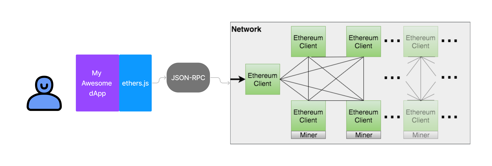

**Previous Section Recap**

In the previous sections, we learned, in order:

1. [Ethereum = A Transaction-Based Computer](/docs/what-is-ethereum)
2. [Read requests via JSON-RPC](/docs/how-to-read-data-with-json-rpc) are easy-peasy! Anyone can make a read query to the Ethereum computer.
3. Signed JSON-RPC is a little more difficult. You must construct the raw tx object, then use `wallet.signTransaction(transaction)` via the [Alchemy SDK](https://www.alchemy.com/sdk). This method will use your [private key](/docs/public-key-cryptography) to produce the digital signature components necessary for the transaction to be valid on the Ethereum computer.
4. [dotenv](https://www.npmjs.com/package/dotenv) is library that allows us to use environment variables in coding projects, without needing to explicitly define them wherever they are needed. It's perfect for private keys, API keys and Alchemy HTTP endpoints (contain keys!).

> Extra Review: If you want to become a competent software developer, make sure to [review this activity](https://university.alchemy.com/course/ethereum/md/send-a-transaction-using-alchemy-sdk), as it guides through `.env` setup for local development. The `dotenv` library is used extensively throughout this course, get comfortable with it!

Virtually every web3 website, or [dapp](https://www.alchemy.com/dapps) that you have ever used uses one of [web3.js](https://web3js.readthedocs.io/en/v1.8.1/) or [ethers.js](https://docs.ethers.io/v5/). Together, they are the two most popular Ethereum Javascript libraries that allow developers to interact with Ethereum or EVM-compatible blockchains using the JSON-RPC (Javascript Object Notation- Remote Procedure Call) protocol.

In other words, these are JavaScript libraries that allow you to do things that fundamental to almost every dapp: deploy smart contracts, create wallets, sign transactions, query the blockchain, etc. without having to make raw API calls to the blockchain.

One of the most common questions developers ask when starting out with web3 development is which library to use in their projects. In this guide, we will cover what ethers.js and web3.js libraries are, what they can do, and how they differ so you're able to make a choice depending on the requirements of your project.

<Info>
  If you're using Ethers.js but you also want access to certain Alchemy-specific features such as our [NFT API](/reference/nft-api-faq), [Enhanced WebSockets](/reference/sdk-websockets-endpoints), [Transact features](/docs/alchemy-transact), or [Token API](/reference/token-api-quickstart), read on!

  We built a strict superset of Ethers.js that makes it simple to integrate your Ethers.js code into Alchemy's custom endpoints, called the Alchemy SDK. You'll get the same syntax and features as Ethers while gaining access to Alchemy's best-in-class infrastructure and Enhanced APIs.

  **[Alchemy SDK Quickstart](/reference/alchemy-sdk-quickstart)**
</Info>

### Advantages of ethers.js

Ethers can do everything that web3.js can when it comes to interacting with the blockchain. In addition to that, it has a few more perks:

#### A Broader License

Ethers is available under the MIT License which not only allows developers to use it for free, but also allows modifications to it.

The latter is also allowed under the LGPL-3.0 license that web3 uses but it also forces you to release the source code containing the modifications.

#### Smaller Size

Ethers is an extremely lightweight library. It's only 77 KB compressed and 284 KB uncompressed.

#### ENS Compatible

Ethers knows how to parse ENS domain names by default. Therefore, you can replace a hexadecimal address with a .eth domain without any extra boilerplate code.

#### A Large Number of Test Cases

Ethers is extraordinarily well-tested, with close to 10,000 test cases; a significant chunk being written by Richard Moore himself. Ethers was a pioneer with respect to maintaining a well-tested Ethereum library (web3 has since managed to catch up to an extent).

### Drawbacks of ethers.js

Ethers is a relatively new library. Hence, it is hard to find it in use in older, more foundational projects and companies. If you work or are planning to work in such a company, it may be worthwhile to spend more time learning web3.

### When to Use ethers.js

Ethers is a fantastic library to use if you're building a new project. At the time of writing, the popularity (in terms of weekly downloads, beginner tutorials, and community support) has either surpassed or quickly catching up to that of web3.

Given the small size of the library, it is especially lucrative on the frontend as it can improve the performance of your website/app significantly.

### Important ethers.js Class Abstractions

These are the core class abstractions that you will need to use to write scripts that interact with the Ethereum computer. These are also the base abstractions that the Alchemy SDK uses 1-to-1.

* [**Provider**](https://docs.ethers.io/v5/api/providers/provider/#Provider): Represents any connection to an Ethereum node
* [**Wallet**](https://docs.ethers.io/v5/api/signer/#Wallet): EOA (private key holder) with ability to sign and send messages to network
* [**Contract**](https://docs.ethers.io/v5/api/contract/contract/#Contract): Represents a smart contract executable deployed on the network

## Conclusion

Front-end libraries like ethers.js and software development kits like the Alchemy SDK make our life as developers extremely easy. Can you imagine what a pain it would be to be coding out all of our scripts in raw JSON-RPC?

So, web3 developers use front-end libraries that work to abstract the lower level away from them so that they can focus on streamlined development. This is the flow typical of web3 dApps:

Your dApp uses some front-end library that uses JSON-RPC under the hood to communicate with an Ethereum node (which is essentially, communicating with the entire Ethereum network).

## Learn More About Ethereum Libraries

Alchemy University offers [free web3 development bootcamps that explain Ethereum in-depth](https://university.alchemy.com/ethereum) and help developers master the fundamentals of web3 technology. Sign up for free, and start building today!
