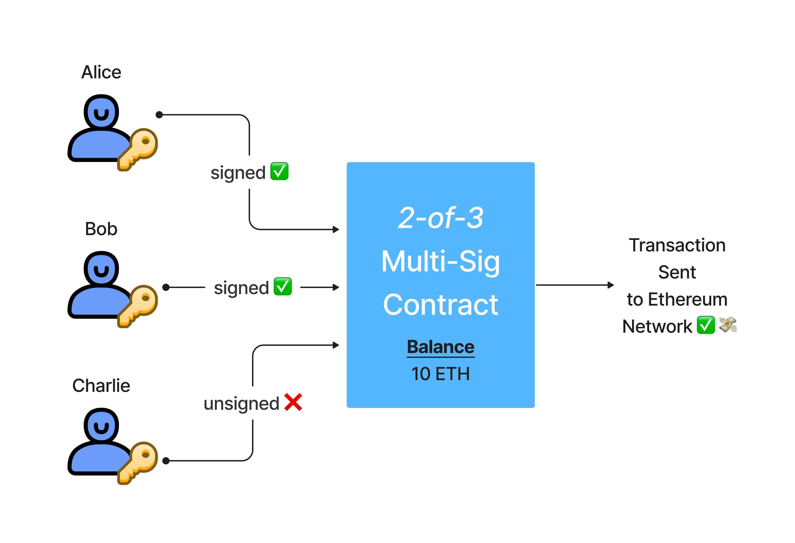

## Multi-Sigs Overview

A **multi-signature contract** is a smart contract designed so that *multiple* signatures from different addresses are needed for a transaction to be executed.

They are commonly used as **wallets**. Yep, you heard that right... multi-sigs are smart contracts that are used as wallets and this triggers a wide variety of use cases. Let's dig in... 🚜

## Multi-Sig Utility

A multi-signature contract acts as a "wallet" as it can hold and transfer funds. It is called "multi-sig" because it typically needs greater than one signature to approve any wallet activity such as transferring funds out. Since multi-sigs are powered by *multiple* keys, they **avoid a *single point of failure*, which makes it significantly harder for funds to be compromised.** ⛓ This design provides a higher degree of security against lost or compromised keys. 🔑🗝🔐

### No Single Point of Failure

Consider the typical EOA, controlled by an external actor (ie. someone outside the blockchain, typically humans):

[An EOA *directly* controls an address](/docs/ethereum-accounts) and any funds associated to it because the external actor has direct ownership over the private key needed to sign and authorize transactions on the Ethereum network.

In certain cases, this is considered a **single point of failure**. Why? Well, the external actor's [private key](/docs/public-key-cryptography) could become compromised by a hacker via phishing or physically stolen! Even as bad, the private key could be lost by the external actor, meaning the *direct* control over an address's balance no longer exists.

<Warning>
  Taking this opportunity to highlight the importance of good private key security! Make sure you **NEVER** share your private keys with anyone... ever. Private keys are something that only you should ever see and be in control of. ⚠️ Take some time soon to make sure your key security details are all safe and accounted for! 🛡
</Warning>

Now, let's see what a multi-signature wallet that **requires 2-of-3 confirmations in order to send funds** looks like:

In a multi-sig wallet setup, multiple keys are required to approve a transaction. In the diagram above, the smart contract requires 2-of-3 keys signatures in order to approve and send a transaction to the Ethereum network.

With this setup, it doesn’t matter whether one individual loses their key, as there will be other individuals that can approve transactions, kick out the compromised key and re-add the compromised user under a new address. Boom! 💥

Splitting responsibility of ownership of an address and its funds between multiple people means the multi-sig wallet is secure against a single key being the single point of failure. 👯‍♀️ Even if there is a malicious party in the multi-sig contract, they would need to corrupt a majority of the holders to compromise the wallet entirely.

## Multi-Sig Contract Wallet Use Cases

Here are a few use cases that can be powered by a multi-signature smart contract wallet:

1. **Families**: Inheritance, Wills, Approved Expenditure of House Expenses
2. **Businesses/Startups**: Business Expenses, Treasury Management, Embezzlement Protection
3. **Teams/Organizations**: Team Jerseys, Travel Expenses

These are just a few for you to think about and maybe expand upon... thanks to multi-signature contracts, all of these groups are empowered to manage their finances in a more secure and transparent manner.

## Gnosis Safe

[Gnosis Safe](https://gnosis-safe.io/) is a multi-signature smart contract instance deployer running on Ethereum that requires a minimum number of people to approve a transaction before it can occur (M-of-N).

<Info>
  Fun challenge: go down the rabbit hole and research Gnosis Safe! Then, try to deploy you own multi-sig contract to the Göerli testnet... 👀 Make sure to add your AU buddies as co-signers on the contract! 👏
</Info>

## Suggested Reading

* [Introduction to Multi-Sig Contracts](https://medium.com/mycrypto/introduction-to-multisig-contracts-33d5b25134b2)
* [What is Gnosis Safe?](https://help.gnosis-safe.io/en/articles/3876456-what-is-gnosis-safe)
* [Getting Started with Gnosis Safe](https://gnosis-safe.io/#getting-started)

## Conclusion

It is super important to consider your situation and decide what type of wallet setup is best for you. If you are a group that manages funds, like a startup, a multi-sig might be the way to go - it will not only make your funds safer but increase the transparency and trustlessness of your organization!

Are you ready for more multi-sigs? We LOVE multi-sigs... which is why the coding tutorial covering them is the *longest* one in all of AU... good luck!

## Learn More About Ethereum Development

Alchemy University offers [free web3 development bootcamps](https://university.alchemy.com/ethereum) that help developers master the fundamentals of web3 technology. Sign up for free, and start building today!
