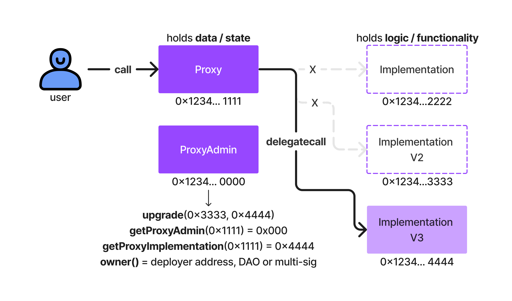

Did you know smart contracts *can be written to be* upgradeable? That's right! If you intend it at deploy time, you can make it so that your smart contract is able to be "upgraded". Let's dig in...

## Why Upgrade Smart Contracts?

By design, smart contracts are immutable. On the other hand, software quality heavily depends on the ability to upgrade and patch source code in order to produce iterative releases.

In short, if you want to make your smart-contract-based software be based on a more iterative approach, you can still do so and are not constrained by set-in-stone immutability. It is up to you to determine whether your dApp will require upgradeable software infrastructure!

## How Do Upgradeable Smart Contracts Work?

Upgradeable smart contracts are a pattern composed of **THREE contracts**:

1. **`Proxy` contract**: The smart contract the user interacts with directly.

   * This contracts holds the **contract state** (ie, the important data is held here!).
   * This is an [EIP1967 standard](https://eips.ethereum.org/EIPS/eip-1967) proxy contract.
   * This proxy contract is in charge of forwarding transactions to the *implementation* contract, the one containing the pure logic.

2. **`Implementation` contract**: The smart contract that provides the skeleton logic and data.
   * This is where you instantiate your variables. Your proxy contract, via delegate calls into this one, will give them value!

3. **`ProxyAdmin` contract**: The contract links `Proxy` and `Implementation`.
   * This contract holds authority over `Proxy` to upgrade the Proxy contract and thus link that proxy to a new implementation contract.

Check out the [OpenZeppelin FAQs on Proxy, Implementation and ProxyAdmin contracts](https://docs.openzeppelin.com/upgrades-plugins/1.x/faq#what-is-a-proxy-admin)! 🔍

## Visualization: Upgrading a Smart Contract from V2 to V3

The above diagram shows what is called the [transparent proxy pattern](https://blog.openzeppelin.com/the-transparent-proxy-pattern/). This pattern uses `call`, `delegatecall` and the three-contract design in order to achieve a super cool infrastructure. 💥

Here is a breakdown of the diagram flow, from the user's perspective:

1. The user performs a `call` into the `Proxy` contract
2. That `call` hits the `fallback` function of the `Proxy` contract which is directly rigged to `delegatecall` into the `Implementation` contract address
3. In performing a `delegatecall`, the context of the `Proxy` contract is forwarded. This means that the storage of `0x1234.1111` will be directly affected by the logic of `0x1234.4444` (that's the whole point of `delegatecall!`)
4. The logic from `Implementation` is performed on the state of `Proxy` and if the logic does not revert, the state is returned to `Proxy` which then returns a receipt to the original user
5. Transaction over! 🧾

## Vending Machine Activity ➡️

In the next section, you will run through a guide that has you set up and deploy an upgradeable vending machine smart contract using two extremely useful tools:

1. [OpenZeppelin Upgradeable Package](https://docs.openzeppelin.com/contracts/4.x/upgradeable)
2. [OpenZeppelin Hardhat Upgrades plugin](https://docs.openzeppelin.com/upgrades-plugins/1.x/)

### BTW, Why Use That Hardhat Plugin?? 🔧

As is a common theme in this course, we are always looking to equip you with the latest and greatest tools to build quality smart contracts. The OpenZeppelin Hardhat Upgrades plugin serves to abstract a lot of the complexity of what we just discussed above away from us as developers so that we can focus on more specific solutions such as: do we want this contract to be upgradeable, yes or no? 👀 Thanks to the plugin, we can get up and running with upgradeable smart contracts in a flash and we'll learn how to do just that in the activity next section!

Can you start thinking of why a vending machine would be a good candidate to enable upgradeability on? 🤔 Let's go! 🥤

## Learn More About Ethereum Development

Alchemy University offers [free web3 development bootcamps that explain upgradable smart contracts](https://university.alchemy.com/ethereum) and help developers master the fundamentals of web3 technology. Sign up for free, and start building today!
