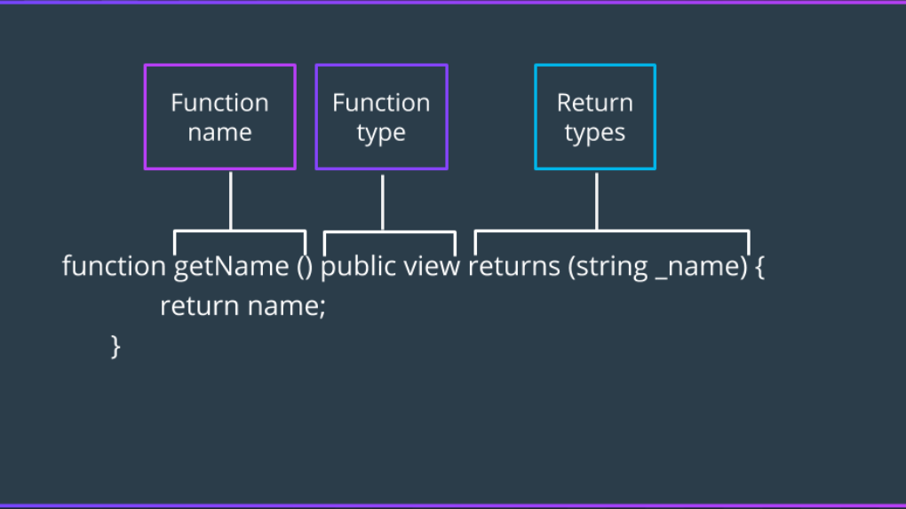

Solidity functions use `function` keyword, can be `view` or `pure`, and have visibility levels: `public`, `external`, `internal`, `private`.

Intro to Solidity [Functions](https://docs.soliditylang.org/en/v0.8.17/contracts.html#functions)

**Previous Section Recap**

In the previous section, we learned the basics of the \[Solidity]\(https://docs.soliditylang.org/en/v0.8.17/) smart contract programming language. Here are some of the important takeaways we looked at:

* In Solidity, a `contract` is very similar to a [JavaScript](/docs/solidity-vs-javascript) `class`
  * The syntax to declare state variables is:

<CodeGroup>
  ```solidity solidity
  // data_type + visibility + variable_name = some_value;
  bool public isHappy = true;
  ```
</CodeGroup>

* **`msg.sender`**: who is the **`from`** in the current calling tx?
* **`msg.value`**: what is the **`value`** in the current calling tx?

## Solidity Functions

In Solidity, a function is generally defined by using the `function` keyword. Functions are where actual logic is contained on a smart contract. Let's dive in...

### Solidity Functions - Syntax

The most common way to define a function in Solidity is by using the `function` keyword:

<CodeGroup>
  ```solidity solidity
  // function_keyword + function_name(paramter_list) + visibility {}
  function helloWorld(bool _saysHello) public {
      // statements
  }
  ```
</CodeGroup>

If the function returns a value, the syntax of a function header includes a `returns` statement, as shown below:



Let's get some Solidity up in this place! Here's a quick function in a sample `MyContract`:

<CodeGroup>
  ```solidity solidity
  contract MyContract {
      function myFunction() external pure {
          uint x = 5;
      }
  }
  ```
</CodeGroup>

> The`myFunction` above doesn't really do much! Once called, the function will just declare a new variable `x` with a value of `5` in local memory, then execution will end which means local memory is wiped. Nothing happens! 🤷

This is what a script call to this function would look like in JavaScript:

<CodeGroup>
  ```javascript javascript
  const myTx = await contract.myFunction();
  ```
</CodeGroup>

The above script call will send a transaction to the `MyContract` address with a specific call to the `myFunction()` endpoint. The [EVM](/docs/how-ethereum-transactions-work) will execute the statements inside until it reaches the closing bracket. Once the logic in a function completes, the transaction is mined and any effects are indexed in the tx's own receipt.

What about a function that actually does something? Here is one example:

<CodeGroup>
  ```solidity solidity
  function changeOwner(address _newOwner) public {
      owner = _newOwner;
  } 
  ```
</CodeGroup>

The above function lives in a smart contract containing an `owner` state variable. By calling the `changeOwner()` function and passing a new `address` to it, the contract will overwrite the current contract `owner` with the passed-in `_newOwner` value.

### Solidity Functions - Declarations

You will sometimes see functions in [Solidity](/docs/how-does-solidity-work) contain one of the following keywords: [`view` and `pure`](https://solidity-by-example.org/view-and-pure-functions/).

**`view`**: this function promises that **NO state will be changed, only read**

> This is basically a keyword that can be seen as the function itself saying: "I promise to just "view", not change state!" 🙋‍♂️

**`pure`**: this function promises that **NO state will be changed *nor* read**

> This is basically a keyword that can be seen as the function itself saying: "I promise to act completely independent of the smart contract I am in!" 🙋‍♂️

#### View Function Example

Let's set up a simple contract with two state variables...

<CodeGroup>
  ```solidity solidity
  pragma solidity 0.8.4;
  contract MyContract {
      uint x = 5;
      uint y = 10;
  }
  ```
</CodeGroup>

Let's then add a new function called `sum()` and *declare* it as `view`:

<CodeGroup>
  ```solidity solidity
  pragma solidity 0.8.4;
  contract MyContract {
      uint x = 5;
      uint y = 10;
      
      function sum() external view returns(uint) {
          return x + y;
      }
  }
  ```
</CodeGroup>

Notice how the `sum()` function, declared as `view`, keeps it promise? It is only *reading* from state because it uses the `x` and `y` state variable values in order to return their sum. It is reading from state to produce a new value but it is not changing any state.

> A `view` **cannot write** to storage. 🔏

#### Pure Function Example

If you noticed in the first contract example, there is already a `pure` function used:

<CodeGroup>
  ```solidity solidity
  contract MyContract {
      function myFunction() external pure {
          uint x = 5;
      }
  }
  ```
</CodeGroup>

The keyword `pure` means this function does not read or write storage. It is function completely independent from contract state. But again, the function above is not really useful at all...

### Solidity Functions - Returns

A more useful `pure` function would be one that **`returns`** something:

<CodeGroup>
  ```solidity solidity
  contract MyContract {
      function add(uint x, uint y) external pure returns(uint) {
          return x + y;
      }
  }
  ```
</CodeGroup>

`pure` functions like the one shown above are typically used in libraries or for functionality that is not specific to a smart contract's state but is still needed for independent contract operations.

Notice the syntax required for functions that actually `return` a value? You must indicate the return type in the `returns(data_type)` block.

#### Implicit Return

The `returns` syntax in Solidity can also look like this:

<CodeGroup>
  ```solidity solidity
  contract MyContract {
      function add(uint x, uint y) external pure returns(uint z) {
          z = x + y;
      }
  }
  ```
</CodeGroup>

> Believe it or not, `z` is **implicitly returned** here! 🤯

#### Return Multiple Values

<CodeGroup>
  ```solidity solidity
  contract MyContract {
      function mathTime(uint sum, uint product) external pure returns(uint sum, uint product) {
          sum = x + y;
          product = x * y;
      }
  }
  ```
</CodeGroup>

In this case, both the `sum` and `product` are returned.

#### Return Multiple Values Using `return`

<CodeGroup>
  ```solidity solidity
  contract MyContract {
      function mathTime(uint sum, uint product) external pure returns(uint, uint) {
          uint sum = x + y;
          uint product = x * y;
          
          return (sum, product);
      }
  }
  ```
</CodeGroup>

> The returned value is referred to as a **tuple**.

### Functions - Writing to Storage

A function can write (fancy term for changing some state) if it is NOT `pure` or `view`:

<CodeGroup>
  ```solidity solidity
  contract MyContract {
      uint x = 5;
      uint y = 10;
      uint z;
      
      function storeSum() external {
          z = x + y;
      }
  }
  ```
</CodeGroup>

Since this function is writing to storage via directly assigning a value to the `z` state variable, it will [always cost gas to execute on the Ethereum network](/docs/ethereum-gas).

> Storage is expensive on the [Ethereum](/docs/what-is-ethereum) network! 💸 As a developer, you must always be optimizing for the least friction possible when changing state so that you do not incur large gas costs to you or your users!

### Solidity Functions - [Visibility](https://solidity-by-example.org/visibility/)

We've only seen the `public` visibility so far. Function signatures always contain a visibility identifier... basically, how accessible to do you want this function to be?

Functions can be declared, from most-public to least-public, as:

* **`public`** - any contract or EOA can call into this function
* **`external`** - only other contracts (external to the current contract) and EOAs can call, no internal calling
* **`internal`** - only this contract along with its inheritance chain can call
* **`private`** - only this contract can call

🚨 State variables work off the same exact criteria for visibility. State variables can be declared as **`public`**, **`private`**, or **`internal`** but not **`external`**.

## Suggested Reading

* [Solidity function visibility explained](https://bitsofco.de/solidity-function-visibility-explained/)
* [Solidity by Example - Visibility](https://solidity-by-example.org/visibility/)
* [Solidity by Example - Pure and View](https://solidity-by-example.org/view-and-pure-functions/)
* [Modifying the Merkle Patricia Trie](https://medium.datadriveninvestor.com/modifying-the-merkle-patricia-trie-4b15813d8e6b)

## Conclusion

We've looked main pillars of Solidity logic: functions. It is important to distinguish the appropriate visbility and declaration. These keywords are extremely important to know, as they are typically included in most Solidity function signatures and have important security ramifications (ie. who can access this function?).

In the next section, we'll look at how contracts communicate. Let's gooooooooooooooo! 🏃‍♂️

## Learn More About Solidity

Alchemy University offers [free web3 development bootcamps that explain Solidity functions in-depth](https://university.alchemy.com/ethereum) and help developers master the fundamentals of web3 technology. Sign up for free, and start building today!
