In this article, we’ll teach you how to create ERC-721 Ethereum tokens (NFTs) on Arbitrum, a leading Ethereum layer 2 scaling solution that uses optimistic rollups, in just a couple of easy steps so you can start selling digital items on NFT marketplaces, like [Stratos](https://www.stratos.xyz/).

# How to deploy an ERC-721 token on Arbitrum

## Step 1: Sign up for Alchemy

To make things easy, [sign up for a free Alchemy developer account](https://dashboard.alchemyapi.io/signup/?a=169b429af6), so you can communicate with the Arbitrum chain without having to run your own nodes.

We’ll also take advantage of Alchemy’s developer tools for monitoring and analytics to understand what’s going on under the hood in your smart contract deployment.

## Step 2: Create an API key

Next, create a new app to generate an API key and to [connect to the Arbitrum Goerli test network.](/docs/choosing-a-web3-network)

Navigate to the “Create App” page in your Alchemy Dashboard by hovering over “Apps” in the navbar and click “Create App”.

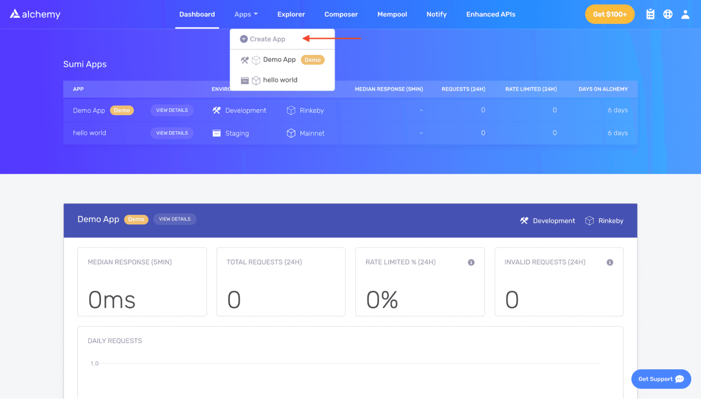

Name your app (we chose “arbitrum\_nft”), and write a short description.

Select **Arbitrum** for your chain and choose **Arbitrum Goerli** for your network.

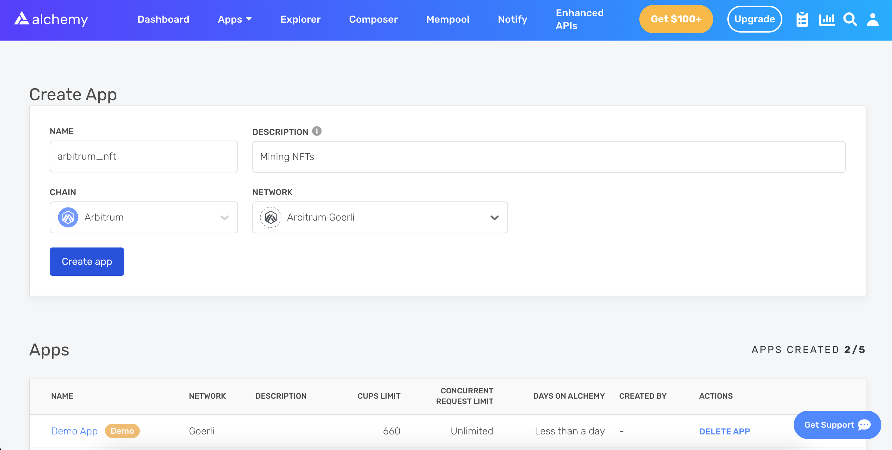

Click ***Create app*** and that’s it! Your app should appear in the ***Apps*** table below.

## Step 3: Create an Ethereum wallet

We need an Ethereum wallet to send and receive transactions. For this tutorial, we’ll use MetaMask, a browser-based digital asset wallet to manage Ethereum accounts. [Download MetaMask](https://metamask.io/) and create a free account.

## Step 4: Connect to the Arbitrum Nitro Rollup Testnet

Connect to the “Arbitrum Nitro Rollup Testnet” so you’re not dealing with real money for this tutorial.

Your metamask should open up a new tab where you can fill in details about the new network you want to add. To add the "Arb-Goerli testnet" to MetaMask, click the network button at the top of your wallet and change it to "Arbitrum Nitro Rollup Testnet."

Fill it in as follows:

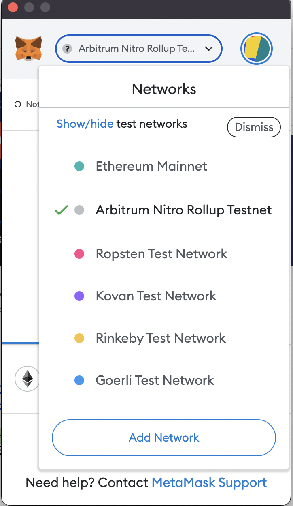

If the Arbitrum Nitro Goerli Rollup Testnet is not listed, click "Add Network," and enter the following Arb-Goerli testnet details:

* **Network Name**: Arbitrum Nitro Rollup Testnet
* **RPC URL**: [https://goerli-rollup.arbitrum.io/rpc](https://goerli-rollup.arbitrum.io/rpc)
* **ChainID**: 421613
* **Symbol**: ETH
* **Block Explorer URL**: [https://goerli-rollup-explorer.arbitrum.io/](https://goerli-rollup-explorer.arbitrum.io/)
* **Retryable Dashboard**: [http://retryable-tx-panel-nitro.arbitrum.io/](http://retryable-tx-panel-nitro.arbitrum.io/)
* **Token Bridge**: [https://bridge.arbitrum.io/](https://bridge.arbitrum.io/)

Because the default RPC URL is a public RPC endpoint hosted by Arbitrum, anyone transacting on the Nitro testnet can use it. To avoid public endpoints, create a reliable and dedicated RPC endpoint just for your Arbitrum Nitro testnet transactions with Alchemy.

Finally, click “Save” and you’re done! Your network should be “Arbitrum Nitro Rollup Testnet” in the upper right.

## Step 5: Add testnet ETH from an Arbitrum Nitro Testnet

To execute transactions on the Goerli testnet you’ll need testnet ETH.

You normally get 0.1 ETH, but if you [sign in with your alchemy account](https://dashboard.alchemyapi.io/signup/?a=169b429af6) you get 0.5 ETH! Simply click “Send me ETH”.

**Here's how to bridge Goerli ETH to Arbitrum**:

The first step is to enter your Ethereum wallet address for the Goerli network to Alchemy's Goerli Faucet to get free Goerli ETH.

If this is your first time getting testnet ETH, follow this step-by-step guide to using a Goerli Faucet:

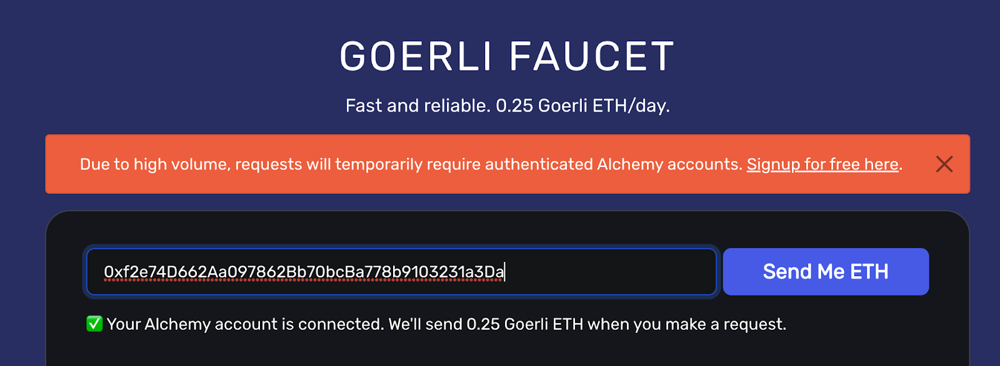

Next, open your MetaMask wallet and change your network to Arbitrum's Nitro Rollup Testnet.

After changing your network, bridge your Goerli L1 ETH to Arbitrum’s Goerli Testnet on layer 2 by connecting your wallet to the Arbitrum Goerli bridge.

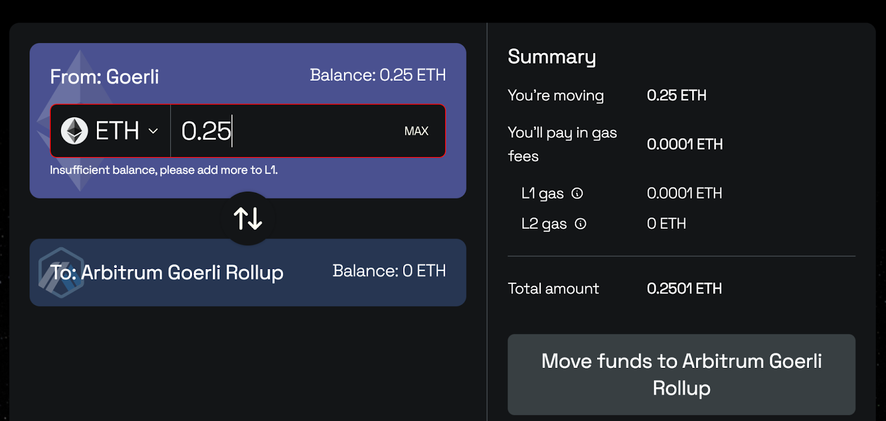

Now, you should see Arbitrum Goerli ETH in your wallet and will be able to use your "Arb-Goerli testnet" ETH to execute contracts on the Arbitrum Nitro Rollup Testnet.

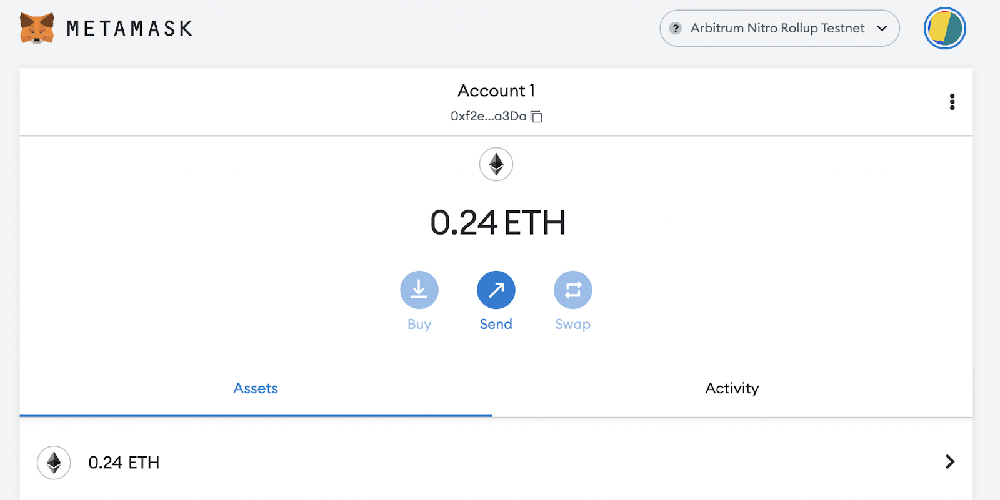

## Step 6: Check your Arbitrum ETH balance

To double-check your balance is there, let’s make an [eth\_getBalance ](/reference/eth-getbalance)request using [Alchemy’s composer tool](https://composer.alchemyapi.io/?composer_state=%7B%22network%22%3A0%2C%22methodName%22%3A%22eth_getBalance%22%2C%22paramValues%22%3A%5B%22%22%2C%22latest%22%5D%7D). This will return the amount of ETH assets in your wallet.

After you input your MetaMask account address and click “Send Request”, you should see a response like this:

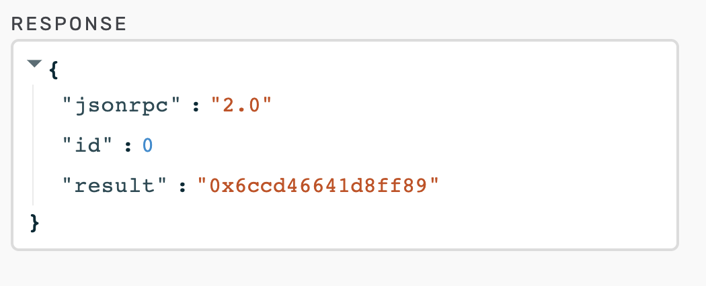

<Info>
  This result is in Wei, not ETH. Wei is used as the smallest denomination of ether. The conversion from wei to ETH is 1 eth = 1018 wei. So if we convert 0x6ccd46641d8ff89 to decimal we get 4.9\*1017 Wei, which equals .49 ETH.
</Info>

## ​​Step 7: Initialize your Arbitrum NFT project

To initialize your Arbitrum NFT project, create a new folder by navigating to your command line and typing the following commands:

```shell
mkdir my-nft
cd my-nft
npm init
```

The output should look like this:

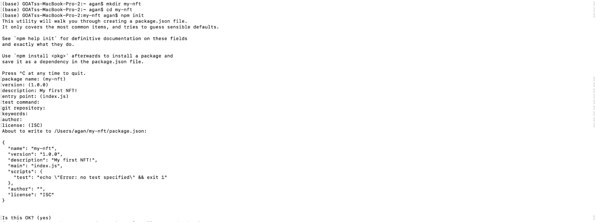

You can answer the installation questions as shown above.

## Step 8: Install Hardhat

Hardhat is a development environment to compile, deploy, test, and debug Ethereum software that helps developers build smart contracts and dApps locally. We’re going to [install Hardhat](https://hardhat.org/getting-started/#overview) to create an Arbitrum NFT.

Inside `my-nft` project run:

<CodeGroup>
  ```shell
  npm install --save-dev hardhat
  ```
</CodeGroup>

## Step 9: Create a new Hardhat project

Inside the project folder, run:

<CodeGroup>
  ```powershell powershell
  npx hardhat
  ```
</CodeGroup>

You should see a welcome message and the option to select what you want to do.

Select “create an empty hardhat.config.js” to generate a `hardhat.config.js` file which is where we’ll set up our project in step 14.

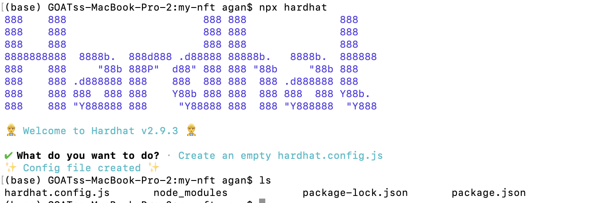

## Step 10: Add project folders

​​To keep your project organized, create two new folders by navigating to the root directory of your project from the command line and typing:

```shell
mkdir contracts
```

`contracts/` is where we’ll keep your NFT smart contract code2.

```shell
mkdir scripts
```

`scripts/` is where we’ll keep scripts to deploy and interact with your smart contract.

## Step 11: Write your contract

Now that we’ve created our development environment, let’s move on to more exciting stuff–writing your smart contract code!

Open up the my-nft project in your favorite editor like VScode.

Smart contracts are written in a language called Solidity which is what we will use to write your `MyNFT.sol` smart contract.‌

Navigate to the contracts folder and create a new file called `MyNFT.sol`

Below is your NFT smart contract code, which is based on the [OpenZeppelin](https://www.openzeppelin.com/) library’s ERC-721 implementation. Copy and paste the contents below into your `MyNFT.sol` file.

<CodeGroup>
  ```solidity solidity
  //Contract based on [https://docs.openzeppelin.com/contracts/3.x/erc721](https://docs.openzeppelin.com/contracts/3.x/erc721)
  // SPDX-License-Identifier: MIT
  pragma solidity ^0.8.0;
  import "@openzeppelin/contracts/token/ERC721/ERC721.sol";
  import "@openzeppelin/contracts/utils/Counters.sol";
  import "@openzeppelin/contracts/access/Ownable.sol";
  import "@openzeppelin/contracts/token/ERC721/extensions/ERC721URIStorage.sol";
  contract MyNFT is ERC721URIStorage, Ownable {
      using Counters for Counters.Counter;
      Counters.Counter private _tokenIds;
      constructor() ERC721("MyNFT", "NFT") {}
      function mintNFT(address recipient, string memory tokenURI)
          public onlyOwner
          returns (uint256)
      {
          _tokenIds.increment();
          uint256 newItemId = _tokenIds.current();
          _mint(recipient, newItemId);
          _setTokenURI(newItemId, tokenURI);
          return newItemId;
      }
  }
  ```
</CodeGroup>

Because we are inheriting classes from the OpenZeppelin contracts library, run the following in the command line to install the library into your folder:

<CodeGroup>
  ```bash bash
  npm install @openzeppelin/contracts
  ```
</CodeGroup>

So, what does this code do exactly? Let’s break it down, line-by-line.

At the top of your smart contract, we import three OpenZeppelin smart contract classes:

* `@openzeppelin/contracts/token/ERC721/ERC721.sol` contains the implementation of the ERC-721 standard, which your NFT smart contract will inherit. Your smart contract must implement all the methods of the ERC-721 standard to be a valid NFT. To learn more about the inherited ERC-721 functions, check out [the interface definition](https://eips.ethereum.org/EIPS/eip-721).
* `@openzeppelin/contracts/utils/Counters.sol` provides counters that can only be incremented or decremented by one. Your smart contract uses a counter to keep track of the total number of NFTs minted and sets the unique ID on your new NFT. Each NFT minted using a smart contract must be assigned a unique ID—here your unique ID is just determined by the total number of NFTs in existence. For example, the first NFT we mint with your smart contract has an ID of "1," and your second NFT has an ID of "2," etc.
* `@openzeppelin/contracts/access/Ownable.sol` sets up [access control](https://docs.openzeppelin.com/contracts/3.x/access-control.) on your smart contract, so only the owner of the smart contract (you) can mint NFTs. (
  * Note, including access control is entirely a preference. If you'd like anyone to be able to mint an NFT using your smart contract, remove the word `Ownable` on line 10 and `onlyOwner` on line 17.)

After your import statements, you have your custom NFT smart contract, which is surprisingly short, it only contains a counter, a constructor, and a single function!

This is thanks to your inherited OpenZeppelin contracts, which implement most of the methods we need to create an NFT. These methods include things like `ownerOf`, which returns the owner of the NFT, and `transferFrom`, which transfers ownership of the NFT from one account to another.

In your ERC-721 constructor, you’ll notice we pass 2 strings, “`MyNFT`” and “`NFT`.” The first variable is the smart contract’s name, and the second is its symbol. You can name each of these variables whatever you wish!

Finally, we have your function `mintNFT(address recipient, string memory tokenURI)` that allows us to mint an NFT! You'll notice this function takes two variables:

* `address recipient` specifies the address that will receive your freshly minted NFT
* `string memory tokenURI` is a string that should resolve to a JSON document that describes the NFT's metadata. An NFT's metadata is really what brings it to life, allowing it to have configurable properties, such as a name, description, image, and other attributes. In part 2 of this tutorial, we will describe how to configure this metadata.

`mintNFT` calls some methods from the inherited ERC-721 library and ultimately returns a number that represents the ID of the freshly minted NFT.

## Step 12: Connect Metamask to Alchemy to your project

Now that we’ve created a MetaMask wallet, Alchemy account, and written your smart contract, it’s time to connect the three.

Every transaction sent from your virtual wallet requires a signature using your unique private key. To provide your program with this permission, we can safely store your private key (and Alchemy API key) in an environment file.

First, install the dotenv package in your project directory:

```shell
npm install dotenv --save
```

Then, create a `.env` file (just name it “.env”) in the root directory of your project, and add your MetaMask private key and HTTP Alchemy API URL.

Follow these instructions to [export your private key from MetaMask](https://metamask.zendesk.com/hc/en-us/articles/360015289632-How-to-Export-an-Account-Private-Key).

See below to get the HTTP Alchemy API URL and copy it to your clipboard.

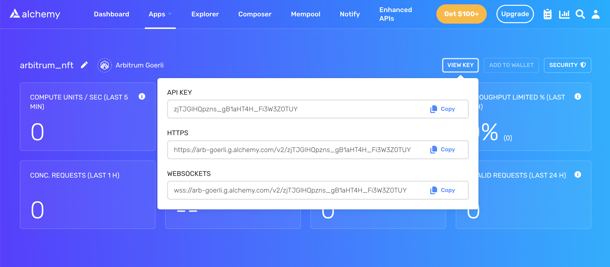

Your `.env` should now look like this:

<CodeGroup>
  ```text .env
  API_URL="https://arb-goerli.g.alchemy.com/v2/your-api-key"
  PRIVATE_KEY="your-metamask-private-key"
  ```
</CodeGroup>

To connect these to your code, we’ll reference these variables in your `hardhat.config.js` file in step 14.

Don't commit `.env`! Please make sure never to share or expose your .env file with anyone, as you are compromising your secrets in doing so. If you are using version control, add your `.env` to a [gitignore](https://git-scm.com/docs/gitignore) file.

## Step 13: Install ethers.js

Ethers.js is a library that makes it easier to interact and make Ethereum requests by wrapping standard JSON-RPC methods with more user-friendly methods.

Hardhat makes it super easy to integrate plugins for additional tooling and extended functionality. We’ll be taking advantage of the [Ethers plugin for Hardhat](https://hardhat.org/plugins/nomiclabs-hardhat-ethers.html) for contract deployment (Ethers.js has some super clean contract deployment methods).

In your project directory type:

```shell
npm install --save-dev @nomiclabs/hardhat-ethers ethers@^5.0.0
```

We’ll also require ethers.js in your `hardhat.config.js` in the next step.

## Step 14: Update hardhat.config.js

We’ve added several dependencies and plugins so far, now we need to update `hardhat.config.js` so that your project knows about them.

Update your `hardhat.config.js` to look like this:

<CodeGroup>
  ```javascript hardhat.config.js
  /**
  * @type import('hardhat/config').HardhatUserConfig
  */
  require("dotenv").config();
  require("@nomiclabs/hardhat-ethers");
  const { API_URL, PRIVATE_KEY } = process.env;
  module.exports = {
   solidity: "0.8.1",
   defaultNetwork: "arbitrum_goerli",
   networks: {
     hardhat: {},
     arbitrum_goerli: {
       chainId: 421613,
       url: API_URL,
       accounts: [`0x${PRIVATE_KEY}`],
     },
   },
  };
  ```
</CodeGroup>

## Step 15: Compile your contract

Compile your contract to make sure everything is working so far by running this command from the command line:

```shell
npx hardhat compile
```

**Note**: You might get a warning about an SPDX license identifier not provided in the source file, but no need to worry about that–hopefully everything else looks good! If not, you can always message in the [Alchemy Discord](https://alchemy.com/discord).

## Step 16: Write your deploy script

Now that your contract is written and your configuration file is good to go, it’s time to write the contract deploy script.

Navigate to the scripts/ folder and create a new file called `deploy.js` with the following contents:

<CodeGroup>
  ```javascript deploy.js
  async function main() {
    const MyNFT = await ethers.getContractFactory("MyNFT");
    // Start deployment, returning a promise that resolves to a contract object
    const myNFT = await MyNFT.deploy();
    await myNFT.deployed();
    console.log("Contract deployed to address:", myNFT.address);
  }
  main()
    .then(() => process.exit(0))
    .catch((error) => {
      console.error(error);
      process.exit(1);
    });
  ```
</CodeGroup>

Hardhat does an amazing job of explaining what each of these lines of code does in their [contracts tutorial](https://hardhat.org/tutorial/testing-contracts.html#writing-tests.). We’ve adopted their explanations here.

`const MyNFT = await ethers.getContractFactory("MyNFT");`

A ContractFactory in ethers.js is an abstraction used to deploy new smart contracts, so MyNFT here is a factory for instances of your NFT contract.

When using the hardhat-ethers plugin, ContractFactory and Contract instances are connected to the first signer by default.

`const myNFT = await MyNFT.deploy();`

Calling `deploy()` on a ContractFactory will start the deployment, and return a Promise that resolves to a Contract. This is the object that has a method for each of your smart contract functions.

## Step 17: Deploy your contract

We’re finally ready to deploy your smart contract! Navigate back to the root of your project directory and in the command line run:

```shell
npx hardhat --network arbitrum_goerli run scripts/deploy.js
```

You should then see something like this:

Contract deployed to address: 0x0BA7b1cB490E375F33773e0f24d3f80D74a96347

If we go to the [Arbitrum Testnet etherscan](https://testnet.arbiscan.io) and search for your contract address we should be able to see that it has been deployed successfully. If you can't see it immediately, wait a while as it can take some time. The transaction will look something like this:

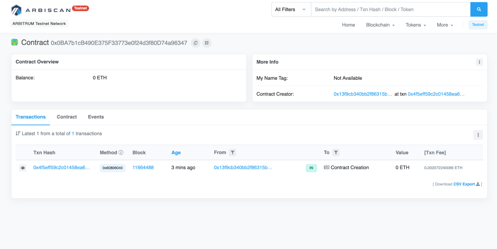

The From address should match your MetaMask account address and the To address will say “Contract Creation.” If we click on the transaction, we’ll see your contract address in the To field:

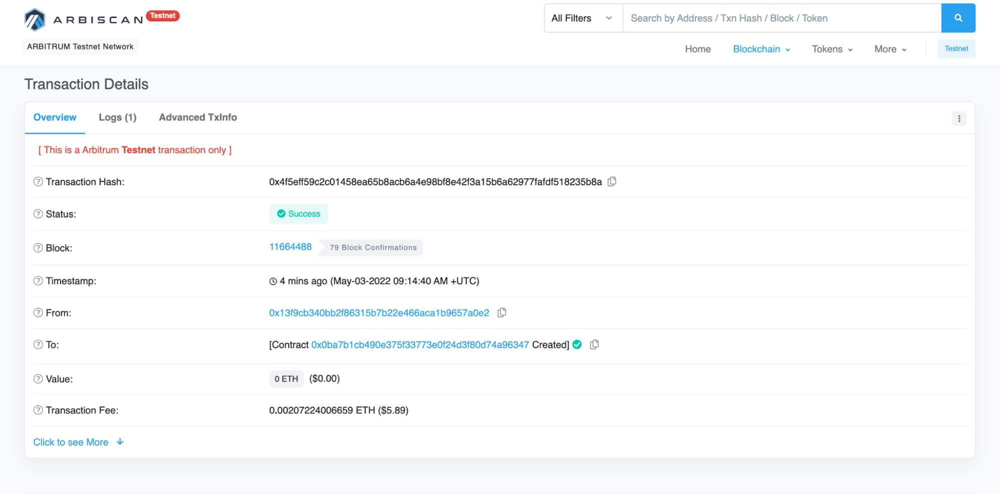

You just deployed your NFT smart contract to the Ethereum chain!

To understand what’s going on under the hood, you can navigate to the **Explorer** tab in your Alchemy dashboard.

If you have multiple Alchemy apps make sure to filter by app and select “arbitrum\_nft”.

Two important ones to call out here are [eth\_sendRawTransaction](/reference/eth-sendrawtransaction), which is the request to actually write your smart contract onto the Arbitrum Goerli chain, and [eth\_getTransactionByHash](/reference/eth-gettransactionbyhash), which is a request to read information about your transaction given the hash (a typical pattern when sending transactions).

To learn more about sending transactions, check out this tutorial on [sending transactions using Web3.](/docs/how-to-send-transactions-on-ethereum)

## Arbitrum NFT Resources

Arbitrum is an excellent choice for creators to launch NFT projects with all the benefits of its optimistic rollup and less expensive gas fees of a fully EVM-compatible layer 2.

Here are some additional Arbitrum NFT resources to check out:

* [Arbitrum One Portal](https://portal.arbitrum.one/) - Arbitrum NFT ecosystem portal
* [Arbitrum NFT Alliance ](https://www.nftalliance.xyz/)- an independent collective of marketplaces and NFT collection creators whose aim is to advance the Arbitrum platform ecosystem

## Conclusion

Because of its speed, cost-efficient transactions, reliability, and security, creating NFTs on Arbitrum’s layer 2 blockchain is a great option for web3 developers who want an alternative to launching NFTs on Ethereum’s mainnet. If you’re interested in launching your own NFT project on Arbitrum, [sign up for a free Alchemy developer account](https://dashboard.alchemyapi.io/signup/?a=169b429af6) and start today!
