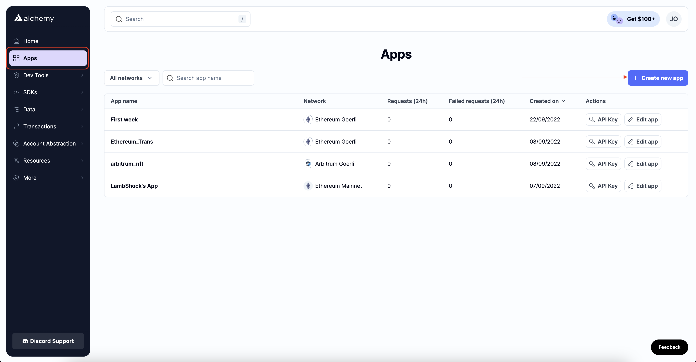
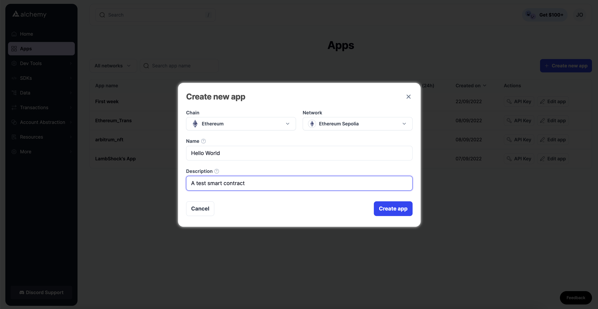
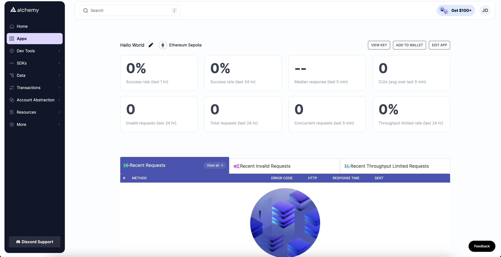
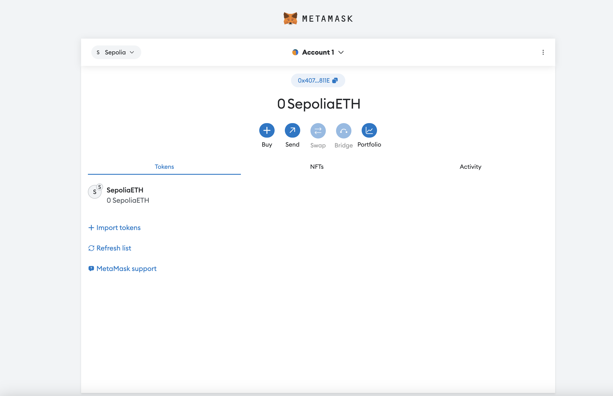
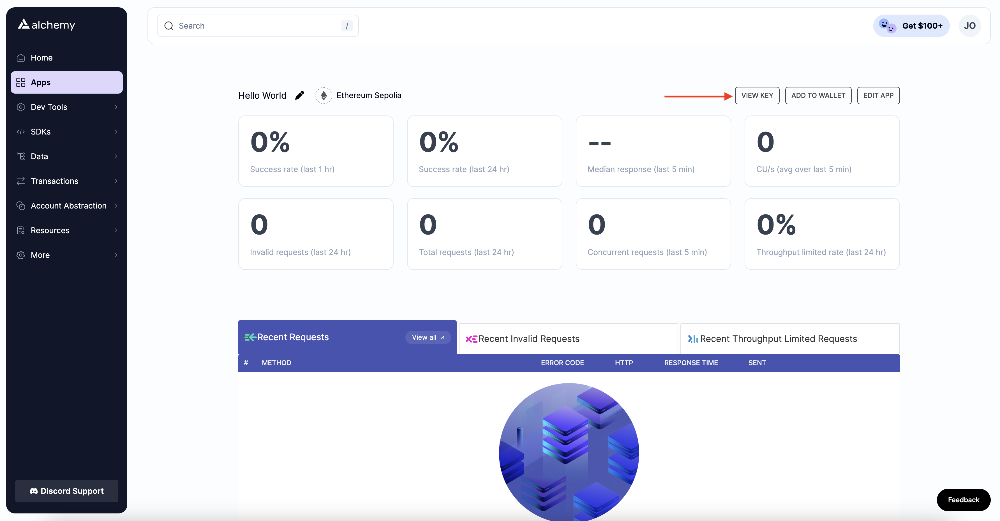
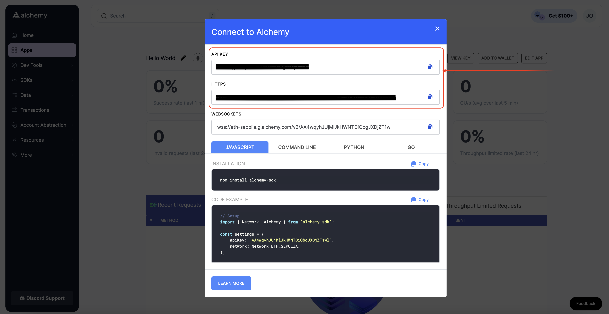
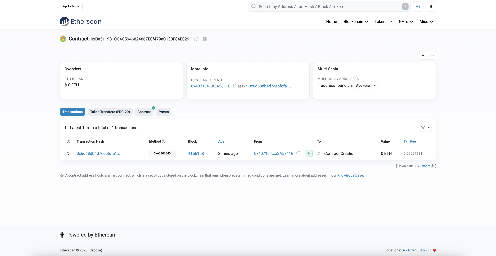
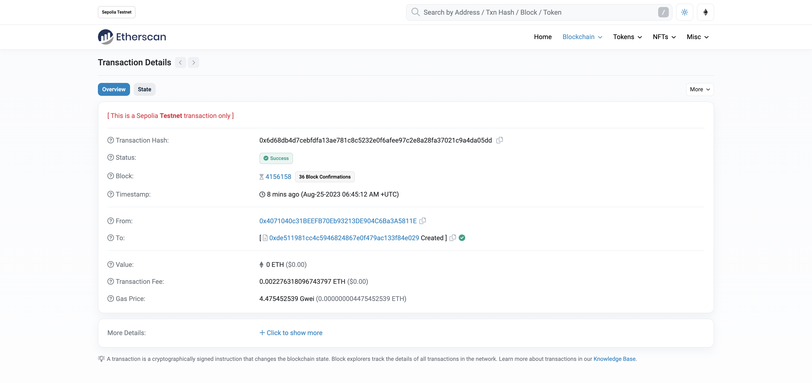
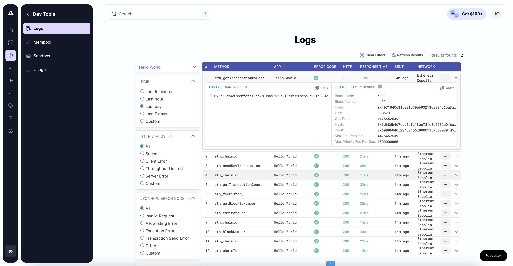

**Estimated time to complete this guide: ~15 minutes**

<Warning>
  Please note that certain installations need to be made before any smart contract code can be written. Steps 1-9 will guide you through these installations. The smart contract code will follow right after!
</Warning>

If you are new to blockchain development and don’t know where to start, or if you just want to understand how to deploy and interact with smart contracts, this guide is for you. We will walk through creating and deploying a simple smart contract on the Sepolia test network using a virtual wallet ([Metamask](https://metamask.io/)), [Solidity](https://docs.soliditylang.org/en/v0.8.0/), [Hardhat](https://hardhat.org/), and [Alchemy](https://www.alchemy.com/?referral=affiliate%3Adf70d561-e6cf-4922-b101-e2bb27c00a15) (don’t worry if you don’t understand what any of this means yet, we will explain it!).

You can find [Part 2: Interacting with the Smart Contract](/docs/interacting-with-a-smart-contract) once it’s deployed and [Part 3: Submitting Your Smart Contract to Etherscan](/docs/submitting-your-smart-contract-to-etherscan) on the sidebar to your left!

If you have questions at any point, feel free to reach out in the [Alchemy Discord](https://discord.com/invite/gWuC7zB)!

<Info>
  This tutorial focuses on using **Hardhat**. It is a development environment for building on Ethereum. Hardhat is the newer kid on the block and tends to be a bit cleaner/easier to use, they also have lots of plugins to make it more customizable.
</Info>

***

## Create and Deploy your Smart Contract using Hardhat

## Step 1: Connect to the Ethereum network

There are many ways to make requests to the Ethereum chain. For simplicity, we’ll use a free account on Alchemy, a blockchain developer platform, and API that allows us to communicate with the Ethereum chain without running our own nodes. The platform also has developer tools for monitoring and analytics that we’ll use in this tutorial to understand what’s going on under the hood in our smart contract deployment. If you don’t already have an Alchemy account, you can [sign up for free here](https://www.alchemy.com/).

## Step 2: Create your app (and API key)

Once you’ve created an Alchemy account, you can generate an API key by creating an app. This will allow us to make requests to the Sepolia test network. If you’re not familiar with testnets, check out [this guide](/docs/choosing-a-web3-network).

Navigate to the **Apps** page in your Alchemy Dashboard's navigation panel and then click the “Create new app” button.



Name your app **Hello World**, offer a short description, ensure you're on the Ethereum chain, and choose **Sepolia** for your network.



Double-check that you're selecting the Sepolia testnet!

Click “Create app”, and that’s it! Your app should appear as a new page, as shown below:



Your new App!!

## Step 3: Create an Ethereum account (address)

We need an Ethereum account to send and receive transactions. For this tutorial, we’ll use Metamask, a virtual wallet in the browser used to manage your Ethereum account address. If you want to understand more about how transactions on Ethereum work, check out [this page ](https://ethereum.org/en/developers/docs/transactions/)from the Ethereum Foundation.

You can download and create a Metamask account for free [here](https://metamask.io/download/). When creating an account, or if you already have one, switch to the “Sepolia Test Network” in the upper right (so that we’re not dealing with real money). Since Sepolia is a test network, if you don't see Sepolia as an option, ensure you have the "Show Test Networks" toggle on in your Metamask settings.



## Step 4: Add ether from a Faucet

To deploy oursmart contract to the test network, we’ll need some fake ETH. To get ETH, you can go to the [Sepolia faucet](https://sepoliafaucet.com/) and log into your Alchemy account and enter your wallet address, then click “Send Me ETH.” Due to network traffic, receiving your fake ETH may take some time. (At the time of writing this, it took around 30 minutes.) You should see Eth in your Metamask account soon after!

## Step 5: Check your Balance

To double-check that our balance is there, let’s make an [eth\_getBalance](/reference/eth-getbalance) request using [Alchemy’s composer tool](https://composer.alchemyapi.io/). This will return the amount of ETH in our wallet. Check out [this video](https://www.youtube.com/watch?v=r6sjRxBZJuU\&feature=youtu.be) for instructions on how to use the composer tool!

After you input your Metamask account address and click “Send Request”, you should see a response that looks like this:

<CodeGroup>
  ```json json
  {"jsonrpc": "2.0", "id": 0, "result": "0x2B5E3AF16B1880000"}
  ```
</CodeGroup>

<Info>
  This result is in wei not eth. Wei is used as the smallest denomination of ether. The conversion from wei to eth is: 1 eth = 10^18 wei. So if we convert 0x2B5E3AF16B1880000 to decimal we get 5\*10^18 which equals 5 eth.

  Phew! Our fake money is all there🤑 .
</Info>

## Step 6: Initialize our project

First, we’ll need to create a folder for our project. Navigate to your [command line](https://www.computerhope.com/jargon/c/commandi.htm) and type:

<CodeGroup>
  ```shell shell
  mkdir hello-world
  cd hello-world
  ```
</CodeGroup>

Now that we’re inside our project folder, we’ll use `npm init` to initialize the project. If you don’t already have npm installed, follow [these instructions](https://docs.alchemy.com/alchemy/guides/alchemy-for-macs#1-install-nodejs-and-npm) (we’ll also need Node.js so download that too!).

<CodeGroup>
  ```shell shell
  npm init # (or npm init --yes)
  ```
</CodeGroup>

It doesn’t really matter how you answer the installation questions; here is how we did it for reference:

<CodeGroup>
  ```json package.json
  package name: (hello-world)
  version: (1.0.0)
  description: hello world smart contract
  entry point: (index.js)
  test command:
  git repository:
  keywords:
  author:
  license: (ISC)

  About to write to /Users/.../.../.../hello-world/package.json:

  {   
     "name": "hello-world",
     "version": "1.0.0",
     "description": "hello world smart contract",
     "main": "index.js",
     "scripts": {
        "test": "echo \"Error: no test specified\" && exit 1"
     },
     "author": "",
     "license": "ISC"
  }
  ```
</CodeGroup>

Approve the `package.json` and we’re good to go!

## Step 7: Download [Hardhat](https://hardhat.org/getting-started#overview)

Hardhat is a development environment to compile, deploy, test, and debug your Ethereum software. It helps developers build smart contracts and dApps locally before deploying to the live chain.

Inside our hello-world project run:

<CodeGroup>
  ```shell shell
  npm install --save-dev hardhat
  ```
</CodeGroup>

Check out this page for more details on [installation instructions](https://hardhat.org/getting-started#overview).

## Step 8: Create a Hardhat project

Inside our hello-world project folder, run:

<CodeGroup>
  ```shell shell
  npx hardhat
  ```
</CodeGroup>

You should then see a welcome message and the option to select what you want to do. Select “create an empty hardhat.config.js”:

<CodeGroup>
  ```shell shell
  888    888                      888 888               888
  888    888                      888 888               888
  888    888                      888 888               888
  8888888888  8888b.  888d888 .d88888 88888b.   8888b.  888888
  888    888     "88b 888P"  d88" 888 888 "88b     "88b 888
  888    888 .d888888 888    888  888 888  888 .d888888 888
  888    888 888  888 888    Y88b 888 888  888 888  888 Y88b.
  888    888 "Y888888 888     "Y88888 888  888 "Y888888  "Y888

  👷 Welcome to Hardhat v2.12.2 👷‍

  ? What do you want to do? … 
    Create a JavaScript project
    Create a TypeScript project
  ❯  Create an empty hardhat.config.js
    Quit
  ```
</CodeGroup>

This will generate a hardhat.config.js file for us, which is where we’ll specify all of the set up for our project (in step 13).

## Step 9: Add project folders

To keep our project organized we’ll create two new folders. Navigate to the root directory of your hello-world project in your command line and type:

<CodeGroup>
  ```shell shell
  mkdir contracts
  mkdir scripts
  ```
</CodeGroup>

* `contracts/` is where we’ll keep our Hello World smart contract code file
* `scripts/` is where we’ll keep scripts to deploy and interact with our contract

## Step 10: Write our contract

You might be asking yourself, when the heck are we going to write code?? Well, here we are, on Step 10 😄.

Open up the hello-world project in your favorite editor (we like [VSCode](https://code.visualstudio.com/)). Smart contracts are written in a language called Solidity, which we will use to write our HelloWorld.sol smart contract.‌

1. Navigate to the “contracts” folder and create a new file called `HelloWorld.sol`
2. Below is a sample Hello World smart contract from the [Ethereum Foundation](https://ethereum.org/en/) that we will be using for this tutorial. Copy and paste the contents below into your `HelloWorld.sol` file, and be sure to read the comments to understand what this contract does:

<CodeGroup>
  ```sol sol
  // SPDX-License-Identifier: UNLICENSED
  // Specifies the version of Solidity, using semantic versioning.
  // Learn more: https://solidity.readthedocs.io/en/v0.5.10/layout-of-source-files.html#pragma
  pragma solidity >=0.7.3;

  // Defines a contract named `HelloWorld`.
  // A contract is a collection of functions and data (its state). Once deployed, a contract resides at a specific address on the Ethereum blockchain. Learn more: https://solidity.readthedocs.io/en/v0.5.10/structure-of-a-contract.html
  contract HelloWorld {

     //Emitted when update function is called
     //Smart contract events are a way for your contract to communicate that something happened on the blockchain to your app front-end, which can be 'listening' for certain events and take action when they happen.
     event UpdatedMessages(string oldStr, string newStr);

     // Declares a state variable `message` of type `string`.
     // State variables are variables whose values are permanently stored in contract storage. The keyword `public` makes variables accessible from outside a contract and creates a function that other contracts or clients can call to access the value.
     string public message;

     // Similar to many class-based object-oriented languages, a constructor is a special function that is only executed upon contract creation.
     // Constructors are used to initialize the contract's data. Learn more:https://solidity.readthedocs.io/en/v0.5.10/contracts.html#constructors
     constructor(string memory initMessage) {

        // Accepts a string argument `initMessage` and sets the value into the contract's `message` storage variable).
        message = initMessage;
     }

     // A public function that accepts a string argument and updates the `message` storage variable.
     function update(string memory newMessage) public {
        string memory oldMsg = message;
        message = newMessage;
        emit UpdatedMessages(oldMsg, newMessage);
     }
  }
  ```
</CodeGroup>

This is a super simple smart contract that stores a message upon creation and can be updated by calling the `update` function.

## Step 11: Connect Metamask & Alchemy to your project

We’ve created a Metamask wallet, an Alchemy account, and written our smart contract. Now, it’s time to connect the three.

Every transaction sent from your virtual wallet requires a signature using your unique private key. We can safely store our private key (and Alchemy API key) in an environment file to provide our program with this permission.

<Info>
  To learn more about sending transactions, check out [this tutorial](/docs/alchemy-quickstart-guide) on sending transactions using web3.
</Info>

First, install the dotenv package in your project directory:

<CodeGroup>
  ```shell shell
  npm install dotenv --save
  ```
</CodeGroup>

Then, create a `.env` file in the root directory of our project, and add your Metamask private key and HTTP Alchemy API URL to it.

<Warning>
  Your environment file must be named `.env` or it won't be recognized as an environment file. Do not name it `process.env` or `.env-custom` or anything else.
</Warning>

* Follow [these instructions](https://metamask.zendesk.com/hc/en-us/articles/360015289632-How-to-Export-an-Account-Private-Key) to export your metamask private key.
* Click on the **View Key** button to view your HTTP Alchemy API URL





Your API KEY and HTTP API URL

Your .env should look like this:

<CodeGroup>
  ```text .env
  API_URL = "https://eth-sepolia.g.alchemy.com/v2/your-api-key"
  PRIVATE_KEY = "your-metamask-private-key"
  ```
</CodeGroup>

To actually connect these to our code, we’ll reference these variables in our `hardhat.config.js` file in step 13.

## Step 12: Install Ethers.js

Ethers.js is a library that makes it easier to interact and make requests to Ethereum by wrapping [standard JSON-RPC methods](/reference/ethereum-api-quickstart) with more user-friendly methods.

Hardhat makes it super easy to integrate [Plugins](https://hardhat.org/plugins) for additional tooling and extended functionality. We’ll be taking advantage of the [Ethers plugin](https://hardhat.org/plugins/nomiclabs-hardhat-ethers) for contract deployment ([Ethers.js](https://github.com/ethers-io/ethers.js/) has some super clean contract deployment methods).

In your project directory, type:

<CodeGroup>
  ```shell shell
  npm install [email protected]
  ```
</CodeGroup>

We’ll also require ethers in our `hardhat.config.js` in the next step.

<CodeGroup>
  ```shell shell
  npm install --save-dev @nomiclabs/hardhat-ethers
  ```
</CodeGroup>

**Note**: If you installed an earlier version of ethers, i.e., `ethers^6.0.0+`, you might encounter problems when installing hardhart-ethers because of the peer depency of hardhat. You can use the `--force` or `--legacy-peer-deps` flags to ignore these warning and install hardhat-etherscan, i.e., `npm install --save-dev @nomiclabs/hardhat-ethers --legacy-peer-deps`

## Step 13: Update hardhat.config.js

We’ve added several dependencies and plugins so far, now we need to update `hardhat.config.js` so that our project knows about all of them.

Update your `hardhat.config.js` to look like this:

<CodeGroup>
  ```javascript hardhat.config.js
  /**
  * @type import('hardhat/config').HardhatUserConfig
  */

  require('dotenv').config();
  require("@nomiclabs/hardhat-ethers");

  const { API_URL, PRIVATE_KEY } = process.env;

  module.exports = {
     solidity: "0.7.3",
     defaultNetwork: "sepolia",
     networks: {
        hardhat: {},
        sepolia: {
           url: API_URL,
           accounts: [`0x${PRIVATE_KEY}`]
        }
     },
  }
  ```
</CodeGroup>

## Step 14: Compile our contract

Let's compile our contract to ensure everything is working so far. The compile task is one of the built-in hardhat tasks.

From the command line, run:

<CodeGroup>
  ```shell shell
  npx hardhat compile
  ```
</CodeGroup>

You might get a warning about `SPDX license identifier not provided in source file`, but no need to worry about that — hopefully, everything else looks good! If not, you can always message in the [Alchemy discord](https://discord.com/invite/u72VCg3).

## Step 15: Write our deploy script

Now that our contract is written and our configuration file is ready, it’s time to write our deploy script.

Navigate to the `scripts/` folder and create a new file called `deploy.js`, adding the following contents to it:

<CodeGroup>
  ```javascript deploy.js
  async function main() {
     const HelloWorld = await ethers.getContractFactory("HelloWorld");

     // Start deployment, returning a promise that resolves to a contract object
     const hello_world = await HelloWorld.deploy("Hello World!");   
     console.log("Contract deployed to address:", hello_world.address);
  }

  main()
    .then(() => process.exit(0))
    .catch(error => {
      console.error(error);
      process.exit(1);
    });
  ```
</CodeGroup>

Hardhat does an amazing job of explaining what each of these lines of code does in their [Contracts tutorial](https://hardhat.org/tutorial/testing-contracts#writing-tests), we’ve adopted their explanations here.

<CodeGroup>
  ```javascript deploy.js
  const HelloWorld = await ethers.getContractFactory("HelloWorld");
  ```
</CodeGroup>

A `ContractFactory` in ethers.js is an abstraction used to deploy new smart contracts, so `HelloWorld` here is a factory for instances of our Hello World contract. When using the hardhat-ethers plugin ContractFactory and Contract, instances are connected to the first signer (owner) by default.

<CodeGroup>
  ```javascript javascript
  const hello_world = await HelloWorld.deploy();
  ```
</CodeGroup>

Calling `deploy()` on a `ContractFactory` will start the deployment and return a `Promise` that resolves to a `Contract` object. This object has a method for each of our smart contract functions.

## Step 16: Deploy our contract

We’re finally ready to deploy our smart contract! Navigate to the command line and run:

<CodeGroup>
  ```shell shell
  npx hardhat run scripts/deploy.js --network sepolia
  ```
</CodeGroup>

You should then see something like:

<CodeGroup>
  ```powershell powershell
  Contract deployed to address: 0xDe511981CC4C5946824867E0f479aC133F84E029
  ```
</CodeGroup>

**Please copy and paste this address to save it somewhere**, as we will use it for later tutorials, so you don't want to lose it.

If we go to the [Sepolia etherscan ](https://sepolia.etherscan.io/)and search for our contract address, we should see that it has been deployed successfully. The transaction will look something like this:



The `From` address should match your Metamask account address and the `To` address will say “Contract Creation”, but if we click into the transaction, we’ll see our contract address in the To field:



Congrats! You just deployed a smart contract to the Ethereum chain 🎉.

To understand what’s going on under the hood, let’s navigate to `Dev Tools > Logs` tab in our [Alchemy dashboard](https://auth.alchemyapi.io/?redirectUrl=https%3A%2F%2Fdashboard.alchemyapi.io%2Fexplorer). If you have multiple Alchemy apps, make sure to filter by app and select “Hello World”.



Here, you’ll see a handful of JSON-RPC calls that Hardhat/Ethers made under the hood for us when we called the `.deploy()` function. Two important ones to call out here are [eth\_sendRawTransaction](/reference/eth-sendrawtransaction), which is the request actually to write our contract onto the Sepolia chain, and [eth\_getTransactionByHash](/reference/eth-gettransactionbyhash), which is a request to read information about our transaction given the hash (a typical pattern when sending transactions). To learn more about sending transactions, check out this tutorial on [How to Send Transactions on Ethereum](/docs/how-to-send-transactions-on-ethereum).

That’s all for part 1 of this tutorial. In part 2, we’ll actually [interact with our smart contract](/docs/interacting-with-a-smart-contract) by updating our initial message, and in part 3, we’ll [publish our smart contract to Etherscan](/docs/submitting-your-smart-contract-to-etherscan) so everyone will know how to interact with it.

***

## Troubleshooting - FAQs

### Error HH8: There are one or more errors in your config file

This is caused by a misconfiguration of your API Keys in your `.env` file as described in [step 11: Connect Metamask & Alchemy to your project](/docs/hello-world-smart-contract#step-11-connect-metamask-and-alchemy-to-your-project).
