HELLO!

If you are new to blockchain development and don’t know where to start, or if you've explored Ethereum mainnet a bit and found it way too expensive.. this guide is for you :)

We will walk through coding, deploying, and interacting with a simple smart contract on the Polygon Mumbai test network using Metamask, Solidity, Hardhat, Ethers.js, and [Alchemy](https://www.alchemy.com/).

And don’t worry if you don’t understand what any of these words mean yet, I'll explain everything! If you have questions at any point, I recommend going through the following steps, **in order**:

1. Look for your question on Ethereum StackExchange using the [Polygon](https://ethereum.stackexchange.com/questions/tagged/polygon) or [Alchemy](https://ethereum.stackexchange.com/questions/tagged/alchemy) tags.

2. Tweet at us [@AlchemyPlatform](https://twitter.com/AlchemyPlatform) or ask me directly [@thatguyintech](https://twitter.com/thatguyintech).

3. Reach out for help in the [Alchemy Discord](https://www.alchemy.com/discord)!

**Our tools today for creating a smart contract on Polygon**:

1. [Alchemy](https://alchemy.com/?a=polygon-smart-contract) provides a connection to the blockchain. It's like how Comcast provides the wires for you to connect to the rest of the internet, or how a copper or PVC pipe connects your kitchen sink to the rest of your neighborhood's plumbing. Alchemy also provides other tools and services such as [testnet ether faucets](https://mumbaifaucet.com/) and [Enhanced APIs](https://docs.alchemy.com/alchemy/enhanced-apis/nft-api).

2. [Hardhat](https://hardhat.org/) provides a developer environment so that we can easily configure environments, settings, and tests.

3. [Ethers.js](https://docs.ethers.io/v5/) is a Javascript SDK that provides a nice developer experience when you're writing code by wrapping lower-level JSON-RPC API calls.

4. [Solidity](https://docs.soliditylang.org/) is the programming language we'll use for the smart contract portion of this project.

5. [Metamask](https://metamask.io/) is the crypto wallet we'll use to create and manage your Ethereum wallet address. You'll need an Ethereum wallet address in order to deploy a smart contract to Polygon (or any other EVM-based blockchain).

Don't worry if that's a bit overwhelming at this point, you'll see how each of these tools works in action.

Now buckle up, and let's get started.

(And if you like to have a fully implemented example repo to reference, check out the AlchemyPlatform GitHub [here](https://github.com/alchemyplatform/polygon-smart-contract-tutorial).)

## Step 1. Initialize Your Polygon Smart Contract Repo

First, we’ll need to create a folder for our polygon smart contract example. Navigate to your command line and type:

<CodeGroup>
  ```shell shell
  mkdir polygon-smart-contract-tutorial
  cd polygon-smart-contract-tutorial
  ```
</CodeGroup>

Now that we’re inside our project folder, we’ll use `npm init --yes` to initialize the project. If you don’t already have npm installed, follow [these instructions](https://docs.alchemy.com/alchemy/guides/alchemy-for-macs#1-install-nodejs-and-npm) (we’ll also need **NodeJS** so download that too!).

<CodeGroup>
  ```shell shell
  npm init --yes
  ```
</CodeGroup>

You should see something like the following output based on your newly created project configuration `package.json`:

<CodeGroup>
  ```javascript package.json
  Wrote to /Users/thatguyintech/Documents/co/polygon-smart-contract-tutorial/package.json:

  {
    "name": "new",
    "version": "1.0.0",
    "description": "",
    "main": "index.js",
    "scripts": {
      "test": "echo \"Error: no test specified\" && exit 1"
    },
    "keywords": [],
    "author": "",
    "license": "ISC"
  }
  ```
</CodeGroup>

## Step 2. Download Hardhat

Hardhat is a development environment to compile, deploy, test, and debug your EVM-based smart contracts. It helps developers when building smart contracts and blockchain applications locally before deploying to a live chain.

Inside our `polygon-smart-contract-tutorial` project run:

<CodeGroup>
  ```shell shell
  npm install --save-dev hardhat
  ```
</CodeGroup>

## Step 3. Create a Hardhat Project

Inside our polygon-smart-contract-tutorial project folder, run:

<CodeGroup>
  ```shell shell
  npx hardhat
  ```
</CodeGroup>

You should then see a welcome message and options on what you can do. Select `Create a JavaScript project`:

<CodeGroup>
  ```sql sql
  888    888                      888 888               888
  888    888                      888 888               888
  888    888                      888 888               888
  8888888888  8888b.  888d888 .d88888 88888b.   8888b.  888888
  888    888     "88b 888P"  d88" 888 888 "88b     "88b 888
  888    888 .d888888 888    888  888 888  888 .d888888 888
  888    888 888  888 888    Y88b 888 888  888 888  888 Y88b.
  888    888 "Y888888 888     "Y88888 888  888 "Y888888  "Y888

  👷 Welcome to Hardhat v2.12.2 👷‍

  ? What do you want to do? … 
  ❯ Create a JavaScript project
    Create a TypeScript project
    Create an empty hardhat.config.js
    Quit
  ```
</CodeGroup>

Agree to all the defaults (project root, adding a `.gitignore`, and installing all sample project dependencies):

<CodeGroup>
  ```shell shell
  ✔ What do you want to do? · Create a JavaScript project
  ✔ Hardhat project root: · /Users/thatguyintech/Documents/co/new
  ✔ Do you want to install this sample project's dependencies with npm (@nomiclabs/hardhat-waffle ethereum-waffle chai @nomiclabs/hardhat-ethers ethers)? (Y/n) · y
  ```
</CodeGroup>

Hardhat will then generate a `hardhat.config.js` file for us along with a couple of folders with sample code we can work with, including `contracts`, `scripts`, and `test`.

To check if everything works properly, run:

<CodeGroup>
  ```shell shell
  npx hardhat test
  ```
</CodeGroup>

We now have our hardhat development environment successfully configured.

## Step 4. Review Your Polygon Smart Contract

In `contracts/Lock.sol`, we can see our example smart contract.

Let's review it to understand a bit about what's going on in Solidity code!

Here's the entire contract code:

<CodeGroup>
  ```sol Lock.sol
  // SPDX-License-Identifier: UNLICENSED
  pragma solidity ^0.8.9;

  // Uncomment this line to use console.log
  // import "hardhat/console.sol";

  contract Lock {
      uint public unlockTime;
      address payable public owner;

      event Withdrawal(uint amount, uint when);

      constructor(uint _unlockTime) payable {
          require(
              block.timestamp < _unlockTime,
              "Unlock time should be in the future"
          );

          unlockTime = _unlockTime;
          owner = payable(msg.sender);
      }

      function withdraw() public {
          // Uncomment this line, and the import of "hardhat/console.sol", to print a log in your terminal
          // console.log("Unlock time is %o and block timestamp is %o", unlockTime, block.timestamp);

          require(block.timestamp >= unlockTime, "You can't withdraw yet");
          require(msg.sender == owner, "You aren't the owner");

          emit Withdrawal(address(this).balance, block.timestamp);

          owner.transfer(address(this).balance);
      }
  }
  ```
</CodeGroup>

Let's break it down line by line :)

<CodeGroup>
  ```sol Lock.sol
  // SPDX-License-Identifier: UNLICENSED
  ```
</CodeGroup>

The [SPDX License Identifier](https://www.linuxfoundation.org/blog/solving-license-compliance-at-the-source-adding-spdx-license-ids/) lets other engineers know what they are allowed to do with your code. "Unlicense" states that your code is not open-source.

<CodeGroup>
  ```sol Lock.sol
  pragma solidity ^0.8.9;
  ```
</CodeGroup>

This line tells the solidity compiler which version it should use to compile your smart contract into byte code. `^0.8.9` means that any minor version from 0.8.9 and upwards is fair to use!

<CodeGroup>
  ```sol Lock.sol
  contract Lock {
    ...
  }
  ```
</CodeGroup>

Every smart contract is a collection of functions and data (its state). Once deployed, a contract resides at a specific address on the Ethereum blockchain. The `contract` syntax is very similar to working with classes or objects in other languages.

<CodeGroup>
  ```sol Lock.sol
  uint public unlockTime;
  address payable public owner;

  event Withdrawal(uint amount, uint when);
  ```
</CodeGroup>

Here we defined two public variables, `unlockTime` and `owner`, and an event named `Withdrawal`.

The unlockTime variable is a public unsigned integer (a whole number that can't be negative) that represents the time at which something can be unlocked. The owner variable is a public address (a unique identifier) that represents the owner of the contract.

The Withdrawal event is triggered when a withdrawal is made from the contract and has two parameters, amount and when. These represent the amount of the withdrawal and the time at which the withdrawal was made, respectively.

It's worth noting that this code does not contain any actual functionality - it's just defining the variables and event. The functionality would be implemented in the rest of the contract code.

<CodeGroup>
  ```sol Lock.sol
  constructor(string memory _greeting) {
          console.log("Deploying a Greeter with greeting:", _greeting);
          greeting = _greeting;
      }
  ```
</CodeGroup>

Similar to many class-based object-oriented languages, a constructor is a special function that is only executed once, upon contract creation.

In this specific code, the constructor function takes in a parameter called `_unlockTime`, which is a uint (unsigned integer) type. The function also has the "payable" modifier, which means it can receive Ether (the cryptocurrency of the Ethereum blockchain) as part of its execution.

Inside the function, there is a require statement that checks if the current block's timestamp is less than the `_unlockTime` parameter. If it is not, then the function will throw an error with the message "Unlock time should be in the future".

After the require statement, the function sets the contract's state variable called `unlockTime` to the value of the `_unlockTime` parameter. It also sets the contract's state variable called `owner` to the address of the deployer of the contract (msg.sender).

In summary, this constructor function initializes the contract with the specified unlock time and sets the contract owner to the address of the message sender (deployer). It also has a check to ensure that the unlock time is in the future.

<CodeGroup>
  ```sol Lock.sol
  function withdraw() public {
          // Uncomment this line, and the import of "hardhat/console.sol", to print a log in your terminal
          // console.log("Unlock time is %o and block timestamp is %o", unlockTime, block.timestamp);

          require(block.timestamp >= unlockTime, "You can't withdraw yet");
          require(msg.sender == owner, "You aren't the owner");

          emit Withdrawal(address(this).balance, block.timestamp);

          owner.transfer(address(this).balance);
      }
  ```
</CodeGroup>

Here we define a function called `withdraw` which is part of the smart contract. The function has the "public" visibility modifier, which means it can be called by any external contract or account.

The function first has a require statement that checks if the current block's timestamp is greater than or equal to the contract's state variable "unlockTime". If it is not, then the function will throw an error with the message "You can't withdraw yet".

After that, the function has another require statement that checks if the message sender (msg.sender) is the same as the contract's state variable "owner". If it is not, then the function will throw an error with the message "You aren't the owner".

After the require statements, the function emits an event called "Withdrawal", which contains the balance of the contract and the current block's timestamp.

Finally, the function calls the "transfer" function on the contract owner's address, passing in the contract's balance as an argument. This transfers all the funds in the contract to the owner's account.

In summary, the "withdraw" function allows the contract owner to withdraw all the funds from the contract. It has checks to ensure that the withdrawal can only happen after the unlock time and that the caller is the contract owner. It also emits an event and transfers the funds to the owner's account.

Now that we understand some basics on how Solidity code works, let's finish setting up some accounts and configurations to prepare for deployment to the Polygon blockchain!

## Step 5. Connect to the Polygon Mumbai blockchain network with Alchemy

There are many ways to make requests to the Polygon chain.

For simplicity, we’ll use a free account on Alchemy, a blockchain developer platform and API that allows us to communicate with the Polygon network without having to run our own nodes. The Alchemy platform also has developer tools for monitoring and analytics that we’ll take advantage of in this tutorial to understand what’s going on under the hood during our smart contract deployment.

If you don’t already have an Alchemy developer account, you can [sign up for free here](https://alchemy.com/?a=polygon-smart-contract).

Once you’ve created an Alchemy account, generate an API key by creating an app. This will allow us to make requests to the Mumbai test network.

If you’re not familiar with testnets, check out [this guide](https://docs.alchemy.com/alchemy/guides/choosing-a-network#polygon) on how to choose a blockchain network.

Navigate to the “Create App” page in your Alchemy Dashboard by hovering over “Apps” in the nav bar and clicking “Create App”.

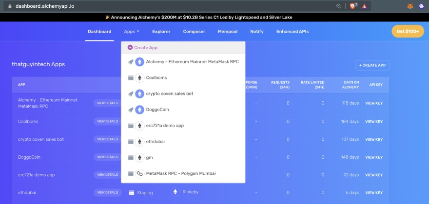

Click "Create App"

Name your app “Polygon Smart Contract”, offer a short description, select “Polygon” for the chain, and "Polygon Mumbai" for the network.

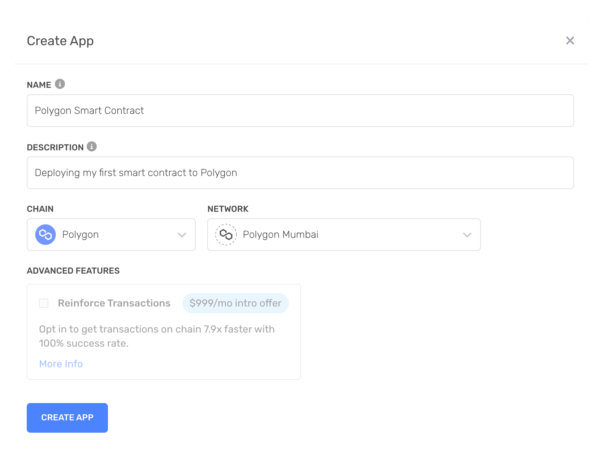

New app settings

Click “Create app” and that’s it! Your app should appear in your apps table.

By clicking on the "View Key" link to the right of the the table row for your app, you will be able to find the HTTP RPC URL you can use to access a Polygon Mumbai Testnet node using Alchemy.

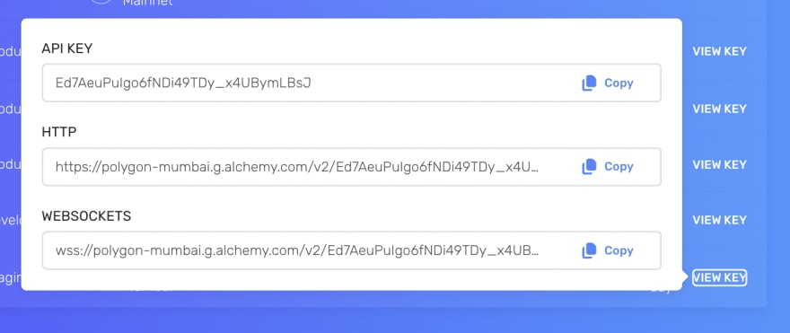

You can see in our example that our HTTP URL is:

`https://polygon-mumbai.g.alchemy.com/v2/Ed7AeuPuIgo6fNDi49TDy_x4UBymLBsJ`

**DO NOT SHARE THIS WITH ANYONE!** This is your access to your node. If you share it, then others will be able to freely use up your app's resources and then you'll be sad.

Copy this down for later, we will use this in our MetaMask configuration, as well as in our Hardhat configuration file to deploy the smart contract.

## Step 6. Create an Ethereum account with MetaMask!

Now we need an Ethereum account to send and receive transactions. For this tutorial, we’ll use MetaMask, a virtual wallet in the browser used to manage your Ethereum account address.

You can download and create a MetaMask account for free [here](https://metamask.io/).

## Step 7. Switch to the Polygon Mumbai test network

After you create your MetaMask account, make sure to switch over to the “Mumbai Test Network”.

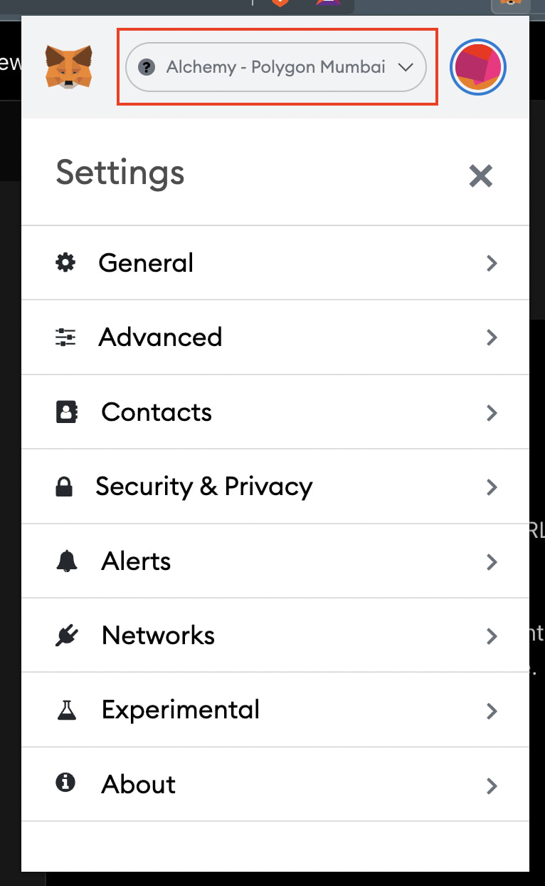

MetaMask doesn't come with the Mumbai Test Network by default, so you will need to make some changes to create the connection. You can do this by clicking on your MetaMask profile icon and going down to settings.

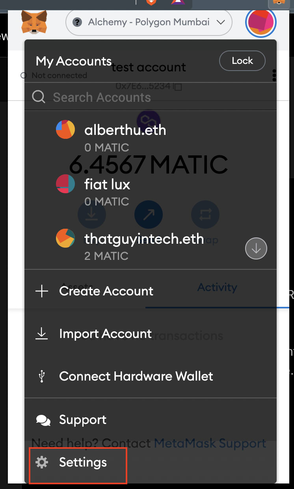

Then click on "Networks" and then the "Add network" button.

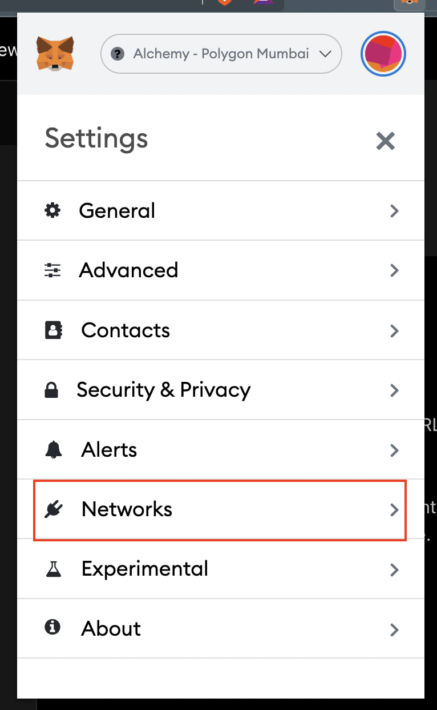 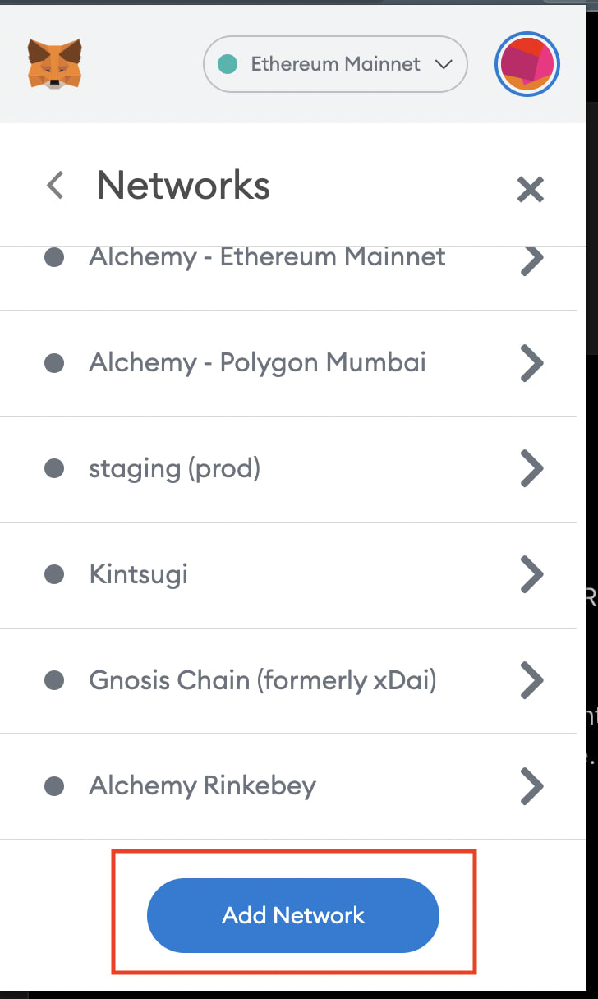

Input the following settings:

* **Network Name**: Polygon Mumbai
* **New RPC URL**: Chain ID: 80001
* **Currency Symbol**: MATIC
* **Block Explorer URL**: [https://mumbai.polygonscan.com](https://mumbai.polygonscan.com/)

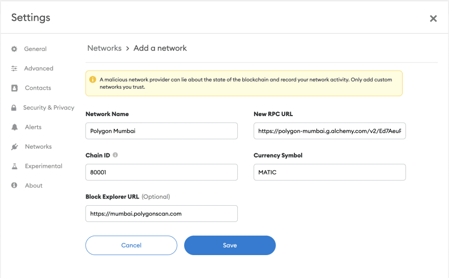

After you confirm the settings, MetaMask should automatically be connected to the new Polygon Mumbai test network.

## Step 8. Get some free test ETH from the Mumbai faucet

Go to [https://mumbaifaucet.com/ ](https://mumbaifaucet.com/)and input your wallet address (ethereum account address) from MetaMask.

You can get your wallet address by opening MetaMask and copying the long string that goes `0x...` at the top.

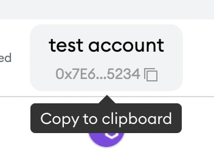

Once you input your wallet address into the faucet input box and click "Send Me MATIC", you will see a new transaction link show up. That links you to the polygonscan page where you can view a receipt of the faucet transaction.

Here is an [example](https://mumbai.polygonscan.com/tx/0x9c20ebc97f9569ce66826d3e9956a750de867b38585ee24111519abd15167740) on the polyscan polygon blockchain explorer.

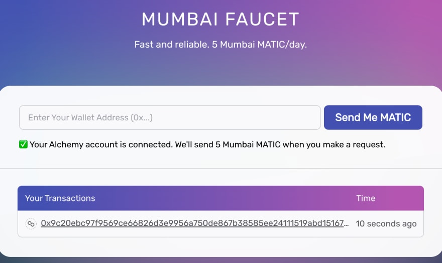

Good stuff! Now that you have some "money", we can actually go back to our contract and deploy it!

## Step 9. Connect MetaMask and Alchemy to your project

We’ve created a MetaMask wallet, Alchemy account, and written our smart contract, now it’s time to connect the three.

Every transaction sent from your virtual wallet requires a signature using your unique private key. To provide our program with this permission, we can safely store our private key (and Alchemy API key) in an environment file.

First, install the [dotenv](https://www.npmjs.com/package/dotenv) package in your project directory:

<CodeGroup>
  ```shell shell
  npm install dotenv --save
  ```
</CodeGroup>

Then, create a `.env` file in the root directory of our project, and add your MetaMask private key and HTTP Alchemy API URL to it.

<Warning>
  Your environment file must be named .env or it won't be recognized as an environment file. Do not name it process.env or .env-custom or anything else.
</Warning>

* Follow these instructions to export your private key
* Review the end of Step 5 to get your HTTP Alchemy API URL

So at this point, your `.env` file should look like this:

<CodeGroup>
  ```text .env
  API_URL=https://polygon-mumbai.g.alchemy.com/v2/<your-api-key>
  PRIVATE_KEY="your-metamask-private-key"
  ```
</CodeGroup>

Now let's make sure these environment variables are correctly loaded in our hardhat project.

We'll use the `dotenv` module inside our `hardhat.config.js` file to do so.

## Step 10: Update hardhat.config.js

We’ve added several dependencies and plugins so far, now we need to update `hardhat.config.js` so that our project knows about all of them.

Update your `hardhat.config.js` with the following code snippet:

<CodeGroup>
  ```javascript hardhat.config.js
  require("@nomiclabs/hardhat-waffle");
  require("dotenv").config();

  const { API_URL, PRIVATE_KEY } = process.env;

  // This is a sample Hardhat task. To learn how to create your own go to
  // https://hardhat.org/guides/create-task.html
  task("accounts", "Prints the list of accounts", async (taskArgs, hre) => {
    const accounts = await hre.ethers.getSigners();

    for (const account of accounts) {
      console.log(account.address);
    }
  });

  // You need to export an object to set up your config
  // Go to https://hardhat.org/config/ to learn more

  /**
   * @type import('hardhat/config').HardhatUserConfig
   */
  module.exports = {
    solidity: "0.8.9",
    networks: {
      mumbai: {
        url: API_URL,
        accounts: [`0x${PRIVATE_KEY}`]
      }
    }
  };
  ```
</CodeGroup>

Note that with `dotenv`, we can access variables defined in our `.env` file by using `process.env`.

Inside the [hardhat config](https://hardhat.org/config/), we define a new network called `mumbai` that uses the Alchemy HTTP URL and our MetaMask account to talk to the blockchain.

## Step 11: Compile our Polgyon smart contract

To make sure everything is working so far, let’s compile our contract. The compile task is one of the built-in hardhat tasks.

From the command line run:

<CodeGroup>
  ```shell shell
  npx hardhat compile
  ```
</CodeGroup>

If all goes well, you should see something like this output in your terminal:

<CodeGroup>
  ```powershell powershell
  thatguyintech@albert new % npx hardhat compile
  Compiled 1 Solidity file successfully
  ```
</CodeGroup>

At this point, if you have any issues, please check previous discussions on [Ethereum Stackexchange](https://ethereum.stackexchange.com/) using the [Alchemy](https://ethereum.stackexchange.com/questions/tagged/alchemy), [Polygon](https://ethereum.stackexchange.com/questions/tagged/polygon), or [Hardhat](https://ethereum.stackexchange.com/questions/tagged/hardhat) tags, or create your own question!

## Step 12: Deploy the smart contract on Polygon

We’re finally ready to deploy our smart contract! Navigate to the command line and run:

<Info>
  You need to have at least about 1.1 ETH in your test wallet for deployment of the smart contract because it locks 1 ETH in the smart contract at the time of deployment.

  If you do not have 1 ETH, you can go to `scripts/deploy.js` file and change the amount that you want to lock in the smart contract on Line 14.
</Info>

<CodeGroup>
  ```shell shell
  npx hardhat run scripts/sample-script.js --network mumbai
  ```
</CodeGroup>

You should then see output similar to this (with different address string):

<CodeGroup>
  ```powershell powershell
  Lock with 1 ETH and unlock timestamp 1670271568 deployed to 0x8Fab93D28e52a93d4b00E25Eaa04B64223382f89
  ```
</CodeGroup>

You can now paste this contract address into [https://mumbai.polygonscan.com/](https://mumbai.polygonscan.com/) and find details about your deployed contract.

For example, you can see when the contract was deployed, how much the transaction fee cost, and which wallet address was responsible for the deployment.

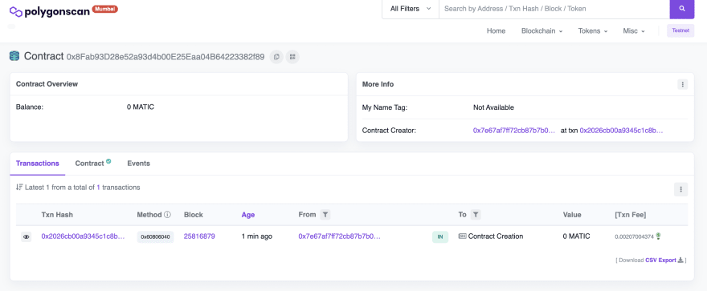

Copy your contract address (i.e. `0x8Fab93D28e52a93d4b00E25Eaa04B64223382f89`) and create a new line in your `.env` file to keep track of it for the next step.

Your `.env` file should have at least these three environment variables defined:

<CodeGroup>
  ```text .env
  API_URL="https://polygon-mumbai.g.alchemy.com/v2/<your-api-key>"
  PRIVATE_KEY="your-wallet-private-key"
  CONTRACT_ADDRESS="your-deployed-contract-address"
  ```
</CodeGroup>

Congrats! You just deployed a smart contract to the Polygon sidechain 🎉.

To understand what’s going on under the hood, let’s navigate to the Explorer tab in our [Alchemy dashboard](https://dashboard.alchemyapi.io/explorer). If you have multiple Alchemy apps, make sure to filter by app and select "Polygon Smart Contract".

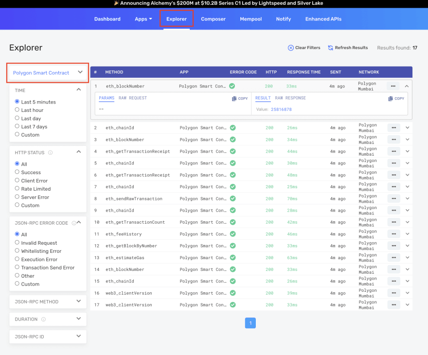

Here you’ll see a handful of JSON-RPC calls that Hardhat/Ethers made under the hood for us when we called the `.deploy()` function.

Two important ones to call out here are:

1. [eth\_sendRawTransaction](https://docs.alchemy.com/alchemy/apis/ethereum/eth_sendrawtransaction), which is the request to actually write our contract onto the Polygon chain, and

2. [eth\_getTransactionByHash](https://docs.alchemy.com/alchemy/apis/ethereum/eth_gettransactionbyhash) which is a request to read information about our transaction given the hash (a typical pattern when sending transactions).

## Step 13: Create greet.js to interact with the Polygon smart contract

Now that we have a contract deployed to the blockchain, we interact with it by writing a script!

In your `scripts` folder, creates a file called `scripts/greet.js`. Read through the comments to understand what's going on!

<CodeGroup>
  ```javascript greet.js
  const hre = require("hardhat");
  const ContractJson = require("../artifacts/contracts/Greeter.sol/Greeter.json");
  // The ABI is very important -- it's the interface to your contract, including
  // the different available functions that are exposed for other contracts,
  // accounts, etc. to call.
  const abi = ContractJson.abi;

  async function main() {
      // Notice that we're using process.env.ALCHEMY_API_KEY to load an
      // environment variable. If you are seeing errors, make sure to go
      // back to Step 12 and 13 to set up the dotenv dependency and .env
      // file correctly!
      const alchemy = new hre.ethers.providers.AlchemyProvider(
          'maticmum',
          process.env.ALCHEMY_API_KEY
      );
      // We're using the same wallet private key for the wallet that you
      // created in Step 6. 
      const userWallet = new hre.ethers.Wallet(process.env.PRIVATE_KEY, alchemy);

      // Get the deployed contract. We need both the specific CONTRACT_ADDRESS
      const Greeter = new hre.ethers.Contract(
          process.env.CONTRACT_ADDRESS,
          abi,
          userWallet
      )

      // We're going to issue two write-transactions to modify the state
      // of the Polygon blockchain via our Greeter smart contract.
      
      // The first transaction sets a new greeting with setGreeting, and then
      // waits for the transaction to be mined before doing a sanity
      // check and checking the new greeting state.
      const setTx1 = await Greeter.setGreeting("web3 is ngmi!");
      await setTx1.wait();
      console.log("before: " + await Greeter.greet());

      // The second transaction does the exact same thing with a new input.
      const setTx2 = await Greeter.setGreeting("web3 is awesome!");
      await setTx2.wait();
      console.log("after: " + await Greeter.greet());
  }

  main()
      .then(() => process.exit(0))
      .catch((error) => {
          console.error(error);
          process.exit(1);
  });
  ```
</CodeGroup>

<Info>
  Notice that we're using process.env.ALCHEMY\_API\_KEY, etc., to load environment variables. If you're getting errors related to this, there may be something off with your `dotenv` dependency or `hardhat.config.js` configurations. Retry Steps 12 and 13 to set up the dotenv dependency again!

  Also check [Ethereum StackExchange ](https://ethereum.stackexchange.com/questions/111731/error-hh8-theres-one-or-more-errors-in-your-config-file-expected-a-value-of-t)to see if anyone else has seen the same issues!
</Info>

Before you run the greeting interaction script, we also need to define some new environment variables. Remember your `.env` file from [Step 9](https://docs.alchemy.com/alchemy/tutorials/how-to-deploy-a-polygon-smart-contract#step-9)? We're going to add a few variable definitions, like this:

<CodeGroup>
  ```text .env
  API_URL=https://polygon-mumbai.g.alchemy.com/v2/<your-api-key>
  PRIVATE_KEY="your-wallet-private-key"
  CONTRACT_ADDRESS="your-contract-address-deployed-to-polygon-mumbai"
  ALCHEMY_API_KEY="<your-api-key>"
  ```
</CodeGroup>

Make sure you **save** after editing your `.env` file so that the changes are persisted!

And now we're ready to run the script:

<CodeGroup>
  ```shell shell
  npx hardhat run scripts/greet.js
  ```
</CodeGroup>

After running that command on your command line, you should see output like this:

<CodeGroup>
  ```shell shell
  thatguyintech@albert polygon-smart-contract-tutorial % npx hardhat run scripts/greet.js
  before: web3 is ngmi!
  after: web3 is awesome!
  ```
</CodeGroup>

Once you see this output, that means you've successfully interacted with your polygon network smart contract.

You can also verify that Alchemy has broadcasted and mined your transaction by going to the [Alchemy Mempool Watcher ](https://dashboard.alchemyapi.io/mempool)and taking a look at your most recent transaction.

By clicking into that transaction, you should see something like this that provides all the information you might want to know about your transaction, including what `Block Number` it was mined in, which `From Address` initiated the transaction, which `To Address` is the recipient of the transaction, how much `Value` (in MATIC) exchanged hands, what the transaction fees were, and much more:

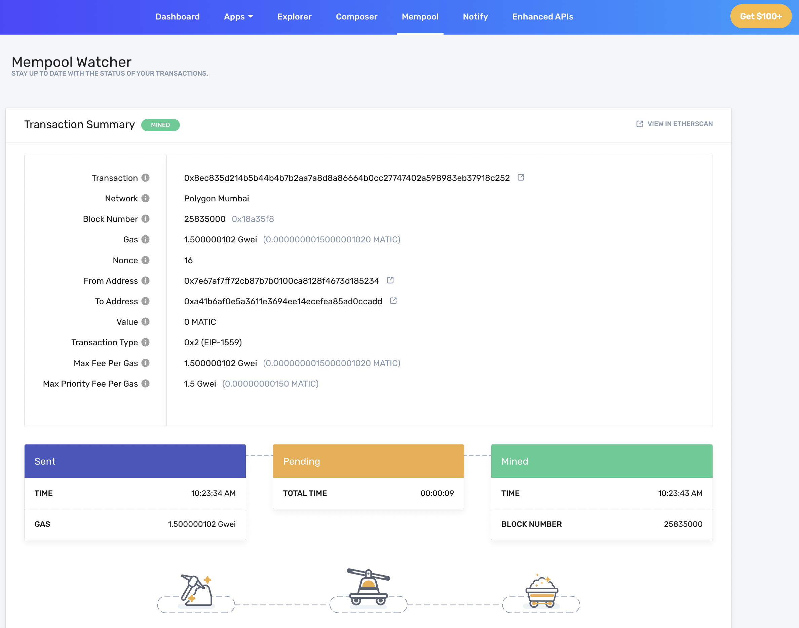

And that's all for now!

You've learned a little bit about Solidity, set up some key accounts and tooling for building smart contracts, deployed your first smart contract to Polygon, and wrote a script to interact with the contract!

You're well on your way to becoming a blockchain developer :)

If you enjoyed this tutorial for how to deploy your first Polygon smart contract, give us a tweet [@AlchemyPlatform](https://twitter.com/AlchemyPlatform)! And tell is if you tried to deploy this to Polygon mainnet!

(Or you can also just tell the original author [@thatguyintech](https://twitter.com/thatguyintech) how awesome he is )

And join our [Discord server](https://www.alchemy.com/discord) to meet other blockchain devs, builders, and entrepreneurs!
