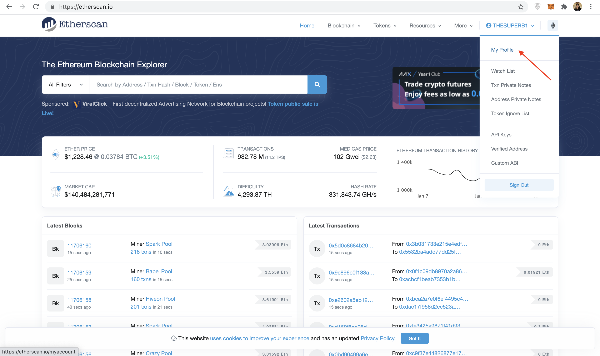

You should have completed Part 1: [Creating and Deploying a Smart Contract](/docs/create-and-deploy-your-smart-contract-using-hardhat), and Part 2:[ Interacting with Your Smart Contract](/docs/interacting-with-a-smart-contract) prior to starting this section below.

## Part 3: Publish your Smart Contract to Etherscan

You did all the hard work of bringing your smart contract to life - now it's time to share it with the world! By verifying your smart contract on Etherscan, anyone can view your source code and interact with your smart contract. Let's get started!

## Step 1: Generate an API Key on your Etherscan account

An Etherscan API Key is necessary to verify that you're the owner of the smart contract that you're trying to publish

<Info>
  If you don't have an Etherscan account, first sign up using this [link](https://etherscan.io/register).
</Info>

Once logged in, press your username on the top right, and select the "My profile" button:



Etherscan Profile

Next, navigate to the "API-KEYs" button on the left tab bar. Then press the "Add" button, name your app whatever you wish (we chose hello-world), and then select **continue**.

.png")

Create a new API-KEY Token

Once you have followed the steps above, you should be able to view your new API key, which we have highlighted in red below. Copy this API key to your clipboard.

.png")

Generate API-KEY.

Let's update your *.env* file to include your Etherscan API Key. If you were following the [Hardhat tutorial](), your *.env* file should look like this:

<CodeGroup>
  ```sol sol
  API_URL = "https://eth-sepolia.g.alchemy.com/v2/your-api-key"
  API_KEY = "your-api-key"
  PRIVATE_KEY = "your-private-account-address"
  ETHERSCAN_API_KEY = "your-etherscan-key"
  ```
</CodeGroup>

## Step 2: Hardhat-deployed Smart Contracts

### Step 2.1 Install the [hardhat-etherscan](https://hardhat.org/plugins/nomiclabs-hardhat-etherscan.html) plugin

Publishing your contract to Etherscan with HardHat is super simple. To get started, you will first need to install the **hardhat-etherscan** plugin to automatically verify your smart contract's source code and ABI on Etherscan. In your **hello-world** project directory run:

<CodeGroup>
  ```shell shell
  npm install --save-dev @nomiclabs/hardhat-etherscan
  ```
</CodeGroup>

**Note**: If using an earlier version of ethers, i.e., `ethers^6.0.0+`, you might encounter problems when installing hardhart-etherscan because of the peer depency of hardhat. You can use the `--force` or `--legacy-peer-deps` flags to ignore these warning and install hardhat-etherscan, i.e., `npm install --save-dev @nomiclabs/hardhat-etherscan --legacy-peer-deps`.

Once installed, include the following statement at the top of your **hardhat.config.js**, and add the Etherscan config options:

<CodeGroup>
  ```javascript hardhat.config.js
  /**
  * @type import('hardhat/config').HardhatUserConfig
  */

  require('dotenv').config();
  require("@nomiclabs/hardhat-ethers");
  require("@nomiclabs/hardhat-etherscan");

  const { API_URL, PRIVATE_KEY } = process.env;
  const ETHERSCAN_API_KEY = process.env.ETHERSCAN_API_KEY;

  module.exports = {
    solidity: "0.7.3",
    defaultNetwork: "sepolia",
    networks: {
        hardhat: {},
        sepolia: {
           url: API_URL,
           accounts: [`0x${PRIVATE_KEY}`]
        }
    },
    etherscan: {
      // Your API key for Etherscan
      // Obtain one at https://etherscan.io/
      apiKey: ETHERSCAN_API_KEY
    }
  };
  ```
</CodeGroup>

### Step 2.2 Verify your smart contract on Etherscan!

Make sure your files are properly saved (especially if you're in VSCode) and your `.env` variables are properly configured.

Finally, run the verify task, passing the address of the contract and the first message argument string that we deployed it with:

<CodeGroup>
  ```shell shell
  npx hardhat verify --network sepolia DEPLOYED_CONTRACT_ADDRESS 'Hello World!'
  ```
</CodeGroup>

<Info>
  Make sure that `DEPLOYED_CONTRACT_ADDRESS` is the address of your deployed smart contract on the Sepolia test network. Also, the last argument, 'Hello World!' must be the same string value that you used during the deploy step in Part 1.
</Info>

If all goes well, you should see the following message in your terminal:

<CodeGroup>
  ```shell shell
  Successfully submitted source code for contract
  contracts/HelloWorld.sol:HelloWorld at 0xdeployed-contract-address
  for verification on Etherscan. Waiting for verification result...

  Successfully verified contract HelloWorld on Etherscan.
  https://sepolia.etherscan.io/address/<contract-address>#contracts
  ```
</CodeGroup>

Congrats! Your smart contract code should be on Etherscan! Check out [Step 3](/docs/submitting-your-smart-contract-to-etherscan#step-3-check-out-your-smart-contract-on-etherscan) to see how to view your smart contract code!

***

## Step 3: Check out your smart contract on Etherscan!

When you navigate to the link provided in your terminal, you should be able to see your smart contract code and ABI published on Etherscan!

**Wahooo - you did it champ! Now, anyone can call or write to your smart contract! We can't wait to see what you build next!**

Once you complete this tutorial, let us know your experience or if you have any feedback by tagging us on Twitter [@Alchemy](https://twitter.com/Alchemy)!
