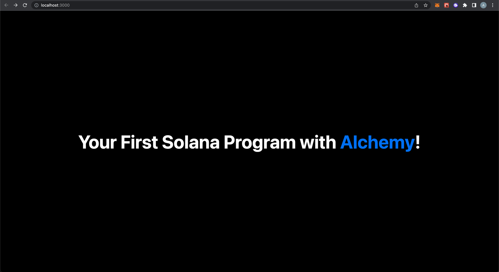

# 1. Introduction

Congrats on making it this far! You’ve already deployed your Solana program, and now we’ll build a frontend application that will interact with the program to allow you write and update a message you’ll store on the Solana blockchain! By the end of this tutorial, you’ll know how to connect your web3 app to a user’s Phantom Wallet and use your previously deployed Solana program to store a message that anyone can change. And we’re going to get through it together!

Like before, you can find the finished product [here](https://github.com/alchemyplatform/solana-hello-world) on Github, and the visual below is what you're gonna build:.

.gif")

You’ll see that each step of this tutorial corresponds to a git commit, like a progress checkpoint to help guide you through. If you have questions at any point feel free to reach out in the [Alchemy Discord](https://discord.com/invite/gWuC7zB) or post questions in our [Discussion Forum](/discuss)! You ready? Let’s go 😎!

# 2. Setup Your Application

## Creating the Application

In the [Hello World Solana Program](/docs/hello-world-solana-program) tutorial, we setup our Anchor project named `solana-hello-world`. From the terminal make you’re in that project directory. In that project, you’ll find an empty `app` folder. We will overwrite that empty app folder with a [Next.js](https://nextjs.org/docs) Typescript starter code template that will be the base for our web3 application!

<CodeGroup>
  ```shell shell
  yarn create next-app --typescript app
  ```
</CodeGroup>

Now, the `app` folder will have a few different subfolders and files, which you can view with your favorite code editor like VSCode. The most important ones for us are:

* A `pages` folder that contains the actually application code we are going to write.

  * The `pages/api` folder is where our code that will connect to our Solana program will live.
  * The `_app.tsx` and `index.tsx` is where our frontend code will live.

* A `styles`folder that contains the CSS files for our application. We’ll edit the `Home.module.css` once and then you don’t have to worry about it!

Next, let’s get into the `app` folder and install the dependencies we'll need for Anchor, Solana, and Phantom:

<CodeGroup>
  ```shell shell
  cd app
  yarn add @project-serum/anchor @solana/web3.js @solana/wallet-adapter-react @solana/wallet-adapter-react-ui @solana/wallet-adapter-wallets @solana/wallet-adapter-base
  ```
</CodeGroup>

This [git commit](https://github.com/alchemyplatform/solana-hello-world/commit/1ecbc0f47e7464630369880c46d4e4fbbbd1df59) is a checkpoint for you to make sure you’ve successfully created your application! By now, you should have been able to create your Next.js project add the relevant dependency libraries we’ll use later. If so, let’s keep going!

## Setting Up Your Initial Frontend

Using your favorite code editor (like VSCode), look at your `app/pages/index.tsx`. It has a lot of boilerplate that we don’t need, so delete all the code and add this to start:

<CodeGroup>
  ```typescript typescript
  import styles from "../styles/Home.module.css";

  export default function Home() {
    return (
      <div className={styles.container}>
        <div className={styles.main}>
          <h1 className={styles.title}>
            Your First Solana Program with{" "}
            <a href="https://alchemy.com/solana/?a=d0c917f7ef">Alchemy</a>!
          </h1>
        </div>
      </div>
    );
  }
  ```
</CodeGroup>

All this is doing is rendering a giant title for your application! Next, look at your `app/styles/Home.module.css` file. Same thing - there’s a lot of boiler plate here. Delete the code and add this:

<CodeGroup>
  ```css css
  .container {
    padding: 2rem;
  }

  .navbar {
    display: flex;
    justify-content: flex-end;
    width: 100%;
  }

  .main {
    min-height: 80vh;
    padding: 64px 0;
    flex: 1;
    display: flex;
    flex-direction: column;
    justify-content: center;
    align-items: center;
  }

  .title {
    margin: 0;
    line-height: 1.15;
    font-size: 64px;
    text-align: center;
  }

  .title a {
    color: #0070f3;
  }

  .title a:hover,
  .title a:focus,
  .title a:active {
    text-decoration: underline;
    border-color: #0070f3;
  }

  .message_bar {
    display: flex;
    justify-content: center;
  }

  .message_input {
    border: none;
    font-size: 16px;
    font-weight: 600;
    height: 48px;
    padding: 0 24px;
    border-radius: 4px;
    margin: 16px;
    text-align: center;
  }

  .message_button {
    background-color: #0070f3;
    border: none;
    cursor: pointer;
    font-size: 16px;
    font-weight: 600;
    height: 48px;
    padding: 0 24px;
    border-radius: 4px;
    margin: 16px;
    text-align: center;
  }

  .card {
    margin: 16px;
    padding: 24px;
    text-align: left;
    color: inherit;
    border: 1px solid #eaeaea;
    border-radius: 10px;
    transition: color 0.15s ease, border-color 0.15s ease;
    max-width: 600px;
  }

  .card h2 {
    margin: 0 0 16px 0;
    font-size: 24px;
  }

  @media (prefers-color-scheme: dark) {
    .card {
      border-color: #222;
    }
  }

  .loader_bar {
    display: flex;
    justify-content: center;
    align-items: center;
  }

  .loader {
    border: 16px solid #f3f3f3;
    border-top: 16px solid #0070f3;
    border-radius: 50%;
    width: 30px;
    height: 30px;
    animation: spin 2s linear infinite;
    margin: 16px;
  }

  @keyframes spin {
    0% {
      transform: rotate(0deg);
    }
    100% {
      transform: rotate(360deg);
    }
  }
  ```
</CodeGroup>

Don’t worry too much about CSS! All this is doing is making our application look pretty. We don’t need CSS to use our Solana program and create our web3 application. It just looks nicer 😅. If you’re still curious, you can learn more about it [here](https://www.w3schools.com/html/html_css.asp).

Awesome! We’re ready to look at our app! You can view your application on `http://localhost:3000/` by running the following from your `app` directory on your terminal:

<CodeGroup>
  ```shell shell
  yarn dev
  ```
</CodeGroup>

You should see something like this:



Amazing 🤩! You have a working web3 application. We haven’t added anything blockchain specific yet, but we’re about to! Make sure your code lines up with this [git commit](https://github.com/alchemyplatform/solana-hello-world/commit/20d64d7c310487e94c3f04ec10aa66bf78c331e9) checkpoint. Alright, now `CTRL+C` from your terminal to stop your app from running for now. We have some changes to make.

## Add the Solana Program IDL

To eventually connect to our Solana program, we’re going to need to add the IDL files that were generated when we ran `anchor build` in the last tutorial. Since you’re still in your `app` folder on your terminal, use this command to add the IDL and types files to our web3 application code to use later:

<CodeGroup>
  ```shell shell
  cp -r ../target/idl ./pages/api/idl
  cp -r ../target/types ./pages/api/types
  ```
</CodeGroup>

One more [git commit](https://github.com/alchemyplatform/solana-hello-world/commit/85516814bbe151a8b07542bf9f7c4ede2e4473c7) checkpoint here to make sure you’re good to go! You should make sure your web3 application looks as amazing as the screenshot above! Your code should match this exactly - if not, copy and paste from it to make sure you’re up-to-date. Things are about to get interesting 😏

# 3. Connect Alchemy And Your Phantom Wallet

## Adding the Alchemy RPC URL

Alright! Let’s add a way for users to connect to your application using their wallet. A reminder, most people in the Solana ecosystem use Phantom as their wallet of choice. When a wallet connects to an application, it’s giving the app permission to send transaction on its behalf. To send transactions on behalf of our users, we’ll need our Alchemy RPC URL again.

<Info>
  You should have an Alchemy account and Phantom wallet from the previous tutorials! If you didn’t make them, you can go [here](https://dashboard.alchemy.com/signup/?a=d0c917f7ef) to create an Alchemy Account, and follow this [setup](/docs/how-to-setup-your-solana-development-environment#3-install-your-phantom-wallet) tutorial to download Phantom.
</Info>

We’ll use our Alchemy RPC URL as an [environment variable](https://nextjs.org/docs/basic-features/environment-variables#exposing-environment-variables-to-the-browser) in our Next.js application, so we’ll need to create an `.env.local` file at the top-level `app` folder. Add this line and you’re golden:

<CodeGroup>
  ```text text
  NEXT_PUBLIC_ALCHEMY_RPC_URL="https://solana-devnet.g.alchemy.com/v2/<YOUR-API-KEY>"
  ```
</CodeGroup>

<Info>
  Eventually, you’re going to want to push your code to a Github repository, you don’t want to hardcode private information like your Alchemy RPC URL in your application. Otherwise, someone can find it and then spam your connection if they’re not very nice. So instead, we use `.env.local` to hide your Alchemy RPC URL and its API KEY. And thanks to your `app/.gitignore` file, this specific file `.emv.local` won’t ever be pushed to Github. Problem solved!
</Info>

Here’s a quick [git commit](https://github.com/alchemyplatform/solana-hello-world/commit/726266c37c89461e6acd24c4bdb7a9d4c1802171) checkpoint for you to confirm you did this right! To clarify, I added a `.env.local.example` file, but locally you should have a`.env.local` file (it won’t be tracked by Github). You should also have added your API Key.

## Adding Constants and Helper Functions

Now that we set up our Alchemy RPC URL, we need to add some other variables that the rest of our application will use on top of this private environment variable. With `app` as our home directory,, under the `api` folder, let’s make a new folder called `utils` and then create a file called `constants.ts` to add the following:

<CodeGroup>
  ```typescript typescript
  import idl from "../idl/solana_hello_world.json";
  import { Connection, PublicKey, clusterApiUrl } from "@solana/web3.js";

  /* Constants for RPC Connection the Solana Blockchain */
  export const commitmentLevel = "processed";
  export const endpoint =
    process.env.NEXT_PUBLIC_ALCHEMY_RPC_URL || clusterApiUrl("devnet");
  export const connection = new Connection(endpoint, commitmentLevel);

  /* Constants for the Deployed "Hello World" Program */
  export const helloWorldprogramId = new PublicKey(idl.metadata.address);
  export const helloWorldprogramInterface = JSON.parse(JSON.stringify(idl));
  ```
</CodeGroup>

Walking through this line-by-line:

* First, we imported the IDL and then some relevant classes from the Solana web3 library.
* We then create some constants to denote the `commitmentLevel` we’ll look for in our `connection` to the Solana blockchain through our Alchemy RPC URL `endpoint`.
* Lastly, we’ll add constants from the IDL we imported earlier to have easy access to our `helloWorldprogramId` and `helloWorldprogramInterface`. We’ll keep them in the same file, and they’ll be useful when we make calls to our Solana program in the next step.

<Info>
  The commitment describes how finalized a block containing transactions is at that point in time. You may know that blockchains are just a chain of bundles of transactions, called blocks. Before being appended to the chain to be read by applications, blocks that require confirmation from nodes in the network, which takes time. The commitment level determines how many nodes in the network need to confirm the block before it’s ready to be read through a client for a web3 application. The more nodes that confirmed, the more likely the block was truly appended to the blockchain.

  Essentially, it’s a tradeoff how fast vs. safe you want your application to be when it comes to reading transactions from Solana, where `processed` is fastest and `finalized` is most safe. Typically, people go in the middle with `confirmed`, but for this application we can use `processed`.You can read more [here](https://docs.solana.com/developing/clients/jsonrpc-api#configuring-state-commitment) about this!
</Info>

While we’re in `app/pages/api/utils`, let’s add one more file called `useIsMounted.ts` and this content:

<CodeGroup>
  ```typescript typescript
  import { useEffect, useState } from "react";

  export default function useIsMounted() {
    const [mounted, setMounted] = useState(false);

    useEffect(() => {
      setMounted(true);
    }, []);

    return mounted;
  }
  ```
</CodeGroup>

Without this, you’re going to run into a [Hydration Error](https://nextjs.org/docs/messages/react-hydration-error) when integrating your Phantom wallet. This isn’t too important - the main takeaway we need to access the `window.solana` object, which won’t be accessible to our application until after our component mounts. Through the React useEffect hook, we’re able to bypass this! (You can watch [this video](https://youtu.be/bq8nVKxDz5A?t=982) for a similar explanation with a different wallet library if you’re curious!).

Okay! Make sure your app constants and helper function are looking good - we'll have a git commit checkpoint after we add our Phantom wallet code now😁!

## Integrating Your Phantom Wallet

First thing we have to do is go to our Phantom Wallet and adjust the network cluster to Devnet for it to work with our application. Click on the “Settings” button in the top left, then go to “Developer Settings.” Then click on “Change Network” to adjust the network to “Devnet.” Check out my screen recording GIF below:

.gif")

Now, let’s add some providers to our `app/pages/_app.ts` file to help support integrating a Phantom Wallet. Delete the boilerplate code in there and then add this:

<CodeGroup>
  ```typescript typescript
  import type { AppProps } from "next/app";
  import { PhantomWalletAdapter } from "@solana/wallet-adapter-phantom";
  import {
    ConnectionProvider,
    WalletProvider,
  } from "@solana/wallet-adapter-react";
  import { WalletModalProvider } from "@solana/wallet-adapter-react-ui";
  import { endpoint } from "./api/utils/constants";
  import "@solana/wallet-adapter-react-ui/styles.css";
  import "../styles/globals.css";

  function MyApp({ Component, pageProps }: AppProps) {
    const phantomWallet = new PhantomWalletAdapter();

    return (
      <ConnectionProvider endpoint={endpoint}>
        <WalletProvider wallets={[phantomWallet]}>
          <WalletModalProvider>
            <Component {...pageProps} />
          </WalletModalProvider>
        </WalletProvider>
      </ConnectionProvider>
    );
  }

  export default MyApp;
  ```
</CodeGroup>

Let’s walk through each section:

* The first few lines are just importing the relevant libraries we installed in Step 1 to help with support different kinds of Solana wallets in our application.
* The `MyApp` function is the top-level component that will render our application. We instantiated a variable `phantomWallet` to represent a way to connect to a user’s Phantom wallet in our app. We then render our application’s components.
* A React Provider is just a wrapper around our application code, providing the [context](https://reactjs.org/docs/context.html) of what RPC URL endpoint we are using (Alchemy) and what wallets we want to show (Phantom). to our app from the Solana wallet libraries we installed. There’s a lot of detail that these libraries abstract away from us to be able to integrate a wallet seamlessly! Pretty cool 😄!

Cool! Now let’s add the Phantom Wallet to `app/pages/index.tsx` by editing it as so:

<CodeGroup>
  ```typescript typescript
  import { WalletMultiButton } from "@solana/wallet-adapter-react-ui";
  import useIsMounted from "./api/utils/useIsMounted";
  import styles from "../styles/Home.module.css";

  export default function Home() {
    const mounted = useIsMounted();

    return (
      <div className={styles.container}>
        <div className={styles.navbar}>{mounted && <WalletMultiButton />}</div>

        <div className={styles.main}>
          <h1 className={styles.title}>
            Your First Solana Program with{" "}
            <a href="https://alchemy.com/solana/?a=d0c917f7ef">Alchemy</a>!
          </h1>
        </div>
      </div>
    );
  }
  ```
</CodeGroup>

Some small changes from last time we touched this file:

* We imported some libraries to help with our wallet button.
* We added the `mounted` function to make sure our wallet button renders only until after the component has mounted, as described earlier.
* We added our wallet button to appear at the top right of our app using the `WalletMultiButton` component!

At this your app should look like this:

.gif")

Nice 🥳! We’ve successfully connected a Phantom wallet to your application! Now, you can write code that sends transactions on behalf of the user (with their approval) to write data to the Solana blockchain. Here’s a [git commit](https://github.com/alchemyplatform/solana-hello-world/commit/207f77372e6f88a2b882af571f8b53455b6608b1) checkpoint. Let’s keep going!

# 4. Connect the App to Your Solana Program

Now we made it to the cool part - connecting to the Solana program we deployed 😤! Really quickly, airdrop some SOL to your Wallet since we’re going to need it soon.

<CodeGroup>
  ```shell shell
  solana airdrop 3
  ```
</CodeGroup>

## Making a Create Message API

Let’s go over what we want our app to do:

1. When a user successfully connects their wallet, we want to show an input form for a user to write a message.
2. Then, a user should press a button to write that message to the Solana blockchain.
3. Once it’s written, we should display on our application the details of the message, including its content, author (the user), and the time it was published.

We can actually do all of this by making calls to our Solana program. In our `app/pages/api` folder let’s rename `hello.ts` to `createMessage.ts` and then remove all the code and replace it with this:

<CodeGroup>
  ```typescript typescript
  import { Program, AnchorProvider, web3 } from "@project-serum/anchor";
  import { SolanaHelloWorld } from "./types/solana_hello_world";
  import {
    connection,
    commitmentLevel,
    helloWorldprogramId,
    helloWorldprogramInterface,
  } from "./utils/constants";
  import { AnchorWallet } from "@solana/wallet-adapter-react";

  export default async function createMessage(
    inputtedMessage: string,
    wallet: AnchorWallet,
    messageAccount: web3.Keypair
  ) {
    const provider = new AnchorProvider(connection, wallet, {
      preflightCommitment: commitmentLevel,
    });

    if (!provider) return;

    /* create the program interface combining the idl, program Id, and provider */
    const program = new Program(
      helloWorldprogramInterface,
      helloWorldprogramId,
      provider
    ) as Program<SolanaHelloWorld>;

    try {
      /* interact with the program via rpc */
      const txn = await program.rpc.createMessage(inputtedMessage, {
        accounts: {
          message: messageAccount.publicKey,
          author: provider.wallet.publicKey,
          systemProgram: web3.SystemProgram.programId,
        },
        signers: [messageAccount],
      });

      const message = await program.account.message.fetch(
        messageAccount.publicKey
      );
      console.log("messageAccount Data: ", message);
      return message;
    } catch (err) {
      console.log("Transaction error: ", err);
      return;
    }
  }
  ```
</CodeGroup>

You’ll notice the code is actually very similar to what we wrote in our tests in the last tutorial! Let’s walk through it briefly:

* After importing relevant libraries and constants, our function will take in the `inputtedMessage` from the user, the user’s `wallet`, and the `account` that our Program will initialize to save the message in.
* We create a `provider` object, which if you remember from last tutorial, is our connection to Solana through 1) an RPC provider and 2) a Solana wallet address. Connection + Wallet = Provider! We also specify the same commitment level as before.
* Lastly, we make a call to our Solana program to create the Message. Like in our tests in the last tutorial, we include the relevant accounts and signatures needed, along with the `inputtedMessage` to make the call. We then fetch and return that message to use in our frontend!

Let’s incorporate this new API endpoint in our frontend code now! The full `app/pages/index.tsx` file should look like this now:

<CodeGroup>
  ```typescript typescript
  import { useState } from "react";
  import { Keypair } from "@solana/web3.js";
  import { useAnchorWallet } from "@solana/wallet-adapter-react";
  import { WalletMultiButton } from "@solana/wallet-adapter-react-ui";
  import useIsMounted from "./api/utils/useIsMounted";
  import createMessage from "./api/createMessage";
  import styles from "../styles/Home.module.css";

  export default function Home() {
    const [messageAccount, _] = useState(Keypair.generate());
    const [message, setMessage] = useState("");
    const [messageAuthor, setMessageAuthor] = useState("");
    const [messageTime, setMessageTime] = useState(0);
    const [inputtedMessage, setInputtedMessage] = useState("");

    const wallet = useAnchorWallet();
    const mounted = useIsMounted();

    return (
      <div className={styles.container}>
        <div className={styles.navbar}>{mounted && <WalletMultiButton />}</div>

        <div className={styles.main}>
          <h1 className={styles.title}>
            Your First Solana Program with{" "}
            <a href="https://alchemy.com/solana/?a=d0c917f7ef">Alchemy</a>!
          </h1>

          {wallet && (
            <div className={styles.message_bar}>
              <input
                className={styles.message_input}
                placeholder="Write Your Message!"
                onChange={(e) => setInputtedMessage(e.target.value)}
                value={inputtedMessage}
              />
              <button
                className={styles.message_button}
                disabled={!inputtedMessage}
                onClick={async () => {
                  const message = await createMessage(
                    inputtedMessage,
                    wallet,
                    messageAccount
                  );
                  if (message) {
                    setMessage(message.content.toString());
                    setMessageAuthor(message.author.toString());
                    setMessageTime(message.timestamp.toNumber() * 1000);
                    setInputtedMessage("");
                  }
                }}
              >
                Create a Message!
              </button>
            </div>
          )}

          {wallet && message && (
            <div className={styles.card}>
              <h2>Current Message: {message}</h2>
              <h2>
                Message Author: {messageAuthor.substring(0, 4)}
                ...
                {messageAuthor.slice(-4)}
              </h2>
              <h2>Time Published: {new Date(messageTime).toLocaleString()}</h2>
            </div>
          )}
        </div>
      </div>
    );
  }
  ```
</CodeGroup>

We added a few things - let’s review:

* We imported more relevant libraries and our newly created `createMessage` function

* We included a few state variables that will be used.

  * `messageAccount` is the generated public-private keypair that will represent storage on the Solana blockchain for our message. We initialized it with `Keypair.generate()`
  * `message`, `messageAuthor`, `messageTime` will store the three corresponding components of a message - it’s content, author, and timestamp. We’ll use this to render a
  * `inputtedMessage` will track what the user inputs as a message in the newly created inputted field below until they submit it. When a message is written, we will clear this variable out.

* We then added an input field and button to our page so our user can input and submit a message if their wallet is connected.

* Lastly, if there is a message that was submitted and the user’s wallet is still connected, we’ll render the message’s content, author, and date published.

Now your app should look like this:

.gif")

Look how far you’ve come 👨‍🎓! You’ve made an app that can connect a user’s wallet and submit to the blockchain a message they write, AND you’re able to show it on your application. So impressive. We’re 99% there - here’s a [git commit](https://github.com/alchemyplatform/solana-hello-world/commit/6393279cd5c95697465c7d641da7950e8f160ef4) checkpoint to make sure your code is all there.

## Making an Update Message API

There is one thing left to do. If you try to write a message, and then write another message, you’ll get an error saying the message account was already initialized. We need to call the separate `updateMessage` function on our Solana program to edit the data in the message’s account.

In our `app/pages/api` folder, let’s add a `updateMessage.ts` file and then add this:

<CodeGroup>
  ```typescript typescript
  import { Program, AnchorProvider, web3 } from "@project-serum/anchor";
  import { SolanaHelloWorld } from "./types/solana_hello_world";
  import {
    connection,
    commitmentLevel,
    helloWorldprogramId,
    helloWorldprogramInterface,
  } from "./utils/constants";
  import { AnchorWallet } from "@solana/wallet-adapter-react";

  export default async function updateMessage(
    inputtedMessage: string,
    wallet: AnchorWallet,
    messageAccount: web3.Keypair
  ) {
    const provider = new AnchorProvider(connection, wallet, {
      preflightCommitment: commitmentLevel,
    });

    if (!provider) return;

    /* create the program interface combining the idl, program Id, and provider */
    const program = new Program(
      helloWorldprogramInterface,
      helloWorldprogramId,
      provider
    ) as Program<SolanaHelloWorld>;

    try {
      /* interact with the program via rpc */
      const txn = await program.rpc.updateMessage(inputtedMessage, {
        accounts: {
          message: messageAccount.publicKey,
          author: provider.wallet.publicKey,
          systemProgram: web3.SystemProgram.programId,
        },
      });

      const message = await program.account.message.fetch(
        messageAccount.publicKey
      );
      console.log("updated messageAccount Data: ", message);
      return message;
    } catch (err) {
      console.log("Transaction error: ", err);
      return;
    }
  }
  ```
</CodeGroup>

This is nearly identical to `createMessage`, the only difference is the function we call on our Solana program now is `updateMessage` which doesn’t need the message account’s signature, just the signer (author), which is implicitly added. Everything else is the same!

Let’s integrate this in our `app/pages/index.tsx` file. The full code should look like this:

<CodeGroup>
  ```typescript typescript
  import { useState } from "react";
  import { Keypair } from "@solana/web3.js";
  import { useAnchorWallet } from "@solana/wallet-adapter-react";
  import { WalletMultiButton } from "@solana/wallet-adapter-react-ui";
  import useIsMounted from "./api/utils/useIsMounted";
  import createMessage from "./api/createMessage";
  import updateMessage from "./api/updateMessage";
  import styles from "../styles/Home.module.css";

  export default function Home() {
    const [messageAccount, _] = useState(Keypair.generate());
    const [message, setMessage] = useState("");
    const [messageAuthor, setMessageAuthor] = useState("");
    const [messageTime, setMessageTime] = useState(0);
    const [inputtedMessage, setInputtedMessage] = useState("");

    const wallet = useAnchorWallet();
    const mounted = useIsMounted();

    return (
      <div className={styles.container}>
        <div className={styles.navbar}>{mounted && <WalletMultiButton />}</div>

        <div className={styles.main}>
          <h1 className={styles.title}>
            Your First Solana Program with{" "}
            <a href="https://alchemy.com/solana/?a=d0c917f7ef">Alchemy</a>!
          </h1>

          {wallet && (
            <div className={styles.message_bar}>
              <input
                className={styles.message_input}
                placeholder="Write Your Message!"
                onChange={(e) => setInputtedMessage(e.target.value)}
                value={inputtedMessage}
              />
              <button
                className={styles.message_button}
                disabled={!inputtedMessage}
                onClick={async () => {
                  const deployedMessage = message
                    ? await updateMessage(inputtedMessage, wallet, messageAccount)
                    : await createMessage(
                        inputtedMessage,
                        wallet,
                        messageAccount
                      );

                  if (deployedMessage) {
                    setMessage(deployedMessage.content.toString());
                    setMessageAuthor(deployedMessage.author.toString());
                    setMessageTime(deployedMessage.timestamp.toNumber() * 1000);
                    setInputtedMessage("");
                  }
                }}
              >
                {message ? "Update the Message!" : "Create a Message!"}
              </button>
            </div>
          )}

          {wallet && message && (
            <div className={styles.card}>
              <h2>Current Message: {message}</h2>
              <h2>
                Message Author: {messageAuthor.substring(0, 4)}
                ...
                {messageAuthor.slice(-4)}
              </h2>
              <h2>Time Published: {new Date(messageTime).toLocaleString()}</h2>
            </div>
          )}
        </div>
      </div>
    );
  }
  ```
</CodeGroup>

Let’s walk through the minor changes we made:

* Now, if there isn’t yet a message published, the button will use the `createMessage` function. If there is a message published, the button will use the `updateMessage` function.

Your app should now look like this:

Congrats! You now have the entire web3 app! Users can now write a message to the Solana blockchain, and later edit that same message! Here’s a [git commit](https://github.com/alchemyplatform/solana-hello-world/commit/ec70d6623285ecd8a0f68b3d28a8d4a818e79812) checkpoint to make sure your app is fully function.

## \[Optional] Prettifying Your Web3 App

You’ll notice it takes a while to update the UI while the message is being published. To make sure people don’t get confused starting at a screen that isn’t moving, let’s add a loading spinner. This is totally optional, but it’ll make the user experience much better!

In your `app/pages/index.tsx` let’s edit it to look like this:

<CodeGroup>
  ```typescript typescript
  import { useState } from "react";
  import { Keypair } from "@solana/web3.js";
  import { useAnchorWallet } from "@solana/wallet-adapter-react";
  import { WalletMultiButton } from "@solana/wallet-adapter-react-ui";
  import useIsMounted from "./api/utils/useIsMounted";
  import createMessage from "./api/createMessage";
  import updateMessage from "./api/updateMessage";
  import styles from "../styles/Home.module.css";

  export default function Home() {
    const [messageAccount, _] = useState(Keypair.generate());
    const [message, setMessage] = useState("");
    const [messageAuthor, setMessageAuthor] = useState("");
    const [messageTime, setMessageTime] = useState(0);
    const [inputtedMessage, setInputtedMessage] = useState("");
    const [loading, setLoading] = useState(false);

    const wallet = useAnchorWallet();
    const mounted = useIsMounted();

    return (
      <div className={styles.container}>
        <div className={styles.navbar}>{mounted && <WalletMultiButton />}</div>

        <div className={styles.main}>
          <h1 className={styles.title}>
            Your First Solana Program with{" "}
            <a href="https://alchemy.com/solana/?a=d0c917f7ef">Alchemy</a>!
          </h1>

          {wallet && (
            <div className={styles.message_bar}>
              <input
                className={styles.message_input}
                placeholder="Write Your Message!"
                onChange={(e) => setInputtedMessage(e.target.value)}
                value={inputtedMessage}
              />
              <button
                className={styles.message_button}
                disabled={!inputtedMessage}
                onClick={async () => {
                  setLoading(true);
                  const deployedMessage = message
                    ? await updateMessage(inputtedMessage, wallet, messageAccount)
                    : await createMessage(
                        inputtedMessage,
                        wallet,
                        messageAccount
                      );

                  if (deployedMessage) {
                    setMessage(deployedMessage.content.toString());
                    setMessageAuthor(deployedMessage.author.toString());
                    setMessageTime(deployedMessage.timestamp.toNumber() * 1000);
                    setInputtedMessage("");
                  }
                  setLoading(false);
                }}
              >
                {message ? "Update the Message!" : "Create a Message!"}
              </button>
            </div>
          )}

          {loading ? (
            <div className={styles.loader_bar}>
              <h2> Loading</h2>
              <div className={styles.loader} />
            </div>
          ) : (
            wallet &&
            message && (
              <div className={styles.card}>
                <h2>Current Message: {message}</h2>
                <h2>
                  Message Author: {messageAuthor.substring(0, 4)}
                  ...
                  {messageAuthor.slice(-4)}
                </h2>
                <h2>Time Published: {new Date(messageTime).toLocaleString()}</h2>
              </div>
            )
          )}
        </div>
      </div>
    );
  }
  ```
</CodeGroup>

This was a minor change:

* We added a state variable to see if our application `isLoading`.
* When a user clicks a button to submit or update a message, it’ll show a loading spinner while the user approves the transaction our app will send on their behalf.
* When we get the message back, we replace the loading spinner with the message details, like what we were showing before!

You'll see we added the spinner now:

.gif")

This is the last [git commit](https://github.com/alchemyplatform/solana-hello-world/commit/68bb071e61ddc99143d1d13f5a9bf85b57724371) checkpoint. You made it to the end 🤩! Congratulations! You’ll see the finished product in the next section!

# 5. You’re Done!

Hooray 🎉! You made it to the end of the tutorial! To recap, you learned how to:

1. Connect a Phantom wallet to your web3 app
2. Read data from your Solana program using the Alchemy Web3 API
3. Send Solana transactions for a user through their Phantom Wallet

Here’s the full code, and this is what the finished product should look like:

.gif")

Now you're fully equipped to apply the skills from this tutorial to build out your own custom web3 App! As always, if you have any questions, don't hesitate to reach out to us for help in the [Alchemy Discord](https://discord.gg/gWuC7zB) or post questions in our [Discussion Forum](/discuss) and we’ll make more tutorials about this! Happy Building 😀!
