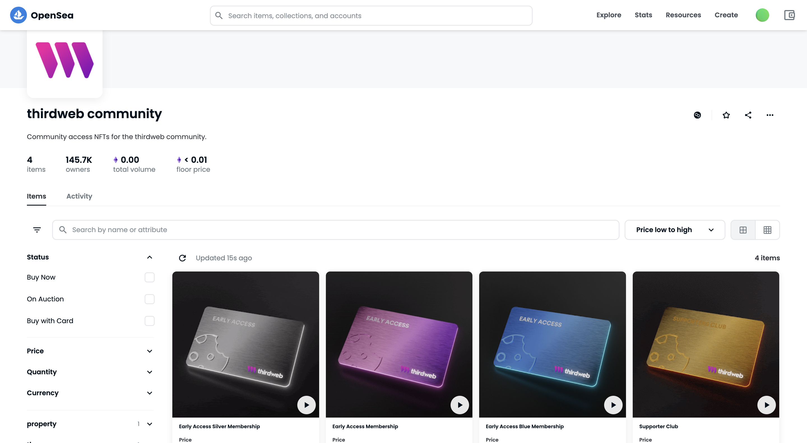
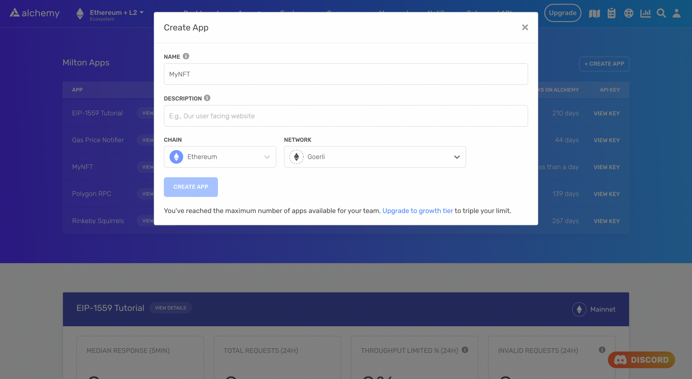
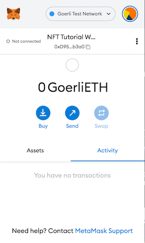
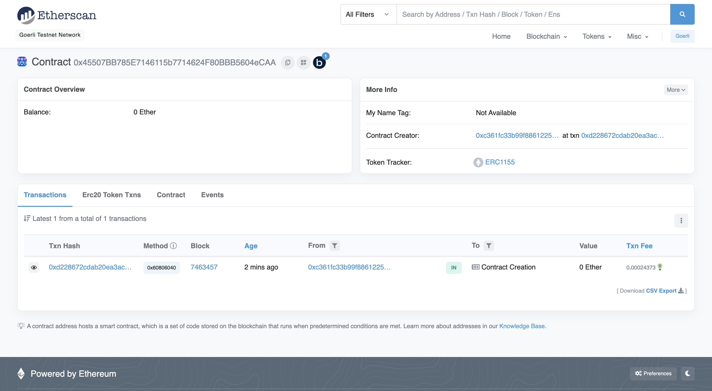

You're probably aware of the two most common standards used to represent tokens on Ethereum:

* **ERC-20:** which standardizes fungible tokens (or currencies).
* **ERC-721:** which standardizes non-fungible tokens (or NFTs).

If you run even a remotely complex blockchain project (such as a game, NFT PFF collection, etc.), chances are you require both tokens and contracts to keep track of them. Additionally, ERC-721 NFTs have been associated with prohibitively high minting and batch transfer costs.



ERC-1155 NFTs by thirdweb

To combat these shortcomings, the Ethereum community developed a new standard called ERC-1155. This standard allows you to create fungible and non-fungible tokens using the same contract, significantly cutting down minting and transfer fees.

In this tutorial, you will write and deploy an ERC-1155 smart contract on the Goerli testnet using the following tools:

* [MetaMask](https://metamask.io/)
* [Solidity](https://docs.soliditylang.org/en/v0.8.0/)
* [Hardhat](https://hardhat.org/)
* [Alchemy](https://alchemy.com/?a=fd0e33a0bb)
* [OpenZeppelin Contracts](https://docs.openzeppelin.com/contracts/3.x/api/token/erc1155)

Don't worry if some of these terms don't make sense to you; we will explain it! But as always, if you have questions at any point, don't hesitate to reach out on the [Alchemy Discord](https://discord.gg/gWuC7zB)!

# Setup your environment

## Step 1: Install Node and npm

If you haven't already, [install node and npm](https://nodejs.org/en/download/) on your local machine.

Make sure that node is at least v14 or higher by typing the following in your terminal:

<CodeGroup>
  ```bash bash
  node -v
  ```
</CodeGroup>

## Step 2: Create an Alchemy app

You will need an [Alchemy app](https://alchemy.com/?a=63bb2620e6) and your app’s API key in this tutorial. To create one, check out [this video](https://www.youtube.com/watch?v=tfggWxfG9o0) or follow the instructions below:

1. From [Alchemy's dashboard](https://dashboard.alchemyapi.io/), hover over the **Apps** drop-down menu and choose **Create App**.
2. Provide a **Name** and **Description** for your app.
3. For **Chain**, select **Ethereum** and for **Network**, select **Goerli**.
4. Click the **Create App** button.
5. After creating your app, click on your app’s **View Key** button in the dashboard and save the **HTTP** key. You will use this later in the tutorial.



Create an Alchemy app

## Step 3: Create a MetaMask Wallet

We need an Ethereum wallet to send and receive transactions. For this tutorial, we’ll use MetaMask, a virtual wallet in the browser. If you want to understand more about how transactions on Ethereum work, check out [this page](https://ethereum.org/en/developers/docs/transactions/) from the Ethereum foundation.

You can download and create a MetaMask account for free [here](https://metamask.io/download/). Once you have an account, make sure to switch to the “Goerli Test Network” in the upper right (so that we’re not dealing with real money).



MetaMask wallet

## Step 4: Add GoerliETH from a Faucet

In order to deploy our smart contract to the test network, we’ll need some test GoerliETH. The easiest way to acquire this is by using Alchemy's [Goerli faucet](https://goerlifaucet.com/). Depending on traffic, the faucet may ask you to sign in with your Alchemy account. If all goes well, you should see your GoerliETH balance update on MetaMask.

## Step 5: Create a Hardhat project

We're going to set up our project using [Hardhat](https://hardhat.org/), the industry-standard development environment for Ethereum smart contracts. Additionally, we'll also install [OpenZeppelin](https://www.openzeppelin.com/) contracts.

***To set up Hardhat, run the following commands in your terminal:***

<CodeGroup>
  ```bash bash
  mkdir erc1155-contract && cd erc1155-contract
  npm init -y
  npm install --save-dev hardhat
  npx hardhat
  ```
</CodeGroup>

Choose `Create a Javascript project` from the menu and accept all defaults. To ensure everything is installed correctly, run the following command in your terminal:

<CodeGroup>
  ```bash bash
  npx hardhat test
  ```
</CodeGroup>

***To install OpenZeppelin, run the following commands in your terminal:***

<CodeGroup>
  ```bash bash
  npm install @openzeppelin/contracts
  ```
</CodeGroup>

# Create your contract

## Step 1: Write the smart contract

Now, let's write a smart contract that implements the assets in a game using tokens. Our game will consist of two fungible currencies (gold and silver), two fungible weapons (sword and shield), and one non-fungible crown.

Open the project in your favorite code editor (e.g., VS Code), and create a new file called `AwesomeGame.sol` in the `contracts` folder. Add the following code to this file:

<CodeGroup>
  ```sol AwesomeGame.sol
  // SPDX-License-Identifier: MIT
  pragma solidity ^0.8.4;

  import "@openzeppelin/contracts/token/ERC1155/ERC1155.sol";

  contract AwesomeGame is ERC1155 {
      uint256 public constant GOLD = 0;
      uint256 public constant SILVER = 1;
      uint256 public constant SWORD = 2;
      uint256 public constant SHIELD = 3;
      uint256 public constant CROWN = 4;

      constructor() ERC1155("https://awesomegame.com/assets/{id}.json") {
          _mint(msg.sender, GOLD, 10**18, "");
          _mint(msg.sender, SILVER, 10**18, "");
          _mint(msg.sender, SWORD, 1000, "");
          _mint(msg.sender, SHIELD, 1000, "");
          _mint(msg.sender, CROWN, 1, "");
      }
  }
  ```
</CodeGroup>

Notice that we have minted fungible and non-fungible tokens from the same contract, which is impossible with ERC-20 and ERC-721.

Also, take note that we have passed a metadata URI to the `ERC1155` constructor. Passing this metadata allows us to associate each token ID with NFT-like metadata, regardless of whether it is fungible or non-fungible.

Using an ERC-11155, we can, for example, associate a picture of a gold coin with the tokens associated with `GOLD`. This wouldn’t be possible had we implemented `GOLD` as a separate ERC-1155 contract.

Compile the contract and make sure everything is working by running the following command in your terminal:

<CodeGroup>
  ```bash bash
  npx hardhat compile
  ```
</CodeGroup>

<Warning>
  **Caution:** If your `contracts` folder contains another `.sol` file other than `AwesomeGame.sol`, feel free to delete it or change it's Solidity version to match: `pragma solidity ^0.8.4`.
</Warning>

## Step 2: Connect MetaMask and Alchemy to your project

Now that we've created a MetaMask wallet, an Alchemy account, and a smart contract, we can connect the three together. To do this, we’ll use the `dotenv` package.

1. Install the `dotenv` pack in your project directory by running the following command from your terminal:

<CodeGroup>
  ```bash bash
  npm install dotenv --save
  ```
</CodeGroup>

2. Create a `.env` file in the root directory of our project. **Note:** Your `.env` file must only be named `.env`. Do not change the name to any form `xx.env`.
3. Add your MetaMask private key and **HTTP Alchemy API Key** (from Step 2: Create an Alchemy app) to your `.env` file. For instructions on how to export your private key from your wallet, see MetaMask’s documentation [How to export an account's private key](https://metamask.zendesk.com/hc/en-us/articles/360015289632-How-to-Export-an-Account-Private-Key).
4. Your `.env` file should look like the following:

<CodeGroup>
  ```text .env
  API_URL = "https://eth-goerli.g.alchemy.com/v2/your-api-key"
  PRIVATE_KEY = "your-metamask-private-key"
  ```
</CodeGroup>

## Step 3: Update hardhat.config.js

Now that we’ve added several dependencies and plugins, we need to update `hardhat.config.js` so that our project knows about them as well.

Replace the contents of `hardhat.config.js` with the following code:

<CodeGroup>
  ```javascript hardhat.config.js
  require('dotenv').config();
  require("@nomicfoundation/hardhat-toolbox");

  const { API_URL, PRIVATE_KEY } = process.env;
  module.exports = {
     solidity: "0.8.4",
     defaultNetwork: "goerli",
     networks: {
        hardhat: {},
        goerli: {
           url: API_URL,
           accounts: [`0x${PRIVATE_KEY}`]
        }
     },
  }
  ```
</CodeGroup>

# Deploy your project

## Step 1: Write the deployment script

Now that our contract is written and our configuration file is good to go, it’s time to write the contract deploy script.

Navigate to the `scripts` folder and create a new file called `deploy.js` , and add the following code:

<CodeGroup>
  ```javascript deploy.js
  const hre = require("hardhat");

  async function main() {

    const factory = await hre.ethers.getContractFactory("AwesomeGame");
    const [owner] = await hre.ethers.getSigners();
    const contract = await factory.deploy();

    await contract.deployed();
    console.log("Contract deployed to: ", contract.address);
    console.log("Contract deployed by: ", owner.address, "\n");
    console.log("Tokens have been minted successfully!");
  }

  main()
    .then(() => process.exit(0))
    .catch((error) => {
      console.error(error);
      process.exit(1);
    });
  ```
</CodeGroup>

Run the script using the following command:

<CodeGroup>
  ```bash bash
  npx hardhat run scripts/deploy.js
  ```
</CodeGroup>

You should see output that looks something like this:

<CodeGroup>
  ```bash bash
  Contract deployed to:  0x5FbDB2315678afecb367f032d93F642f64180aa3
  Contract deployed by (Owner):  0xf39Fd6e51aad88F6F4ce6aB8827279cffFb92266 

  Tokens have been minted successfully!
  ```
</CodeGroup>

Notice that every wallet we marked as eligible to receive an airdrop now has an NFT balance of 1. The owner/creator of the project was responsible for minting all the NFTs as well as paying the gas fees associated with it.

## Step 2: Deploy the contract to Goerli

Now, let’s deploy our contract to a real testnet. In the terminal, run the following command:

<CodeGroup>
  ```jsx jsx
  npx hardhat run scripts/deploy.js --network goerli
  ```
</CodeGroup>

If all goes well, you should see the following output:

<CodeGroup>
  ```jsx jsx
  Contract deployed to:  0x45507BB785E7146115b7714624F80BBB5604eCAA
  Contract deployed by:  0xc361Fc33b99F88612257ac8cC2d852A5CEe0E217 

  Tokens have been minted successfully!
  ```
</CodeGroup>

Our contract is live on the Goerli net and we can check this out on [Goerli Etherscan](https://goerli.etherscan.io/) by searching for the contract’s address.



Contract page on Goerli Etherscan

# Conclusion

Congratulations! You now know how to create and deploy ERC-1155 contracts. In a future tutorial, we will explore how to configure metadata using [Pinata](https://www.pinata.cloud/) and IPFS, and view our tokens on [OpenSea](https://opensea.io/).

If you enjoyed this tutorial about creating on-chain allowlists, tweet us at [@AlchemyPlatform](https://twitter.com/AlchemyPlatform) and give us a shoutout!

Don't forget to join our [Discord server](https://www.alchemy.com/discord) to meet other blockchain devs, builders, and entrepreneurs!

Ready to start building your next web3 project?

[Create a free Alchemy account](https://alchemy.com/?a=fd0e33a0bb) and do share your project with us!
