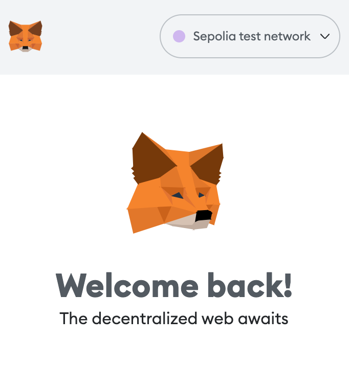
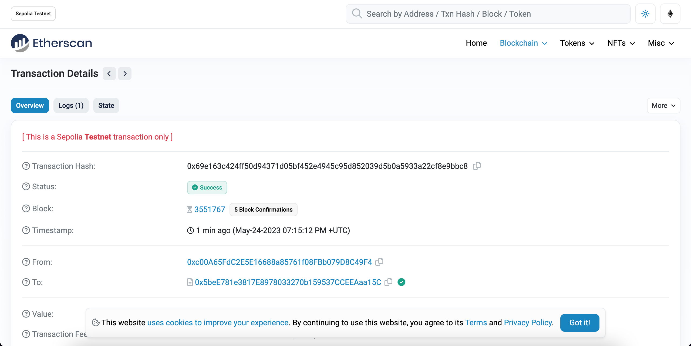
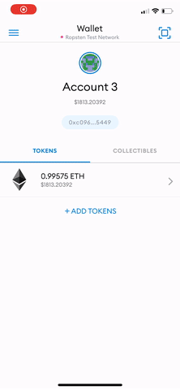

*Estimated time to complete this guide: ~3 minutes*

Congrats! You've made it to the shortest and simplest part of our NFT tutorial series: how to view your freshly minted NFT in your virtual wallet. We'll be using Metamask for this example since it is what we used in the previous two parts.

As a prerequisite, you should already have Metamask on mobile installed, and it should include the account to which you minted your NFT — you can get the app for free on [iOS](https://apps.apple.com/us/app/metamask-blockchain-wallet/id1438144202), or [Android](https://play.google.com/store/apps/details?id=io.metamask\&hl=en_US\&gl=US).

***

## Step 1: Set your network to Sepolia

At the top of the app, press the *Wallet* button, after which you'll be prompted to select a network. As our NFT was minted on the Sepolia network, you'll want to select Sepolia as your network.

***

## Step 2: Add your collectible to Metamask

Once you're on the Sepolia network, select the *NFTs* tab on the right and add the NFT smart contract address and the ID of your NFT— which you should be able to find on Etherscan based on the transaction hash from your [NFT minted in Part II](https://docs.alchemyapi.io/alchemy/tutorials/how-to-write-and-deploy-a-nft-smart-contract/how-to-mint-a-nft) of our tutorial.

Mint NFT Transaction page on Sepolia Etherscan

You may need to refresh a couple of times to view your NFT —but it will be there! 😄

Congrats! You can now view your NFT in your wallet! We can't wait to see how you'll take the NFT world by storm! 🎨🪄🧙🤑🎊
