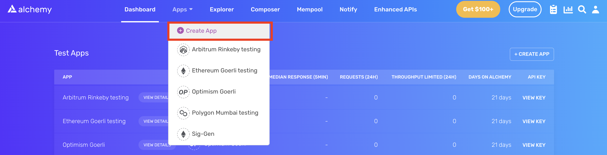

DAOs (decentralized autonomous organizations) have become a powerful use case for blockchain. With a dedicated community and a shared crypto wallet, DAOs have the power to ship products, fundraise for important causes, maintain/grow core community protocols, and drive transformative change within the Web3 space.

<Info>
  To learn more about DAOs (and the steps to starting one!), check out Alchemy's [comprehensive DAO creation guide](https://www.alchemy.com/overviews/the-definitive-guide-to-starting-a-dao).
</Info>

One critical component of any DAO is [governance](https://www.alchemy.com/overviews/the-definitive-guide-to-starting-a-dao#governance), going hand in hand with [treasury management](https://www.alchemy.com/overviews/the-definitive-guide-to-starting-a-dao#treasury-management) and [token incentive systems](https://www.alchemy.com/overviews/the-definitive-guide-to-starting-a-dao#tokenomics). If you're interested in starting a DAO, you'll need to launch a governance token and governance contract to the blockchain so your members can create, vote on, and execute proposals as a community.

## Create an Alchemy app and Ethereum address

### Step 1: Connect to the Ethereum network

There are many ways to interact with the Ethereum blockchain. To make things most accessible, we'll use a free account on [Alchemy](https://alchemy.com/?a=bf6ebb0d1c), a blockchain developer platform and API that allows us to communicate with the Ethereum blockchain without having to run our own nodes.

In this tutorial, we'll also take advantage of Alchemy's developer tools for monitoring and analytics to understand what's going on "under the hood" in our smart contract deployment. If you don't already have an Alchemy account, you can sign up for free [here](https://alchemy.com/?a=bf6ebb0d1c).

### Step 2: Create an app and API key

Once you've created an Alchemy account, you can generate an API key by creating an app. This will allow us to make requests to the Sepolia test network. Check out [this guide](https://docs.alchemyapi.io/guides/choosing-a-network) if you're curious to learn more about test networks.

***To create an Alchemy app:***

1. From the Alchemy Dashboard, hold your pointer over the **Create App**, then click **Create App**.



Create App button

2. Provide a **Name** and **Description** for your app, then choose **Ethereum** as your **Chain** and **Sepolia** as your **Network**.


3. Click **Create app** and that’s it! Your app should appear in the table below.

### Step 3: Create an Ethereum account (address)

We need an Ethereum account to send and receive transactions. For this tutorial, we'll use Metamask, a virtual wallet in the browser used to manage your Ethereum account address. If you want to understand more about how transactions on Ethereum work, check out [this page](https://ethereum.org/en/developers/docs/transactions/) from the Ethereum foundation.

You can download and create a MetaMask account for free [here](https://metamask.io/download.html). After you create an account, make sure to switch over to the **Sepolia Test Network** in the upper right (so that we're not dealing with real money).

### Step 4: Add Ether from a faucet

In order to deploy our smart contract to the test network, we'll need some test Eth. To get Eth, go to the Alchemy [Sepolia Faucet](https://sepoliafaucet.com/) and enter your Sop account address, then click **Send Me ETH**. You should see Eth in your MetaMask account soon after!

### Step 5: Check your Balance

To double check our balance is there, let’s make an [eth\_getBalance](/reference/eth-getbalance) request using [Alchemy’s composer tool](https://composer.alchemyapi.io/?composer_state=%7B%22network%22%3A0%2C%22methodName%22%3A%22eth_getBalance%22%2C%22paramValues%22%3A%5B%22%22%2C%22latest%22%5D%7D). This will return the amount of Eth in our wallet. After you input your MetaMask account address and click **Send Request**, you should see a response like this:

`{"jsonrpc": "2.0", "id": 0, "result": "0xde0b6b3a7640000"}`

**Note:** This result is in wei not eth. Wei is used as the smallest denomination of ether. The conversion from wei to eth is: 1 eth = 10¹⁸ wei. So if we convert 0xde0b6b3a7640000 to decimal we get 1\*10¹⁸ which equals 1 Eth.

## Set up your development environment

### Step 1: Initialize your project

First, we'll need to create a folder for our project. Navigate to your terminal and type:

<CodeGroup>
  ```shell shell
  mkdir voting-contract
  cd voting-contract
  ```
</CodeGroup>

Now that we're inside our project folder, we'll use npm init to initialize the project. If you don't already have npm installed, follow [these instructions](https://docs.npmjs.com/downloading-and-installing-node-js-and-npm) (we'll also need [Node.js](https://nodejs.org/en/download/), so download that too!).

<CodeGroup>
  ```shell shell
  npm init
  ```
</CodeGroup>

For our project, it doesn't matter how you answer the installation questions. The following is how we did it for reference:

<CodeGroup>
  ```shell shell
  package name: (voting-contract) 
  version: (1.0.0) 
  description: Open Zeppelin governance token & contracts for my DAO!
  entry point: (index.js) 
  test command: 
  git repository: 
  keywords: 
  author: 
  license: (ISC) 
  About to write to /Users/madhavvats/Desktop/voting-contract/package.json:

  {
    "name": "voting-contract",
    "version": "1.0.0",
    "description": "Open Zeppelin governance token & contracts for my DAO!",
    "main": "index.js",
    "scripts": {
      "test": "echo \"Error: no test specified\" && exit 1"
    },
    "author": "",
    "license": "ISC"
  }
  ```
</CodeGroup>

Approve the `package.json` and we're good to go!

### Step 2: Download Hardhat

[Hardhat](https://hardhat.org/hardhat-runner/docs/getting-started#overview) is a development environment to compile, deploy, test, and debug your Ethereum software. It helps developers build smart contracts and dApps locally before deploying to the live chain.

Navigate to the terminal and make sure you're inside the `my-nft` project folder, then run:

<CodeGroup>
  ```shell shell
  npm install --save-dev hardhat
  ```
</CodeGroup>

Check out the Hardhat documentation for more details on [installation instructions](https://hardhat.org/hardhat-runner/docs/getting-started#installation).

### Step 3: Create a Hardhat project

Inside our project folder, run the following command:

<CodeGroup>
  ```shell shell
  npx hardhat
  ```
</CodeGroup>

You should then see a welcome message and the option to select what you want to do. Select `Create an empty hardhat.config.js`:

<CodeGroup>
  ```sql sql
  888    888                      888 888               888
  888    888                      888 888               888
  888    888                      888 888               888
  8888888888  8888b.  888d888 .d88888 88888b.   8888b.  888888
  888    888     "88b 888P"  d88" 888 888 "88b     "88b 888
  888    888 .d888888 888    888  888 888  888 .d888888 888
  888    888 888  888 888    Y88b 888 888  888 888  888 Y88b.
  888    888 "Y888888 888     "Y88888 888  888 "Y888888  "Y888

  👷 Welcome to Hardhat v2.12.2 👷‍

  ? What do you want to do? … 
    Create a JavaScript project
    Create a TypeScript project
  ❯  Create an empty hardhat.config.js
    Quit
  ```
</CodeGroup>

This generates a `hardhat.config.js` file for us, where we will specify the setup for our project (later when you [Install Ethers.js](#step-13-install-ethers.js)).

### Step 4: Create your project folders

To keep our project organized, we’ll create two new folders. Navigate to the root directory of your project in your terminal and type:

<CodeGroup>
  ```shell shell
  mkdir contracts

  mkdir scripts
  ```
</CodeGroup>

* `contracts/` is where we’ll keep our governance smart contract code
* `scripts/` is where we’ll keep scripts to deploy and interact with our smart contract

## Write your contracts

### Step 1: Token contract

Now that our development environment is set up, the next step is to set up our governance token. This ERC-20 token will determine the voting power of each account in our governance setup.

Our token will implement the OpenZeppelin ERC20Votes extension, which keeps track of historical balances so that voting power is retrieved from past snapshots instead of the current balance. This protection helps prevent double voting.

Open the `voting-contract` project in your favorite text editor (we like [VSCode](https://code.visualstudio.com)). Smart contracts are written in a language called Solidity, which is what we will use to write our `MyToken.sol` smart contract.‌

Because we are inheriting classes from the OpenZeppelin contracts library, in your terminal first run the following to install the library into our folder:

<CodeGroup>
  ```shell shell
  npm install @openzeppelin/contracts
  ```
</CodeGroup>

Now we are ready to start writing our first contract!

1. Navigate to the `contracts` folder and create a new file called `MyToken.sol`.
2. Below is our governance token smart contract code, which is based on the [OpenZeppelin](https://docs.openzeppelin.com/contracts/4.x/api/governance) library's ERC-20 implementation. Copy and paste the contents below into your `MyToken.sol` file.

<CodeGroup>
  ```sol MyToken.sol
  // Contract based on: https://docs.openzeppelin.com/contracts/4.x/governance
  // SPDX-License-Identifier: MIT
  pragma solidity ^0.8.0;

  import "@openzeppelin/contracts/token/ERC20/ERC20.sol";
  import "@openzeppelin/contracts/token/ERC20/extensions/draft-ERC20Permit.sol";
  import "@openzeppelin/contracts/token/ERC20/extensions/ERC20Votes.sol";

  contract MyToken is ERC20, ERC20Permit, ERC20Votes {
      constructor() ERC20("MyToken", "MTK") ERC20Permit("MyToken") {}

      // The functions below are overrides required by Solidity.

      function _afterTokenTransfer(address from, address to, uint256 amount)
          internal
          override(ERC20, ERC20Votes)
      {
          super._afterTokenTransfer(from, to, amount);
      }

      function _mint(address to, uint256 amount)
          internal
          override(ERC20, ERC20Votes)
      {
          super._mint(to, amount);
      }

      function _burn(address account, uint256 amount)
          internal
          override(ERC20, ERC20Votes)
      {
          super._burn(account, amount);
      }
  }
  ```
</CodeGroup>

You can learn more about OpenZeppelin contracts [here](https://www.openzeppelin.com/contracts) and use this interactive [generator](https://wizard.openzeppelin.com/#erc20) to customize the functionality of your token/governance contract—just update the smart contract text accordingly!

#### Code explanation

So, what does this code do, exactly? Let's break it down, line by line.

In lines 5-7, our code inherits three [OpenZepplin](https://openzeppelin.com) smart contract classes, stemming from @openzeppelin/contracts/token/ERC20/ERC20.sol. This library contains the [ERC-20 standard](https://docs.openzeppelin.com/contracts/4.x/erc20), which implements the fungible tokens we'll use in our voting contracts and is inherited into our DAO governance token.

In lines 9-34, we have our token deployment smart contract, which inherits most of its functionality directly from the OpenZeppelin contract, with a few key overrides as required by Solidity, introducing new versions of the token transfer, mint, and burn functions.

### Step 2: Governor contract

The next step is to write our actual governance logic, the smart contact that will dictate proposal creation, voting, and execution using our DAO's token.

1. Navigate to the `contracts` folder and create a new file called `MyGovernor.sol`.
2. Below is our governance token smart contract code, which is based on the [OpenZeppelin](https://docs.openzeppelin.com/contracts/4.x/api/governance#governor) library's Governor implementation. Copy and paste the contents below into your `MyGovernor.sol` file.

<CodeGroup>
  ```sol MyGovernor.sol
  // SPDX-License-Identifier: MIT
  pragma solidity ^0.8.4;

  import "@openzeppelin/contracts/governance/Governor.sol";
  import "@openzeppelin/contracts/governance/extensions/GovernorCountingSimple.sol";
  import "@openzeppelin/contracts/governance/extensions/GovernorVotes.sol";
  import "@openzeppelin/contracts/governance/extensions/GovernorVotesQuorumFraction.sol";

  contract MyGovernor is Governor, GovernorCountingSimple, GovernorVotes, GovernorVotesQuorumFraction {
      constructor(IVotes _token)
          Governor("MyGovernor")
          GovernorVotes(_token)
          GovernorVotesQuorumFraction(4)
      {}

      function votingDelay() public pure override returns (uint256) {
          return 1; // 1 block
      }

      function votingPeriod() public pure override returns (uint256) {
          return 45818; // 1 week
      }
    
      function proposalThreshold() public pure override returns (uint256) {
          return 0;
      }

      // The following functions are overrides required by Solidity.
      function quorum(uint256 blockNumber)
          public
          view
          override(IGovernor, GovernorVotesQuorumFraction)
          returns (uint256)
      {
          return super.quorum(blockNumber);
      }
  }
  ```
</CodeGroup>

#### Code explanation

This code might look complex, but that is okay. Let's break it down, line by line. The contract's core logic is still given within the Governor contract (imported from OpenZeppelin in lines 4-7), but we need to set a few additional parameters:

1. `votingDelay`: Determines how long after a proposal is created should voting power be fixed. A large voting delay gives users time to unstake tokens if necessary (lines 16-18).
2. `votingPeriod`: Determines how long a proposal remains open to votes (lines 20-22).

These parameters are specified in the number of blocks. Assuming block time of around 13.14 seconds, we will set `votingDelay` = 1 day = 6545 blocks, and `votingPeriod` = 1 week = 45818 blocks.

<Info>
  **Tip:** You can change the voting delay and period to whatever you'd like!
</Info>

In addition, we can optionally set a proposal threshold (lines 24-26). This restricts proposal creation to accounts that have enough voting power.

#### Additional modules

There are a few other modules you should know about:

1. **To determine voting power:** the `GovernorVotes` module, which hooks to a IVotes instance to assess the voting power of an account based on the token balance it holds when a proposal becomes active. This module requires the address of the token as a constructor parameter.
2. **To find how many votes are needed for a quorum:** `GovernorVotesQuorumFraction`, which works together with `ERC20Votes` to define quorum as a percentage of the total supply at the block when a proposal's voting power is retrieved. This requires a constructor parameter to set the percentage (4% is standard).
3. **To decide on the options voters have to select between:** `GovernorCountingSimple`, a module that offers 3 options to voters: For, Against, and Abstain, where only For and Abstain votes are counted towards quorum.

These modules are used in our constructor (lines 10-14), which sets up our governance contract with inputs for our deployed token.

#### Timelock

Also, it is important to note that adding a timelock to governance decisions is good practice. This ensures that users can exit the system if they disagree with a decision before it is executed. For simplicity, this tutorial does not employ a timelock contract. To add a timelock, you need to deploy another contract and use that as your second initialization parameter. To learn more, see OpenZeppelin's documentation [Protect Your Users With Smart Contract Timelocks](https://blog.openzeppelin.com/protect-your-users-with-smart-contract-timelocks/).

## Connect Alchemy, MetaMask, and your contract

### Step 1: Connect Metamask & Alchemy to your project

Now that we've created a MetaMask wallet, Alchemy account, and written our smart contract, it's time to integrate them together.

Every transaction sent from your virtual wallet requires a signature using your unique private key. To provide our program with this permission, we can safely store our private key (and Alchemy API key) in an environment file. To learn more about sending transactions, check out [How to Send Transactions on Ethereum](https://docs.alchemyapi.io/alchemy/tutorials/sending-transactions-using-web3-and-alchemy).

1. Install the `dotenv` package in your project directory with the following command:

```shell
npm install dotenv --save
```

2. Create a .env file in the root directory of our project. Your file *must* be named `.env`.
3. Add your MetaMask private key and **HTTP Alchemy API URL** to it. It should look like the following:

<CodeGroup>
  ```env env
  API_URL = "https://eth-sepolia.g.alchemy.com/v2/your-api-key"

  PRIVATE_KEY = "your-metamask-private-key"
  ```
</CodeGroup>

For instructions to export your private key from MetaMask, see MetaMask's documentation [How to export an account's private key](https://metamask.zendesk.com/hc/en-us/articles/360015289632-How-to-Export-an-Account-Private-Key). To obtain your Alchemy API URL, from the Alchemy dashboard, select **Apps > Your App > View Key**, then copy your **HTTP** key.

We’ll reference your `.env` variables in a `hardhat.config.js` file [later in this tutorial](#step-3-update-hardhatconfigjs).

### Step 2: Install Ethers.js

Ethers.js is a library that makes it easier to interact with and make requests to Ethereum by wrapping [standard JSON-RPC methods](https://docs.alchemyapi.io/alchemy/documentation/alchemy-api-reference/json-rpc) with user-friendly methods.

Hardhat makes it very simple to integrate [Plugins](https://hardhat.org/plugins/) for additional tooling and extended functionality. We’ll use the [Ethers plugin](https://hardhat.org/plugins/nomiclabs-hardhat-ethers.html) for contract deployment ([Ethers.js](https://github.com/ethers-io/ethers.js/) has some awesome contract deployment methods).

In your project directory, type the following into your terminal:

<CodeGroup>
  ```shell shell
  npm install --save-dev @nomiclabs/hardhat-ethers "ethers@^5.0.0"
  ```
</CodeGroup>

We’ll also require ethers in our hardhat.config.js in the next step.

### Step 3: Update hardhat.config.js

Now that we’ve added several dependencies and plugins, we need to update `hardhat.config.js` so that our project "knows" about them.

Update your `hardhat.config.js` to look like the following:

<CodeGroup>
  ```javascript hardhat.config.js
  /**
  * @type import('hardhat/config').HardhatUserConfig
  */

  require('dotenv').config();
  require("@nomiclabs/hardhat-ethers");

  const { API_URL, PRIVATE_KEY } = process.env;
  module.exports = {
    solidity: {
      version: "0.8.8", 
      settings: {
        optimizer: {
          enabled: true,
          runs: 200,
        },
      }
    }, 
     defaultNetwork: "sepolia",
     networks: {
        hardhat: {},
        sepolia: {
           url: API_URL,
           accounts: [`0x${PRIVATE_KEY}`]
        }
     },
  }
  ```
</CodeGroup>

The updated config file calls our environment variables to authenticate our Sepolia network calls and sets our Solidity version/gas optimization settings.

### Step 4: Compile your contracts

To make sure everything is working so far, let’s compile our token and governance contracts. The compile task is one of the built-in hardhat tasks.

From your terminal, run the following command:

<CodeGroup>
  ```shell shell
  npx hardhat compile
  ```
</CodeGroup>

If everything is successful, you should a success message. You may receive the following error:

<CodeGroup>
  ```Text Shell
  The Solidity version pragma statement in these files doesn't match any of the configured compilers in your config. Change the pragma or configure additional compiler versions in your hardhat config.
    * @openzeppelin/contracts/utils/cryptography/EIP712.sol (^0.8.8)
  ```
</CodeGroup>

Simply update the line 11 of `hardhat.config.js` to match the highest version number of the listed incompatible files. Check out the Solidity docs on \[version pragmas]\(The Solidity version pragma statement in these files doesn't match any of the configured compilers in your config. Change the pragma or configure additional compiler versions in your hardhat config. \* @openzeppelin/contracts/utils/cryptography/EIP712.sol (^0.8.8)) to learn more about avoiding these errors.

If you receive any other unexpected errors, you can always message in the [Alchemy discord](https://discord.gg/u72VCg3).

## Deploy your contract

### Step 1: Write your token deploy script

Now that we've written our contract and set up our configuration file, it is time to write our contract deploy scripts.

First, we'll need one for our governance token. Navigate to the `scripts/` folder and create a new file called `deploytoken.js`. Add the following contents to it:

<CodeGroup>
  ```javascript deploytoken.js
  async function main() {
    // Grab the contract factory 
    const MyToken = await ethers.getContractFactory("MyToken");

    // Start deployment, returning a promise that resolves to a contract object
    const myToken = await MyToken.deploy(); // Instance of the contract 
    console.log("Contract deployed to address:", myToken.address);
  }

  main()
   .then(() => process.exit(0))
   .catch(error => {
     console.error(error);
     process.exit(1);
   });
  ```
</CodeGroup>

Hardhat does an amazing job of explaining what each of these lines of code does in their [Contracts tutorial](https://hardhat.org/tutorial/testing-contracts.html#writing-tests), and we’ve adopted their explanations here.

<CodeGroup>
  ```javascript javascript
  const MyToken = await ethers.getContractFactory("MyToken");
  ```
</CodeGroup>

A ContractFactory in `ethers.js` is an abstraction used to deploy new smart contracts. `MyToken` here is a factory for instances of our governance token contract. When using the hardhat-ethers plugin, `ContractFactory` and `Contract` instances are connected to the first signer by default.

<CodeGroup>
  ```javascript javascript
   const myToken = await MyToken.deploy();
  ```
</CodeGroup>

Calling `deploy()` on a `ContractFactory` will start the deployment and return a Promise that resolves to a Contract. This is the object that has a method for each of our smart contract functions.

### Step 2: Deploy your token contract

We're finally ready to deploy our smart contract! Navigate back to the root of your project directory, and in the command line run the following:

<CodeGroup>
  ```shell shell
  npx hardhat run scripts/deploytoken.js --network sepolia
  ```
</CodeGroup>

If successful, you should output similar to the following:

<CodeGroup>
  ```shell shell
  Contract deployed to address: 0x81c587EB0fE773404c42c1d2666b5f557C470eED
  ```
</CodeGroup>

Save this address somewhere, as we'll need it in the next step to set up our governance contract!

If we go to the [Sepolia Etherscan](https://sepolia.etherscan.io/) and search for our contract address, we should be able to see that it has been deployed successfully. The transaction will look something like this:


The **From** address field should match your MetaMask account address and the **To** field will say “Contract Creation.” If we click into the transaction, we’ll see our contract address in the **To** field:


### Step 3: Write and execute your governance deploy script

Now that we've deployed our governance token, it's time to build a governor on top of that token. Our governor will allow DAO members to create and vote on proposals.

Navigate to the `scripts/` folder and create a new file called `deploygovernor.js`. Add the following contents to it:

<CodeGroup>
  ```javascript deploygovernor.js
  async function main() {
      // Grab the contract factory 
      const MyGovernor = await ethers.getContractFactory("MyGovernor");
   
      // Start deployment, returning a promise that resolves to a contract object
      const myGovernor = await MyGovernor.deploy("TOKEN_CONTRACT_ADDRESS"); // Instance of the contract taking token contract address as input
      console.log("Contract deployed to address:", myGovernor.address);
   }
   
   main()
     .then(() => process.exit(0))
     .catch(error => {
       console.error(error);
       process.exit(1);
     });
  ```
</CodeGroup>

You'll notice this deploy script, which deploys the governor smart contract we wrote in [Write our governor contract](#step-2-governor-contract), takes in one input parameters in line 6: the token contract address. Replace `TOKEN_CONTRACT_ADDRESS` in the script above with the address you saw in [Deploy your token contract](#step-2-deploy-your-token-contract).

Next, save and execute this deploy script. Navigate back to the root of your project directory, and in the command line run the following:

<CodeGroup>
  ```shell shell
  npx hardhat run scripts/deploygovernor.js --network sepolia
  ```
</CodeGroup>

You should then see something like:

<CodeGroup>
  ```shell shell
  Contract deployed to address: 0x81c587EB0fE773404c42c1d2666b5f557C470eED
  ```
</CodeGroup>

That's it! We've written and deployed both a governance token that your DAO members will be able to earn/purchase and a governor contract that allows them to vote/create proposals with those tokens! These are the core backend frameworks you'll need to run your whole community on-chain.

### Creating and executing proposals

Now, we can create proposals, either programmatically from a script that calls Ethers.js (such as the deploy scripts we just wrote) or via an interface like Tally or Defender. Below we'll explore how to use Tally, a governance UI. If you want to do these calls programmatically, OpenZeppelin has instructions [here](https://docs.openzeppelin.com/contracts/4.x/governance#proposal_lifecycle).

A proposal is a sequence of actions the Governor contract will perform if it passes. Each action consists of a target address, call data encoding a function call, and an amount of ETH to include. Additionally, a proposal includes a human-readable description.

***To get started:***

1. Visit [tally.xyz ](https://www.tally.xyz/)and click **Add a DAO**. Fill out your DAO's name, description, logo, website, ENS, etc. Click **Submit** to proceed.
2. Enter your DAO's contract address, which we got at [the previous step](#step-3-write-and-execute-your-governance-deploy-script). Tally will automatically fill out the remaining governance fields (type, network, starting block). Click **Submit** to proceed.
3. Tally will automatically fill out the token fields upon which our DAO is built. Click **Submit** to proceed.
4. That's it! Your DAO has been added to Tally. Your DAO page will require an additional 5–10 minutes to finish indexing.

**Note:** if you're planning to use these steps to start a real DAO, make sure you do it on the mainnet Ethereum network to ensure maximum security and operability.

From there, you can use Tally's interface to create proposals, cast votes, and execute proposals (with and without timelock) as DAO admin.

Congratulations! You've just set up your first DAO. Now, its time to build 🎉

Check out Alchemy's comprehensive guide to building and scaling a DAO's community and incentive mechanisms [here](https://www.alchemy.com/overviews/the-definitive-guide-to-starting-a-dao). Good luck!!
