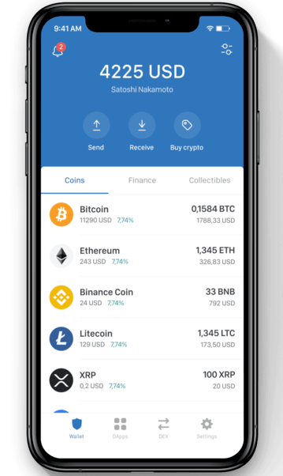

<Info>
  This tutorial uses the **[alchemy\_getTokenBalances](/reference/alchemy-gettokenbalances)** endpoint.
</Info>

The token balances for a user address is a critical data point for almost any web3 use case - be it DeFi platforms, wallets, analytics, exchanges, and many others. A common use case would be displaying the balances as below in your wallet app.



Sample wallet screen displaying coin balances

To fetch this data you have 2 options:

1. Fetch the Transaction History for the token’s contract, for example take USDT, which is [millions of records](https://etherscan.io/token/0xdac17f958d2ee523a2206206994597c13d831ec7). Then search through for your user’s address among those records (will take hours) and then show that to your user. Not to forget, do this indexing process every second forever to keep it updated for every user.
2. OR just use Alchemy’s [`getTokenBalances`](/reference/alchemy-gettokenbalances) endpoint.

If you’re like most web3 developers, you probably want to go for the second option!

### About this Tutorial

***

We will write a simple script in Node to gets us the balance of USDT for a particular wallet address. We will get the latest balance, the balance at a a particular block (in our case, 1000000), and at a particular human-readable time using Alchemy's [Token API Quickstart](/reference/token-api-quickstart).

## Creating the Token Balances Script

***

### Step 1: Install Node and npm

In case you haven't already, [install node and npm](https://nodejs.org/en/download/) on your local machine.

Make sure that node is at least **v14 or higher** by typing the following in your terminal:

<CodeGroup>
  ```shell shell
  node -v
  ```
</CodeGroup>

### Step 2: Create an Alchemy app

***

In case you haven't already, [sign up for a free Alchemy account](https://alchemy.com/?a=99a4749c0c).


Alchemy's account dashboard where developers can create a new app on the Ethereum blockchain.

Next, navigate to the [Alchemy Dashboard](https://dashboard.alchemy.com/signup/?a=99a4749c0c) and create a new app.

Make sure you set the chain to Ethereum and the network to Mainnet.

Once the app is created, click on your app's *View Key* button on the dashboard.

Take note of the **HTTP URL**.

The URL will be in this form: `https://eth-mainnet.g.alchemy.com/v2/xxxxxxxxx`

You will need this later.

***

### Step 3: Create a node project

Let's now create an empty repository and install all node dependencies.

To make requests to the Token API, use the [Alchemy SDK](/reference/alchemy-sdk-quickstart).

You can also use `axios` or `fetch` alternatively.

<CodeGroup>
  ```shell Alchemy SDK
  mkdir token-balances && cd token-balances
  npm init -y
  npm install --save alchemy-sdk
  touch main.js
  ```

  ```shell Axios
  mkdir token-balances && cd token-balances
  npm init -y
  npm install --save axios
  touch main.js
  ```

  ```shell Fetch
  mkdir token-balances && cd token-balances
  npm init -y
  touch main.js
  ```
</CodeGroup>

This will create a repository named `token-balances` that holds all your files and dependencies.

Next, open this repo in your favorite code editor.

We will be writing all our code in the `main.js` file.

### Step 4: Get the latest USDT balance

To get the USDT balance of a particular wallet, we will use the [getTokenBalances](/reference/sdk-gettokenbalances) method.

This method takes in two arguments:

1. `DATA`: The wallet address whose USDT balance we want to check
2. `Array`: An array containing the list of token contract addresses we are interested in. In our case, it's just one address (i.e of USDT).

Add the following code to the `main.js` file.

<CodeGroup>
  ```javascript Alchemy SDK
  const { Alchemy, Network, Utils } = require("alchemy-sdk");

  const config = {
      apiKey: "<-- ALCHEMY API KEY -->",
      network: Network.ETH_MAINNET,
  };
  const alchemy = new Alchemy(config);

  const main = async () => {

      // Wallet address
      const walletAddress = "0xef0dcc839c1490cebc7209baa11f46cfe83805ab";

      // USDT contract address
      const contractAddress = "0xdAC17F958D2ee523a2206206994597C13D831ec7";
      const numDecimals = 6;

      // Get latest USDT balance
      let balance = await alchemy.core.getTokenBalances(walletAddress, [contractAddress])
      balance = balance['tokenBalances'][0]['tokenBalance'];
      balance = (parseInt(balance) / 10 ** numDecimals).toFixed(2);
      console.log("Balance:", balance, "USDT");
  };

  const runMain = async () => {
      try {
          await main();
          process.exit(0);
      } catch (error) {
          console.log(error);
          process.exit(1);
      }
  };

  runMain();
  ```

  ```javascript Axios
  const axios = require('axios');

  // Wallet address
  const walletAddress = "0xef0dcc839c1490cebc7209baa11f46cfe83805ab";

  // USDT contract address
  const contractAddress = "0xdAC17F958D2ee523a2206206994597C13D831ec7";
  const numDecimals = 6;

  // Alchemy API key
  const apiKey = "<-- ALCHEMY API KEY -->";
  const baseURL = `https://eth-mainnet.g.alchemy.com/v2/${apiKey}`;

  let data = JSON.stringify({
      "jsonrpc": "2.0",
      "method": "alchemy_getTokenBalances",
      "params": [
          `${walletAddress}`,
          [
              `${contractAddress}`
          ]
      ],
      "id": 42
  });

  var config = {
      method: 'post',
      url: baseURL,
      headers: {
          'Content-Type': 'application/json'
      },
      data: data
  };

  axios(config)
      .then(function (response) {
          balance = response['result']['tokenBalances'][0]['tokenBalance'];
          balance = (parseInt(balance) / 10 ** numDecimals).toFixed(2);
          console.log("Balance:", balance, "USDT");
      })
      .catch(function (error) {
          console.log(error);
      });
  ```

  ```javascript Fetch
  import fetch from 'node-fetch';

  // Replace with your Alchemy API key:
  const apiKey = "<-- ALCHEMY API KEY -->";

  const fetchURL = `https://eth-mainnet.g.alchemy.com/v2/${apiKey}`;

  // Wallet Address
  const walletAddress = "00xef0dcc839c1490cebc7209baa11f46cfe83805ab";

  // USDT Contract Address
  const contractAddress = "0xdAC17F958D2ee523a2206206994597C13D831ec7";
  const numDecimals = 6;

  var raw = JSON.stringify({
      "jsonrpc": "2.0",
      "method": "alchemy_getTokenBalances",
      "headers": {
          "Content-Type": "application/json"
      },
      "params": [
          `${walletAddress}`,
          [
              `${contractAddress}`,
          ]
      ],
      "id": 42
  });

  var requestOptions = {
      method: 'POST',
      body: raw,
      redirect: 'follow'
  };

  // Make the request and print the formatted response:
  fetch(fetchURL, requestOptions)
      .then(response => response.json())
      .then(response => {
          let balance = response['data']['result']['tokenBalances'][0]['tokenBalance'];
    			balance = (parseInt(balance) / 10 ** numDecimals).toFixed(2);
          console.log("Balance:", balance, "ETH");
      })
      .catch(error => console.log('error', error));
  ```
</CodeGroup>

You can find the contract address of any token by searching its ticker or name on [Etherscan](https://etherscan.io/).

In order to format a token into its human-readable format, you simply convert the hexadecimal result received from the API response into a decimal, and then divide by the number of decimal places that that particular token has. USDT, for instance, has 6. You can find out how many decimal places any currency has by reading the `decimals` value from the contract's page on Etherscan.

Solidity does not support decimal point numbers. So, If you want an ERC20 token to have the ability to be subdivided with a precision of 2 decimal places, you need to represent 1 token as 100 (set its decimal places to 2). Similarly if I you want an ERC20 token to have the ability to subdivided with a precision of 18 decimal places, you need to represent 1 token as 1000000000000000000 (set its decimal places to 18).

So, the formula for number of tokens becomes:

`tokenSupplyWithDecimalZeros = actualTokenSupply * (10 ** decimals)`

That is why we need to divide the decimal value by the number of decimal places, to get the actual token value.

Run the script using the following command:

<CodeGroup>
  ```javascript javascript
  node main.js
  ```
</CodeGroup>

If all goes well, you should see output that looks something like this:

```
Balance: 61900000.01 USDT
```

### Step 5: Get USDT balance at a particular block

In order to get the balance of a token at a particular block, we need to leverage the [eth\_call](/reference/eth-call) method. This will allow us to query USDT contract's `balanceOf` method at a particular block number.

Create a new file called `historical_balance.js` and add the following code:

<CodeGroup>
  ```javascript Alchemy SDK
  const { Alchemy, Network, Utils } = require("alchemy-sdk");
  const ethers = require('ethers');

  const config = {
      apiKey: "<-- ALCHEMY API KEY -->",
      network: Network.ETH_MAINNET,
  };
  const alchemy = new Alchemy(config);

  const main = async () => {

      // Wallet address
      const walletAddress = "0xef0dcc839c1490cebc7209baa11f46cfe83805ab";

      // USDT contract address
      const contractAddress = "0xdAC17F958D2ee523a2206206994597C13D831ec7";
      const numDecimals = 6;

      // Block number
      const blockNum = 12026456;

      // ABI
      let abi = [
          'function balanceOf(address account)'
      ];

      // Create function call data -- eth_call
      let iface = new ethers.utils.Interface(abi)
      let data = iface.encodeFunctionData("balanceOf", [walletAddress]);

      // Get balance at a particular block -- usage of eth_call
      let balance = await alchemy.core.call({
          to: contractAddress,
          data: data,
      }, blockNum);

      balance = (parseInt(balance) / 10 ** numDecimals).toFixed(2);
      console.log("Balance:", balance, "USDT");
  };

  const runMain = async () => {
      try {
          await main();
          process.exit(0);
      } catch (error) {
          console.log(error);
          process.exit(1);
      }
  };

  runMain();
  ```

  ```javascript Axios
  const axios = require('axios');
  const ethers = require('ethers');

  // Wallet address
  const walletAddress = "0xef0dcc839c1490cebc7209baa11f46cfe83805ab";

  // USDT contract address
  const contractAddress = "0xdAC17F958D2ee523a2206206994597C13D831ec7";
  const numDecimals = 6;

  // Block number
  const blockNum = 12026456;

  // Alchemy API key
  const apiKey = "<-- ALCHEMY API KEY -->";
  const baseURL = `https://eth-mainnet.g.alchemy.com/v2/${apiKey}`;

  // ABI
  let abi = [
      'function balanceOf(address account)'
  ];

  // Create function call data
  let iface = new ethers.utils.Interface(abi)
  let edata = iface.encodeFunctionData("balanceOf", [walletAddress]);

  let data = JSON.stringify({
      "jsonrpc": "2.0",
      "method": "eth_call", // usage of eth_call
      "params": [
          {
              to: contractAddress,
              data: edata,
          },
          ethers.utils.hexlify(blockNum).toString(),
      ],
      "id": 1
  });

  var config = {
      method: 'post',
      url: baseURL,
      headers: {
          'Content-Type': 'application/json'
      },
      data: data
  };

  axios(config)
      .then(function (response) {
          balance = response['data']['result']
          balance = (parseInt(balance) / 10 ** numDecimals).toFixed(2);
          console.log("Balance:", balance, "USDT");
      })
      .catch(function (error) {
          console.log(error);
      });
  ```

  ```javascript Fetch
  import fetch from 'node-fetch';
  import ethers from 'ethers';

  // Replace with your Alchemy API key:
  const apiKey = "<-- ALCHEMY API KEY -->";

  const fetchURL = `https://eth-mainnet.g.alchemy.com/v2/${apiKey}`;

  // Wallet Address
  const walletAddress = "0xef0dcc839c1490cebc7209baa11f46cfe83805ab";

  // USDT Contract Address
  const contractAddress = "0xdAC17F958D2ee523a2206206994597C13D831ec7";

  // Block number
  const blockNum = 12026456;

  // ABI
  let abi = [
      'function balanceOf(address account)'
  ];

  // Create function call data
  let iface = new ethers.utils.Interface(abi)
  let edata = iface.encodeFunctionData("balanceOf", [walletAddress]);

  var raw = JSON.stringify({
      "jsonrpc": "2.0",
      "method": "eth_call", // usage of eth_call
      "headers": {
          "Content-Type": "application/json"
      },
      "params": [
          {
              to: contractAddress,
              data: edata,
          },
          ethers.utils.hexlify(blockNum).toString(),
      ],
      "id": 1
  });

  var requestOptions = {
      method: 'POST',
      body: raw,
      redirect: 'follow'
  };

  // Make the request and print the formatted response:
  fetch(fetchURL, requestOptions)
      .then(response => response.json())
      .then(response => {
          let balance = response['data']['result'];
          balance = (parseInt(balance) / 10 ** numDecimals).toFixed(2);
          console.log("Balance:", balance, "USDT");
      })
      .catch(error => console.log('error', error));
  ```
</CodeGroup>

Run this script using:

<CodeGroup>
  ```shell shell
  node historical_balance.js
  ```
</CodeGroup>

If all goes well, you should see output that looks something like this:

```
Balance: 61933384.84 USDT
```

### Step 6: Get USDT balance at a particular timestamp

The process to get the USDT balance at a particular timestamp is identical to the previous, except that we need to figure out a way to convert a timestamp into a block number.

In order to do this, we will use a library called `ethereum-block-by-date`.

Install this package by running the following command in your terminal:

<CodeGroup>
  ```shell shell
  npm install ethereum-block-by-date
  ```
</CodeGroup>

Replace the contents of `historical_balance.js` with the following:

<CodeGroup>
  ```javascript Alchemy SDK
  const { Alchemy, Network, Utils } = require("alchemy-sdk");
  const ethers = require('ethers');
  const EthDater = require('ethereum-block-by-date');

  const config = {
      apiKey: "<-- ALCHEMY API KEY -->",
      network: Network.ETH_MAINNET,
  };
  const alchemy = new Alchemy(config);

  const dater = new EthDater(
      alchemy.core // Ethers provider, required.
  );

  const main = async () => {

      // Wallet address
      const walletAddress = "0xef0dcc839c1490cebc7209baa11f46cfe83805ab";

      // USDT contract address
      const contractAddress = "0xdAC17F958D2ee523a2206206994597C13D831ec7";
      const numDecimals = 6;

      // Set timestamp
      const timestamp = '2021-02-20T13:20:40Z';

      // Get blocknumber 
      let block = await dater.getDate(timestamp);
      let blockNum = block['block']

      // ABI
      let abi = [
          'function balanceOf(address account)'
      ];

      // Create function call data
      let iface = new ethers.utils.Interface(abi)
      let data = iface.encodeFunctionData("balanceOf", [walletAddress]);

      // Get balance at a particular block -- usage of eth_call
      let balance = await alchemy.core.call({
          to: contractAddress,
          data: data,
      }, blockNum);

      balance = (parseInt(balance) / 10 ** numDecimals).toFixed(2);
      console.log("Balance:", balance, "USDT");
  };

  const runMain = async () => {
      try {
          await main();
          process.exit(0);
      } catch (error) {
          console.log(error);
          process.exit(1);
      }
  };

  runMain();
  ```

  ```javascript Axios
  const axios = require('axios');
  const ethers = require('ethers');
  const EthDater = require('ethereum-block-by-date');

  // Wallet address
  const walletAddress = "0xef0dcc839c1490cebc7209baa11f46cfe83805ab";

  // USDT contract address
  const contractAddress = "0xdAC17F958D2ee523a2206206994597C13D831ec7";
  const numDecimals = 6;

  // Set timestamp
  const timestamp = '2021-02-20T13:20:40Z';

  // Alchemy API key
  const apiKey = 'NQSuAhlOs706-XBHAkbF6rbLJ50InHTj';

  const provider = new ethers.providers.AlchemyProvider(null, apiKey);
  const dater = new EthDater(provider);

  const main = async () => {

      let block = await dater.getDate(timestamp);
      let blockNum = ethers.utils.hexlify(block['block']);

      // ABI
      let abi = [
          'function balanceOf(address account)'
      ];

      // Create function call data
      let iface = new ethers.utils.Interface(abi)
      let edata = iface.encodeFunctionData("balanceOf", [walletAddress]);

      let data = JSON.stringify({
          "jsonrpc": "2.0",
          "id": 1,
          "method": "eth_call", // usage of eth_call
          "params": [
              {
                  to: contractAddress,
                  data: edata,
              },
              ethers.utils.hexlify(blockNum).toString(),
          ]
      });

      let config = {
          method: 'post',
          url: `https://eth-mainnet.alchemyapi.io/v2/${apiKey}`,
          headers: {
              'Content-Type': 'application/json',
              'Accept': 'application/json',
          },
          data: data
      };

      const response = await axios(config);

      let balance = response['data']['result']
      balance = (parseInt(balance) / 10 ** numDecimals).toFixed(2);
      console.log("Balance:", balance, "USDT");

  }

  const runMain = async () => {
      try {
          await main();
          process.exit(0);
      }
      catch (error) {
          console.log(error);
          process.exit(1);
      }
  };

  runMain();
  ```

  ```javascript Fetch
  import fetch from 'node-fetch';
  import ethers from 'ethers';

  // Wallet address
  const walletAddress = "0xef0dcc839c1490cebc7209baa11f46cfe83805ab";

  // USDT contract address
  const contractAddress = "0xdAC17F958D2ee523a2206206994597C13D831ec7";
  const numDecimals = 6;

  // Set timestamp
  const timestamp = '2021-02-20T13:20:40Z';

  // Alchemy API key
  const apiKey = '<-- ALCHEMY APP API KEY -->';

  const provider = new ethers.providers.AlchemyProvider(null, apiKey);
  const dater = new EthDater(provider);

  var myHeaders = new Headers();
  myHeaders.append("Content-Type", "application/json");

  const main = async () => {

      let block = await dater.getDate(timestamp);
      let blockNum = ethers.utils.hexlify(block['block']);

      // ABI
      let abi = [
          'function balanceOf(address account)'
      ];

      // Create function call data
      let iface = new ethers.utils.Interface(abi)
      let edata = iface.encodeFunctionData("balanceOf", [walletAddress]);

      let raw = JSON.stringify({
          "jsonrpc": "2.0",
          "id": 1,
          "method": "eth_call", // usage of eth_call
          "params": [
              {
                  to: contractAddress,
                  data: edata,
              },
              ethers.utils.hexlify(blockNum).toString(),
          ]
      });

      let requestOptions = {
          method: 'POST',
          headers: myHeaders,
          body: raw,
          redirect: 'follow'
      };

      const response = fetch(`https://eth-mainnet.g.alchemy.com/v2/${apiKey}`, requestOptions);
      let balance = response['data']['result'];
      balance = (parseInt(balance) / 10 ** numDecimals).toFixed(2);
      console.log("Balance:", balance, "USDT");

  }

  const runMain = async () => {
      try {
          await main();
          process.exit(0);
      }
      catch (error) {
          console.log(error);
          process.exit(1);
      }
  };

  runMain();
  ```
</CodeGroup>

Running the same command as in step 5 should produce the same output.

```
Balance: 61933384.84 USDT
```

## Conclusion

***

Congratulations! You now know how to use the [Alchemy Ethereum API](/reference/ethereum-api) and [Token API](/reference/token-api-quickstart) to get the token balance of a wallet at present, a particular block height or timestamp.

If you enjoyed this tutorial on how to get ETH balance at a point in time, give us a tweet [@AlchemyPlatform](https://twitter.com/AlchemyPlatform).

Don't forget to join our [Discord server](https://www.alchemy.com/discord) to meet other blockchain devs, builders, and entrepreneurs.

Ready to start using the Alchemy Token API?

[Create a free Alchemy account ](https://alchemy.com/?a=cac34e777f)and share your project with us!
