In this guide, you will learn how to build a TipJar app that creators can use to receive tips from their supporters**.**

The TipJar app will have the following functionality:

* Users can deposit ETH to tip the creator who owns the app.
* Users can see how much ETH is in their wallet.
* Users can see how much ETH is in the TipJar.

Here is what the app will look like when you're finished.

The app will be built using Next.js, [ConnectKit](https://docs.family.co/connectkit), [Wagmi](https://wagmi.sh/) and [Viem](https://viem.sh/).

This guide is divided into the following sections:

* **Prework:** Gather the tools you’ll need to build the app
* **Step 1:** Set up the starter template
* **Step 2:** Build a static version of the app
* **Step 3:** Add interactivity
* **Step 4:** Add on-chain transaction functionality
* **Wrapping Up**

# Prework

In this guide, you will use:

* **CodeSandbox:** CodeSandbox makes it easy to develop and deploy applications in your browser without installing anything locally.
* **Alchemy:** Alchemy APIs allow you to fetch blockchain data and execute transactions.
* **WalletConnect:** WalletConnect allows your application to connect to hundreds of wallet apps.
* **TipJar Contract:** This contract will accept tips from supporters and allow its owner to withdraw those tips.

In this section, you will set up these tools.

### **Alchemy Setup**

1. Create an Alchemy account: [Sign up here](https://alchemy.com/?a=KofiNFT)

2. Log in to your Alchemy Dashboard.

3. Navigate to the **Apps** page and click **Create App**. When prompted, pick Ethereum as the Chain and Sepolia as the Network.

   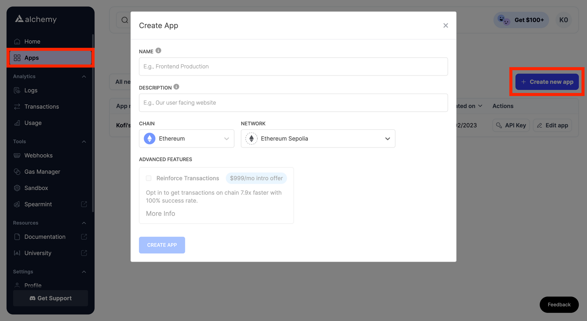

4. Once the app is created, click into it and note down the API key. You’ll need this for the next steps in this guide.

   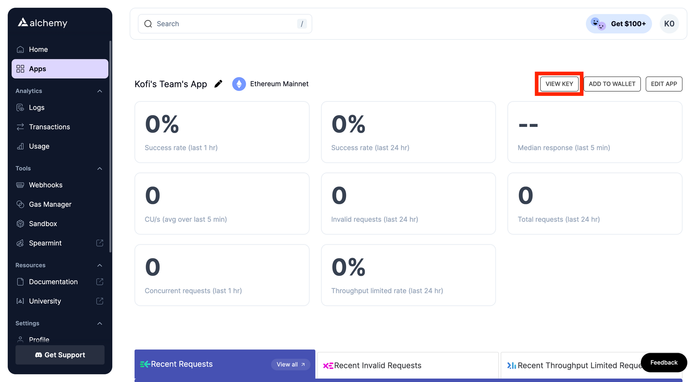

### **WalletConnect Cloud Setup**

1. Create a WalletConnect account: [Sign up here](https://cloud.walletconnect.com/sign-up)

2. In your WalletConnect dashboard, select **New Project** and give the project a name.

   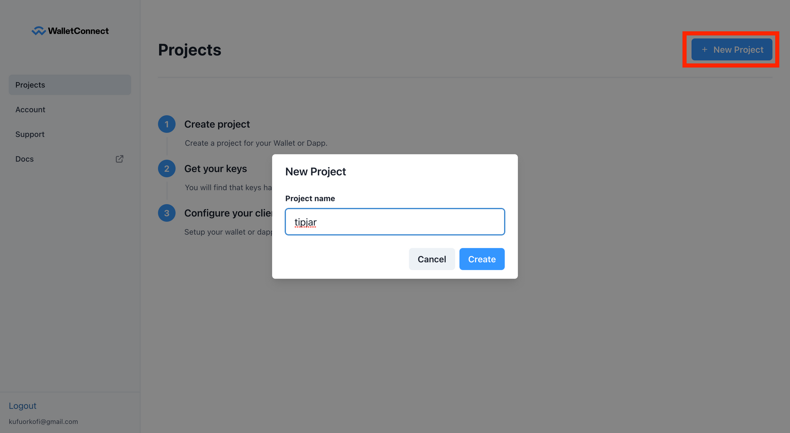

3. Once the project is created, note down the **Project ID**. You will need this for the next steps in the guide.

   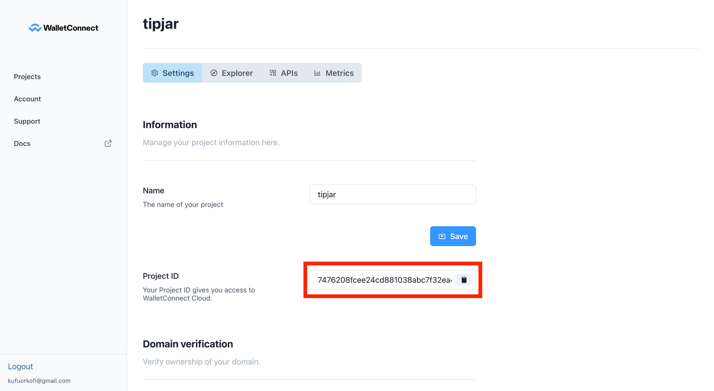

### CodeSandbox **Setup**

Create a CodeSandbox Account: [Sign up here](https://codesandbox.com/)

You will see a prompt to create a team. For this tutorial, it doesn't matter whether you make a team or use a personal account.

### **TipJar Contract**

The TipJar contract has two key functions:

* A `deposit` function that allows users to deposit a tip into the contract.
* A `withdraw` function that only the creator, who owns the contract, can call to withdraw all of the tips.

To call these functions, users have to make on-chain transactions.

The app you build in this guide will use the Sepolia testnet, so you will need Sepolia ETH to fund transactions. To get Sepolia ETH:

1. Sign in to your Alchemy account.
2. Open the Sepolia ETH faucet at [sepoliafaucet.com](https://sepoliafaucet.com/).
3. Enter the address of the wallet you want to use for development (use a different wallet from your personal one) and click "Send me ETH".
4. Congratulations, you now have 0.5 Sepolia ETH to use for development!

You can build the app using a TipJar contract that has already been deployed on Sepolia testnet: [Check it out here](https://sepolia.etherscan.io/address/0x728DDDe0aB16B59df95a4D43d9692a44b7AEe944#code) and note down the address.

You will need that address later in this tutorial.

Alternatively, you can deploy a new Tipjar contract using the instructions below and then note the address of that contract.

Remix IDE - [Link](https://remix.ethereum.org/) Contract Github Gist - [Link](https://gist.github.com/Jam516/b999f1712c97c34303ec237eefd0673f)

# **Step 1:** Set up the starter template

In this tutorial, you will be given a [Next.js](https://nextjs.org/) template to use as a starting point when building your app. Next.js is a [React](https://react.dev/) framework for building web applications.

In this section, we will explore how the starter code works. Then you will fork the template on CodeSandbox and run it.

There are two critical packages used in the starter template:

* **[Wagmi](https://wagmi.sh/react/getting-started)** is a collection of React Hooks that make it easy to fetch on-chain data, sign messages and interact with contracts.
* **[ConnectKit](https://docs.family.co/connectkit)** is a React component library for adding **Connect Wallet** functionality to your app.

The starter template has four key files in it. Here is an explanation of how they work:

### `_app.tsx`

This is a special file you can use to inject additional data into your website's pages or create a shared layout.

In this template’s `_app.tsx` file, all rendered pages are wrapped with `WagmiConfig` and `ConnectKitProvider` to enable the use of Wagmi and ConnectKit. Also, Wagmi is configured for the Sepolia testnet.

`_app.tsx` can be found in the `pages` folder of the template. In Next.js, each file in the `pages` folder represents a different page or route on your website, except for `_app.tsx`. For example, a file named `about.tsx` would correspond to your `/about` page.

Read the code to gain a deeper understanding of how `_app.tsx` works.

<CodeGroup>
  ```typescript typescript
  import '../styles/globals.css'
  import type { AppProps } from 'next/app'
  import { sepolia } from "wagmi/chains";
  import { WagmiConfig, createConfig } from "wagmi";
  import { ConnectKitProvider, ConnectKitButton, getDefaultConfig } from "connectkit";

  const alchemyId = process.env.ALCHEMY_API_KEY;
  const walletConnectProjectId = process.env.WALLETCONNECT_PROJECT_ID;

  const chains = [sepolia];

  const config = createConfig(
    getDefaultConfig({
      alchemyId,
      walletConnectProjectId: walletConnectProjectId || "default",
      chains,
      appName: "TipJar",
    }),
  );

  function MyApp({ Component, pageProps }: AppProps) {
    return (
      <WagmiConfig config={config}>
        <ConnectKitProvider>
          <Component {...pageProps} />
        </ConnectKitProvider>
      </WagmiConfig>
    )
  }

  export default MyApp
  ```
</CodeGroup>

### `index.tsx`

This file contains the main logic of your app. There are three main React components in the `index.tsx` starter file:

* `ConnectBlock`: This contains the `ConnectKitButton` imported from the ConnectKit library. Users connect their wallets to the app using this button.
* `TitleBlock`: A component that returns a title and subtitle.
* `MainBlock`: Wraps all the other components.

In React, a component is a reusable piece of code that represents a part of a user interface.

`index.tsx` is located in the template’s `pages` folder. It is the root of your directory and will be the first page to load when the site loads.

Read the code to gain a deeper understanding of how `index.tsx` works.

<CodeGroup>
  ```typescript typescript
  import type { NextPage } from "next";
  import Head from "next/head";
  import styles from "../styles/Home.module.css";
  import { ConnectKitButton } from "connectkit";

  function MainBlock() {
    return (
      <main className={styles.main}>
        <ConnectBlock />
        <TitleBlock />
      </main>
    );
  }

  function ConnectBlock() {
    return (
      <div className={styles.connectDiv}>
        <ConnectKitButton />
      </div>
    );
  }

  function TitleBlock() {
    return (
      <div className={styles.titleDiv}>
        <h1 className={styles.title}>TipJar</h1>
        <p className={styles.description}>Toss a coin to the witcher ✨</p>
      </div>
    );
  }

  const Home: NextPage = () => {
    return (
      <div className={styles.container}>
        <Head>
          <title>TipJar</title>
          <meta name="description" content="Tipping app" />
          <link rel="icon" href="/favicon.ico" />
        </Head>

        <MainBlock />
      </div>
    );
  };

  export default Home;
  ```
</CodeGroup>

### `Home.module.css`

This file provides all the styling for `index.jsx`. Feel free to modify the CSS in `Home.module.css` to match your style preferences.

### `next.config.js`

This is a special file used to configure NextJS settings. This fallback statement instructs Next to ignore certain modules when building your app. This is necessary to prevent a [common bug](https://github.com/wagmi-dev/wagmi/issues/2300#issuecomment-1541425648) that pops up when using ConnectKit or RainbowKit with Wagmi.

<CodeGroup>
  ```typescript typescript
  module.exports = {
    webpack: (config) => {
      config.resolve.fallback = { fs: false, net: false, tls: false }
      return config
    },
  }
  ```
</CodeGroup>

### **Action: Fork the starter template on CodeSandbox and run it ⚡**

(1) Open the starter template on CodeSandbox: [Use this link](https://codesandbox.io/p/sandbox/starter-template-wndgqs)

(2) Click the **Fork** button located in the upper right corner to create a copy of the starter template that you own.

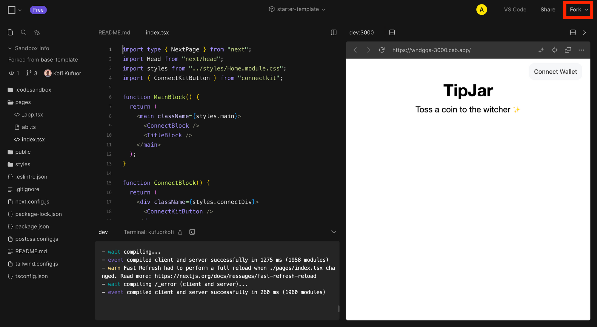

In your CodeSandbox project you will see 3 main sections:

* The **Files** section in the left-hand panel with a list of folders and files you can open.
* The **Code Editor** where you’ll see the source code of your selected file in the middle-panel.
* The **Browser** section in the right-hand panel where you’ll see how the code you’ve written will be displayed.

(3) After your fork is made, open the **Menu** using the square button in the top left corner of the page and open **Project Settings**.

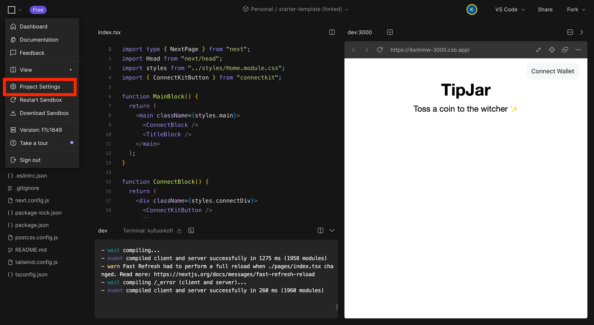

(4) Create environment variables called `ALCHEMY_API_KEY` and `WALLETCONNECT_PROJECT_ID` that contain the Alchemy key and WalletConnect ID you noted down earlier. Then **restart** the project to implement those changes.

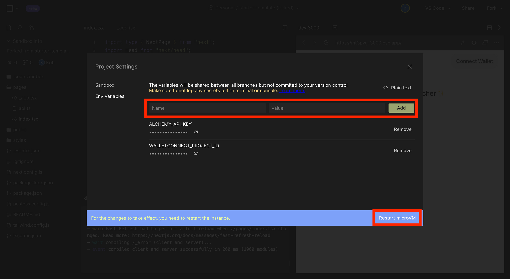

(5) Test the template app by connecting your wallet.

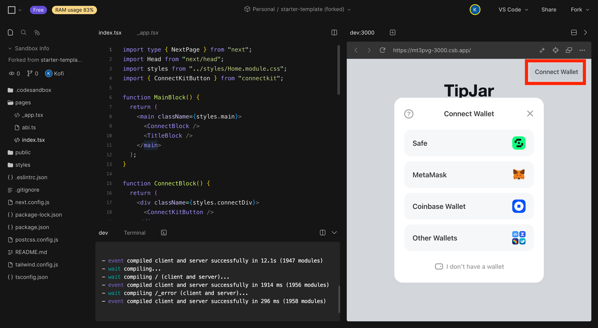

# **Step 2:** Design a static version of the app

Here is a basic sketch of what your final product should look like. Imagine that you got it from a designer on your team.

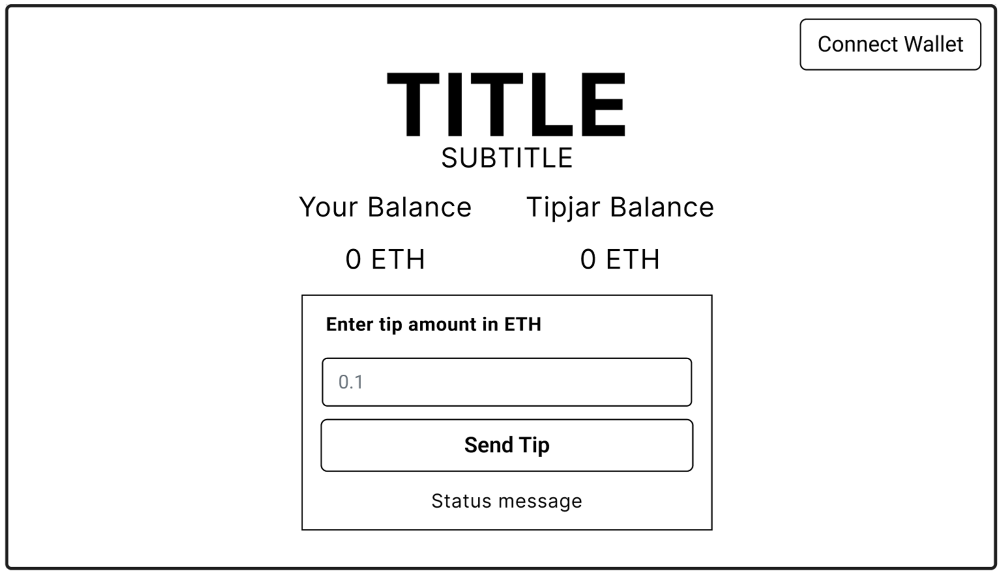

You should break down this UI into its components. You can start by making a component for each task the UI has to perform, for example, a component to display wallet balances. Then you can organize the app’s design into layers by wrapping groups of components in parent components.

This is just one way to do it; you could split up the components using any preferred method.

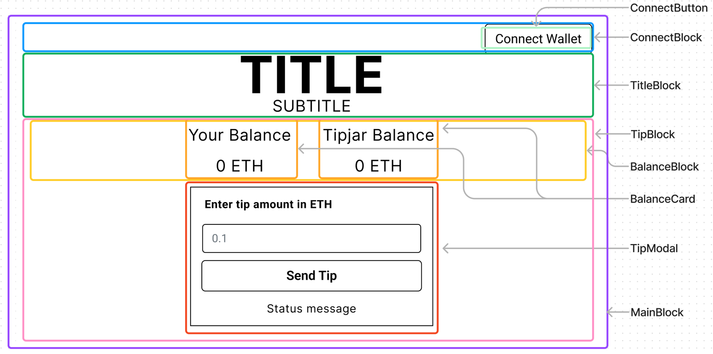

This example is composed of 8 components:

* `MainBlock`: contains and sets the layout style for the entire app
* `ConnectBlock`: contains and styles the `ConnectButton`
* `TitleBlock`: contains and styles the title and subtitle
* `TipBlock`: contains `BalanceBlock` and `TipModal`
* `BalanceBlock`: contains the `BalanceCard` components that display the user's and contract's ETH balance
* `TipModal`: executes the tip transaction

Once the components have been identified, arrange them hierarchically. Components that appear within another component should be listed as children in the hierarchy.

* `MainBlock`

  * `ConnectBlock`
    * `ConnectButton`

  * `TitleBlock`

  * `TipBlock`

    * `BalanceBlock`
      * `BalanceCard`
    * `TipModal`

Some of these components are already provided in the starter template. You will have to implement the rest of them.

# **Step 3:** Build a static version of the app

Now that you have your component hierarchy, build a prototype that renders the UI with example data, but isn't interactive. It's usually easier to build a static version of your app first and add interactivity later.

### **Action: Add new components to `index.js` ⚡**

(1) Create the `TipBlock` and its subcomponents by copy-pasting these changes into `index.jsx` file:

<CodeGroup>
  ```typescript typescript
  // -- import packages same as before

  function MainBlock() {
    return (
      <main className={styles.main}>
        // -- `ConnectBlock` and `TitleBlock` same as before
        <TipBlock />
      </main>
    );
  }

  // -- `ConnectBlock` and `TitleBlock`  same as before

  function TipBlock() {
    const address = "0xd8dA6BF26964aF9D7eEd9e03E53415D37aA96045";
    const isConnected = false;
    const userBalance = "0";
  	const userIsError = false;
  	const userIsLoading = false;

    return (
      <div className={styles.tipDiv}>
  			<BalanceBlock
          userIsConnected={isConnected}
          userBalance={userBalance}
          userIsError={userIsError}
          userIsLoading={userIsLoading}
        />
        <TipModal isConnected={isConnected} userBalance={userBalance} />
      </div>
    );
  }

  interface BalanceBlockProps {
    userIsConnected: boolean;
    userBalance: string;
    userIsError: boolean;
    userIsLoading: boolean;
  }

  function BalanceBlock({
    userIsConnected,
    userBalance,
    userIsError,
    userIsLoading,
  }: BalanceBlockProps) {
    const contractBalance = "0";
    const contractIsError = false;
    const contractIsLoading = false;

    return (
      <div className={styles.balanceDiv}>
  			<BalanceCard
          title={"Your Balance"}
          balance={userBalance}
          isConnected={userIsConnected}
          isError={userIsError}
          isLoading={userIsLoading}
        />
        <BalanceCard
          title={"Tipjar Balance"}
          balance={contractBalance}
          isConnected={true}
  				isError={contractIsError}
          isLoading={contractIsLoading}
        />
      </div>
    );
  }

  interface BalanceCardProps {
    title: string;
    balance: string;
    isConnected: boolean;
    isError: boolean;
    isLoading: boolean;
  }

  function BalanceCard({
    title,
    balance,
    isConnected,
    isError,
    isLoading,
  }: BalanceCardProps) {
    return (
      <div className={styles.balanceCard}>
        <h2 className={styles.balanceHeader}>{title}</h2>
  			<p>
          {!isConnected
            ? "0 ETH"
            : isLoading
            ? "Fetching balance…"
            : isError
            ? "Error fetching balance"
            : `${balance} ETH`}
        </p>
      </div>
    );
  }

  interface TipModalProps {
    isConnected: boolean;
    userBalance: string;
  }

  function TipModal({ isConnected, userBalance }: TipModalProps) {
    const inputValue = "";

    const isNotNumber = isNaN(Number(inputValue));

    function handleClick() {
      console.log("clicked");
    }

    return (
      <div className={styles.modal}>
        <h4 className={styles.modalHeader}> Enter tip amount in ETH </h4>
        <input type="text" value={inputValue}></input>
        <button
          onClick={handleClick}
          className={styles.buttonmodal}
          disabled={
            inputValue === "" ||
            isNotNumber ||
            !isConnected ||
            Number(inputValue) > Number(userBalance)
          }
        >
          Send Tip
        </button>
      </div>
    );
  }

  // const Home: NextPage = () => {
  // -- same as before
  ```
</CodeGroup>

(2) Save the changes you made using **CNTRL + S** (Windows) or **CMD + S** (Mac). The page should look like this now.

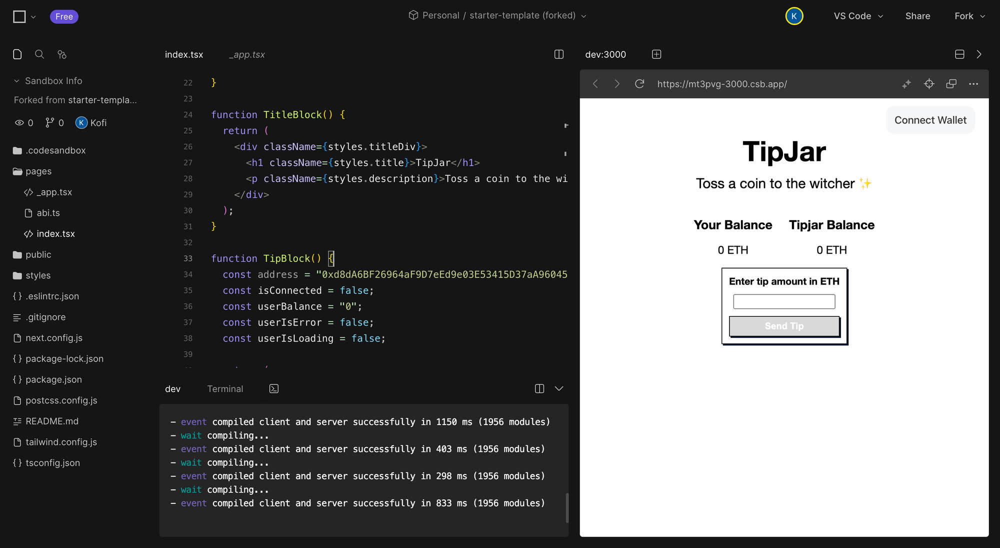

### Recommendations

Here are some tips for writing components on your own:

* You can either build "top-down" by starting with higher-level components (like `MainBlock`), or "bottom-up" by working on lower-level components first (like `BalanceCard`). It's easier to go top-down in simpler projects, but on larger projects, it's easier to go bottom-up.
* Use [props](https://react.dev/learn/passing-props-to-a-component) to pass data down the hierarchy from parent components to their children. For example, in this project `TipBlock` passes down the `userBalance` to `BalanceBlock`. Avoid repeating the same data in multiple components. If more than one component uses a data point, retrieve it once in their shared parent and pass it down using props. If there isn't a shared parent, create one. If you're unfamiliar with props, check out the React [Quick Start guide](https://react.dev/learn).

# **Step 4:** Add interactivity

To make the UI interactive, you need to allow users to modify the underlying data model. To achieve this, you will use **state**.

Think of state as the smallest set of changing data that your application needs to remember.

Your Tipjar app utilizes the following data points:

* The user's wallet connection status
* The user's wallet address
* The user's ETH balance
* The Tipjar contract's balance
* The user's input tip amount

These data points can be described as state due to the following reasons:

* They **change over time**
* When they change, your **UI components should re-render** to reflect the changes
* They **cannot be calculated** within the app using existing state or props.

you don't want to repeat the same data in multiple places. Each piece of state should be owned by one component and passed down to any child components that need it using props.

The user’s wallet address, balance and connection status are needed by

* `BalanceBlock` to display the user’s balance
* `TipModal` to enable tipping when the user is connected

You can access that data using the [useAccount](https://wagmi.sh/react/hooks/useAccount) and `[useBalance](https://wagmi.sh/react/hooks/useBalance)` Wagmi hooks. Their common parent is `TipBlock`, so that component will retrieve the state and pass it down.

### **Action: Replace the static data in `TipBlock` with state ⚡**

(1) Delete the TipBlock component and replace it by copy-pasting the new TipBlock code below. This new version of TipBlock adds state data for the user’s address, balance and connection status.

Note that the ‘watch’ parameter of `useBalance` is set to true so that the balance is automatically updated every block.

<CodeGroup>
  ```typescript typescript
  //  -- import packages 

  import { useAccount, useBalance } from "wagmi";

  // -- build components

  function TipBlock() {
    const { address, isConnected } = useAccount();

    const {
      data: userData,
      isError: userIsError,
      isLoading: userIsLoading,
    } = useBalance({
      address: address,
      watch: true,
    });

    const userBalance= parseFloat(userData?.formatted || "0")?.toFixed(4);

    return (
      <div className={styles.tipDiv}>
        <BalanceBlock
          userIsConnected={isConnected}
          userBalance={userBalance}
          userIsError={userIsError}
          userIsLoading={userIsLoading}
        />
  			<TipModal isConnected={isConnected} userBalance={userBalance} />
      </div>
    );
  }

  // -- build components
  ```
</CodeGroup>

(2) Save the changes. Now when you connect your wallet, you should be able to see your Sepolia ETH balance in the UI.

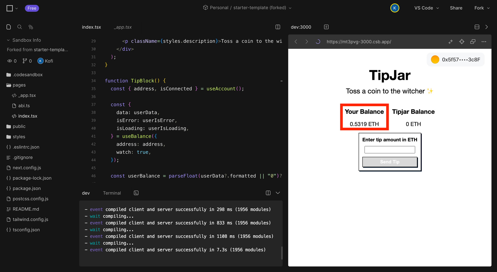

If you reload the page, you will encounter an error that looks like this. This [Hydration](https://nextjs.org/docs/messages/react-hydration-error) error is a [common problem](https://github.com/wagmi-dev/wagmi/issues/542) when using Wagmi with NextJS.

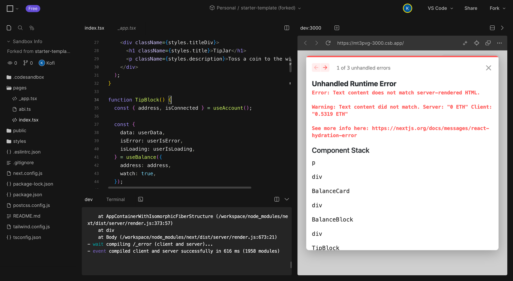

(3) To fix the Hydration error, create a `useIsMounted` hook to ensure that certain content is only rendered after hydration. Apply that new hook to `TipBlock`. Copy-paste the following code to make that change.

<CodeGroup>
  ```typescript typescript
  // -- import packages

  import { useState, useEffect } from 'react';

  export const useIsMounted = () => {
    const [mounted, setMounted] = useState(false);
    useEffect(() => setMounted(true), []);
    return mounted;
  };

  // -- build components

  function TipBlock() {
    const isMounted = useIsMounted();

    // -- retrieve the balance and account information 

    if (!isMounted) return null;

    return (
      // -- return the JSX
    );
  }

  // -- build components
  ```
</CodeGroup>

(4) Save the changes. Now if you reload the page, you won't see any errors.

(5) Add the state for the Tipjar contract’s ETH balance by copy-pasting these changes to `BalanceBlock.` As before, you use the `useIsMounted` hook to prevent hydration errors.

<CodeGroup>
  ```typescript typescript
  // -- same as before

  function BalanceBlock({
    userIsConnected,
    userBalance,
    userIsError,
    userIsLoading,
  }: BalanceBlockProps) {
    const isMounted = useIsMounted();

    const {
      data: contractData,
      isError: contractIsError,
      isLoading: contractIsLoading,
    } = useBalance({
      address: "0x728DDDe0aB16B59df95a4D43d9692a44b7AEe944",
      watch: true,
    });

    const contractBalance = parseFloat(contractData?.formatted || "0")?.toFixed(4);

    if (!isMounted) return null;

    return (
      // -- same as before
    );
  }

  // -- same as before
  ```
</CodeGroup>

Now the UI should display the balance of the TipJar contract.

(6) Add state for the user-entered tip by deleting TipModal and copy-pasting the new TipModal code below. To store the current value of the tip amount in state and change it when the user types in a new amount, you will use the [useState](https://react.dev/learn/state-a-components-memory) hook.

<CodeGroup>
  ```typescript typescript
  // -- same as before

  function TipModal({ isConnected, userBalance }: TipModalProps) {
    const [inputValue, setInputValue] = useState("");

    const handleInputChange = (event) => {
      // Update the input value state when the input changes
      setInputValue(event.target.value);
    };

    const isNotNumber = isNaN(Number(inputValue));

    function handleClick() {
      console.log("clicked");
    }

    return (
      <div className={styles.modal}>
        <h4 className={styles.modalHeader}> Enter tip amount in ETH </h4>
        <input
          type="text"
          value={inputValue}
          onChange={handleInputChange}
        ></input>
        <button
          onClick={handleClick}
          className={styles.buttonmodal}
          disabled={
            inputValue === "" ||
            isNotNumber ||
            !isConnected ||
            Number(inputValue) > Number(userBalance)
          }
        >
          Send Tip
        </button>
        {Number(inputValue) > Number(userBalance) && (
          <div>You dont have enough ETH...</div>
        )}
      </div>
    );
  }

  // -- same as before
  ```
</CodeGroup>

(4) Save your work. Then try entering a tip amount into the UI. When you enter an amount the button should become clickable. If you try to enter a tip amount higher than your balance, you'll see a warning message.

💡 **If you get stuck** at this stage, compare your work to this template to see where you went wrong: [Link](https://codesandbox.io/p/sandbox/starter-template-forked-prv9jx?file=%2Fpages%2Findex.tsx%3A167%2C4)

If you fork this template, you will need to make the `ALCHEMY_API_KEY` and `WALLETCONNECT_PROJECT_ID` environment variables same as you did before.

# **Step 5:** Add transaction functionality

Your app currently displays data from the blockchain, but it needs to be able to make transactions as well. To accomplish this, you can use the [useContractWrite](https://wagmi.sh/react/hooks/useContractWrite) and [usePrepareContractWrite](https://wagmi.sh/react/hooks/useContractWrite#prepared-usage) hooks from Wagmi.

These hooks allow you to call a "write" function on a smart contract. Write functions change the state of the blockchain and require a transaction to be executed. `usePrepareContractWrite` validates whether a transaction is viable before the user interacts with the button. This saves time between the user clicking and the wallet popping up. `useContractWrite` sends the transaction.

For this project, the app needs to call the `deposit` function on the Tipjar contract so that the user can deposit their tip.

### **Action: Update `TipModal` to enable transactions ⚡**

(1) The first step is to obtain the ABI (Application Binary Interface) of the smart contract. Your app will use this information to correctly encode function calls to send to the contract and to decode the data that comes back.

To get the ABI, open the page for the contract on [Sepolia Etherscan](https://sepolia.etherscan.io/). If you're using the pre-deployed example, search for [0x728DDDe0aB16B59df95a4D43d9692a44b7AEe944](https://sepolia.etherscan.io/address/0x728DDDe0aB16B59df95a4D43d9692a44b7AEe944). If you're using a newly deployed Tipjar, search for its address. Click on the **Contract** tab, scroll down to the **Contract ABI**, and copy it.

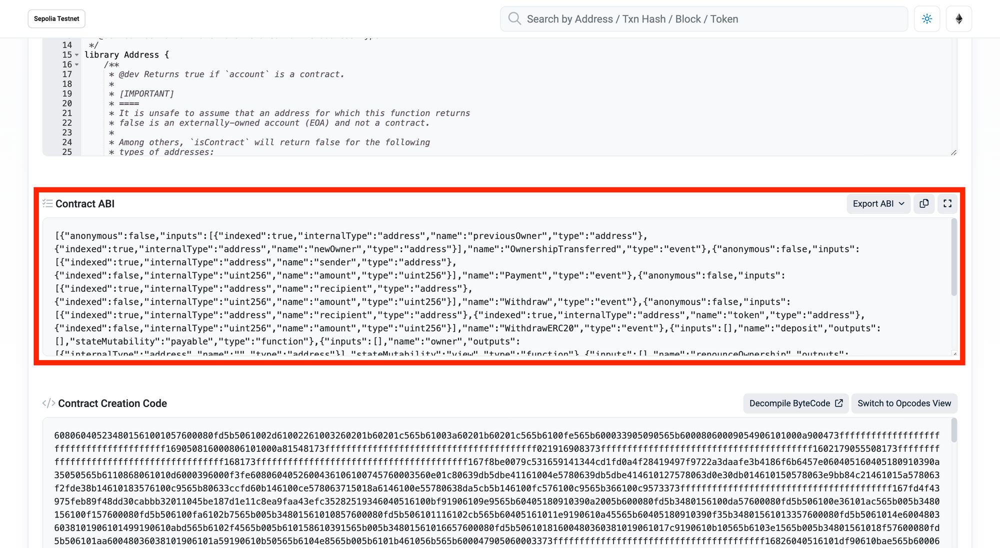

(2) Then make a new file in the `pages` folder called `abi.ts` and copy the ABI into it. To make a new file, right click on the `pages` folder in the file explorer and click the **New File** option.

<CodeGroup>
  ```typescript typescript
  export const tipjarConfig = {
  	// note: If you deployed your own tipjar contract use its address instead
    address: '0x728DDDe0aB16B59df95a4D43d9692a44b7AEe944',
    abi: -- PASTE THE ABI HERE
  } as const
  ```
</CodeGroup>

(3) Import `abi.ts` into your `index.tsx` file

<CodeGroup>
  ```typescript typescript
  // -- import packages as before

  import { tipjarConfig } from './abi'

  // -- build components as before
  ```
</CodeGroup>

(4) Import these packages

<CodeGroup>
  ```typescript typescript
  import { 
    useContractWrite, 
    usePrepareContractWrite
  } from "wagmi";
  import { parseEther } from 'viem'
  ```
</CodeGroup>

(4) Delete the TipModal component and replace it with the new TipModal code below. This update:

* Configures `usePrepareContractWrite` with the contract address and name of the contract function you want to call (the `deposit` function in this case).
* Replaces the `handleClick()` function used by the tip button with the `write` function generated by `useContractWrite` hook.
* Modifies the tip button so it is disabled when a contract call is in progress.
* Resets the input field after a successful transaction using the `useEffect` hook. This hook runs every time the **`isSuccess`** variable changes.

<CodeGroup>
  ```typescript typescript
  // -- same as before

  function TipModal({ isConnected, userBalance }: TipModalProps) {
    const [inputValue, setInputValue] = useState("");

    const handleInputChange = (event: React.ChangeEvent<HTMLInputElement>) => {
      // Update the input value state when the input changes
      setInputValue(event.target.value);
    };

    const isNotNumber = isNaN(Number(inputValue));

    // If you have deployed a contract, use your own contract address!
    const { config } = usePrepareContractWrite({
      address: "0x728DDDe0aB16B59df95a4D43d9692a44b7AEe944",
      abi: tipjarConfig.abi,
      functionName: "deposit",
      value: parseEther(inputValue),
    });
    const { data, isLoading, isSuccess, write } = useContractWrite(config);

    return (
      <div className={styles.tipmodal}>
        <div className={styles.modal}>
          <h4 className={styles.modalHeader}> Enter tip amount in ETH </h4>
          <input
            type="text"
            value={inputValue}
            onChange={handleInputChange}
          ></input>
          <button
            onClick={() => write?.()}
            className={styles.buttonmodal}
            disabled={
  						!write ||
  						isLoading ||
              inputValue === "" ||
              isNotNumber ||
              !isConnected ||
              Number(inputValue) > Number(userBalance)
            }
          >
            Send Tip
          </button>
          {Number(inputValue) > Number(userBalance) && (
            <div>You dont have enough ETH...</div>
          )}
          {isLoading && <div>Check Wallet</div>}
        </div>
        {isSuccess && <div>Transaction: {JSON.stringify(data)}</div>}
      </div>
    );
  }

  // -- same as before
  ```
</CodeGroup>

(5) Run the project and try depositing a tip to see the complete flow!

💡 **If you get stuck** at this stage, compare your work to this template to see where you went wrong: [Link](https://codesandbox.io/p/sandbox/starter-template-forked-prv9jx?file=%2Fpages%2Findex.tsx%3A167%2C4)

If you fork this template, you will need to make the `ALCHEMY_API_KEY` and `WALLETCONNECT_PROJECT_ID` environment variables same as you did before.

# Wrapping Up

Congratulations! You have successfully built a frontend for a DeFi app that:

* Allows users to connect their wallets.
* Retrieves and displays on-chain data.
* Enables users to execute transactions with a smart contract.

Great job! 🥳🥳🥳

# Bonus: Deploy your app

If you want to turn this code into a live website that anyone can visit, follow these steps:

(1) Sign up for [Github](https://github.com/).

(2) Sign up for [Vercel](https://vercel.com/).

(3) In your CodeSandbox, navigate to the Git tool in the left-hand panel. Create a Github repository from your CodeSandbox project.

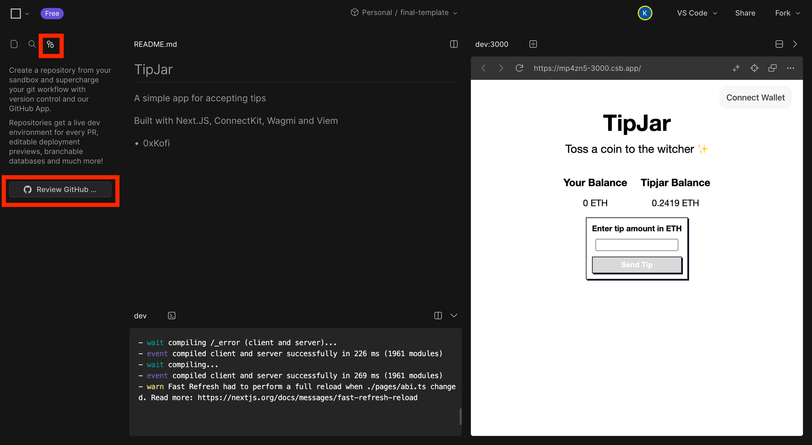

(4) In Vercel, create a new **Project** and import the GitHub repository you just made.

(5) Your site is now live on the internet 🚀
