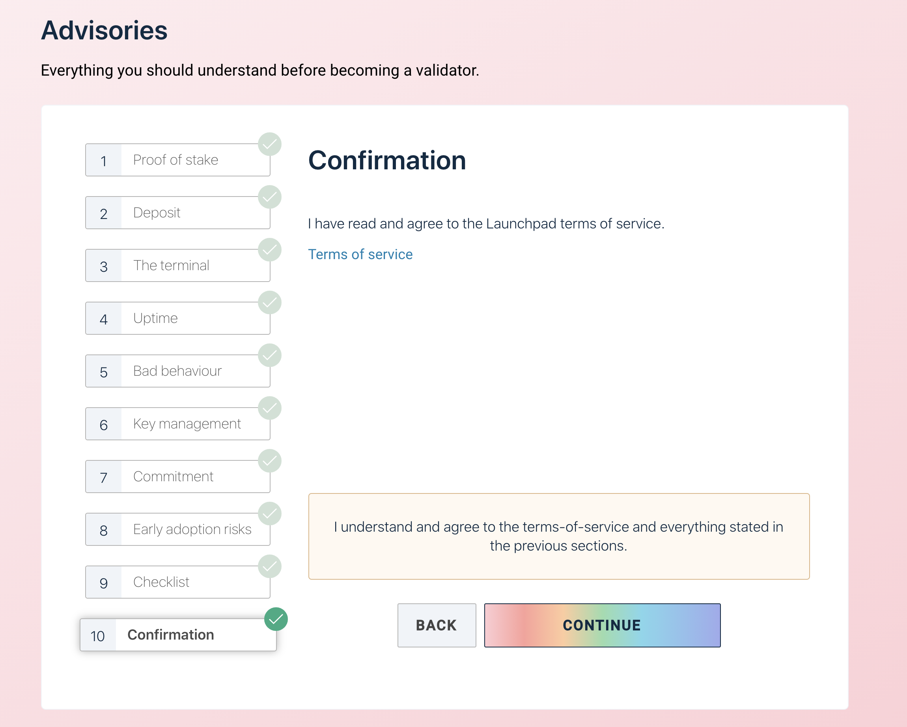
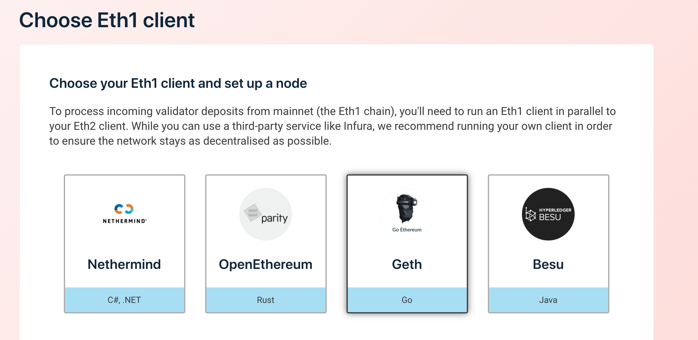
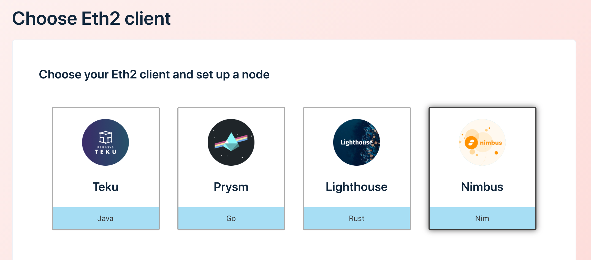
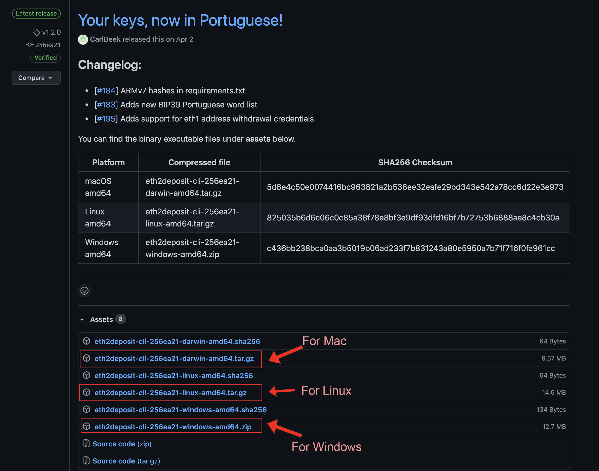
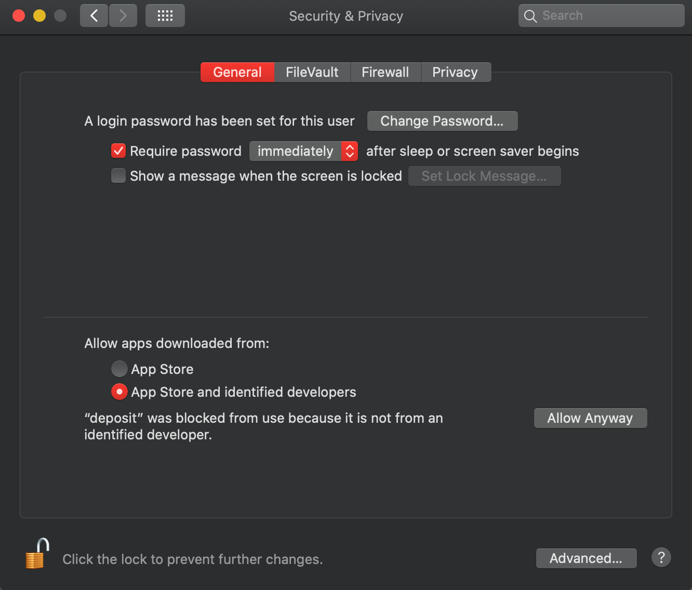
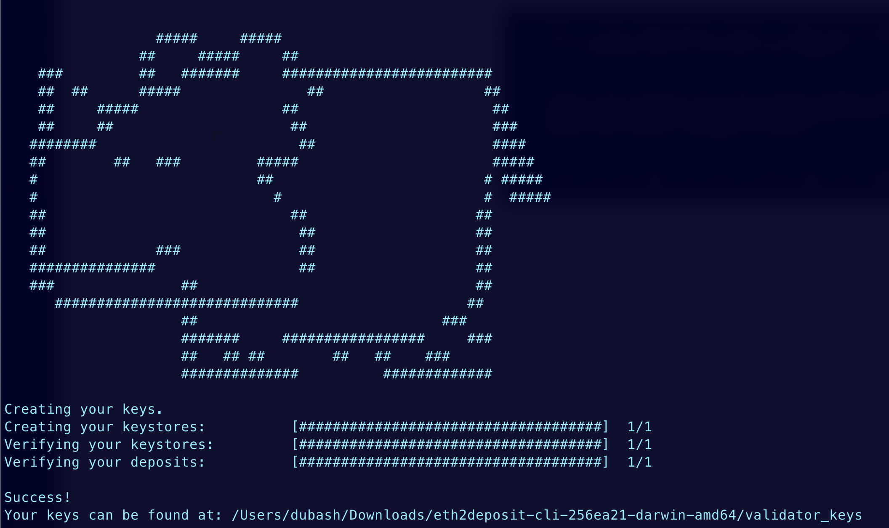
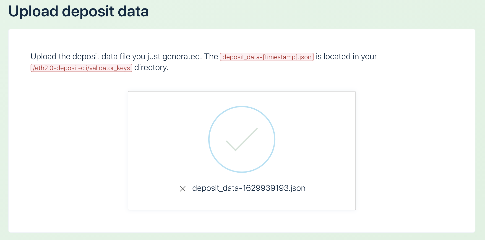
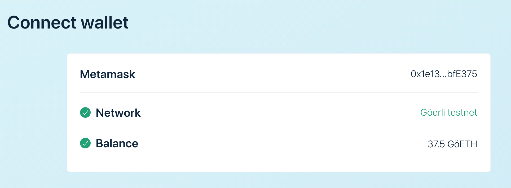
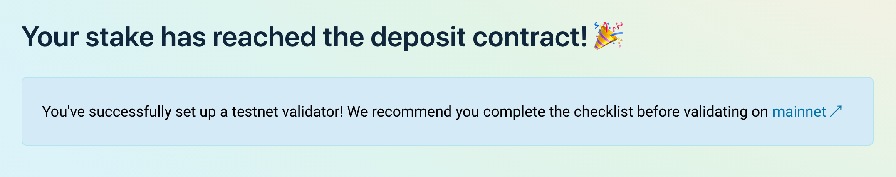

If you want general information on Ethereum 2.0, we recommend checking out [ethereum.org](https://ethereum.org/en/eth2/).

You can use Alchemy to support your Eth2 project by running a [beacon node](https://ethereum.org/en/eth2/get-involved/#clients) or running a [validator](https://ethereum.org/en/eth2/staking/#gatsby-focus-wrapper) (note if you want to run a validator you'll have to also run a node to interact with the beacon chain). A beacon node simply maintains a view of the [beacon chain](https://ethereum.org/en/eth2/beacon-chain/) and [shard chain](https://ethereum.org/en/eth2/shard-chains/), while validators actively mine and validate new blocks ([earning rewards in the process](https://ethereum.org/en/eth2/staking/)). In order to become a validator, you have to [stake 32 Eth](https://launchpad.ethereum.org/overview). You can learn more about staking on [ethereum.org](https://ethereum.org/en/eth2/staking/) and on [EthHub](https://docs.ethhub.io/ethereum-roadmap/ethereum-2.0/proof-of-stake/).

There are a handful of [beacon node clients](https://ethereum.org/en/eth2/get-involved/#clients) to choose from. This guide will show you how to set up your keys, initiate your staking transaction, and then set up your node/validator for either a [Prysm node](https://docs.alchemy.com/alchemy/guides/running-an-eth2-node-with-alchemy/setting-up-an-eth-2.0-node-or-validator-with-prysm) or a [Teku node.](https://docs.alchemy.com/alchemy/guides/running-an-eth2-node-with-alchemy/eth2-staking-teku) The setup process should is necessary for other node clients!

<Info>
  If you are just getting started it is highly recommended to run an Eth2 testnode prior to jumping into mainnet. This guide will walk you through using the **Goerli test network**.
</Info>

***

## Getting Started

Before we can begin setting up our Ethereum 2.0 node, we should make sure we have met all the requirements to run our node. You can find the full list of requirements by running through the [Eth2 validator checklist](https://launchpad.ethereum.org/en/checklist). The same instructions can be run with the [mainnet](https://launchpad.ethereum.org/en/).

### What you'll need

* A wallet with 32 Ethereum

***

## 1. Checking advisories

We'll start by going through the Ethereum foundation advisory checklist:

[**View**: https://prater.launchpad.ethereum.org/en/overview](https://prater.launchpad.ethereum.org/en/overview)

Some notable advisories:

* Setup will require some use of the command line - luckily you've got this great guide to walk you through all the technical portions.
* Uptime is important! You will only get rewards if your validator is online. If your validator is offline, you will be penalized.
* You will have to manage your validator key & passwords.

Complete the checklist until you get to the confirmation step.



Confirmation page on the Ethereum 2.0 Launchpad

***

## 2. Choose your Eth1 client

If you want to run your own node, you can view the options for the various Eth1 providers and set up your node. **Luckily, if you use Alchemy** as your Eth1 provider and completely skip this step. 😃



Eth 1

***

## 3. Choosing your Eth2 client

There are four major Eth2 clients [which can be found here](https://ethereum.org/en/eth2/get-involved/#clients). You can find guides on how to configure Alchemy with [Prysm](https://docs.alchemy.com/alchemy/guides/running-an-eth2-node-with-alchemy/setting-up-an-eth-2.0-node-or-validator-with-prysm) and [Teku](https://docs.alchemy.com/alchemy/guides/running-an-eth2-node-with-alchemy/eth2-staking-teku).



Eth 2.0 Clients

***

## 4. Generating your key pairs

#### Download the official keys from the Ethereum official GitHub:

[https://github.com/ethereum/eth2.0-deposit-cli/releases/](https://github.com/ethereum/eth2.0-deposit-cli/releases/)

You're going to want the latest release. Download the binary that is appropriate for your operating system.



eth2deposit-cli binary choices for Mac, Linux, and Windows

* Extract the downloaded file.
* Navigate to this folder using your terminal/Powershell.

#### Run the deposit script

In the directory of the binary, run the `deposit` command to generate your mnemonic and key pair.

For Mac/Linux:

<CodeGroup>
  ```shell shell
  ./deposit new-mnemonic --num_validators 1 --chain prater
  ```
</CodeGroup>

For Windows:

<CodeGroup>
  ```shell shell
  .\deposit.exe new-mnemonic --num_validators 1 --chain prater
  ```
</CodeGroup>

On some Macs, you may get a warning that `deposit` can't be opened because the developer cannot be verified. [Follow apple's instructions ](https://support.apple.com/en-us/HT202491)on installing applications from unverified developers. Re-run the command after allowing access to the application.



All 'deposit' to be run even if it is not an identified developer by selecting 'Allow Anyway'

Select your language. Press **enter** to default to English. Then enter a passphrase that can unlock your keys. Remember to keep this password!

<CodeGroup>
  ```text text
  $>./deposit new-mnemonic --num_validators 1 --chain prater

  Please choose your mnemonic language (czech, chinese_traditional, chinese_simplified, english, spanish, italian, portuguese, korean) [english]:
  Type the password that secures your validator keystore(s):
  Repeat for confirmation:
  ```
</CodeGroup>

After confirming your password, you will be handed a mnemonic. This is a collection of words that represent your key. It's **extremely** important that you have a private copy of these keys. This key is the only way to get your deposit back. Loss of this key could result in the loss of the 32 Eth deposit or have your deposit stolen from you.

<CodeGroup>
  ```text text
  This is your seed phrase. Write it down and store it safely, 
  it is the ONLY way to retrieve your deposit.

  canvas vocal patient lock knife famous meadow rookie 
  symptom hub never plate sleep annual beauty pencil title reveal 
  blade clock sponsor sausage fan battle

  Press any key when you have written down your mnemonic.
  ```
</CodeGroup>

Next, paste your mnemonic into the terminal input. On success, you will see a Rhino and the output location of your keys! Keep track of this location as it will be helpful when setting up your Eth 2.0 client.



Successful generation of your keys

***

## 5. Submit your keys to launchpage

Upload your validator keys to [launch pad](https://prater.launchpad.ethereum.org/en/upload-deposit-data). If you generated keys on the wrong network, the launchpad will prevent you from progressing. You can switch the network you are on by clicking on the top right corner.



Successful upload of validator keys

***

## 6. Submit your keys to launchpad

Connect your wallet to the launchpad. In this demo, we will be using metamask. Switch your network to **Goerli**. If you are on the right network and have the required 32 Eth, you will be able to proceed. If you need the Goerli test ether, you can get 35 Eth [from the public faucet](https://faucet.goerli.mudit.blog).



Connecting your wallet and validating 32 Eth requirement

***

## 7. Send your deposit

Review the requirements and click continue. When ready, submit your transaction to the beacon chain!


Successful submission of initial deposit for beacon chain



Success message after sending a deposit

***

## 8. Set up Eth 2.0 client

Congrats! You have successfully submitted your initial deposit to the beacon chain. The final step is to set up your Eth 2.0 client! Alchemy has guides on how to set up both Prysm and Teku:

* [Setting up an Eth 2.0 Staking Validator with Prysm](/docs/setting-up-an-eth-20-staking-validator-with-prysm)
* [Setting up an Eth 2.0 Staking Validator with Teku](/docs/setting-up-an-eth-20-staking-validator-with-teku)
