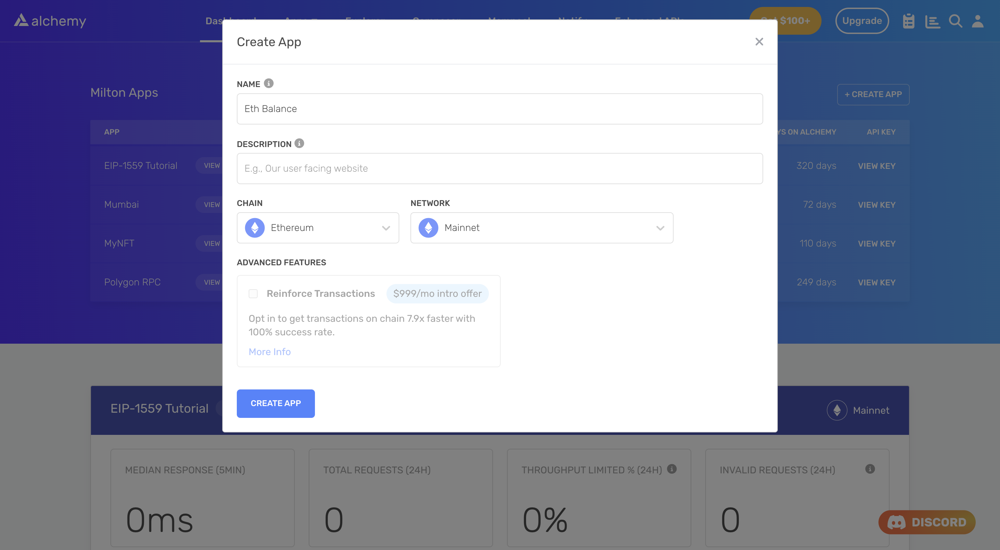

<Info>
  This tutorial uses the **[eth\_getBalance](/reference/eth-getbalance)** endpoint.
</Info>

Perhaps the most important piece of data you can fetch about a wallet on the Ethereum blockchain is its Ether (ETH) balance. This balance is essential for virtually any dapp you build, whether that is a wallet, an NFT marketplace, or a lending protocol.

In this tutorial, we will use [eth\_getBalance](/reference/eth-getbalance) method to fetch the ETH balance of a wallet at a particular block height. We will also implement logic that can convert UTC timestamps into block height, and thus give us the ETH balance at any given point of time.

### About this Tutorial

***

We will write a simple script in Node that gets us the ETH balance of a wallet (say, `vitalik.eth`) at the latest block and at a particular UTC timestamp using [a free Alchemy developer account](https://alchemy.com/?a=cac34e777f) and the [Ethereum API](/reference/ethereum-api-quickstart).

## Creating the ETH balance script

***

### Step 1: Install Node and npm

In case you haven't already, [install node and npm](https://nodejs.org/en/download/) on your local machine.

Make sure that node is at least **v14 or higher** by typing the following in your terminal:

<CodeGroup>
  ```shell shell
  node -v
  ```
</CodeGroup>

### Step 2: Create an Alchemy app

***

In case you haven't already, [sign up for a free Alchemy account](https://alchemy.com/?a=cac34e777f).



Alchemy's account dashboard where developers can create a new app on the Ethereum blockchain.

Next, navigate to the [Alchemy Dashboard](https://dashboard.alchemy.com/signup/?a=cac34e777f) and create a new app.

Make sure you set the chain to Ethereum and network to Mainnet.

Once the app is created, click on your app's *View Key* button on the dashboard.

Take a note of the **HTTP URL** and **API KEY**.

The URL will be in this form: `https://eth-mainnet.g.alchemy.com/v2/xxxxxxxxx`

You will need this later.

***

### Step 3: Create a node project

Let's now create an empty repository and install all node dependencies.

To make requests to the SDK, use the [Alchemy SDK](/reference/alchemy-sdk-quickstart).

You can also use `axios` or `fetch` alternatively.

<CodeGroup>
  ```shell Alchemy SDK
  mkdir eth-balance && cd eth-balance
  npm init -y
  npm install --save alchemy-sdk
  touch main.js
  ```

  ```text Axios
  mkdir eth-balance && cd eth-balance
  npm init -y
  npm install --save axios ethers
  touch main.js
  ```

  ```text Fetch
  mkdir eth-balance && cd eth-balance
  npm init -y
  npm install ethers
  touch main.js
  ```
</CodeGroup>

This will create a repository named `eth-balance` that holds all your files and dependencies.

Next, open this repo in your favorite code editor.

We will be writing all our code in the `main.js` file.

### Step 4: Get ETH balance of a wallet

To get ETH balance of a particular wallet, we will use the [getBalance](/reference/eth-getbalance) method.

This method takes in two arguments:

1. The wallet address for which we want to extract the ETH balance of
2. The block height at which we want to get the ETH balance from. This can be the block number in hexadecimal or one of the predefined `block tags`.

We are going to set the `block` parameter to `latest` to get the most recently observed balance of the wallet.

Add the following code to the `main.js` file.

<CodeGroup>
  ```javascript Alchemy SDK
  const { Alchemy, Utils } = require('alchemy-sdk');

  const apiKey = "<-- ALCHEMY API KEY -->";
  const settings = {
      apiKey: apiKey
  };

  const alchemy = new Alchemy(settings);

  const main = async () => {

      // Set wallet address
      const address = 'vitalik.eth';

      // Get balance and format in terms of ETH
      let balance = await alchemy.core.getBalance(address, 'latest');
      balance = Utils.formatEther(balance);
      console.log(`Balance of ${address}: ${balance} ETH`);
  }

  const runMain = async () => {
      try {
          await main();
          process.exit(0);
      }
      catch (error) {
          console.log(error);
          process.exit(1);
      }
  };

  runMain();
  ```

  ```javascript Axios
  const axios = require('axios');
  const ethers = require('ethers');

  // Set wallet address corresponding to vitalik.eth
  const address = '0xd8da6bf26964af9d7eed9e03e53415d37aa96045';

  // Alchemy API key
  const apiKey = '<-- ALCHEMY API KEY -->';

  var data = JSON.stringify({
      "jsonrpc": "2.0",
      "id": 1,
      "method": "eth_getBalance",
      "params": [
          address, 'latest',
      ]
  });

  var config = {
      method: 'post',
      url: `https://eth-mainnet.g.alchemy.com/v2/${apiKey}`,
      headers: {
          'Content-Type': 'application/json',
          'Accept': 'application/json',
      },
      data: data
  };

  axios(config)
      .then(function (response) {
          let balance = response['data']['result'];
          balance = ethers.utils.formatEther(balance);
          console.log(`Balance of ${address}: ${balance} ETH`);
      })
      .catch(function (error) {
          console.log(error);
      });
  ```

  ```javascript Fetch
  import fetch from 'node-fetch';
  import ethers from 'ethers';

  // Set wallet address corresponding to vitalik.eth
  const address = '0xd8da6bf26964af9d7eed9e03e53415d37aa96045';

  // Alchemy API key
  const apiKey = '<-- ALCHEMY APP API KEY -->';

  var myHeaders = new Headers();
  myHeaders.append("Content-Type", "application/json");

  var raw = JSON.stringify({
    "jsonrpc": "2.0",
    "id": 1,
    "method": "eth_getBalance",
    "params": [
      address, 'latest'
    ]
  });

  var requestOptions = {
    method: 'POST',
    headers: myHeaders,
    body: raw,
    redirect: 'follow'
  };

  fetch(`https://eth-mainnet.g.alchemy.com/v2/${apiKey}`, requestOptions)
    .then(response => {
      let balance = response['data']['result'];
      balance = ethers.utils.formatEther(balance);
      console.log(`Balance of ${address}: ${balance} ETH`);
    })
    .catch(error => console.log('error', error));
  ```
</CodeGroup>

Note that ENS names can only be used with the Alchemy SDK. If you're using Axios or Fetch, you will have to use a hexadecimal address.

Run the script using the following command:

<CodeGroup>
  ```shell shell
  node -v
  ```
</CodeGroup>

If all goes well, you should see output that looks something like this:

```shell
Balance of vitalik.eth: 1000.046443844809563961 ETH
```

***

### Step 5: Get ETH balance at a particular timestamp

In order to convert a timestamp into the closest block number, we will use a library called `ethereum-block-by-date`.

Install this package by running the following command in your terminal:

<CodeGroup>
  ```shell shell
  npm install ethereum-block-by-date
  ```
</CodeGroup>

Replace the contents of `main.js` with the following:

<CodeGroup>
  ```javascript Alchemy SDK
  const { Alchemy, Utils } = require('alchemy-sdk');
  const EthDater = require('ethereum-block-by-date');

  const apiKey = "<-- ALCHEMY API KEY -->";
  const settings = {
      apiKey: apiKey
  };

  const alchemy = new Alchemy(settings);

  const dater = new EthDater(
      alchemy.core // Ethers provider, required.
  );

  const main = async () => {

      // Set wallet address
      const address = 'vitalik.eth';

      // Set timestamp
      const timestamp = '2016-07-20T13:20:40Z';

      // Get blocknumber 
      let block = await dater.getDate(timestamp);
      block = block['block']

      // Get balance and format in terms of ETH
      let balance = await alchemy.core.getBalance(address, block);
      balance = Utils.formatEther(balance);
      console.log(`Balance of ${address}: ${balance} ETH`);
  }

  const runMain = async () => {
      try {
          await main();
          process.exit(0);
      }
      catch (error) {
          console.log(error);
          process.exit(1);
      }
  };

  runMain();
  ```

  ```javascript Axios
  const axios = require('axios');
  const ethers = require('ethers');
  const EthDater = require('ethereum-block-by-date');

  // Set wallet address corresponding to vitalik.eth
  const address = '0xd8da6bf26964af9d7eed9e03e53415d37aa96045';

  // Set timestamp
  const timestamp = '2016-07-20T13:20:40Z';

  // Alchemy API key
  const apiKey = '<-- ALCHEMY API KEY -->';

  const provider = new ethers.providers.AlchemyProvider(null, apiKey);
  const dater = new EthDater(provider);

  const main = async () => {

      let block = await dater.getDate(timestamp);
      block = ethers.utils.hexlify(block['block']);

      var data = JSON.stringify({
          "jsonrpc": "2.0",
          "id": 1,
          "method": "eth_getBalance",
          "params": [
              address, block.toString(),
          ]
      });

      var config = {
          method: 'post',
          url: `https://eth-mainnet.g.alchemy.com/v2/${apiKey}`,
          headers: {
              'Content-Type': 'application/json',
              'Accept': 'application/json',
          },
          data: data
      };

      const response = await axios(config);

      let balance = response['data']['result'];
      balance = ethers.utils.formatEther(balance);
      console.log(`Balance of ${address}: ${balance} ETH`);

  }

  const runMain = async () => {
      try {
          await main();
          process.exit(0);
      }
      catch (error) {
          console.log(error['response']);
          process.exit(1);
      }
  };

  runMain();
  ```

  ```javascript Fetch
  import fetch from 'node-fetch';
  import ethers from 'ethers';

  // Set wallet address corresponding to vitalik.eth
  const address = '0xd8da6bf26964af9d7eed9e03e53415d37aa96045';

  // Set timestamp
  const timestamp = '2016-07-20T13:20:40Z';

  // Alchemy API key
  const apiKey = '<-- ALCHEMY APP API KEY -->';

  const provider = new ethers.providers.AlchemyProvider(null, apiKey);
  const dater = new EthDater(provider);

  var myHeaders = new Headers();
  myHeaders.append("Content-Type", "application/json");

  const main = async () => {

      let block = await dater.getDate(timestamp);
      block = ethers.utils.hexlify(block['block']);

      var raw = JSON.stringify({
        "jsonrpc": "2.0",
        "id": 1,
        "method": "eth_getBalance",
        "params": [
          address, 'latest'
        ]
      });

      var requestOptions = {
        method: 'POST',
        headers: myHeaders,
        body: raw,
        redirect: 'follow'
      };

      const response = fetch(`https://eth-mainnet.g.alchemy.com/v2/${apiKey}`, requestOptions);
      let balance = response['data']['result'];
      balance = ethers.utils.formatEther(balance);
      console.log(`Balance of ${address}: ${balance} ETH`);

  }

  const runMain = async () => {
      try {
          await main();
          process.exit(0);
      }
      catch (error) {
          console.log(error['response']);
          process.exit(1);
      }
  };

  runMain();
  ```
</CodeGroup>

Run the script using the following command:

<CodeGroup>
  ```shell shell
  node main.js
  ```
</CodeGroup>

You should see output that looks like this:

```shell
Balance of vitalik.eth: 215.92554399541193451 ETH
```

## Conclusion

***

Congratulations! You now know how to use the [Alchemy Ethereum API](/reference/ethereum-api) to get the ETH balance of a wallet at a particular time and/or block height.

If you enjoyed this tutorial on how to get ETH balance at a point in time, give us a tweet [@Alchemy](https://twitter.com/Alchemy).

Don't forget to join our [Discord server](https://www.alchemy.com/discord) to meet other blockchain devs, builders, and entrepreneurs.

Ready to start using the Alchemy NFT API?

[Create a free Alchemy account ](https://alchemy.com/?a=cac34e777f)and share your project with us!
