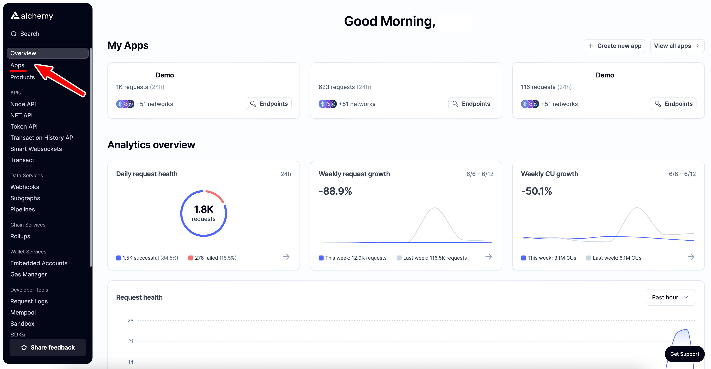
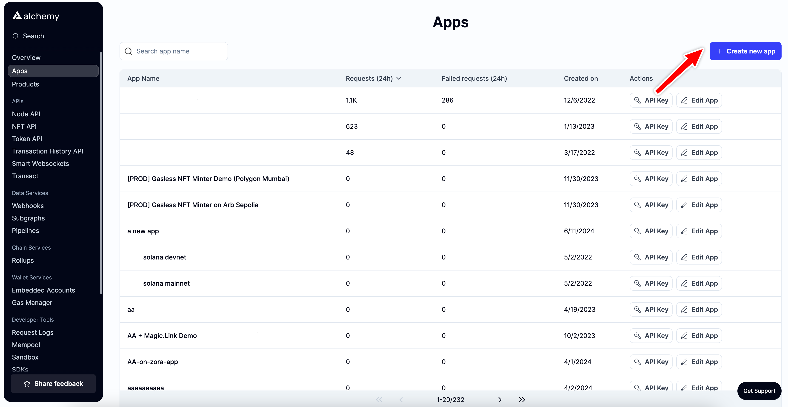
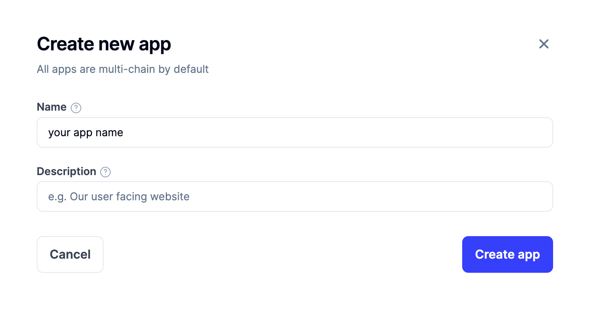
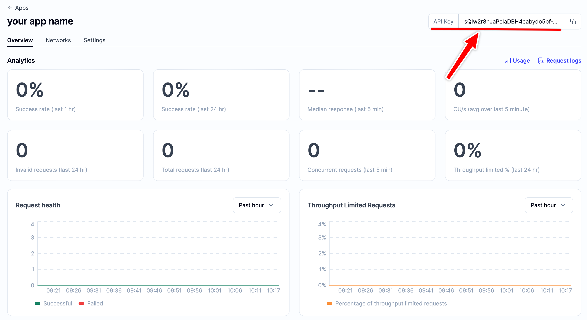
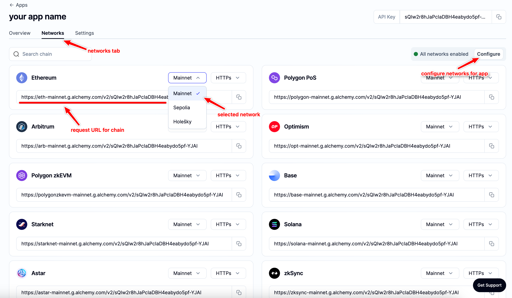
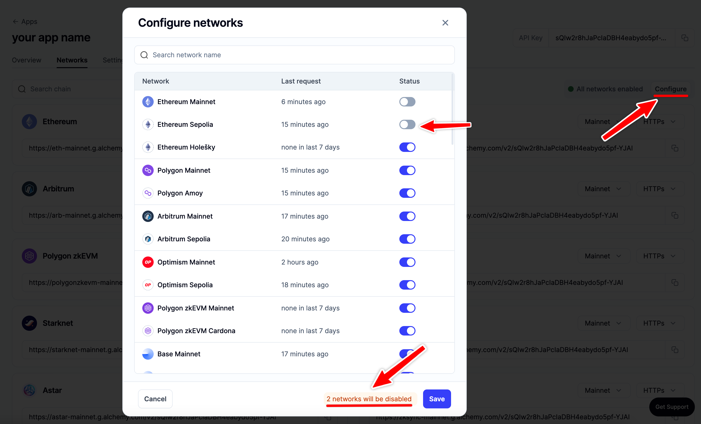
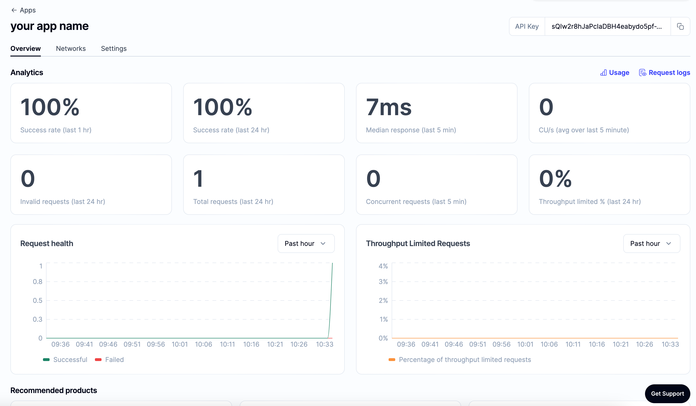

# Getting Started

👋 *New to Alchemy? Get access to Alchemy for free* ***[here](https://alchemy.com/?r=e68b2f77-7fc7-4ef7-8e9c-cdfea869b9b5)***.

*Estimated time to complete this guide: \< 10 minutes*

***

## 📋 Steps to get started with Alchemy

This guide assumes you already have an [Alchemy account](https://alchemy.com/?r=e68b2f77-7fc7-4ef7-8e9c-cdfea869b9b5) and access to our [Dashboard](https://dashboard.alchemy.com/).

**1**. 🔑 [Create an Alchemy API key](#1key-create-an-alchemy-api-key)

**2**. ✍️ [Make a request](/docs/alchemy-quickstart-guide#2-️-make-your-first-request)

**3**. 🤝 [Set up Alchemy as your client](doc:alchemy-quickstart-guide/#3-🤝-set-up-alchemy-as-your-client)

4\. 💻[ Start building!](/docs/alchemy-quickstart-guide#4-computer-start-building)

***

## 1.🔑 Create an Alchemy API Key

To use Alchemy's products, you need an API key to authenticate your requests.

You get an API key when you [create an app from the dashboard](https://dashboard.alchemy.com/). Follow the steps below to create an app:

1. First, navigate to your [Alchemy dashboard](https://dashboard.alchemy.com/) and click on the "Apps" tab.

   

2. Next, click on the "Create new app" button.

   

3. Fill in the details for your new app, this includes specifying a name and description (optional) for it. Then click the "Create app" button.

   

4. Once your app is created, you will be redirected to the app details page, here you will see your API key in the top right corner.

   

5. By default the API key is enabled for all the chains and networks, switch to the "Networks" tab to disable certain chains and view the request URLs.

   

6. You can easily disable networks using the "Configure" option.

   

***

## 2. ✍️ Make Your First Request

You can interact with Alchemy's infrastructure provider using JSON-RPC and your [command line](https://www.computerhope.com/jargon/c/commandi.htm).

For manual requests, we recommend interacting with the `JSON-RPC` via `POST` requests. Simply pass in the `Content-Type: application/json` header and your query as the `POST` body with the following fields:

* `jsonrpc`: The JSON-RPC version—currently, only `2.0` is supported.
* `method`: The ETH API method. [See API reference.](https://alchemyenterprisegroup.readme.io/reference/ethereum-api-quickstart)
* `params`: A list of parameters to pass to the method.
* `id`: The ID of your request. Will be returned by the response so you can keep track of which request a response belongs to.

Here is an example you can run from the Terminal/Windows/LINUX command line to retrieve the current gas price:

<CodeGroup>
  ```shell shell
  curl https://eth-mainnet.g.alchemy.com/v2/demo \
  -X POST \
  -H "Content-Type: application/json" \
  -d '{"jsonrpc":"2.0","method":"eth_gasPrice","params":[],"id":73}'
  ```
</CodeGroup>

<Info>
  Please remember to replace "demo" in the request URL with your actual Alchemy API key you created in the last step!
</Info>

Results:

<CodeGroup>
  ```json Result
  { "id": 73,
    "jsonrpc": "2.0",
    "result": "0x09184e72a000" // 10000000000000 }
  ```
</CodeGroup>

***

## 3. 🤝 Set up Alchemy as your Client

Want to integrate Alchemy into your production app?

Find out how to set up or switch your current provider to Alchemy by using the Alchemy SDK, the easiest and most powerful way to access Alchemy's suite of Enhanced APIs and tools.

<Warning>
  **If you have an existing client,** change your current node provider URL to an Alchemy URL with your API key: "[https://eth-mainnet.g.alchemy.com/v2/your-api-key](https://eth-mainnet.g.alchemy.com/v2/your-api-key)"

  **Note:** The scripts below need to be run in a **node context** or **saved in a file**, not run from the command line.
</Warning>

### The Alchemy SDK

There are tons of Web3 libraries you can integrate with Alchemy. However, we recommend using the [Alchemy SDK](https://github.com/alchemyplatform/alchemy-sdk-js), a drop-in replacement for Ethers.js, built and configured to work seamlessly with Alchemy. This provides multiple advantages such as automatic retries and robust WebSocket support.

### 1. From your [command line](https://www.computerhope.com/jargon/c/commandi.htm), create a new project directory and install the Alchemy SDK.

To install the Alchemy SDK, you want to create a project, and then navigate to your project directory to run the installation. Let's go ahead and do that! Once we're in our home directory, let's execute the following:

With Yarn:

<CodeGroup>
  ```shell Yarn
  mkdir your-project-name
  cd your-project-name
  yarn init # (or yarn init --yes)
  yarn add alchemy-sdk
  ```
</CodeGroup>

With NPM:

<CodeGroup>
  ```shell NPM
  mkdir your-project-name
  cd your-project-name
  npm init   # (or npm init --yes)
  npm install alchemy-sdk
  ```
</CodeGroup>

### 2. Create a file named `index.js` and add the following contents:

<Info>
  You should ultimately replace `demo` with your Alchemy HTTP API key.
</Info>

<CodeGroup>
  ```javascript index.js
  // Setup: npm install alchemy-sdk
  const { Network, Alchemy } = require("alchemy-sdk");

  // Optional Config object, but defaults to demo api-key and eth-mainnet.
  const settings = {
    apiKey: "demo", // Replace with your Alchemy API Key.
    network: Network.ETH_MAINNET, // Replace with your network.
  };

  const alchemy = new Alchemy(settings);

  async function main() {
    const latestBlock = await alchemy.core.getBlockNumber();
    console.log("The latest block number is", latestBlock);
  }

  main();
  ```
</CodeGroup>

Unfamiliar with the async stuff? Check out this [Medium post](https://betterprogramming.pub/understanding-async-await-in-javascript-1d81bb079b2c).

### 3. Run it using node

<CodeGroup>
  ```shell shell
  node index.js
  ```
</CodeGroup>

### 4. You should now see the latest block number output in your console!

<CodeGroup>
  ```shell shell
  The latest block number is 11043912
  ```
</CodeGroup>

Woo! Congrats! You just wrote your first web3 script using Alchemy and sent your first request to your Alchemy API endpoint 🎉

The app associated with your API key should now look like this on the dashboard:



***

## 4. 💻 Start Building!

Don't know where to start? Check out these four tutorials to get more familiar with Alchemy and blockchain development:

1. [Examples of Common Queries Using the Alchemy SDK](/reference/using-the-alchemy-sdk)
2. Write a [simple web3 script](/docs/how-to-get-the-latest-block-on-ethereum)
3. Learn [How to Send Transactions on Ethereum](/docs/how-to-send-transactions-on-ethereum)
4. Try deploying your first [Hello World Smart Contract](/docs/hello-world-smart-contract) and get your hands dirty with some solidity programming!

Once you complete this tutorial, let us know how your experience was or if you have any feedback by tagging us on Twitter [@alchemyplatform](https://twitter.com/AlchemyPlatform)!

***

### Other Web3 Libraries

Check out the documentation for each library:

* [Web3.py](https://web3py.readthedocs.io/en/stable/)
* [Web3j](https://docs.web3j.io)
* [Ethers.js](https://docs.ethers.io/v5/)
* [Web3.js](https://web3js.readthedocs.io/en/v1.2.9/)

Using the below code snippets, you can install and use Alchemy as a provider via any of the following libraries!

<CodeGroup>
  ```python Web3.py
  # Setup: pip install web3
  from web3 import Web3
  alchemy = Web3(Web3.HTTPProvider("https://eth-mainnet.g.alchemy.com/v2/your-api-key"));
  ```

  ```java Web3j
  // Setup: curl -L get.web3j.io | sh
  Web3j web3 = Web3j.build(new HttpService("https://eth-mainnet.g.alchemy.com/v2/your-api-key"));
  ```

  ```javascript Ethers.js
  // Setup: npm install ethers
  const ethers = require("ethers");
  const url = "https://eth-mainnet.g.alchemy.com/v2/your-api-key";
  const customHttpProvider = new ethers.providers.JsonRpcProvider(url);
  ```

  ```javascript Web3.js
  // Setup: npm install web3
  const Web3 = require('web3');
  const web3 = new Web3("https://eth-mainnet.g.alchemy.com/v2/your-api-key");
  ```
</CodeGroup>
