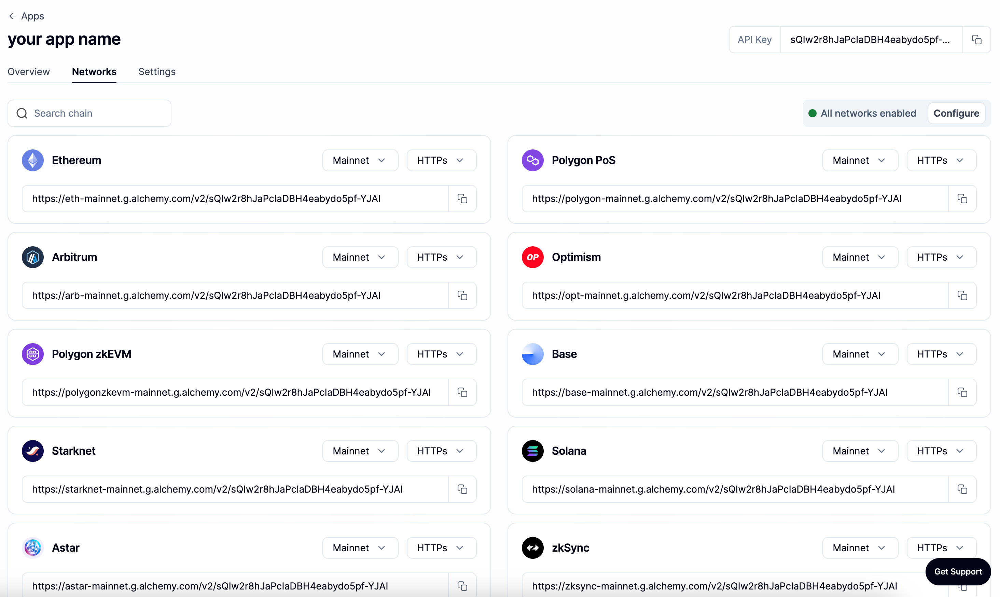
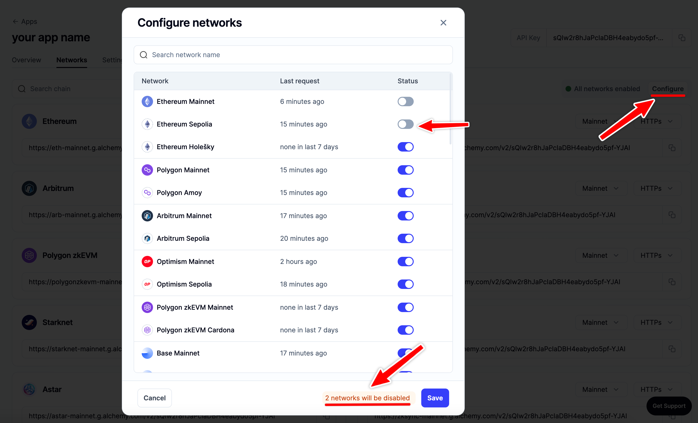
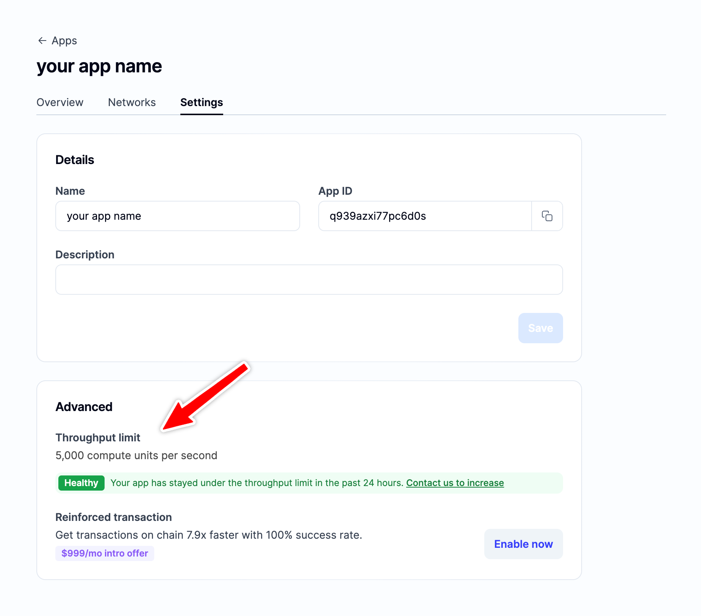

## Why are apps multichain?

Our goal is to make it as easy as possible for developers to build multichain applications. To do this, we’ve enabled multichain apps so that you no longer have to create separate apps and manage separate API keys for each network your product supports.

## What happens to my existing apps?

All existing apps will now be available on all networks. You can disable any network by following the instructions below.

## How do I disable a network?

You can disable networks anytime by clicking on the “configure” button on the app "Networks" page. From here you can toggle off any networks you want to disable.

1. 

## What happens if I disable a network?

If a network is disabled requests will no longer work to that network. All requests will return a `403` response that looks like this:

* `{NETWORK} has been disabled for this app.`

## How does this affect throughput?

Throughput limits are set on each network, so you will have the defined API key throughput limit for each individual network. To see your throughput limit for your app, check out the app settings page.

## How does this affect usage?

Multichain apps do not affect usage. Usage is set at a team level.
