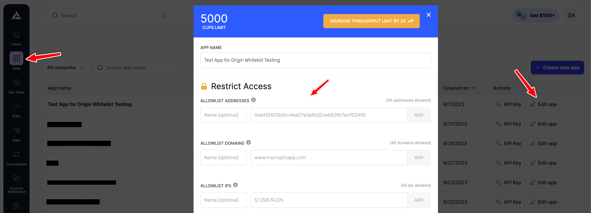

## Introduction

When building applications that rely on your Alchemy API, security is the top concern. API keys are essential for your apps, but exposing them on the frontend could pose a risk. What if someone inspects your website's code and uses your API key for malicious purposes? Or what if your API key accidentally gets leaked through some other way? To mitigate these risks, we provide a set of features to restrict access to your app. These features effectively allow your app to only interact with specified addresses, domains, and IP addresses. In this guide, we'll walk you through how to utilize these restrictions for enhanced security.

***

## Restricting Access To Apps

Restricting access to your apps means setting up rules that limit which addresses, domains, or IPs can interact with your app or API key. You can set these rules for any app by navigating to the ["Apps" section](https://dashboard.alchemy.com/apps) in your [Alchemy dashboard](https://dashboard.alchemy.com/) and selecting the "Edit App" option for the app you want to set the rules for.

Alchemy offers three ways to restrict access:

### 1. Allowlist Addresses

By using the "Allowlist Addresses" feature, you can specify a list of crypto addresses that your app can interact with. This prevents third parties from using your key to interact with contracts or addresses not listed.

**Methods Affected**

* `eth_call`
* `eth_getCode`
* `eth_getLogs`
* `eth_getStorageAt`

#### Steps to Test

* Before adding allowlist addresses

  1. Use your Alchemy key to make an API request involving an address not intended for the allowlist. ( For example, using [`eth_call`](/reference/eth-call) to call the `balanceOf` function of an ERC20 token )
  2. Confirm the request works as expected.

* After adding allowlist addresses

  1. Make the same API request again.
  2. Confirm that the request fails, thereby confirming the address restriction is working.

***

### 2. Allowlist Domains

The "Allowlist Domains" feature allows you to specify a list of web domains that can use your API key, thereby preventing third-parties from using your key on their websites.

**Notes on Caveats**

* If domain whitelist items are set, a missing `Origin` header in the API request will cause the request to fail.
* Specifying a parent domain like `wadafada.com` will not automatically allow its subdomains like `ada.wadafada.com`.
* Using wildcard notation ( ex. `*.padafada.com` ) for subdomains allows all the subdomains but excludes the parent domain itself ( `padafada.com` )

#### Steps to Test

* Before adding allowlist domains

  1. Make an API request from a domain not intended for the allowlist.
  2. Confirm that the request works as expected.

* After adding allowlist domains

  1. Make an API request from a domain not on the allowlist.
  2. Confirm that the request fails, thereby confirming the domain restriction is working.

<Info>
  You can also use tools like Postman to manually set the `Origin` header of the request to mimic different domains.
</Info>

***

### 3. Allowlist IPs

With the "Allowlist IPs" feature, you can specify IPv4 addresses from which requests can be made using your API key, blocking all others.

#### Steps to Test

* Before adding whitelist IPs

  1. Connect to any VPN server.
  2. Test an API request using your Alchemy key.
  3. Confirm the request works as expected.

* After adding whitelist IPs

  1. Connect to a non-whitelisted VPN server.
  2. Test an API request using your Alchemy key.
  3. The request should fail, confirming the IP restriction.

***

## Conclusion

In this guide, we've shown you how to secure your Alchemy apps by restricting access via "Allowlist Addresses", "Allowlist Domains", and "Allowlist IPs". Implementing these restrictions will make it much harder for unauthorized users to misuse your API key, allowing you to build more secure applications.
