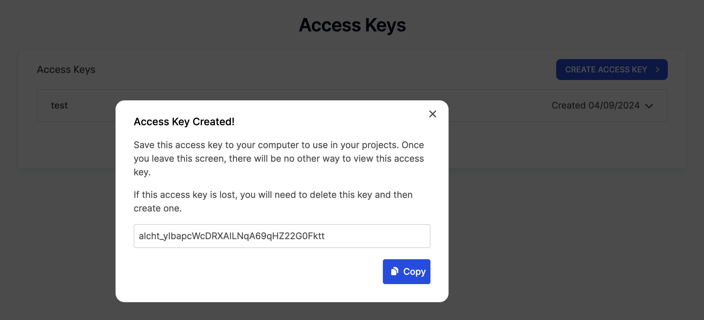

## Introduction to Access Keys

Access keys serve as authentication tokens needed to interact with a subset of Alchemy's suite of APIs. They enable you to access JSON-RPC APIs, NFT API and Gas Manager Admin API. Unlike API keys, access keys can be used in the [authentication header](/docs/how-to-use-api-keys-in-http-headers) of API requests for added security.

## Generating Access Keys

Follow these steps to create a new access key:

1. Log in to your [Alchemy Dashboard](https://dashboard.alchemy.com/).

2. Click the "Access Keys" option in the sidebar. This will take you to the access keys menu where you can see all your existing access keys and create new ones.

   

3. Click on "Create Access Key" to initiate the process.

   

4. Fill out the form:

   1. **Name**: Choose a unique identifier for your access key, limited to 50 characters.

   2. **Permissions**: Select the permissions for your access key. If you plan to make JSON-RPC & NFT API requests using this key, select that option and associate it with an Alchemy app. Select the Gas Manager permissions as required (Read or Read & Write).

   3. **Expiry Date**: Optionally, specify when the access key should expire. After this date, the key will become invalid.

      

5. Once the details are filled in, click "Create".

6. After creation, the access key will be displayed. Be sure to save it securely — it's only shown once.

   

7. Your access key will then be displayed in the access keys menu from where you can delete it if required.

   

## Using Access Keys

### Using as Path Param

When making requests to the APIs, you can use your access key similar to how you would use an API key (as path params), for example:

### Using as Auth Header

In addition to using access keys as path params, you also have the option to use them in authentication header of API requests for added security, for example:

Refer to the guide on [HTTP Header-Based API Requests](/docs/how-to-use-api-keys-in-http-headers) for detailed information on this approach and why this is more secure than using access keys as path params.

That concludes this tutorial! With these steps, you can now successfully create and use access keys for making requests to Alchemy APIs!
