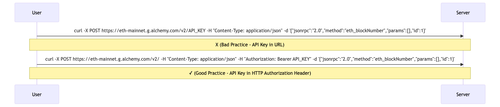
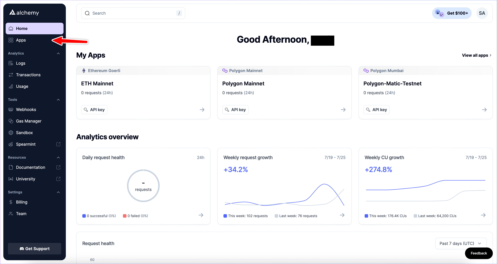
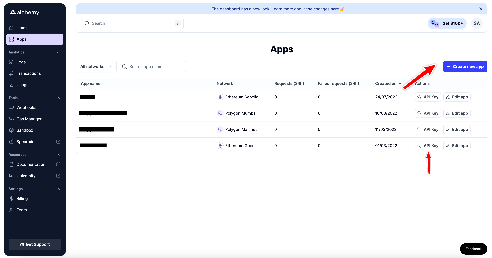
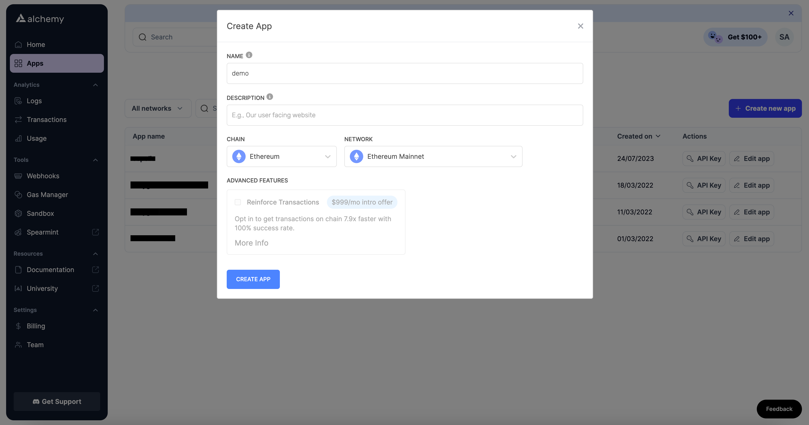
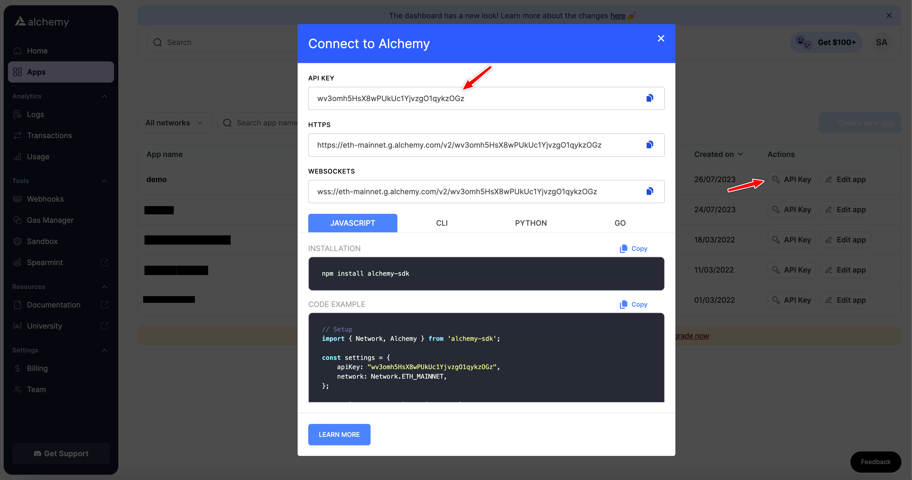
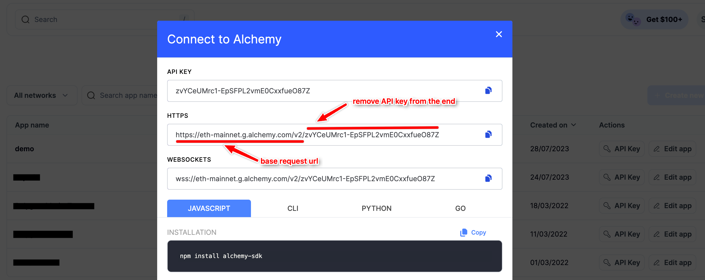
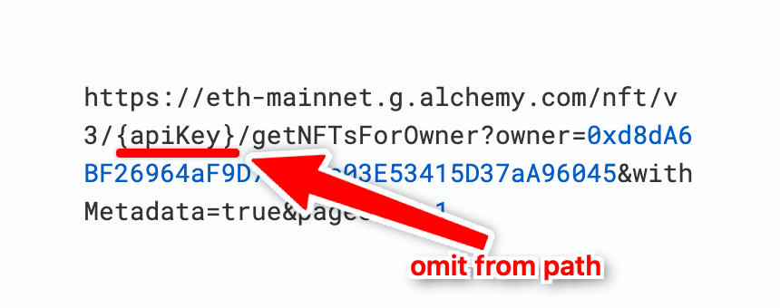

## Introduction

When working with RPC providers, including API keys directly in the request URL is a common practice but this is a security risk as the keys are exposed in server logs, browser history, and cached data. This goes against the best practice of putting API keys in the request `Authorization` header where they can be properly secured and omitted from logs.

In line with this best practice, we expanded our API key handling methods to accept API keys in request `Authorization` header, while still maintaining compatibility with the URL method. In this guide we'll discuss why this update was needed, its security benefits, and provide a detailed walkthrough on how to use your Alchemy API keys in HTTP headers for blockchain API requests.



***

## Why HTTP Header Based Requests?

HTTP requests consist of three parts: a request line, headers, and optionally a body. The request line specifies the method of the request (GET, POST, etc.), the request URI, and the HTTP version. Headers carry additional information like content type and authorization details. The body, which is optional and mostly used with methods like POST and PUT, contains the data that is intended to be sent.

In a URL-based request approach, data like an API key is sent as a part of the URL itself. An example of this is the given request url:

<CodeGroup>
  ```text text
  https://eth-mainnet.g.alchemy.com/v2/your_api_key
  ```
</CodeGroup>

However, this approach can expose your API key to risks, such as being logged in server logs, appearing in browser history, or accidentally being exposed through sharing of URLs.

HTTP header-based requests send the API key or Access key in HTTP `Authorization` header rather than in the URL. This method is generally safer because the header information isn't exposed in browser history or server logs by default.

In the next two sections we will show you how you can get an Alchemy API key and setup a project to make header based requests. If you already have a project setup and an Alchemy API key, please skip to the [Implementation](#making-the-api-requests) section.

<Info>
  You can make requests using either an Alchemy API Key or an Access Key in the Auth header. However, in this tutorial we will use API Key for simplicity. Check out the guide on [creating Access Keys](/docs/how-to-create-access-keys) !
</Info>

***

## Getting Your API Key

The first step to using HTTP header-based requests with Alchemy is to get your API key. Here's how to do it:

1. Navigate to your Alchemy dashboard and click on the "Apps" tab.



2. Grab the API from one of the existing apps by clicking the "API key" button or create a new app for your brand new project by clicking the "Create new app" button on the top-right. 
3. Fill out the details for your new app, this includes the app name, description ( optional ) and network. The network will be the network on which you want to make the requests. 
4. Once the app is created, click on the "API key" button to get your API key for the given app. And that's it! You should now have an API key that you can use in your project. 

***

## Setting up the Project

Before we proceed with making HTTP header-based requests using the API key, we need to set up a basic Node.js project where we can write and execute our code. Here's how you can do it:

1. **Install Node.js**: If you haven't installed Node.js on your system, you can download and install it from the official [Node.js website](https://nodejs.org/en).

2. **Create a new project**: Create a new directory for your project and initialize the project by running the following commands in your terminal:

   <CodeGroup>
     ```bash bash
     mkdir alchemy-tutorial
     cd alchemy-tutorial
     npm init -y
     ```
   </CodeGroup>

   These commands will initialize a Node.js project and create a `package.json` file with default values.

3. **Install necessary libraries**: To work with our HTTP header-based requests, we need a library to make those requests. In this tutorial we will show you how you can make requests using the two most popular libraries namely: axios and ethers.js. So install these libraries by running the command below:

   <CodeGroup>
     ```bash bash
     npm install axios ethers
     ```
   </CodeGroup>

   This command adds Axios and Ethers.js to your project and updates the `package.json` file to include these dependencies. You'll see how we use these libraries in the next section.

4. **Create a new file for your code**: You can now create new JavaScript files in your project directory which will hold the actual code for making these requests. Create two new files called: `axiosScript.js` and ` ethersScript.js` ( or just a single file for the library you're interested in ).

You've now set up a simple Node.js project with the necessary dependencies installed. You're ready to start writing your code.

Please note that while we're using a basic Node.js project here for demonstration purposes, you can certainly use this approach in other types of projects, such as those built with Next.js, React, etc. The method of making HTTP header-based requests using the API key remains the same; the project setup and configuration will differ based on the framework or library you're using.

***

## Making the API Requests

With your API key at hand and the project set up, you can now start making HTTP header-based requests. To demonstrate the process, we'll use two major JavaScript libraries: Axios and Ethers.js. We'll make requests to the [`eth_getBalance`](/reference/eth-getbalance) method (JSON-RPC API) and [getNFTsForOwner](/reference/getnftsforowner-v3) NFT API method (Enhanced API) for showcasing.

### Using Axios (JSON-RPC API)

Axios is a widely adopted JavaScript library for HTTP requests. Below is how you would use your Alchemy API key/Access Key in an HTTP header with Axios:

<CodeGroup>
  ```javascript javascript
  const axios = require('axios'); // Import axios library

  // Set up data object for the request
  const data = {
    method: 'eth_getBalance', // Set request method
    params: ['0xd8dA6BF26964aF9D7eEd9e03E53415D37aA96045'], // Insert the EVM address
    id: 1,
    jsonrpc: "2.0"
  }

  // Set up headers object for the request
  const headers = {
    'Authorization': `Bearer YOUR_API_KEY`, // Insert API key/Access Key in Authorization header
  }

  // Send POST request using axios to base request url ( you can get the base request url from your Alchemy dashboard )
  axios.post('https://eth-mainnet.g.alchemy.com/v2', data, { headers: headers })
    .then(response => console.log(response.data.result)) // Log response data
    .catch(error => console.error(error)); // Log any errors
  ```
</CodeGroup>

Add the code given above to your `axiosScript.js` file and remember to replace `YOUR_API_KEY` with your actual Alchemy API key and `'0xd8dA6BF26964aF9D7eEd9e03E53415D37aA96045'` with the EVM address whose balance you want to check.

This code:

* Imports the Axios library.

* Sets up a data object containing the JSON-RPC method to call and its params.

* Creates a header object containing the authorization header for the request. This also includes the API key. This is used for authenticating the request.

* Finally it sends the request through axios using the Alchemy base request url and the two objects ( header and data ) defined before. The base request url should correspond to the network you're making requests on. You can get this url from your app details in the Alchemy dashboard as shown below:

  

* If it's a successful response the result is logged to the console, if not, the errors are logged.

### Using Axios (Enhanced API)

Similarly for Enhanced APIs like NFT API, you can include the API Key/Access Key in the header and omit the `apiKey` from path:



Here's the code demonstrating this:

<CodeGroup>
  ```javascript javascript
  const axios = require("axios"); // Import axios library

  // Set up headers object for the request
  const headers = {
    Authorization: `Bearer YOUR_API_KEY`, // Insert API key/Access Key in Authorization header
  };

  // Send GET request using axios to the request URL omitting api key from it
  axios
    .get(
      "https://eth-mainnet.g.alchemy.com/nft/v3/getNFTsForOwner?owner=0xd8dA6BF26964aF9D7eEd9e03E53415D37aA96045&withMetadata=true&pageSize=1",
      { headers: headers }
    )
    .then((response) => console.log(response.data)) // Log response data
    .catch((error) => console.error(error)); // Log any errors
  ```
</CodeGroup>

We can make the same request using cURL as following:

<CodeGroup>
  ```shell shell
  curl --location 'https://eth-mainnet.g.alchemy.com/nft/v3/getNFTsForOwner?owner=0xd8dA6BF26964aF9D7eEd9e03E53415D37aA96045' \ --header 'Authorization: Bearer YOUR_API_KEY'
  ```
</CodeGroup>

Again, it's following the same principle of removing API Key/Access Key from path and including it in Auth header.

### Using Ethers.js

Ethers.js is a commonly used JavaScript library in blockchain development. Here's how to use your Alchemy API key in an HTTP header with Ethers.js:

<CodeGroup>
  ```javascript javascript
  // Import the FetchRequest class from ethers
  const { FetchRequest } = require('ethers');

  // Define an asynchronous function to get the balance of EVM address
  async function getBalance() {
      // The base request URL ( you can get this from your app details in Alchemy dashboard )
      const url = 'https://eth-mainnet.g.alchemy.com/v2'; 
      // The EVM address that we want to get the balance of
      const address = '0xd8dA6BF26964aF9D7eEd9e03E53415D37aA96045';  // Replace with the address you're interested in
      // Alchemy API Key
      const apiKey = 'YOUR_API_KEY';  // Replace with your actual API key

      // Create a new FetchRequest instance with the specified URL
      let req = new FetchRequest(url);
      // Set the Content-Type header to 'application/json'
      req.setHeader('Content-Type', 'application/json');
      // Set the Authorization header with the API key
      req.setHeader('Authorization', `Bearer ${apiKey}`);
      // Set the request body with a JSON string containing the JSON-RPC request
      req.body = JSON.stringify({
          jsonrpc: '2.0',
          id: 1,
          method: 'eth_getBalance',
          params: [address]
      });
      // Set the HTTP method to POST
      req.method = 'POST';

      // Send the request and wait for the response
      let resp = await req.send();

      // Parse the response body as JSON and extract the result field
      let result = JSON.parse(resp.bodyText).result;

      // Log the result to the console
      console.log(result);
  }

  // Call the getBalance function and log any errors to the console
  getBalance().catch(console.error);
  ```
</CodeGroup>

Add the code given above to your `ethersScript.js` file and remember to replace `YOUR_API_KEY` with your actual Alchemy API key and `'0xd8dA6BF26964aF9D7eEd9e03E53415D37aA96045'` with the EVM address whose balance you want to check.

This code:

* Imports the `FetchRequest` class from the Ethers library that can be used for making custom HTTP requests.
* Defines an asynchronous function `getBalance` to handle the entire process of fetching balance.
* Specifies the base request URL, the EVM address whose balance needs to be fetched, and the Alchemy API key. The base request URL should correspond to the network you're making the requests on. You can get it from your app details in the Alchemy dashboard as shown below: 
* Creates a new `FetchRequest` instance using the base request URL.
* Sets the 'Content-Type' header of the request to 'application/json' using the `setHeader` method.
* Sets the 'Authorization' header of the request to include the API key using the `setHeader` method.
* Specifies the body of the request with a stringified JSON object representing the JSON-RPC request for `eth_getBalance` method.
* Sets the HTTP method of the request to `'POST'`.
* Sends the request to the Alchemy endpoint using the `send` method and waits for the response.
* Parses the response body as a JSON object using `JSON.parse`, and retrieves the `result` field from the parsed object, which contains the hex formatted balance of the EVM address in Wei.
* Logs the result (the balance) to the console.
* Executes the `getBalance` function and provides error handling. If an error occurs during execution, it's caught and logged to the console.

## Conclusion

In this guide you learned how to make HTTP header-based API requests.

We recommend moving your Alchemy API keys from the URL to HTTP headers as it enhances the security of your projects. With our support for header-based requests, this transition is seamless and easy.

If you have any questions or need further help implementing these changes, please don't hesitate to reach out to us on [Alchemy's Discord](https://discord.com/invite/alchemyplatform).
