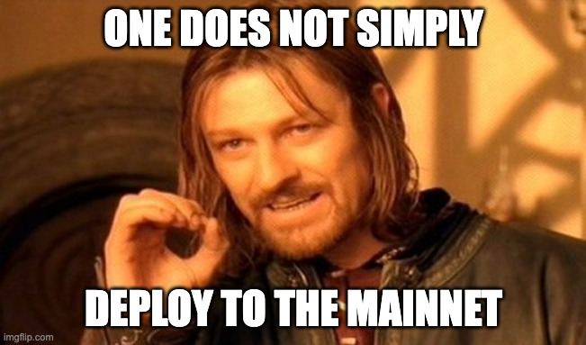

### Don’t have an API key?

Sign up or upgrade your plan for access.

[Get started for free](https://dashboard.alchemy.com/signup/?a=8e6ab7a8db)

# Introduction

So you have deployed your smart contract on a testnet, it's working fine and now you want to deploy it to the mainnet. Before you deploy it to the mainnet, there are a few things you should take into consideration. This guide will go through some of those considerations, such as gas optimizations, auditing and security, verifying source code and managing keys securely.

# Gas Optimizations

Review your smart contract to see if there are any [gas optimizations](https://www.alchemy.com/overviews/solidity-gas-optimization) that can be made. Gas optimization is important in smart contracts because it allows for more efficient execution of code. By optimizing the gas usage, smart contracts can run more quickly and efficiently. This can lead to lower costs and faster execution times.

Gas optimizations can save millions of dollars in user funds as they lower the gas fees required to interact with the smart contract. This ultimately leads to a better user experience.

Check out Alchemy's guide on [Gas Optimization Techniques](https://www.alchemy.com/overviews/solidity-gas-optimization) and see if you can implement any of these techniques in your smart contract.

# Auditing

When deploying a smart contract to the mainnet, it is a good idea to audit the contract first to ensure that it is secure and does not contain any vulnerabilities. This is because once a contract is deployed, it is very difficult to change or update it, so it is important to make sure that it is correct before deploying it.

Review [smart contract security best practices](https://www.alchemy.com/overviews/smart-contract-security-best-practices) and make sure that your smart contract adheres to these best practices.

If you have enough funds, you can also request a security audit from security audit firms like Quantstamp, Trail of Bits or Openzeppelin, if not, always ask another developer to review your smart contract. Keep in mind that audits do not guarantee that there are no bugs, but having several experienced security researchers go through your code can certainly help.

Also check out [A Developer's Guide To Securing Ethereum Smart Contracts](https://alchemy.com/blog/a-developers-guide-to-securing-ethereum-smart-contracts) by Alchemy.

# Key Management

You need to be extra careful when securing your private keys while working on mainnet. The accounts you use to deploy and interact with your contracts will contain actual Ether, which has real value and is an appealing target for hackers. Do everything you can to protect your keys, and consider using a hardware wallet if necessary. Additionally, you may define certain accounts to have special privileges in your system - and you should take extra care to secure them. These accounts are called Admin accounts.

An administrator account is one that has more privileges than a regular account. For example, an administrator may have the power to pause a contract. If such an account were to fall into the hands of a malicious user, they could wreak havoc in your system.

A good option for securing administrator accounts is to use a special contract, such as a multisig, instead of a regular externally owned account. A multisig is a contract that can execute any action, as long as a predefined number of trusted members agree upon it. [Gnosis Safe](https://safe.gnosis.io/multisig) is a good multisig to use.

# Verifying Your Source Code

It's important to verify the source code of your contracts after you deploy them to the mainnet. This process involves submitting the Solidity code to a third-party, such as Etherscan or Etherchain, who will compile it and verify that it matches the deployed assembly. This allows any user to view your contract code in a block explorer, and know that it corresponds to the assembly actually running at that address. It builds trust for the project among users as they can verify exactly what they are interacting with.

You can verify your contracts manually on the [Etherscan](https://etherscan.io/verifyContract) website or if you want to verifty the contracts programatically, you can use the [Hardhat Etherscan](https://hardhat.org/hardhat-runner/plugins/nomiclabs-hardhat-etherscan) plugin.

# Conclusion

Congratulations! You have now learned the best practices to use when deploying your contract on the mainnet. If you follow these steps, you will have a safe and successful deployment.
