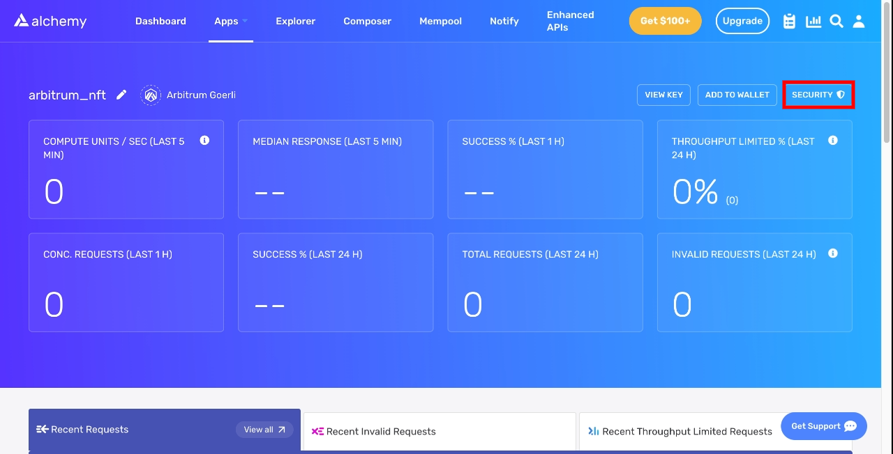
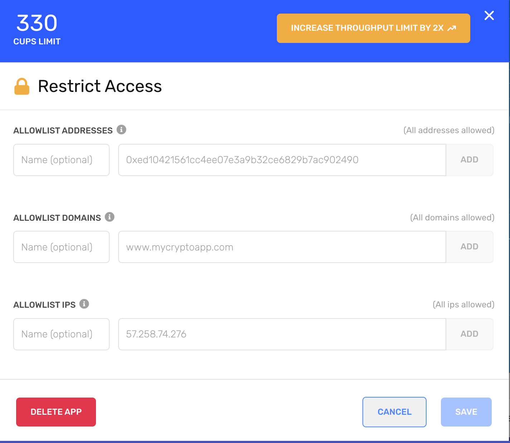

Here is a list of best practices to reduce [compute unit usage costs](/reference/compute-units) to make sure you’re getting the most out of Alchemy’s platform!

We will continue updating these as we receive customer feedback.

## 1. Send Requests Concurrently

Depending on your background with blockchain nodes, you might expect that requests need to be sent sequentially to function properly. That’s not the case!

**Don’t treat Alchemy like a single node or a group of nodes** - treat it like an automated, scalable service that can handle concurrent request patterns.

You don’t need to be concerned about overloading Alchemy with concurrent requests at scale. Alchemy is built specifically to process high rates of concurrent requests for [all of our web3 customers](https://www.alchemy.com/all-case-studies).

## 2. Avoid High Batch Cardinality

When sending batch requests, **aim for batches under 50 requests per call**.

If you need hundreds or thousands of responses quickly, send more batched requests concurrently rather than placing all your requests in a single call.

Blockchain responses tend to be heavy, which means that responses for certain requests sent to the nodes (like [eth\_getLogs](/docs/deep-dive-into-eth_getlogs) can have an unbounded size or time to execute.

By batching smaller sets of requests, you can minimize time-outs as the result of unbounded response sizes, and indefinite execution times, and guarantee higher throughputs.

Additionally, it’ll be easier to identify and solve requests that are failing. Instead of having to retry a batch with 100+ requests, you can quickly retry a subset of requests without the failing query.

## 3. Retry (w/ Exponential Backoff) on Failures, Not On Client-Side Timeouts

Many types of common node requests require long processing times or unbounded response sizes, leading to slower response times (oftentimes from 1 - 10+ seconds).

If you’re canceling and re-sending requests on client-side timeouts that are too short, you could end up never receiving the response you’re looking for and spamming the node infrastructure with expensive requests that waste your compute units.

Instead, **retry your requests with exponential backoff on response failures**, which will reduce your compute unit costs, increase the success rate of your requests, and allow you to handle failures properly based on their respective error messages.

If you need to handle timeouts, you can also retry your requests on Alchemy-based timeouts, which will prevent you from accidentally retrying requests before nodes have finished processing them. Alternatively, increase your client-side timeouts to see if your request success rate improves.

To save development overhead, you can use the [Alchemy SDK](https://github.com/alchemyplatform/alchemy-sdk-js) which handles exponential backoff retries on failure for you automatically, among other benefits!

## 4. Send Requests over HTTPS, not WebSockets

Though it may be tempting to use WebSockets for all node requests because it’s a newer technology, the [industry best practice for using WebSockets](/docs/best-practices-for-using-websockets-in-web3) is still primarily for push-based notifications. In the case of EVM chains, `eth_subscribe` and `eth_unsubscribe` to certain events.

HTTPS is a better option for standard JSON-RPC node requests for several reasons:

* **Silent failures**: WebSockets client-side handling has many tricky edge cases and silent failure modes.

* **Load balancing**: When making requests to distributed systems such as Alchemy, individual HTTP requests are load-balanced to the fastest possible server, whereas with WebSockets you incur additional latency by sending JSON-RPC requests only to a single node.

* **Retries**: In most common request frameworks, support for retrying failed HTTP requests comes automatically, and can be configured easily. Conversely, in WebSockets retrying failed requests typically requires custom JSON-RPC id-based tracking.

* **HTTP status codes**: When web3 developers use WebSockets they won't receive HTTP status codes in WebSockets responses, which can be useful for debugging or sorting responses.

## 4. Avoid Large Request / Response Sizes

We recommend keeping the vast majority of requests to be under 100 KB and avoiding response sizes above 10 MB.

Though we permit sending large requests (currently up to 2.5 MB) and receiving large responses (currently up to 150 MB), we strongly suggest avoiding these limits as much as possible. This is for several reasons: Larger requests and responses are more likely to hit our size limits, which will result in failing API calls that you’ll have to retry. Heavy API calls have higher likelihood of timing out, failing while in flight, and causing nodes to become unstable. Smaller API calls are easier to debug and identify issues that arise.

By keeping your API calls an order of magnitude smaller than our hard limits, your infrastructure will become more reliable, responsive, and you’ll spend less time debugging your dApp.

## 5. Use gZip Compression to Speed Up Large Requests

At Alchemy, many of our developers have brought up slow response times as a major blocker to providing their customers with a good web3 user experience.

To provide users with better product experiences, we updated our internal infrastructure to offer Alchemy developers **support for gzip compression on all responses larger than 1kb in size.**

In practice, we’ve seen roughly a **75% improvement in the total latency of typical JSON-RPC replayTransaction calls.**

Go to the article below to learn how to implement gZip compression:

[docs.alchemy.com](https://docs.alchemy.com/alchemy/guides/how-to-enable-compression-to-speed-up-json-rpc-blockchain-requests)

[How to Enable Compression to Speed Up JSON-RPC Blockchain Requests](https://docs.alchemy.com/alchemy/guides/how-to-enable-compression-to-speed-up-json-rpc-blockchain-requests)

## 6. Contact Us When Multiplying Your Capacity

Are you planning on launching the next big NFT project? Planning a major indexing project to backfill your databases with custom node data?

Please reach out to us if you’re expecting a massive capacity increase in the order of 3x or more of your current usage!

There are a few reasons for this:

**1. We can save you money**

By letting us know ahead of time, we can help you optimize your request patterns to lower compute unit costs, decrease the load on our system, and ensure your launch goes smoothly.

**2. We can spin up additional infrastructure**

New full blockchain nodes that can serve historical data take days or weeks to bring up in the past, leading to significant scalability issues.

At Alchemy, we’ve solved most of these issues, but the more advanced warning you can give us for specific high-load request patterns, the better.

**3. We can provide hands-on support.**

For large projects, we provide white-glove support and direct access to our engineers; one of the reasons our customers love us so much. We’re available and willing to help with your infrastructure needs - just let us know!

## 7. Protecting your API Keys

There might be instances where you want to embed your API key somewhere public, like frontend-only applications. To avoid unintended use of the API Key, you can setup an allowlist within your Alchemy dashboard, specifying what domains, contract addresses, wallet addresses, or IP addresses are able to send requests.

To do this, visit your unique app page in the dashboard, and click on "Security" in the top right.

Security Button

This will open up a pop-up screen that allows you to restrict access to your API key

Restrict app access

Learn more about it [here](/docs/how-to-add-allowlists-to-your-apps-for-enhanced-security).

## 8. API Authentication

Alchemy provides three ways to authenticate API requests:

1. **API Key in URL**: Simple but vulnerable to exposure in server logs and browser histories.
2. **API Key in Request Header**: Safer than URL. Uses the HTTP Authorization header.
3. **JWT Tokens**: Most secure but requires backend server setup.

**Recommendations**:

* For frontend apps, use short-lived JWTs.
* For backend services, prefer API keys in headers.
* Rotate keys annually or if a leak is suspected.

**Guides**:

* [Header-Based Requests](/docs/how-to-use-api-keys-in-http-headers)
* [Using JWTs](/docs/how-to-use-jwts-for-api-requests)
