# What Alerts can I set up?

We offer two types of alerts:

* **Error rate alerts**: Receive alerts when your error rates reach a specified threshold across all your apps in a certain time interval. For instance, get an alert if 5% of your requests in the past 10 minutes are errors.
* **Usage Alerts**: Monitor your spending and stay within budget by getting alerted when your on-demand usage reaches a specified dollar or CU amount.

<Info>
  Alerts are currently not available on the free tier.
</Info>

# How to set up alerts

Setting up alerts in the dashboard is easy.

<Info>
  All members of your team will have the same alerts configuration and access to the alerts hub. You can manage your alert settings by adding or removing yourself as a subscriber to active team alerts.
</Info>

1. Visit the [configure alerts page](https://dashboard.alchemy.com/settings/alerts) in the dashboard

   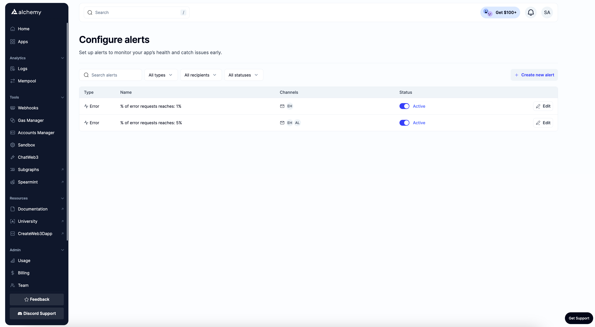

2. Click “Create new alert”

   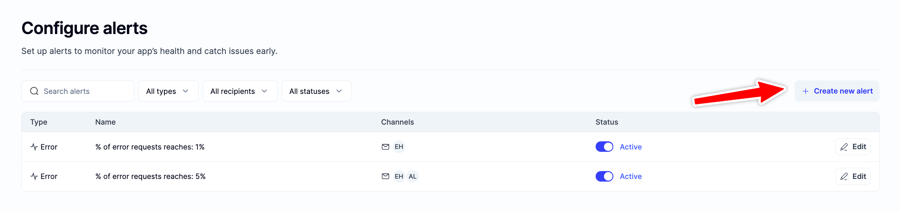

3. Choose the type of alert you wish to create: Error Rate or Usage Alert.

   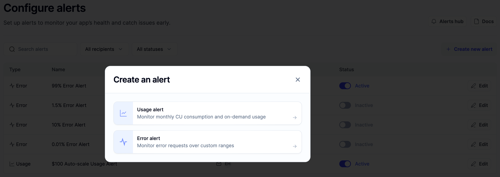

4. Set your alert configurations **For Error Rate Alerts:**

   * ***Error Threshold***: The % of errors out of your total requests that you want to be alerted for. We recommend setting this high enough so that it’s not noisy, but low enough to catch abnormalities. This range will change depending on your expected error rates but we typically recommend anywhere from 1-5% depending on your error tolerance.

   * ***Interval***: The time interval to measure total requests over. A good rule of thumb here is 5-15mins.

   * ***Alert Frequency***: Decide how often you want the alert notifications. Depending on what your threshold is set at, you don’t want this to be spammy.

   * ***Recipients***: Define who the alert will be sent to. If there are specific teammates who want to subscribe to these alerts you can add their emails here. Only emails with active alchemy accounts on your team will be able to receive alerts.

   * ***Alert Name***: Give your alert a distinct name for easy identification.

     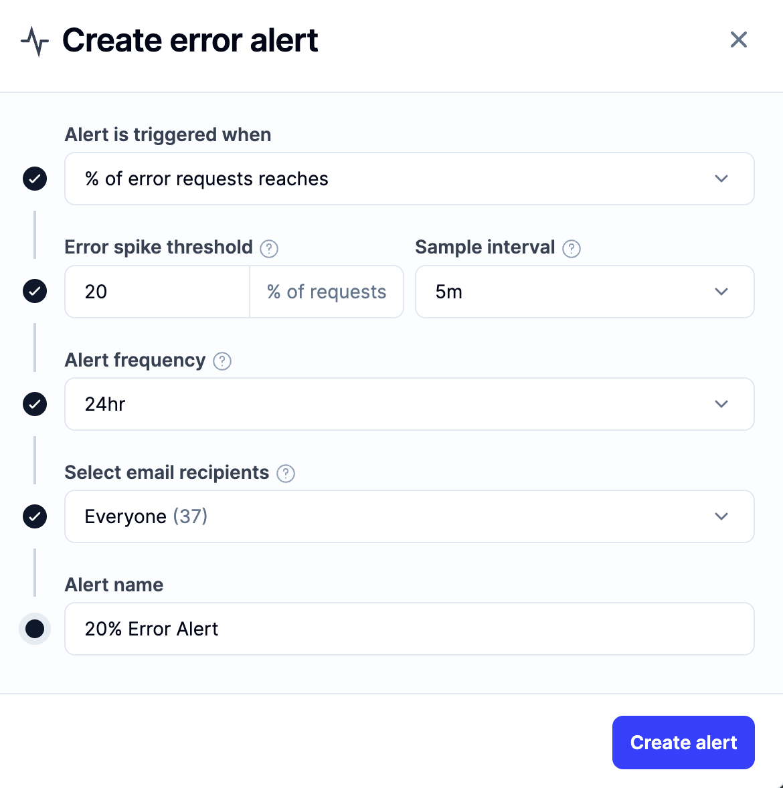

   **For Usage Alerts:**

   * ***Usage Threshold***: Input the dollar or CU amount that, when reached, will trigger the alert.

   * ***Usage Unit***: Choose USD or CUs based on your preference from the drop-down on the right.

   * ***Email Recipients***: Define who the alert will be sent to. If there are specific teammates who want to subscribe to these alerts you can add their emails here. Only emails with active alchemy accounts on your team will be able to receive alerts.

   * ***Alert Name***: Give your alert a distinct name for easy identification.

     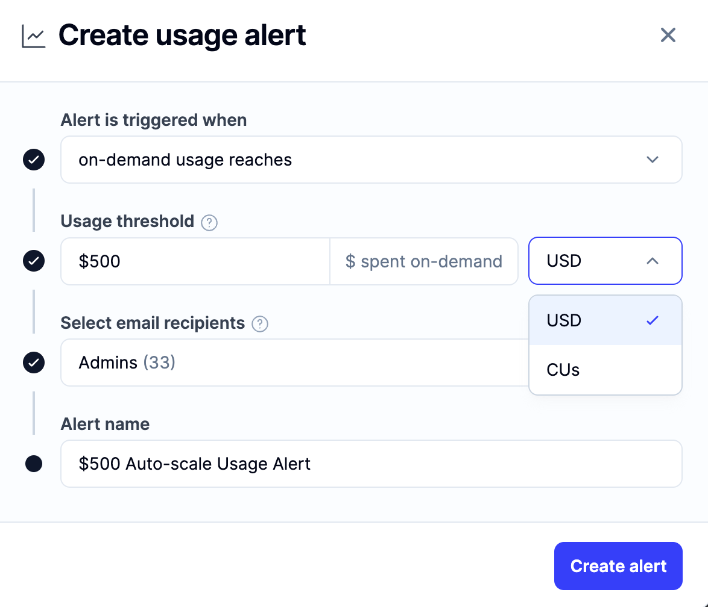

5. Save your alert

   Once your alert is saved, you should see it appear in your alerts list.

   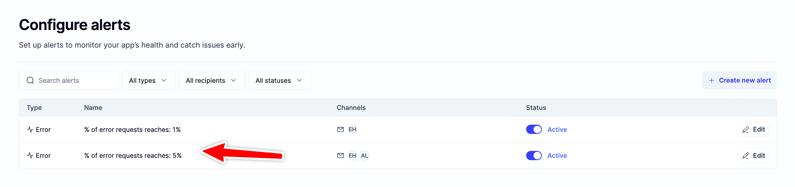

6. When your alert gets triggered, you’ll get an email about it and will also be able to see it in the notification panel and the [Alerts Hub](https://dashboard.alchemy.com/alerts)! **Alerts Email:**

   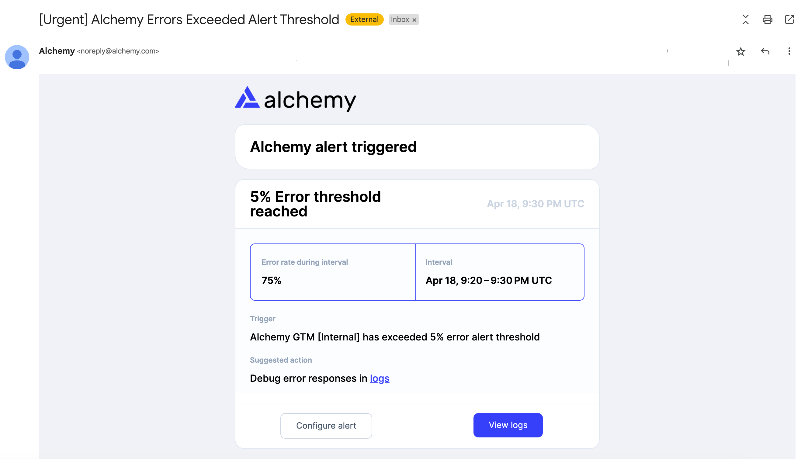

   **Alerts Notification Panel:**

   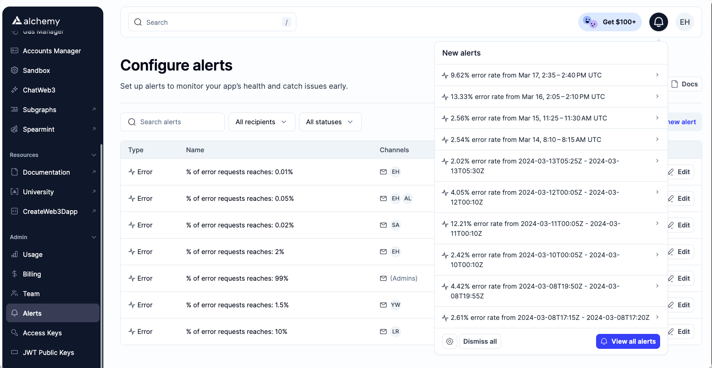

   **Alerts Hub:**

   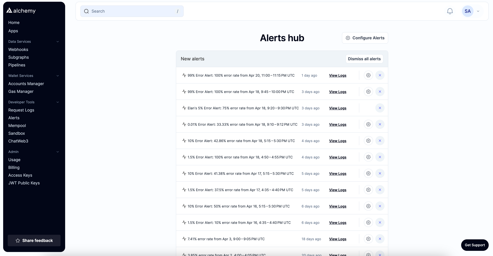

7. Dismiss alerts manually or by clicking on the relevant action item.

   Alerts will automatically be dismissed if you click on them directly.

   Manually dismiss alerts by clicking on the X button next to the alert or by clicking “Dismiss All”

   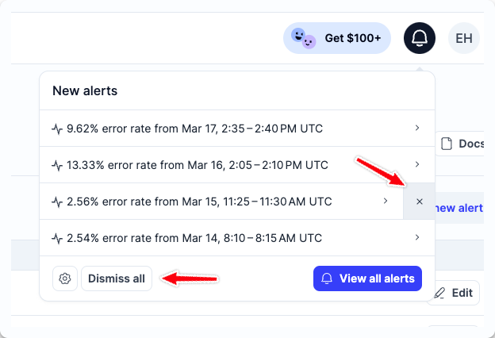

8. Dismissed alerts will be moved into “past alerts”

   Past alerts are available for you to view at any time.

   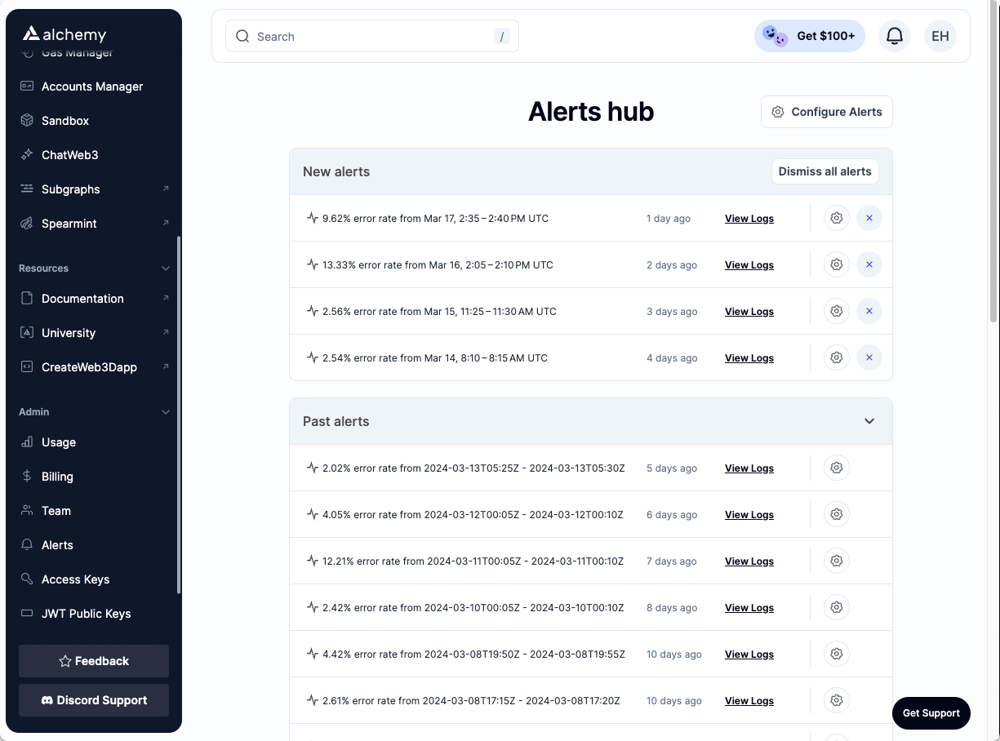

9. Edit, deactivate, and delete alerts at any time by visiting your [Alert configuration page](https://dashboard.alchemy.com/settings/alerts).

# How do I unsubscribe myself from an Alert?

You can unsubscribe yourself from an alert by editing the alert and removing your name from the recipient list. Note that deactivating or deleting alerts will do so for your entire team so if you’re just looking to remove yourself, you should edit the alert instead.

# Editing Alerts

You can edit any alert by visiting the [Alerts Configuration page](https://dashboard.alchemy.com/settings/alerts). Alert edits will apply to the entire team so make sure to communicate with the alert subscribers or create a new alert if you want to keep multiple versions.

# Deactivating Alerts

Deactivating alerts will disable them from being sent to all the specified subscribers. If you’d like to remove yourself from receiving the alert you can do so by editing the alert instead of deactivating it for everyone. We recommend deactivating alerts if your team no longer wants to receive them but may want to use them again in the future. You can also edit your alert settings to change the thresholds and frequencies.

# Deleting Alerts

Deleting an alert will remove and unsubscribe it for everyone in addition to removing all alert settings. We only recommend deleting alerts if you know you will never want to reactivate them again.

# How we define “Errors”

To understand how we define error requests, it’s helpful to know what our definition is for successful requests:

* **Success:** HTTP status code is `2xx` **and** the `response.error` field is empty (null).
* **Failure:** Any condition that does not meet the success criteria.

For more details and context on error codes, check out [Error Reference](/reference/error-reference).
