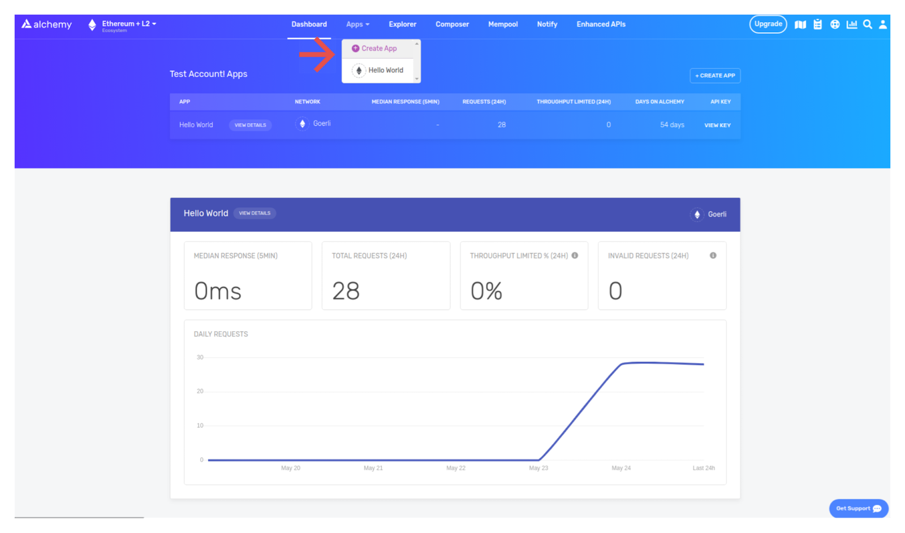
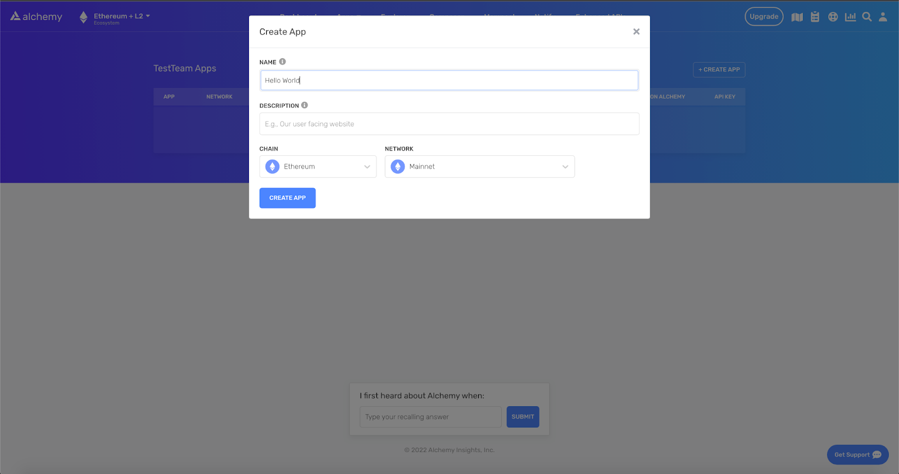
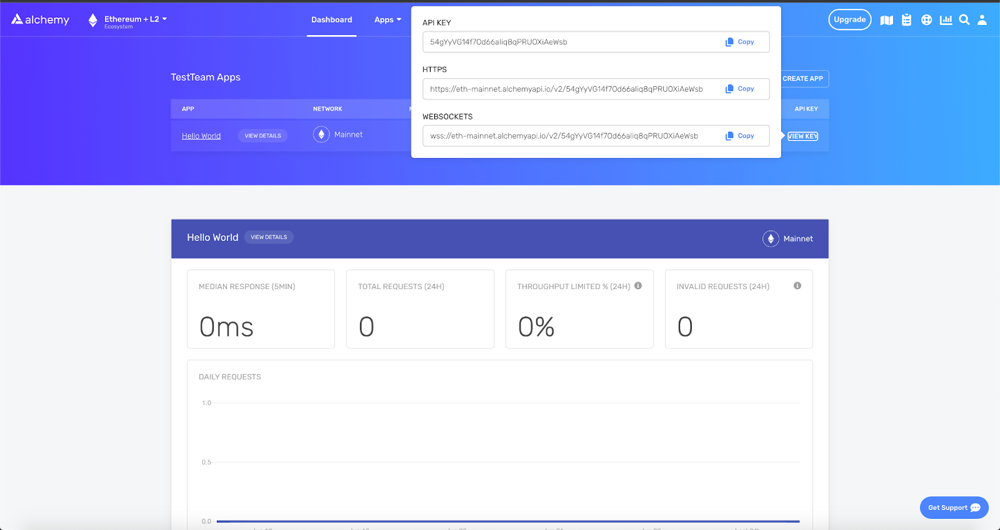

**TL;DR -** Adding an "Accept-Encoding: gzip" header to JSON-RPC requests results in roughly a 75% speedup for requests over 100kb. Use this single code change to speed up JSON-RPC requests for Ethereum, Polygon Optimism, Arbitrum, and more!

Because of the structure of data storage in [blockchain nodes](https://www.alchemy.com/blog/what-is-a-node-provider), RPC endpoints that provide access to blockchain nodes can have extremely slow requests and response times. Many requests, such as a simple `getLogs` or `replayTransaction` call, can take anywhere from 1 to 30 seconds to process

### What causes slow response times?

The round-trip time of these requests can take a while for two primary reasons: (1) the request or response is large; (2) the requests are complex.

#### 1. Large Requests or Responses

The size of the request or response can become quite large - up to 1MB for certain requests - and from 10MB - 250MB for certain response patterns. The latency to send or receive these calls can take seconds to process, depending on the connection speeds of the client or server.

#### 2. Complex Requests

The requests themselves can take the nodes seconds to process, as they oftentimes involve replaying complicated transactions from scratch or scanning thousands of blocks to identify relevant transactions.

Because of this, the [best practice for making calls to RPC node providers](https://docs.alchemy.com/alchemy/documentation/best-practices-when-using-alchemy) includes:

1. Keeping request sizes under 100KB
2. Keeping response sizes under 10MB
3. Sending requests in batches no larger than 50

Together, these best practices help developers avoid client-side timeouts and unreliable behavior

***

## Compressing RPC Responses to Speed Up Blockchain Node Requests

At Alchemy, many of our developers have brought up slow response times as a major blocker to providing their customers with a good web3 user experience.

To provide users with better product experiences, we updated our internal infrastructure to offer **Alchemy developers support for gzip compression on all responses larger than 1kb in size.**

Gzip compression offers up to a 95% decrease in the size of files sent over a streaming connection. However, the actual latency and bandwidth savings are dependent on the structure of data being broadcast, the connection speeds of the client and server, and the size of the response.

In practice, we’ve seen roughly a **75% improvement in the total latency of typical JSON-RPC `replayTransaction` calls.**

### Can JSON-RPC responses be compressed on Optimism, Arbitrum, Polygon, Starknet, or Solana?

Beyond support for gZip compression for Ethereum, this method of compressing JSON-RPC requests works on all the above blockchains. To implement this latency optimization, simply enable Gzip compression using your Alchemy endpoint

***

## How to Enable Gzip Compression on Node Requests

### Step 1: Set up an Alchemy Account

To enable gzip compression, first, you’ll need an Alchemy endpoint. [If you don’t already have an Alchemy account, sign up for free here.](https://alchemy.com/?a=gzip-compression)

If you’re already building applications on Alchemy’s developer platform, sign in to your account and skip to step 3.

Alchemy is a blockchain developer platform and suite of APIs that allow developers to communicate with multiple blockchains without having to run their own nodes. Alchemy comes with 300 million compute units per month for free, which is equivalent to roughly 12 million free requests per month.

### Step 2: Create your app and API key

Once you’ve created an Alchemy account, you can generate an API key by creating an app. This will allow you to make requests to the mainnet.

Navigate to the “Create App” page in your Alchemy Dashboard by hovering over “Apps” in the nav bar. Then, click “Create App.”



Then:

* Name your app “Hello World”
* Offer a short description
* Click “Create App”!



Your app should appear in the table. Finally, click on “View Key” on the right-hand side and copy the HTTPS URL.



### Step 3: Make a command-line node request with gzip enabled

In order to enable gzip compression, **you’ll simply need to provide the additional field "Accept-Encoding: gzip" to the header of the JSON-RPC request.**

When making a curl request in the terminal, your request with gzip might look like this:

<CodeGroup>
  ```curl curl
  curl https://eth-mainnet.g.alchemy.com/v2/demo
  -v -X POST
  -H "Content-Type: application/json"
  -H "Accept-Encoding: gzip"
  -d '{"method":"trace_replayTransaction","params":["0x3277c743c14e482243862c03a70e83ccb52e25cb9e54378b20a8303f15cb985d",["trace"]],"id":1,"jsonrpc":"2.0"}'
  ```
</CodeGroup>

***

## Test the JSON-RPC Response Latency Decrease using Gzip Compression

To compare the latency improvements you’ll get using gzip on a single request, we’ll set up a script to record the total time a [`trace_replayTransaction`](https://docs.alchemy.com/alchemy/enhanced-apis/trace-api/trace_replaytransaction) request takes, and then run the same request with gzip compression and without gzip compression

### Step 1: Create a curl-format file

Create a new file named `curl-format.txt` and add the following lines:

<CodeGroup>
  ```text curl-format.txt
  time_namelookup:  %{time_namelookup}s\n
  time_connect:  %{time_connect}s\n
  time_appconnect:  %{time_appconnect}s\n
  time_pretransfer:  %{time_pretransfer}s\n
  time_redirect:  %{time_redirect}s\n
  time_starttransfer:  %{time_starttransfer}s\n
  —------------------------------------------------------\n
  time_total:  %{time_total}s\n
  ```
</CodeGroup>

### Step 2: Run a test JSON-RPC request script without gzip compression

Next, run the following script without gzip compression on an arbitrary node request:

<CodeGroup>
  ```curl curl
  curl -w "@curl-format.txt" -o /dev/null -s https://eth-mainnet.g.alchemy.com/v2/demo
  -v -X POST
  -H "Content-Type: application/json"
  -d '{"method":"trace_replayTransaction","params":["0x3277c743c14e482243862c03a70e83ccb52e25cb9e54378b20a8303f15cb985d",["trace"]],"id":1,"jsonrpc":"2.0"}'
  ```
</CodeGroup>

On our pass, **we got the following output with approximately a 4-second response time:**

<CodeGroup>
  ```json json
  time_namelookup:  0.004295s
  time_connect:  0.015269s
  time_appconnect:  0.055590s
  time_pretransfer:  0.056517s
  time_redirect:  0.000000s
  time_starttransfer:  0.056595s
  ----------
  time_total:  4.017589s
  ```
</CodeGroup>

### Step 3: Run a test JSON-RPC request with gzip compression enabled

Run the same script, but this time with gzip compression enabled on the same node request:

<CodeGroup>
  ```curl curl-format
  curl -w "@curl-format.txt" -o /dev/null -s https://eth-mainnet.g.alchemy.com/v2/demo
  -v -X POST
  -H "Content-Type: application/json"
  -H "Accept-Encoding: gzip"
  -d '{"method":"trace_replayTransaction","params":["0x3277c743c14e482243862c03a70e83ccb52e25cb9e54378b20a8303f15cb985d",["trace"]],"id":1,"jsonrpc":"2.0"}'
  ```
</CodeGroup>

On our pass, **we got the following output with a roughly 1 second response time:**

<CodeGroup>
  ```text response
  time_namelookup: 0.030062s
  time_connect: 0.046659s
  time_appconnect: 0.099016s
  time_pretransfer: 0.099198s
  time_redirect: 0.000000s
  time_starttransfer: 0.099243s
  ----------
  time_total: 0.984284s
  ```
</CodeGroup>

As you can see, in just two responses we’ve seen a **75% decrease in total latency!**

JSON-RPC response latency improvements are dependent on many factors, including connection speed from the client, type of request, and size of the response.

Though this number will vary dramatically based on these factors, you’ll typically see a non-trivial decrease in latency using gzip compression for speeding up large response packages.

Good luck on your blockchain development journey - and feel free to message us with any related questions on [our Discord!](https://alchemy.com/discord)
