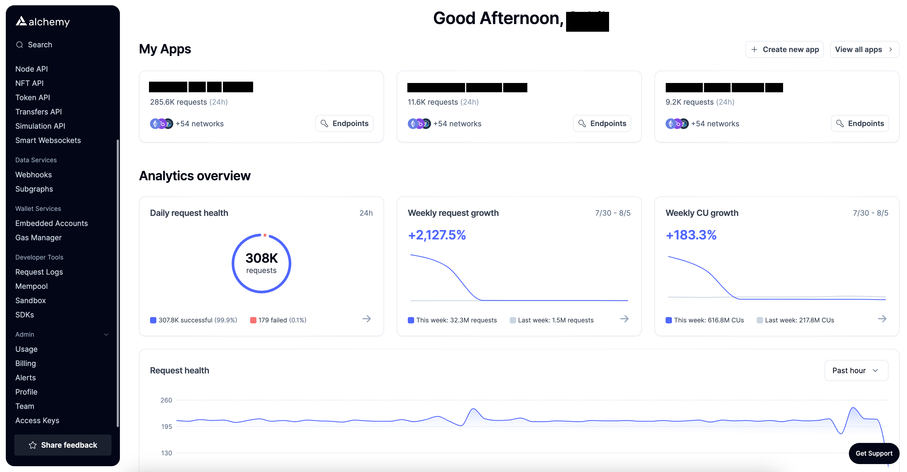
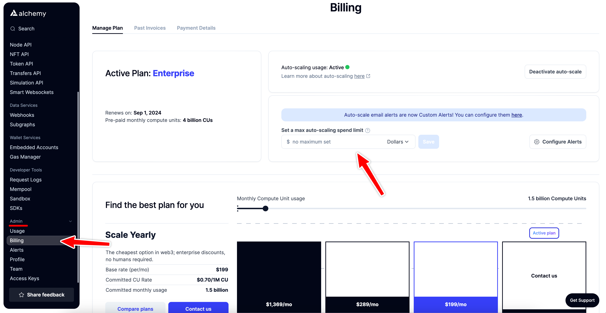
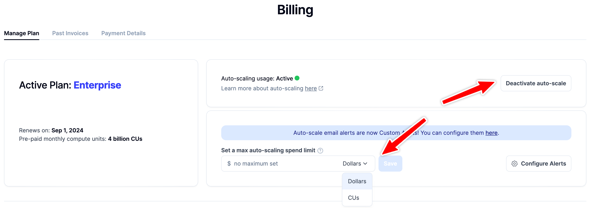

Managing your Alchemy account wisely is essential to avoid any unexpected costs and to keep your usage in check. With the ability to set limits, you can have peace of mind knowing that you won't accidently overspend. In this guide, we'll walk you through the steps to set usage limits for your Alchemy account.

***

### 1. Accessing the Alchemy Dashboard

**Step 1:** Open your preferred web browser and navigate to the [Alchemy Dashboard](https://dashboard.alchemy.com/).

***

### 2. Navigate to the billing section

**Step 2:** Once you're on the dashboard, select the "Billing" option under the "Admin" section on the left navigation bar.

***

### 3. Configure auto-scale options

**Step 3:** Here you will find an option to activate/deactivate auto-scale and set a max auto-scaling spend limit in dollars or in CUs.

Here's a breakdown of the options available:

* **Auto-scaling**: This feature allows for unlimited on-demand API access after your prepaid amount is utilized. This is particularly useful if you have varying API needs that might exceed your prepaid amount. If this is not active, your API access will be turned off once your prepaid amount is reached.

* **Max auto-scaling spend limit**: This is an optional spend limit when auto-scaling is activated. By setting this limit, your service will automatically stop once this amount is reached, ensuring you don't incur unexpected costs. You can set this limit either in Dollars or Compute Units (CUs)..

***

### 4. Setting your preferences

**Step 4:** Configure the auto-scale options based on your requirements and you're all set!

<Info>
  Check out our guide on setting up [Dashboard Alerts](/docs/dashboard-alerts)!
</Info>

***

Managing your Alchemy account wisely is important for both cost management and efficient usage. By setting appropriate limits, you can ensure that your projects run smoothly without any unexpected costs. Regularly review and adjust these settings as your needs evolve over time.
