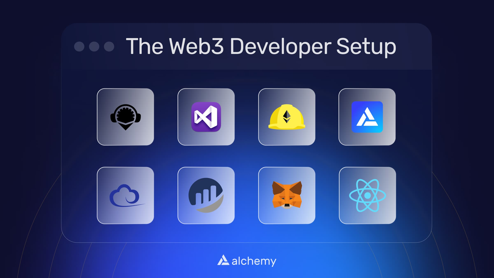

If you're a web3 developer trying to build blockchain dApps you have a lot of tools to choose from, but knowing which web3 developer tools are the right ones to use - and how to set them up - isn't always clear. This guide will show you the core web3 tools and teach you how to set them up.

***

## Web3 Developer Tools

The web3 developer tools we'll cover in this article are:

* [Visual Studio](/docs/how-to-set-up-core-web3-developer-tools#visual-studio)
* [Remix](/docs/how-to-set-up-core-web3-developer-tools#remix)
* [Node and npm](/docs/how-to-set-up-core-web3-developer-tools#node-and-npm)
* [React and Next.js](/docs/how-to-set-up-core-web3-developer-tools#react-and-nextjs)
* [Hardhat](/docs/how-to-set-up-core-web3-developer-tools#hardhat)
* [Alchemy](/docs/how-to-set-up-core-web3-developer-tools#alchemy)
* [Ethers.js](/docs/how-to-set-up-core-web3-developer-tools#ethersjs)
* [Metamask](/docs/how-to-set-up-core-web3-developer-tools#metamask)
* [Etherscan](/docs/how-to-set-up-core-web3-developer-tools#etherscan)

<Warning>
  If you're on Windows, all of the below instructions will work for you on the [Windows Subsystem for Linux](https://ubuntu.com/wsl) (WSL). WSL gives you the Linux experience without making you log off your Windows OS. So most Linux commands will work on a WSL terminal as well.

  So before you can follow along with any of the below instructions, please [install WSL](https://apps.microsoft.com/store/detail/ubuntu/9PDXGNCFSCZV?hl=en-in\&gl=IN) from the Microsoft App store, and then go to the "Start" menu to open the app named "Ubuntu," to access the Ubuntu terminal from your Windows OS.

  **Note:** Command Prompt will work in most cases, but some Linux commands are not supported.
</Warning>

## Integrated Development Environments (IDE)

### Visual Studio

Visual Studio is one of the leading IDEs used by a spectrum of developers, not just Web3.

Visual Studio's in-platform terminal, extensibility for new languages, and great UI make it a perfect IDE for all developers, and the most popular IDE today.

[Download Visual Studio](https://code.visualstudio.com/download) for your OS (available for Windows, Linux, and Mac), and then install it.

### Remix

If you want to save yourself from the hassle of setting up your environment and get started right away - Remix is the web3 IDE tool for you.

[Remix](https://remix.ethereum.org/) is an online all-integrated IDE that lets you test, deploy and execute smart contracts from the comfort of your browser tab.

And don't forget to [add Alchemy as your Custom RPC provider](/docs/how-to-add-alchemy-rpc-endpoints-to-metamask).

## Development Frameworks and Languages

### Node and npm

Node.js is a Javascript runtime that serves as the base layer for many web-based projects.

Npm is a package manager to download and update packages for your Node.js ecosystem.

Both are typically crucial to manage packages and develop seamlessly in web3.

To set up node, [download and install the correct version for your OS](https://nodejs.org/en/download/).

<Info>
  Below commands will work for all Linux, macOS, and Windows. [Windows Subsystem for Linux](https://ubuntu.com/wsl) (Recommended) and Command Prompt can be used on Windows.
</Info>

To verify your installation you can type the below commands in your Terminal and hit enter.

<CodeGroup>
  ```shell shell
  node -v
  npm -v
  ```
</CodeGroup>

if you see a version number (for instance `14.0.1`) node and npm are now installed in your system.

To install the latest version of npm, you can do:

<CodeGroup>
  ```shell shell
  npm install -g npm@latest
  ```
</CodeGroup>

### React and Next.js

React and Next are development frameworks that make it super easy for a developer to get started with developing applications.

React and Next.js comes with packaged tools and configured files, which reduces the developer's effort to just write code instead of managing the environment as well earlier.

<Info>
  Below commands will work for all Linux, macOS, and Windows. [Windows Subsystem for Linux](https://ubuntu.com/wsl) (Recommended) and Command Prompt can be used on Windows.
</Info>

If not already installed, you can install react using the below command:

<CodeGroup>
  ```shell shell
  npm install react
  ```
</CodeGroup>

Then you can create a react app with the below command:

<CodeGroup>
  ```shell shell
  npx create-react-app sampleApp
  ```
</CodeGroup>

To install next.js, run the below command:

<CodeGroup>
  ```shell shell
  npm install next react react-dom
  ```
</CodeGroup>

## Local Web3 Development Environment

### Hardhat

Hardhat is the de-facto local Ethereum development environment.

Hardhat makes it very easy for web3 developers to:

* Deploy and test on specific [Ethereum and EVM-compatible testnets](https://www.alchemy.com/overviews/what-are-testnets) like Mumbai and Goerli
* Deploy smart contracts and test on Hardhat's local network
* Deploy on Ethereum mainnet and other blockchains using JSON-RPC providers like [Alchemy](https://alchemy.com)
* Use [blockchain developer tools](https://www.alchemy.com/overviews/20-blockchain-development-tools) like Waffle, Etherscan, and Ganache via built-in plugins

While we recommend using Hardhat, other local Ethereum environments include:

* [Truffle](https://trufflesuite.com/truffle/)
* [Ganache](https://trufflesuite.com/ganache/)

<Info>
  Below commands will work for all Linux, macOS, and Windows. [Windows Subsystem for Linux](https://ubuntu.com/wsl) (Recommended) and Command Prompt can be used on Windows.
</Info>

To install hardhat in your systems, you can run the following:

<CodeGroup>
  ```shell shell
  npm install –save-dev hardhat
  ```
</CodeGroup>

When you want to create a Hardhat project in a specific directory, you can run:

<CodeGroup>
  ```shell shell
  npx hardhat
  ```
</CodeGroup>

## Web3 APIs

### Alchemy

Alchemy is one of the leading [blockchain developer platforms](https://alchemy.com/?a=4195838853) that provides services like:

* [RPC nodes](https://www.alchemy.com/supernode)
* [Webhooks](https://www.alchemy.com/notify)
* [Blockchain Application Monitoring tools](https://www.alchemy.com/monitor)
* [Token API](/docs/token-api-quickstart)
* [NFT API](/reference/nft-api-quickstart)
* [Trace API](https://alchemyenterprisegroup.readme.io/reference/trace-api)

All of these [Enhanced APIs](https://www.alchemy.com/enhanced-apis) make it very easy for you to build in Web3 at no cost initially!

Check out our [free tier](https://www.alchemy.com/pricing)!

To create an account with Alchemy, follow the below steps

1. If you don't already have one, create an account [here](https://auth.alchemyapi.io/?redirectUrl=https%3A%2F%2Fdashboard.alchemyapi.io%2Fsignup%2F%3Freferrer_origin%3DDIRECT%26ref%3Daffiliate%3A083e41431e).
2. Name your app (e.g. "Sample App")
3. Choose a chain and a network (e.g. "Ethereum" as the chain and "Goerli" as the network)
4. If you click "View Key" from your dashboard, you can see the API Key, HTTP URL and Websocket URL which can now be plugged into your dApp!

To learn more about how to use Alchemy, [build your first Hello world smart contract](/docs/hello-world-smart-contract) (30 mins)!

## Ethereum Libraries

### Alchemy SDK

The [Alchemy SDK](/reference/alchemy-sdk-quickstart) is a lightweight, modular SDK built as a drop-in replacement of Ethers.js that provides a superset of functionality - enabling access to the Alchemy NFT API, Websockets, and Enhanced API methods.

Check out the full Github repo here:

[](https://github.com/alchemyplatform/alchemy-sdk-js)

[github.com](https://github.com/alchemyplatform/alchemy-sdk-js)

[GitHub - alchemyplatform/alchemy-sdk-js](https://github.com/alchemyplatform/alchemy-sdk-js)

To install the Alchemy SDK, you can use npm or yarn:

<CodeGroup>
  ```shell NPM
  npm install alchemy-sdk
  ```

  ```text Yarn
  yarn add @alch/alchemy-sdk
  ```
</CodeGroup>

After installing the app, you can then import and use the SDK:

<CodeGroup>
  ````javascript SDK.js
  import { Network, Alchemy } from 'alchemy-sdk';

  // Optional Config object, but defaults to demo api-key and eth-mainnet.
  const settings = {
    apiKey: 'demo', // Replace with your Alchemy API Key.
    network: Network.ETH_MAINNET, // Replace with your network.
  };

  const alchemy = new Alchemy(settings);

  // Access standard Ethers.js JSON-RPC node request
  alchemy.core.getBlockNumber().then(console.log);

  // Access Alchemy Enhanced API requests
  alchemy.core.getTokenBalances("0x3f5CE5FBFe3E9af3971dD833D26bA9b5C936f0bE").then(console.log);

  // Access the Alchemy NFT API
  alchemy.nft.getNftsForOwner('vitalik.eth').then(console.log);

  // Access WebSockets and Alchemy-specific WS methods
  alchemy.ws.on(
    {
      method: 'alchemy_pendingTransactions'
    },
    res => console.log(res)
  );
  ```
  ````
</CodeGroup>

The `Alchemy` object returned by `new Alchemy()` provides access to the Alchemy API. An optional config object can be passed in when initializing to set your API key, change the network, or specify the max number of retries.

If you are already using Ethers.js, you should be simply able to replace the Ethers.js object with `alchemy.core` and it should just work.

### Ethers.js

Ethers.js is one of the most common Ethereum libraries used by developers to interact with the Ethereum mainnet and Ethereum testnets via code.

[Ethers.js](https://docs.ethers.io/v5/) has readily available and easy-to-use functions to deploy contracts, execute smart contract methods, send Ethereum, etc.

<Info>
  Below commands will work for all Linux, macOS, and Windows. [Windows Subsystem for Linux](https://ubuntu.com/wsl) (Recommended) and Command Prompt can be used on Windows.
</Info>

To install ethers, you need to run the below:

<CodeGroup>
  ```shell shell
  npm install --save ethers
  ```
</CodeGroup>

To import the library in your javascript code (React or Next.js) you can write:

<CodeGroup>
  ```javascript javascript
  import {ethers} from "ethers";
  ```
</CodeGroup>

## Wallet

### Metamask

Metamask is one of the most [common browser-based blockchain wallets](https://www.alchemy.com/web3-wallets-overview) used within the Web3 ecosystem, and blockchain application developers use it to test, build and deploy dApps.

Web3 consumers use MetaMask to store and manage their crypto assets, and interact with web3 applications, and use DeFi apps.

Here are some helpful [tutorials to set up your MetaMask wallet](https://www.youtube.com/watch?v=GNPz-Dv5BjM) and [how to add Alchemy as an RPC endpoint](/docs/how-to-add-alchemy-rpc-endpoints-to-metamask) to your Metamask which will make your transactions faster and easier to manage.

<Info>
  Metamask is currently supported only on Chrome, Opera, Firefox and Brave. It is not supported on Safari.
</Info>

## Block Explorer

### Etherscan

Etherscan is an [online block explorer](https://etherscan.io/) (no installation needed) where users can search transaction hashes, contract addresses, or EOA's and it will return all the info for that address/hash on a page.

Block explorers are helpful web3 developer tools when you need to see the status of a recently submitted transaction or the details of a smart contract.

Each testnet has their own block explorers. The most popular ones are:

* [Goerli](https://goerli.etherscan.io/)
* [Ropsten](https://ropsten.etherscan.io/)
* [Rinkeby (deprecated)](https://rinkeby.etherscan.io/)

Similarly, other chains and L2's have their own explorers:

* [Polygonscan](https://polygonscan.com/)
* [Arbiscan](https://arbiscan.io/)

## Conclusion

Congrats! You have now set up your web3 environment and are ready to begin programming smart contracts like a professional blockchain developer!

If you enjoyed this tutorial for setting up your web3 environment, give us a tweet [@AlchemyPlatform](https://twitter.com/AlchemyPlatform), or shout out the author [@ankg404](https://twitter.com/ankg404) on Twitter!

Don't forget to join our [Discord server](https://www.alchemy.com/discord) to meet other blockchain devs, builders, and entrepreneurs!
