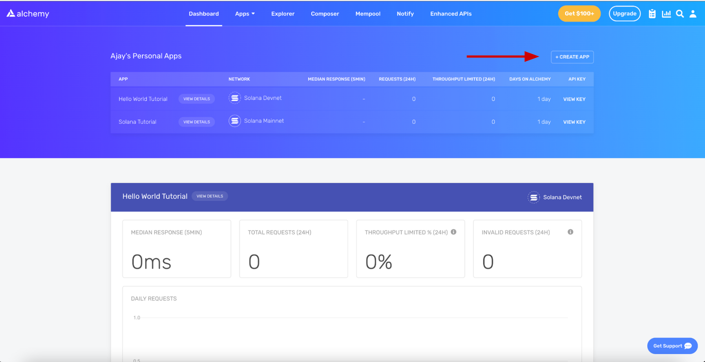
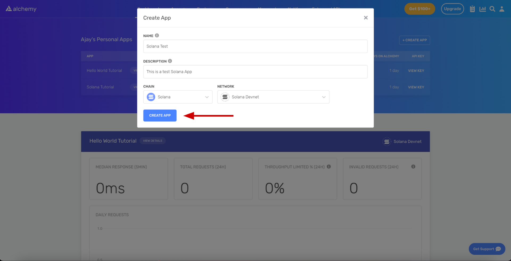
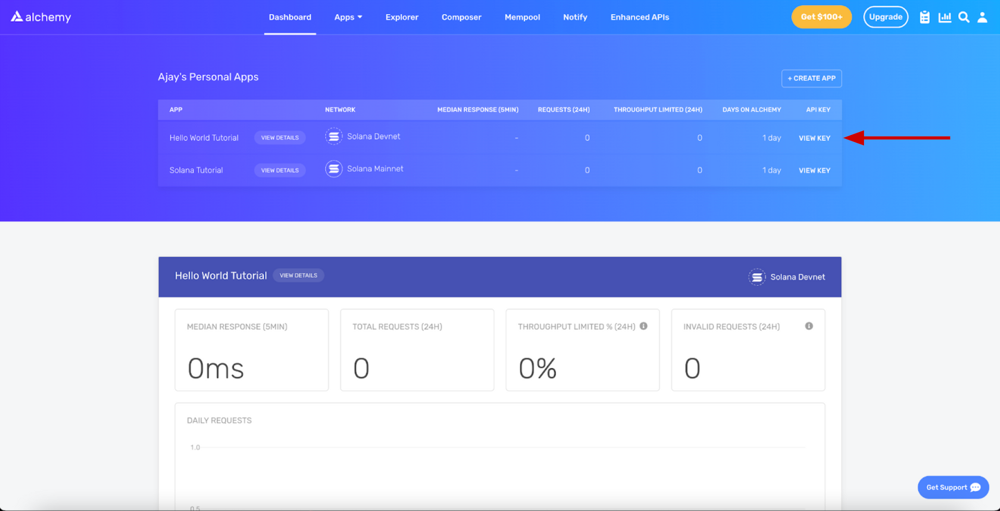
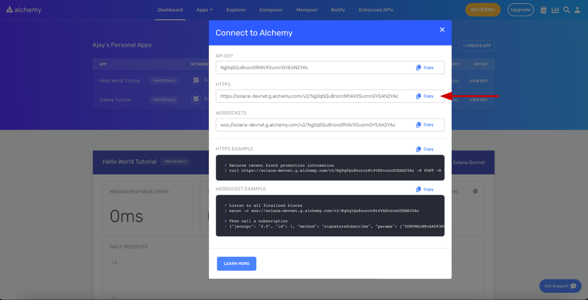
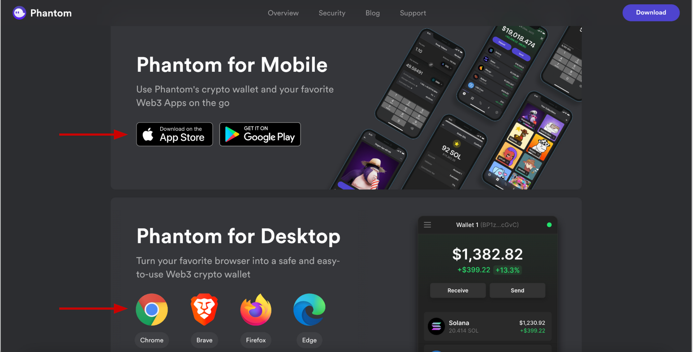
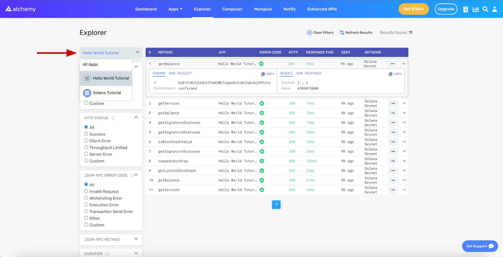

# 1. Introduction

Welcome! This tutorial walks through setting up everything you need for Solana development. It’s a key first step to then using any of our Solana tutorials like the [Hello World tutorial](/docs/hello-world-solana-program). By the end, you’ll have installed a [Phantom](https://phantom.app/) Wallet on your browser, registered an API Key with [Alchemy](https://alchemy.com/?a=7daee4eeeb) to connect to the Solana blockchain, and setup a [Solana](https://solana.com/) environment to run [Rust](https://www.rust-lang.org/), [Javascript](https://nodejs.org/en/), and the [Anchor](https://www.anchor-lang.com/) framework! If that doesn’t make sense to you yet, don’t worry! We’ll explain everything 😄!

If you have questions at any point feel free to reach out in the [Alchemy Discord](https://discord.com/invite/gWuC7zB) or post questions in our [Discussion Forum](/discuss)!

# 2. Create Your Alchemy API Key

There are many ways to connect to the Solana Blockchain. Thousands of developers share the public RPC endpoint for their development. Sure, you could use that for any of our tutorials. However, Once your web3 app has users reading and writing data on Solana, you’re going to want your own personal connection that’s reliable, data-consistent, and fast. Alchemy is the only developer platform built for that scale, and connecting to Solana with Alchemy is easy through an Alchemy API Key!

To get an Alchemy API Key, go to [your Alchemy dashboard](https://dashboard.alchemy.com/?a=7daee4eeeb) and signup for an account. Then on your dashboard, click on the “Create App” button to open up a pop-up modal. Name your app “Solana Hello World”, and a short description, and make sure you select “Solana” as your chain and “Solana Devnet” as for your network.

 

<Info>
  The Solana blockchain maintains three public networks - Mainnet, Devnet, and Testnet. The Solana Devnet allows you test programs (also known as smart contracts) on a test network that mimics Solana’s Mainnet. We’ll be using it to deploy and test the various programs we write together! You can read more about it [here](https://www.alchemy.com/overviews/solana-devnet) and [here](https://docs.solana.com/clusters#devnet).
</Info>

Awesome! Now click on the “View Key” button for the app you just created. It’ll open a pop-up modal with some copyable snippets.

 

You’ll notice that the “HTTPS” URL will contain your “API KEY.” This is what is known as an RPC URL - it’s your personal connection through Alchemy to the Solana blockchain. If you click the “copy” button, it’ll copy it to your clipboard to paste anywhere. Remember how to get here because we’ll be using this RPC URL to configure your Solana environment in Step 4!

# 3. Install Your Phantom Wallet

On most of the web3 dapps we build together, we’ll want people to be able to view, track, buy, send, receive, or swap tokens and NFTs, and they’ll do so by connecting a crypto wallet. In the Solana ecosystem, the premier wallet is Phantom! You can download it [here](https://phantom.app/) as an extension for your browser, or as an app for you mobile device.



Go through the [setup](https://help.phantom.app/hc/en-us/articles/8071074929043-How-to-create-a-new-wallet) steps to create a password, store your secret recovery phrase in a password manager like [1Password](https://1password.com/), and then configure settings! We’ll be using Phantom as part of our development lifecycle, connecting to and imitating what people might do when they interact with your web3 app. Just have it ready for these tutorials! Of course, you should also use your Phantom Wallet to interact with other Solana web3 apps in the ecosystem!

# 4. Set Up Your Solana Developer Environment

## Rust

Rust is the language you’ll need to use to write and build programs. Don’t worry if you’ve never developed with Rust before - our Solana tutorials will teach you everything you need to know! To [install](https://www.rust-lang.org/tools/install) Rust, all you need to do is run this line in your terminal!

<CodeGroup>
  ```shell shell
  curl --proto '=https' --tlsv1.2 -sSf https://sh.rustup.rs | sh
  ```
</CodeGroup>

Next, confirm that this installation has added the following line to your shell configuration by opening you `~/.zshrc` or `~/.bashrc` file. You can view this by running `vim ~/.zshrc` from the command line. If it's not there, then add the following at the bottom and then restart your terminal.

<CodeGroup>
  ```shell shell
  export PATH="$HOME/.cargo/bin:$PATH"
  ```
</CodeGroup>

If you can run these commands without any errors from your terminal, you successfully downloaded Rust:

<CodeGroup>
  ```shell shell
  rustup --version
  rustc --version
  cargo --version
  ```
</CodeGroup>

## JavaScript

Javascript is the language you’ll need to write your web3 app. It’s also the language you can use to test your programs. Most likely, your computer will already have Node.js and NPM installed as a Javascript environment you can use to run those tests. If not, you can download it [here](https://nodejs.org/en/download/).

Then, through your terminal, you’ll also want to install [mocha](https://mochajs.org/), which is a testing framework, and yarn, which is a package [manager](https://yarnpkg.com/) for other third-party libraries to help with your Solana development:

<CodeGroup>
  ```shell shell
  npm install --global mocha
  npm install --global yarn
  ```
</CodeGroup>

If you can run these commands without any errors from your terminal, you successfully set up your Javascript environment for Solana:

<CodeGroup>
  ```shell shell
  node --version
  mocha --version
  yarn --version
  ```
</CodeGroup>

## Solana

Solana provides a CLI (command line interface) to make your development experience easier. To install [Solana](https://docs.solana.com/cli/install-solana-cli-tools), all you need to do is run this line in your terminal!

<CodeGroup>
  ```shell shell
  sh -c "$(curl -sSfL https://release.solana.com/stable/install)"
  ```
</CodeGroup>

Installing Solana will also add a new PATH to your shell configurations. Depending on your system, it might ask you to manually update your PATH by providing you with a line to copy/paste. Remember, you can view that line by running `vim ~/.zshrc` from the command line. Alternatively, you can add the following line at the bottom of your `~/.zshrc` file.

<CodeGroup>
  ```text text
  export PATH="$HOME/.local/share/solana/install/active_release/bin:$PATH"
  ```
</CodeGroup>

You can verify you successfully downloaded the Solana CLI if you can run these commands without any errors from your terminal:

<CodeGroup>
  ```shell shell
  solana --version
  ```
</CodeGroup>

You’ll also want to set the CLI configuration. Remember that Alchemy RPC URL from Step 2? Copy it and use it here to setup your developer environment to connect to the Solana devnet through Alchemy!

<CodeGroup>
  ```shell shell
  solana config set --url https://solana-devnet.g.alchemy.com/v2/<YOUR-API-KEY>
  ```
</CodeGroup>

In the response you’ll see that your config will now be using your Alchemy RPC URL for further calls that connect to the Solana devnet! Congrats 🎉! We’ll be using this environment for our program development on Solana.

Next, you’re going to check if you have a Solana address. On Solana, your identity is represented as a public key and private key. It’s the same concept behind what’s used in your Phantom Wallet. We’ll be using this key pair to deploy our program to the devnet!

Run this command to see you public key, otherwise known as your address:

<CodeGroup>
  ```shell shell
  solana address
  ```
</CodeGroup>

If it returns an error, you’ll need to create an key pair using this command:

<CodeGroup>
  ```shell shell
  solana-keygen new
  ```
</CodeGroup>

At the end, you’ll be given a long recovery phrase. Save it in a password manager like [1Password](https://1password.com/)! You can always recover your key pair by running `solana-keygen recover <YOUR-RECOVERY-PHRASE>`.

Awesome! Now, let’s airdrop you some devnet SOL. The Solana CLI comes with access to a faucet for the devnet, and we’ll be using these devnet tokens to deploy, test, and debug our Solana programs. Run these commands:

<CodeGroup>
  ```shell shell
  solana airdrop 2
  solana balance
  ```
</CodeGroup>

You’ll see that your Solana address now owns 2 devnet SOL! Something to note, since devnet SOL is only used for development, it's not worth anything 😂! But hey, technically you're rich 🤑!

Something pretty cool is that, in your Alchemy dashboard, you can actually see all the underlying Solana RPC methods that were used in those terminal commands. If you go to [https://dashboard.alchemy.com/explorer](https://dashboard.alchemy.com/explorer) and select your App as shown below:



You’ll see we used `getBalance`, `getVersion`, `getSignatureStatuses`, `isBlockHashValid`, and `requestAirdrop`. If you don’t what this means, don’t worry! We’ll understand these more in the tutorials. For now, as long as it’s installed, you’re golden 😎!

## Anchor

Anchor is a framework to compile, deploy, test, and debug Solana software. If you’ve ever used Hardhat in the EVM space, it’s a very similar experience - namely, it’s awesome and makes development wayyy easier! To [install](https://www.anchor-lang.com/docs/installation) Anchor, run this command from your terminal:

<CodeGroup>
  ```shell shell
  cargo install --git https://github.com/coral-xyz/anchor anchor-cli --locked
  ```
</CodeGroup>

You can verify you successfully downloaded the Solana CLI if you can run these commands without any errors from your terminal:

<CodeGroup>
  ```shell shell
  anchor --version
  ```
</CodeGroup>

In our tutorials, We’ll play a lot more with Anchor to initialize, build, test, deploy your Solana programs. For now, this is perfect!

# 5. You’re Ready to Build!

That’s it! You’ve successfully set up your Solana development environment. We know setup can be tricky especially when the technology is moving quickly. If you have any issues, feel free to post to the [Alchemy Discussion Forum](/discuss) or reach out in the [Alchemy Discord](https://discord.com/invite/gWuC7zB).

The next best step for you now is to try our [Hello World Solana Program](/docs/hello-world-solana-program) tutorial and start developing on Solana. Or, you can check out any of our other Solana Tutorials on the Alchemy Docs. LFG 🔥!
