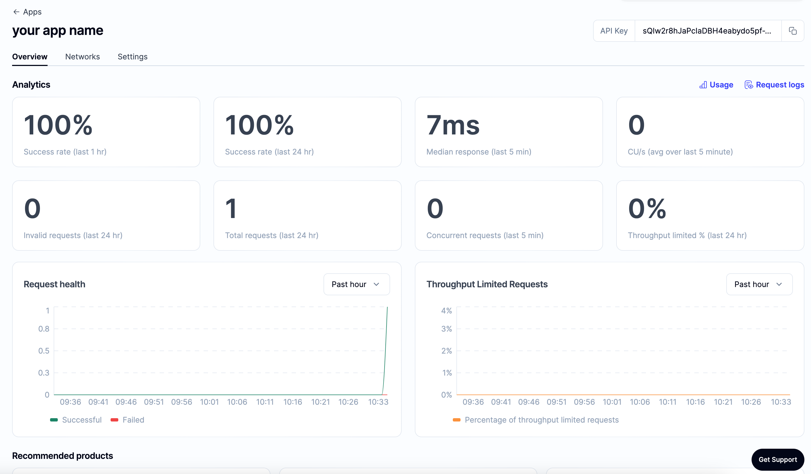

👋 *New to Alchemy? Get access to Alchemy for free* ***[here](https://alchemy.com/?r=e68b2f77-7fc7-4ef7-8e9c-cdfea869b9b5)***.

# Set Up Alchemy as Your Client

Want to integrate Alchemy into your production app?

Find out how to set up or switch your current provider to Alchemy by using the Alchemy SDK, the easiest and most powerful way to access Alchemy's suite of Enhanced APIs and tools.

<Warning>
  **If you have an existing client,** change your current node provider URL to an Alchemy URL with your API key: "[https://eth-mainnet.g.alchemy.com/v2/your-api-key](https://eth-mainnet.g.alchemy.com/v2/your-api-key)"

  **Note:** The scripts below need to be run in a **node context** or **saved in a file**, not run from the command line.
</Warning>

### The Alchemy SDK

There are tons of Web3 libraries you can integrate with Alchemy. However, we recommend using the [Alchemy SDK](https://github.com/alchemyplatform/alchemy-sdk-js), a drop-in replacement for Ethers.js, built and configured to work seamlessly with Alchemy. This provides multiple advantages such as automatic retries and robust WebSocket support.

### 1. From your [command line](https://www.computerhope.com/jargon/c/commandi.htm), create a new project directory and install the Alchemy SDK.

To install the Alchemy SDK, you want to create a project, and then navigate to your project directory to run the installation. Let's go ahead and do that! Once we're in our home directory, let's execute the following:

With Yarn:

<CodeGroup>
  ```shell Yarn
  mkdir your-project-name
  cd your-project-name
  yarn init # (or yarn init --yes)
  yarn add alchemy-sdk
  ```
</CodeGroup>

With NPM:

<CodeGroup>
  ```shell NPM
  mkdir your-project-name
  cd your-project-name
  npm init   # (or npm init --yes)
  npm install alchemy-sdk
  ```
</CodeGroup>

### 2. Create a file named `index.js` and add the following contents:

<Info>
  You should ultimately replace `demo` with your Alchemy HTTP API key.
</Info>

<CodeGroup>
  ```javascript index.js
  // Setup: npm install alchemy-sdk
  const { Network, Alchemy } = require("alchemy-sdk");

  // Optional Config object, but defaults to demo api-key and eth-mainnet.
  const settings = {
    apiKey: "demo", // Replace with your Alchemy API Key.
    network: Network.ETH_MAINNET, // Replace with your network.
  };

  const alchemy = new Alchemy(settings);

  async function main() {
    const latestBlock = await alchemy.core.getBlockNumber();
    console.log("The latest block number is", latestBlock);
  }

  main();
  ```
</CodeGroup>

Unfamiliar with the async stuff? Check out this [Medium post](https://betterprogramming.pub/understanding-async-await-in-javascript-1d81bb079b2c).

### 3. Run it using node

<CodeGroup>
  ```shell shell
  node index.js
  ```
</CodeGroup>

### 4. You should now see the latest block number output in your console!

<CodeGroup>
  ```shell shell
  The latest block number is 11043912
  ```
</CodeGroup>

Woo! Congrats! You just wrote your first web3 script using Alchemy and sent your first request to your Alchemy API endpoint 🎉

The app associated with your API key should now look like this on the dashboard:


