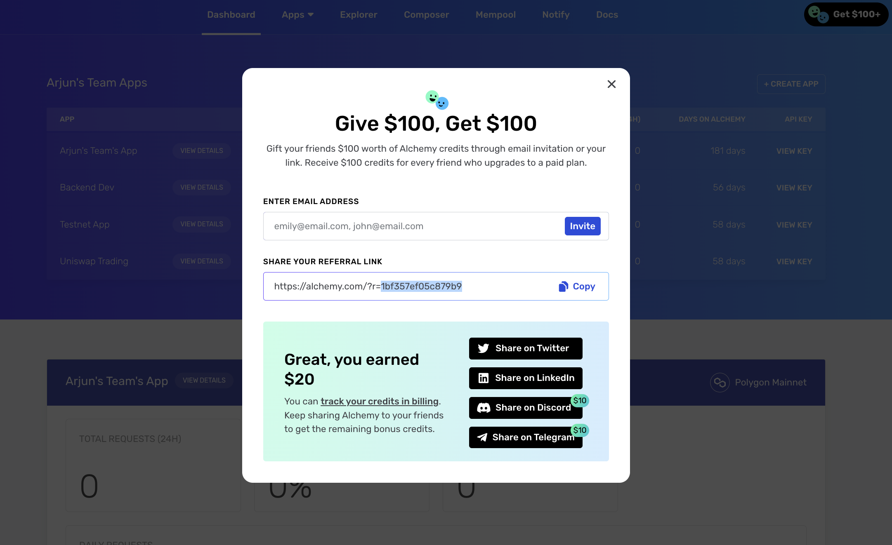
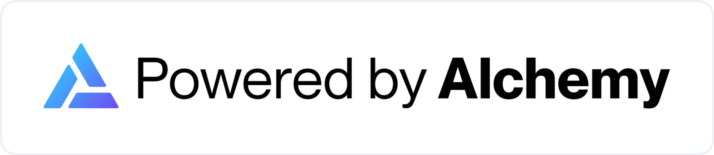
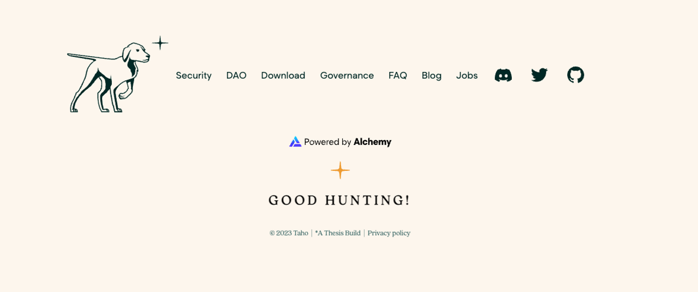
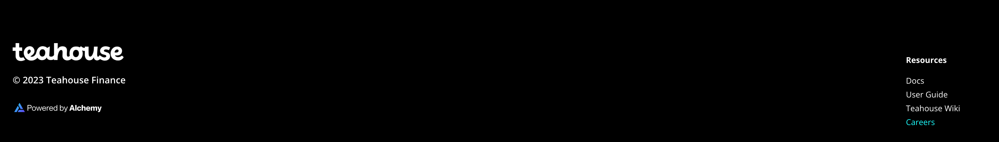
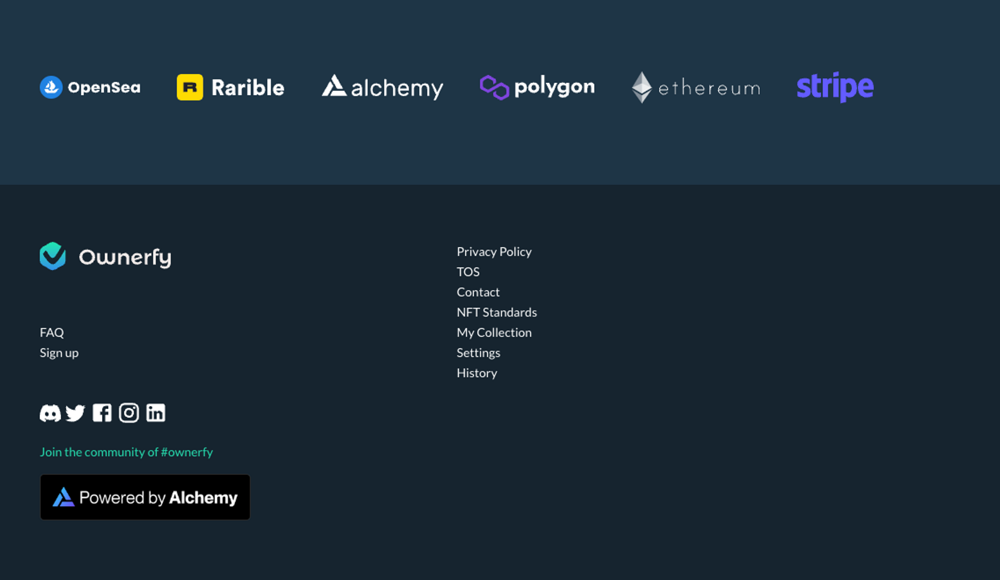

By adding the badge, you get perks like free Alchemy credits, increased throughput and more. Join companies like Tally, Earnifi, Ownerfy, and others in adding the badge! It takes ~3 minutes to add the badge to your site, steps below.

## Benefits of adding the Alchemy badge

1. **💵 50M CUs of free Alchemy credits monthly** - providing ongoing support for your project.

2. **⚡️ 50% more throughput** - 150 more [computing units per seconds](/reference/compute-units) (”CUPS”) to build faster

3. **📣 Legitimacy signal** - the purpose of this badge is that Alchemy certifies your project’s infrastructure and instills trust. At Alchemy’s discretion, we may include projects in marketing avenues like our newsletter or Twitter – this is on an ad-hoc basis

***

⬇️ **Instructions below — it only takes a few minutes ⬇️**

***

## Step 1 – Find the Unique Referral Token

You need to get the unique referral token of your team. Therefore, go to your team dashboard ([log into your Alchemy account](https://www.alchemy.com/)) and **click on the “Get $100+” button.**

Highlight just the unique referral token part (everything after “?r=”). You’ll enter that in the code snippet below in Step 3.

**👋 New to Alchemy? Get access to Alchemy for free [here](https://www.alchemy.com/).**



***

## Step 2 – Add the Badge Code to Your Website's Code

In the code below, replace the words ‘UNIQUE ALCHEMY TEAM REFERRAL TOKEN HERE’ with your unique referral token from Step 2. Please add the badge to your project's official website.

If your website is in React, copy the Alchemy JS into your code and then attach the "logBadgeClick()" function to the window and call it inside of your React code.

**Option 1: “Dark” Badge | Code**


<CodeGroup>
  ```jsx jsx
  <>
    <script>const BADGE_ID = 'UNIQUE ALCHEMY TEAM REFERRAL TOKEN HERE';</script>
    <script type="text/javascript" src="https://static.alchemyapi.io/scripts/badge/alchemy-badge.js"></script>
    <a href="#">
        
    </a>
  </>
  ```
</CodeGroup>

**Option 2: “Light” Badge | Code**

[https://static.alchemyapi.io/scripts/badge/alchemy-badge.js](https://static.alchemyapi.io/scripts/badge/alchemy-badge.js)



<CodeGroup>
  ```jsx jsx
  <script>const BADGE_ID = 'UNIQUE ALCHEMY TEAM REFERRAL TOKEN HERE';</script>
  <script type="text/javascript" src="https://static.alchemyapi.io/scripts/badge/alchemy-badge.js"></script>
  <a href="#">
      
  </a>
  ```
</CodeGroup>

***

## Step 3 – Email Us to Receive Perks

To make sure you get the perks (100M CUs monthly, 50% more throughput), please email us at [\[email protected\]](/cdn-cgi/l/email-protection#c8a9a5b8a4a1aeb188a9a4aba0ada5b1e6aba7a5) and let us know you've added the badge.

You can use the below email template:

\===

SUBJECT LINE: Added the Alchemy Badge

EMAIL COPY:

"Hey there,

I've added the Alchemy badge to my project's official website -- \[your project URL].

I use this email for my Alchemy account - \[your email].

Can you please confirm and add perks to my Alchemy account? Thanks"

\===

**🎉 Congrats! You’re done. You'll hear back soon (usually within two days) and get credits to your account.  🎉**

*Note: Alchemy reserves the right to reject projects we deem spammy.*

***

**🙋🏻‍♀️ PS - Other perks you’d like to see?**

Instruction improvements? Questions / hesitations about adding the badge?

We want to know! Please email us at [\[email protected\]](/cdn-cgi/l/email-protection#bfded2cfd3d6d9c6ffded3dcd7dad2c691dcd0d2)

***

## Examples of Projects with the Badge





