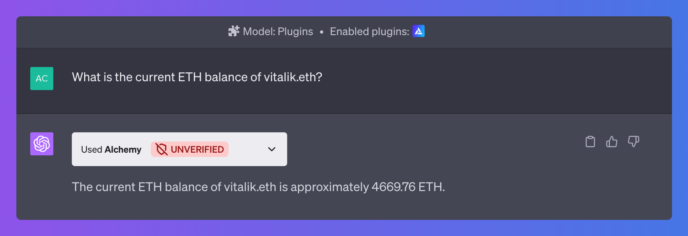
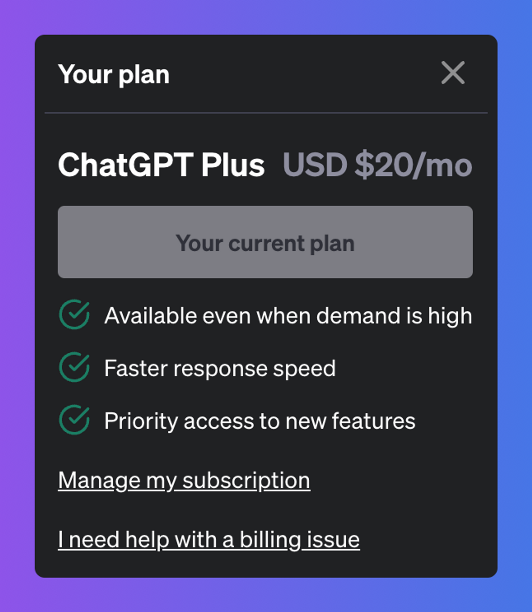
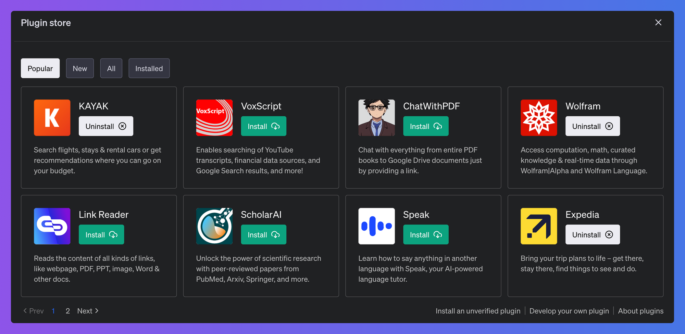

<Info>
  Join the waitlist to access Alchemy's ChatGPT Plugin
  [here](https://www.alchemy.com/alchemyai).
</Info>

# Introduction

Welcome to the User Guide for the Alchemy ChatGPT Plugin. This guide aims to provide you with a clear understanding of the Alchemy ChatGPT plugin, including instructions on how to access and use it, as well as an overview of its use cases and limitations.

***

# What is the Alchemy ChatGPT Plugin?

The Alchemy ChatGPT Plugin is a tool to get blockchain data through natural language. For example, you can ask it to get the current balance of `vitalik.eth` and it will show you the balance. It is currently supported on Ethereum, Polygon, Arbitrum and Optimism.

***

# How to access the Plugin?

<Info>
  The Alchemy ChatGPT plugin is currently in beta and invite-only. You can [sign up for the waitlist here](https://www.alchemy.com/alchemyai).

  The following instructions are applicable when the Alchemy plugin is in public access - stay tuned!
</Info>

Please note that [ChatGPT plugins](https://openai.com/blog/chatgpt-plugins) are only available to a sub-section of [ChatGPT Plus](https://openai.com/blog/chatgpt-plus) subscribers.

If you are a ChatGPT Plus subscriber but don’t have access to Plugins, you can sign up for the [Plugin waitlist](https://openai.com/waitlist/plugins). If you are not a ChatGPT Plus subscriber you can manage your subscription at [chat.openai.com](http://chat.openai.com).

The Alchemy plugin is currently invite only. You can [sign up for the waitlist](https://www.alchemy.com/alchemy-ai) to gain early access. Assuming you already have access to plugins, you can install the Alchemy plugin from the [Plugin Store](https://chat.openai.com/?model=gpt-4-plugins)

# What data is retrievable?

The plugin uses Alchemy's state of the art web3 APIs under the hood to get real-time blockchain data. Due to ChatGPT’s context limit, not all Alchemy APIs are currently being used. The information that you can get using this plugin includes:

* Account Balances
* NFT Ownership Data
* ETH / ERC20 / NFT Transfer Data
* Transaction Details
* NFT Metadata ( Floor Price, Image, Last sale price etc. )
* ERC20 Token balances
* ERC20 Token Metadata ( Token Image, Supply, decimals etc. )
* Block data of current and previously mined blocks
* Fee data according to current network conditions

## API Methods

The Alchemy plugin is trained on the following API methods:

* [getBalance](/reference/sdk-getbalance)
* [getBlock](/reference/sdk-getblock)
* [getAssetTransfers](/reference/sdk-getassettransfers)
* [getTransaction](/reference/sdk-gettransaction)
* [getTokenBalances](/reference/sdk-gettokenbalances)
* [getNftsForOwner](/reference/sdk-getnfts)
* [getMintedNfts](/reference/sdk-getmintednfts)
* [getContractMetadata](/reference/sdk-getcontractmetadata)
* [getTokenMetadata](/reference/sdk-gettokenmetadata)
* [getNftMetadata](/reference/sdk-getnftmetadata)
* [getNftSales](/reference/sdk-getnftsales)
* [getFeeData](/reference/sdk-getfeedata)
* [getTransactionCount](/reference/sdk-gettransactioncount)
* [getBlockNumber](/reference/sdk-getblocknumber)

## Test Prompts

Here are some of the prompts that you can use to try the Plugin right now:

* Show me all the NFTs minted by X address (or ENS domain).

* Can you show me that most recent nft sold?

  * what was the price of that nft?
  * what was the gast cost of minting that nft?

* Show me all the NFT / ERC20 / ETH transfers from X address to Y address.

* Get all the ERC20 tokens owned by X address.

* What's the current suggested fee for sending transactions?

* Show me all the NFTs owned by X address.

***

# What are the Plugin Limitations?

Due to ChatGPT’s plugin context limit, there are some limitations with the Plugin right now:

* **Response character limit:** Requests that result in a large number of transactions or data may cause the response to fail since ChatGPT has a character limit of 100k.

  * **Workaround**: specify a smaller block range to reduce response size.
  * *Example: instead of prompting, “Get all the ERC20 transfers by `vitalik.eth`” you can prompt “Get all the ERC20 transfers by `vitalik.eth` after block 16000000” ( This can also be a block range i.e. after X block and before Y block ).*

* **API suite:** Due to chatGPT's context limit, the plugin is only trained on a fixed set of API methods ([listed above](#API-Methods))

  * **Workaround**: as the plugin context limit increases we will continue to add more API methods. Please [fill out this form](https://alchemyapi.typeform.com/to/yHEll1rE) if you have specific methods you'd like to see supported in the future.
  * *Example: instead of prompting, “Get me all of the event logs in the latest block" (uses [eth\_getLogs](/reference/eth-getlogs)) you can prompt “Get me all of the transfer events in the latest block”*

* **Real-time off-chain data:** the plugin only supports real-time on-chain data that the supported APIs are able to provide.
  * *Example: "What is the current price of ETH in USD” is not a question that the plugin can handle. You'll need to use another resource to get this info.*

***

# Give us feedback!

If you have any feedback or feature requests regarding the Alchemy ChatGPT Plugin please [fill out this form](https://alchemyapi.typeform.com/to/yHEll1rE) 🙏
