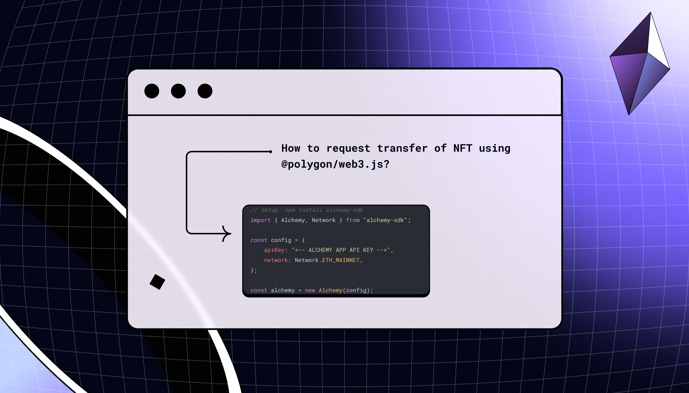
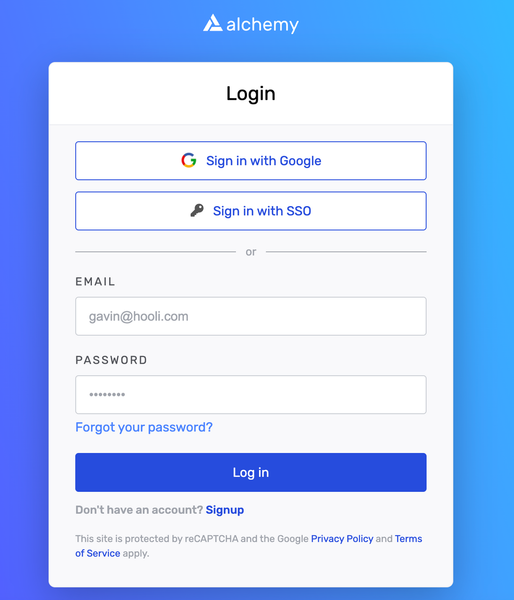
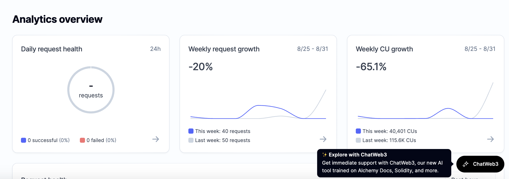

<Info />

# Introduction

This user guide will help anyone understand how to access and use ChatWeb3. This guide contains the information for the following questions:

1. What is ChatWeb3?
2. Who is ChatWeb3 meant for?
3. What is ChatWeb3 trained on?
4. What are the best practices for using ChatWeb3?
5. What are the limitations for ChatWeb3?
6. How can I access ChatWeb3?
7. How can I give feedback on ChatWeb3

<Info>
  Alchemy also has a ChatGPT Plugin to request real-time blockchain data using natural language. To learn more, check out the [Alchemy ChatGPT Plugin User Guide.](/docs/alchemy-chatgpt-plugin)
</Info>

***

# What is ChatWeb3?

Developer’s workflows are cumbersome; they include having to consume and synthesize information constantly, read product specs, sift through countless docs on different services and tools, review PRs, learn the latest frameworks, and more, all while having to constantly ship reliable code.

ChatGPT and Github Co-Pilot have helped developers decrease the amount of time it takes to synthesize, read, and even code. However, for web3 developers, these tools are not up to date with the fast-paced changes in Web3, making it less effective for problem-solving and building on the blockchain.

### Introducing ChatWeb3:

ChatWeb3 is an AI chat tool, accessible in the Alchemy dashboard, designed to revolutionize the way developers build web3 projects. ChatWeb3 is the ultimate assistant that provides specific and relevant answers to all your web3 development queries, right at your fingertips. Some example questions you can ask it include:

> 1. What are the best Alchemy APIs I should use for building a crypto wallet?
> 2. How can I save gas costs on contract deployments?
> 3. Write me sample code to build an NFT minter.

***

# Who is ChatWeb3 meant for?

ChatWeb3 is explicitly meant for developers building blockchain applications on chains that Alchemy currently supports. Whether you’re just entering the web3 space as a new engineer, or actively deploying complex smart contracts, ChatWeb3 is here to help accelerate your workflows.

***

# What is ChatWeb3 trained on?

ChatWeb3 is trained on thousands of pages of trusted and battle-tested web3 developer documentation. As we expand out to new use cases, we will continue training ChatWeb3 on more web3 documentation, if you have a specific resource you’d like to see in the training set, please let us know by [filling out this form](https://alchemyapi.typeform.com/to/fiwDYr6S)!

***

# ChatWeb3 Best Practices

There are a few different categories that ChatWeb3 can work well with in terms of Web3 development: error codes, best practices for Solidity development, smart contract development, code optimizations, creating sample code snippets, and more.

### Here are best practices to yield a quality response in ChatWeb3

* Provide code snippets for debugging & code completion assistance, but avoid blindly copy-pasting code without understanding the implications of the code’s output.
* Keep prompts short and precise that focus on specific tasks.
* Utilize styling options using keywords like “markdown” or “solidity code” in your prompts.
* Leverage other sources where relevant such as tutorials, other docs, etc, which could help validate the information received.
* Utilize ChatWeb3 for boilerplate code, test cases for code, smart contracts, and optimizations.

### Here are popular categories & sample questions

1. **Contract Interactions & Queries**: Seeking guidance on how to interact with specific contract functions, access data, or handle specific use cases within their contracts.

   * Do you know if `hardhat.ethers.signer` has a `getBalance` function?
   * I want to use `view createWalletClient` to call a contract read with rainbowkits. How to make it?

2. **Ethereum Transaction Simulation**: Questions about tools or methods to simulate Ethereum transactions.

   * How can I save gas costs on contract deployments? On transactions?
   * How can I configure Hardhat networks to connect to different Ethereum networks, such as the mainnet, testnets, or private networks?
   * Is there a tool to simulate ethereum transactions?

3. **Alchemy API & Cryptocurrency**: Alchemy and crypto-related questions.

   * How do I get started with NestJS and the Alchemy SDK?
   * What are the best Alchemy APIs I should use for building a crypto wallet?

4. **Solidity Development**: Solidity coding, implementation details, and updates

   * How do I compile a solidity contract using Hardhat?
   * What's the best way to remove a number of elements from an array in solidity?
   * How can I integrate off-chain data in oracles into my Solidity smart contracts? Show me how.

5. **ERC-20 Token Creation**: Creating and deploying ERC-20 tokens.
   * How to create and deploy an ERC-20 token?

6. **Contract Writing & Design**: Designing specific contracts, adding functionalities, or understanding contract structures.
   * Write me a smart contract that allows me to airdrop to 1000 addresses.

7. **NFT Code Requests**: NFT is here, but maybe just pulling from popular question database.
   * Write me sample code to build an NFT minter.

***

# Limitations

* ChatWeb3 can only infer on the docs it's been trained on, so it won’t answer questions that are not related to Web3 development.

* ChatWeb3 does not have access to real-time blockchain data, to make on-chain requests using natural language. Check out the [Alchemy ChatGPT Plugin ](/docs/alchemy-chatgpt-plugin)to get real-time on-chain data.

* ChatWeb3 can provide contextual information for the following chains (including mainnet and testnet):

  * Ethereum
  * Arbitrum
  * Optimisim
  * Starknet
  * Polygon PoS
  * Polygon zkEVM
  * Solana
  * Astar

***

# Getting Access to ChatWeb3

To access ChatWeb3, follow the instructions below:

### **1. Access ChatWeb3 here [https://tinyurl.com/alchemy-ai](https://tinyurl.com/alchemy-ai)**

### **2. Login into Alchemy or create an Alchemy account.**

### **3. You can access ChatWeb3 with a floating button on the right-hand side named “ChatWeb3”**

### **4. Ask any web3 development-related question**.

### **5. All your chats will be saved in “Chat History”, so you can refer back to your previous queries.**

***

# How can I give feedback?

If you have any feedback or feature requests for ChatWeb3, please [fill out the form here.](https://alchemyapi.typeform.com/to/fiwDYr6S)
