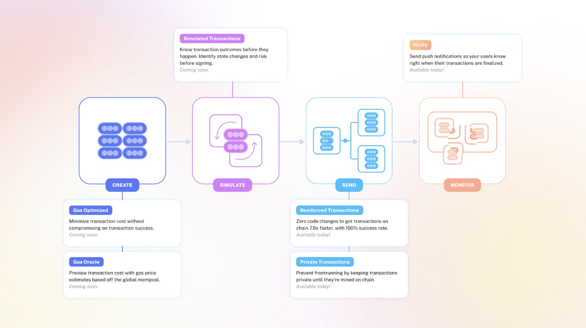

#### Get access to [**Alchemy for free here**](https://auth.alchemy.com/signup?redirectUrl=https%3A%2F%2Fdashboard.alchemy.com%2Fsignup%2F%3Freferrer_origin%3DDIRECT%26ref%3Daffiliate%3Abf20d53b27)

#### **Looking to use Alchemy Transact? Check out our [Transact API QuickStart](/reference/transact-api-quickstart) documentation**

***

## ✅ Benefits

### 1. Faster transactions

Get transactions mined 7.9x faster than normal.

### 2. More reliable

Send transactions at a 100% success rate, 46% more successful than standard methods.

### 3. Safer

Avoid arbitrage and front-running on your transactions by sending them privately.

***

## 😫 Problem: Transactions are Unpredictable

* Transactions can get dropped for seemingly no reason, costing you money and time
* Transactions can be extremely slow from the time you send them to the time they get mined
* Public transactions can fall victim to frontrunning and arbitrage
* Users have to manually refresh their apps to know the status of their transactions

## 😃 Solution: Alchemy Transact

Alchemy Transact replaces opaque complexity with actionable clarity in the transaction life-cycle.

### How it works

Transactions occur in 4 primary steps: **1. Create** You decide to send a transaction at a specific gas price **2. Simulate** You preview how your transaction will behave once it’s sent **3. Send** You send your transaction to get executed on chain **4. Monitor** You follow along to ensure your transaction is successful

**At each step, Alchemy Transact can help optimize the transaction to increase its chances of going through quickly, reliably, safely and affordably:**

***

## Features

## 1. Private Transactions

The [Private Transactions](/reference/eth-sendprivatetransaction) endpoints are a way to send and cancel transactions without exposing them to the public mempool, preventing unwanted arbitrage and front running.

## 2. Notify

[Alchemy Notify](/docs/alchemy-notify) offers a key benefit within the transaction lifecycle, giving you real-time alerts when transactions are mined or dropped from the mempool. This allows you to notify your users when transactions are final instead, so they don’t have to refresh the screen to see if the transaction was confirmed.

# Features that are coming soon:

Alchemy Transact is just getting started and there’s a lot on the roadmap. [Sign up to get on the waitlist](https://alchemyapi.typeform.com/to/EhW0nBC1) for what’s next.

## 3. Gas Optimized Transactions

Gas Optimized functionality will provide better gas price estimates than a single node. Minimize transaction cost without compromising on transaction success.

## 4. Simulated Transactions

Know exactly what on-chain actions will take place to protect users from scam contracts.

## 5. Gas Oracle

Preview transaction cost with gas price estimates based off the global mempool.

***

## Ready to use Alchemy Transact?

Check out our [Transact API QuickStart](/reference/transact-api-quickstart) guide!
