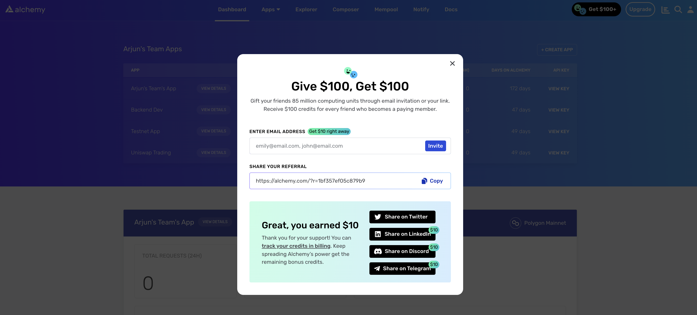
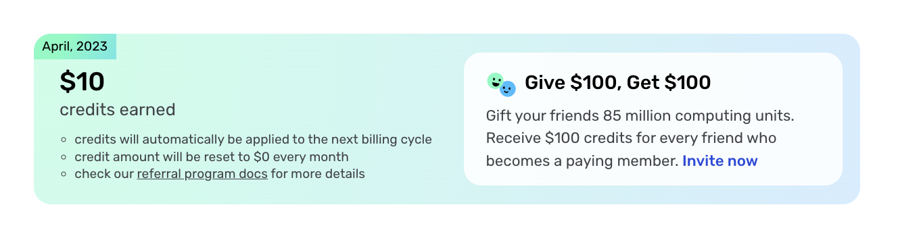

The Alchemy referral program allows you to earn rewards for sharing Alchemy with new users! Find out how to participate below (benefits subject to change).

### Referral Link

Every Alchemy user receives a unique referral link that they can share to earn rewards!

**Benefits:**

💰You and the person you refer will receive **$100 in Alchemy credits** if they sign up or upgrade (at any time) to growth tier through your unique referral link. **This includes users who start free-tier and later upgrade to a paid tier at any point!**

<Info>
  Referral rewards are added in the form of **85 Million compute units** and are awarded the following month (for both the referrer and the referee) after the referee signs up or upgrades to the growth tier.
</Info>

**How to participate:**

All you have to do is share out your link with your network or email fellow developer friends. You can also earn up to $50 in credits instantly by sharing. Email, Tweet, post on your docs, discord, product, website, tinder, send to your high school crush, whatever you want!

You can invite a friend by clicking the button in the dashboard nav bar below:

You can also see how much you've earned from your referrals in your billing settings. Credits will be applied to the next billing month and reset every month, so keep on referring to get more credits!

Happy Referring 🎉
