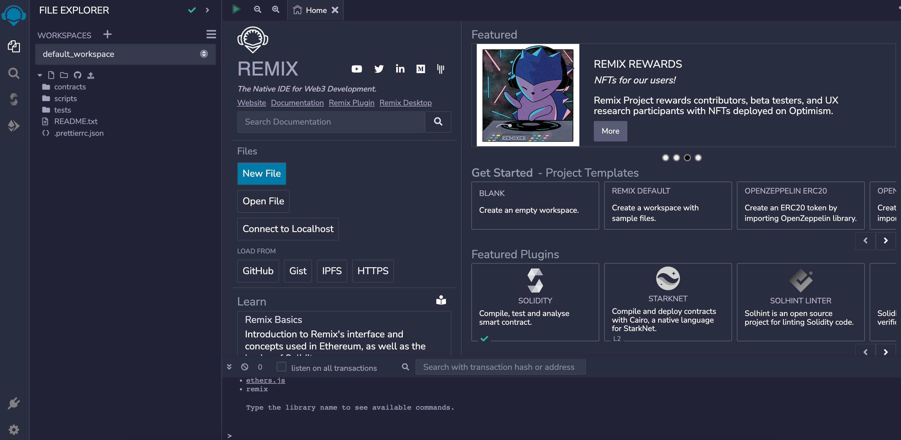
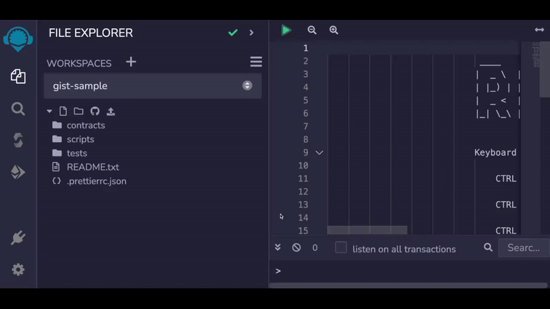
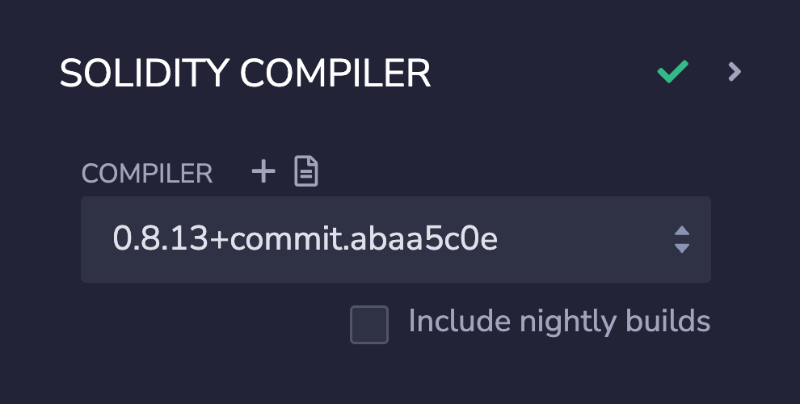
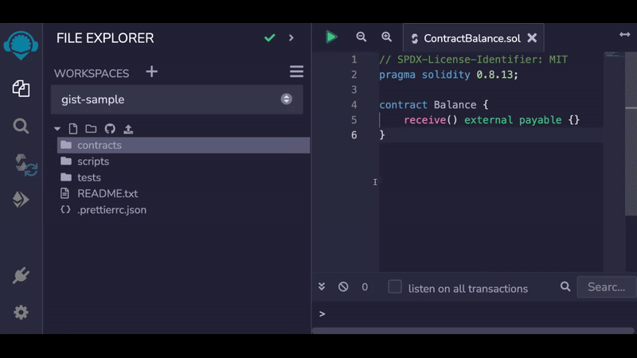
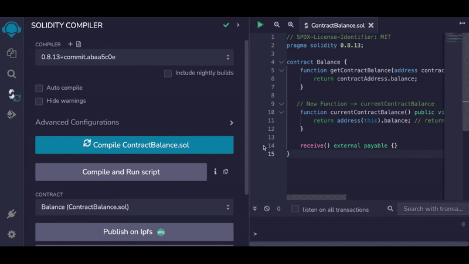
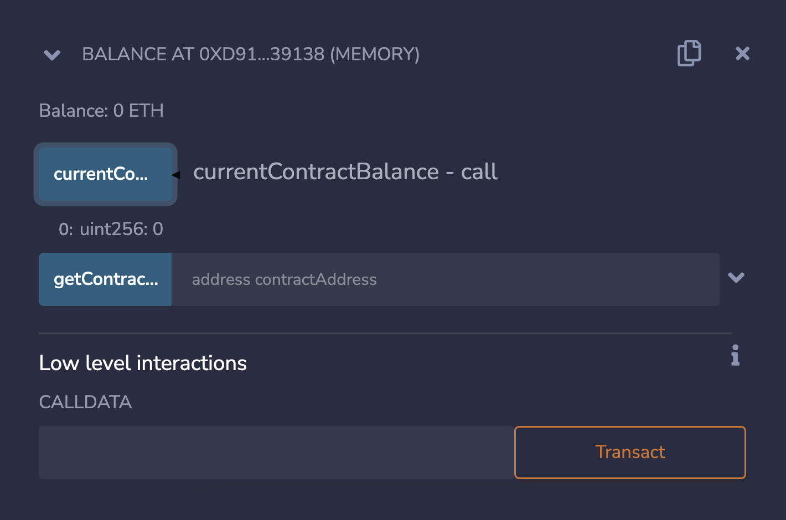
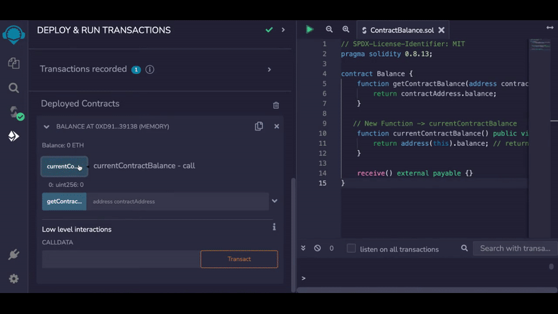
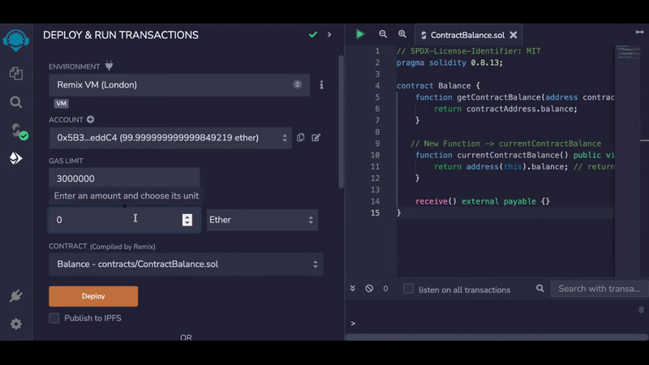
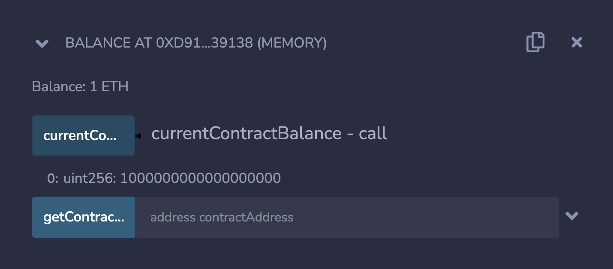
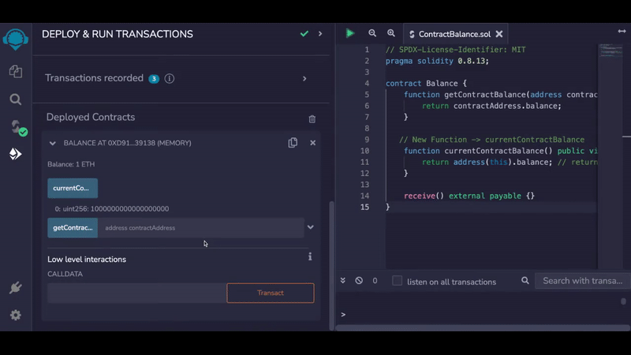

# Introduction

In this tutorial, we will learn how to get the balance of a smart contract in Solidity. The balance of a smart contract refers to the amount of Ether (ETH) stored in the contract's address on the blockchain. This information can be useful in a variety of situations, such as:

* Checking the balance of a crowdfunding contract to see how much has been raised so far.
* Checking the balance of a contract that is being used as an escrow account to release the fund when certain conditions are met.
* Keeping track of a contract's balance over time to see if it has been hacked or used in an unexpected way.

We will start by explaining what the `this` keyword is, and how it can be used to get the address of the contract itself. Then, we will show you how to use the `balance` property to obtain the balance of a contract.

***

# Prerequisites

Before starting this tutorial, you should have a basic understanding of Solidity and the Ethereum Virtual Machine (EVM). If you are new to web3 development and don't have the prerequisite knowledge, you can learn through [Alchemy University](/docs/alchemy-university), a comprehensive program that teaches web3 development from scratch. This will provide you with the foundational knowledge needed to follow along with this tutorial.

***

# The `this` keyword and the `balance` property

To get the balance of a smart contract, you first need to obtain the contract address. You can do this using the `this` keyword, which refers to the contract itself:

<CodeGroup>
  ```sol Getting address of the contract itself
  address contractAddress = address(this);
  ```
</CodeGroup>

The `address(this)` is used to obtain the address of the current smart contract that the code is being executed on. The `this` keyword refers to the current smart contract and `address` is a type that represents an Ethereum address, by using `address(this)` we are casting the object `this` to a variable of type `address`.

This address is then stored in the variable `contractAddress` which is being used to access the balance property in order to get the contract balance.

<CodeGroup>
  ```sol The balance property
  uint contractBalance = contractAddress.balance;
  ```
</CodeGroup>

Alternatively, you can use a single line of code to get the contract's balance:

<CodeGroup>
  ```sol Getting the balance of the contract itself
  uint contractBalance = address(this).balance;
  ```
</CodeGroup>

If you want to obtain the balance of a different contract, you can just replace the contract address of the current contract with any other contract's address.

<CodeGroup>
  ```sol Getting the balance of a different smart contract
  address differentContract = 0xD7ACd2a9FD159E69Bb102A1ca21C9a3e3A5F771B;

  uint differentContractBalance = differentContract.balance;
  ```
</CodeGroup>

The balance property returns the balance of the contract address in Wei. Wei is the smallest unit of Ether, and there are 1,000,000,000,000,000,000 Wei in 1 Ether. Therefore, to convert the balance from Wei to Ether, you would divide it by 1,000,000,000,000,000,000.

That's it! With just one line of code, you can obtain the balance of a smart contract in Solidity. The rest of the tutorial dives deeper into examples of how to use this functionality, such as creating a function to get the balance of a specific contract.

# Objective

To demonstrate the use of `balance` property and `this` keyword, let's create a simple smart contract called `Balance` that contains two functions:

1. `getContractBalance`: Function that takes in a contract's address and returns its balance.
2. `currentContractBalance`: Function that returns the balance of the contract itself.

***

# Setting up the Development Environment

Before we can start coding, we need to set up a development environment where we can write and test our code. For this tutorial, we will be using [Remix](https://remix.ethereum.org/).

1. Head over to [remix.ethereum.org](https://remix.ethereum.org/). You will be greeted with this screen:



***

2. Under the "contracts" directory, create a new Solidity file named `ContractBalance.sol`.



***

3. Paste the code below in the new file that we just created (`ContractBalance.sol`).

<CodeGroup>
  ```sol ContractBalance.sol
  // SPDX-License-Identifier: MIT
  pragma solidity 0.8.13;

  contract Balance {
      receive() external payable {}
  }
  ```
</CodeGroup>

This is the starter code that we need. Here's the explanation for this code snippet:

* In the first line we are setting the license for our file to be MIT license. This means that the code we are going to write can be used by anyone.
* In the second line we set the solidity version that we want to use for this file. In this case, we are using Solidity version 0.8.13. The Ethereum Foundation regularly releases new versions of Solidity with bug fixes and improvements.
* Next, we define a new contract called `Balance` by using the `contract` keyword.
* In this contract we also define a `receive()` function. The receive function allows our contract to receive ETH. This is useful for us in this case because we will be sending some ETH to our contract and then check its updated balance.

***

4. Navigate to the "compiler" tab and make sure your compiler version is set to `0.8.13`.



***

5. Compile the code by clicking "Compile ContractBalance.sol" button. You are good to go if the code gets compiled successfully!



***

# Coding the `Balance` Contract

Let's start by defining the `getContractBalance` function. This function accepts a contract's address as an input and returns the balance of the contract on that address.

<CodeGroup>
  ```sol ContractBalance.sol
  // SPDX-License-Identifier: MIT
  pragma solidity 0.8.13;

  contract Balance {
    	// New Function -> getContractBalance
      function getContractBalance(address contractAddress) public view returns(uint){
          return contractAddress.balance; // returns the balance of the contract whose address is `contractAddress` using the `balance` property	
      }
    
      receive() external payable {}
  }
  ```
</CodeGroup>

Here's an explanation for the `getContractBalance` function that we just defined:

* The function is a `public` function, which means it can be called by other users and smart contracts.
* It is a `view` function, which means it does not change the state of the blockchain.
* It takes in an `address` as the input and returns a `uint`, which is the balance of the contract on that address. The returned balance will be in the `uint` form that means it will be returned in the units of `wei`.
* It uses the `balance` property to return the balance of the contract.

***

Now let's define the other function called `currentContractBalance`. This function does not require any inputs and simply returns the balance of the contract itself.

<CodeGroup>
  ```sol ContractBalance.sol
  // SPDX-License-Identifier: MIT
  pragma solidity 0.8.13;

  contract Balance {
      function getContractBalance(address contractAddress) public view returns(uint){
          return contractAddress.balance;
      }

     // New Function -> currentContractBalance
      function currentContractBalance() public view returns (uint) {
          return address(this).balance; // returns the balance of the contract itself using the `balance` and `this` keywords.
      }

      receive() external payable {}
  }
  ```
</CodeGroup>

Here's an explanation for the `currentContractBalance` function that we just defined:

* The function is a `public` function, which means it can be called by other users and smart contracts.
* It is a `view` function, which means it does not change the state of the blockchain.
* It does not accept any inputs and simply returns the balance of the contract itself using the `balance` property and the `this` keyword. The returned balance will be in the `uint` form that means it will be returned in the units of `wei`.

At this point, we are done writing the smart contract, now let's see this in action!

# Testing the contract

For testing the contract, we will deploy the `Balance` contract and call the `currentContractBalance` and `getContractBalance` functions to see if they return the values that we expect them to return.

* Compile the contract before deploying, then navigate to the "deploy" tab and click the "deploy" button to deploy the contract. You will see the deployed contract under the "Deployed Contracts" section.



<Info>
  Please note here we are deploying the contract on **Remix VM** and not on a testnet or the mainnet.

  Remix VM is a local blockchain created by Remix in your browser, it is great for testing purposes as you don't have to wait for the confirmation of your transactions because you are the only validator in the network.

  You also don't have to worry about getting the test ether from a faucet as you are given 15 test accounts, each containing 100 ether which resets every time the Remix VM is restarted.
</Info>

***

* Call the `currentContractBalance` function to check the current balance of the contract. The function will return 0 as expected.



***

* Now let's send some ETH to this contract and then check the balance again. Navigate to the "value" section, where you can specify the value you want to send to the contract and change the value units to "Ether".



***

* Enter "1" in the value input field and click on the "transact" button at the bottom of the deploy tab to send 1 ETH to the contract.



***

* Check the balance of the contract again by calling the `currentContractBalance` function. It will return 1000000000000000000, which is correct because this represents 1 Ether in the units of Wei.



***

* So, the `currentContractBalance` function is working properly, now let's deploy the `Balance` contract once again on another address and check the balance of the newly deployed contract using the existing `getContractBalance` function. We expect it to return 0 because the newly deployed contract will not contain any Ether.



***

* We copy the contract address of the newly deployed contract using the "copy" button and check its balance using the `getContractBalance` function of our previously deployed contract. It returns 0 as expected!

Congratulations! All the tests were successful 🎉

# Conclusion

In this tutorial, we learned how to get the balance of a smart contract in Solidity. We saw how to obtain the contract address using the `this` keyword, and how to use the `balance` property to obtain the contract balance. With these techniques, you should be able to get the balance of any smart contract in Solidity!
