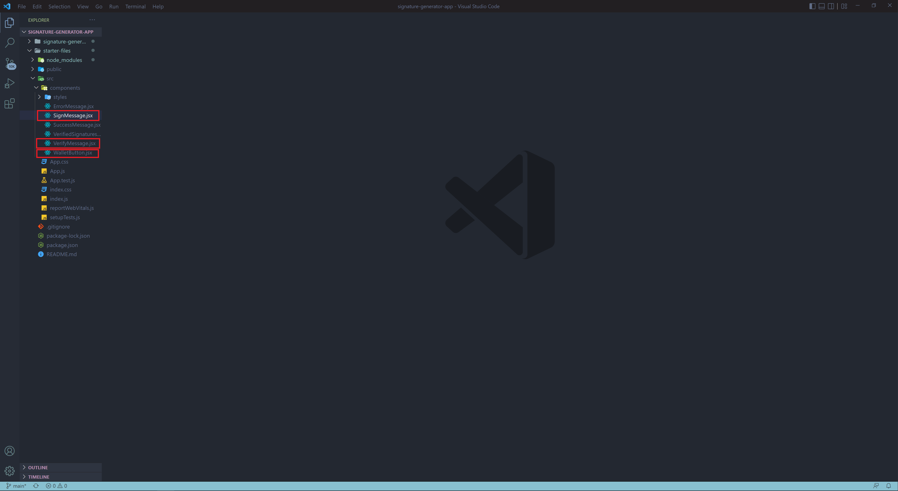
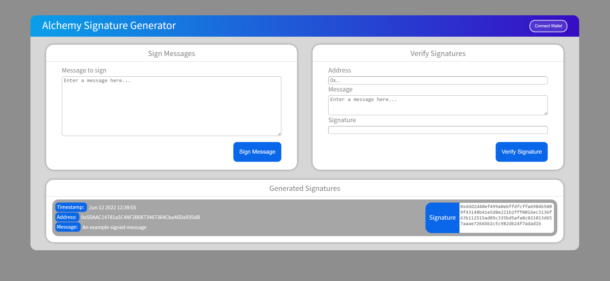
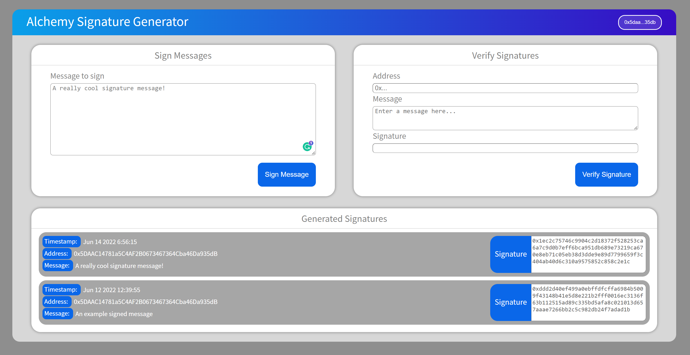
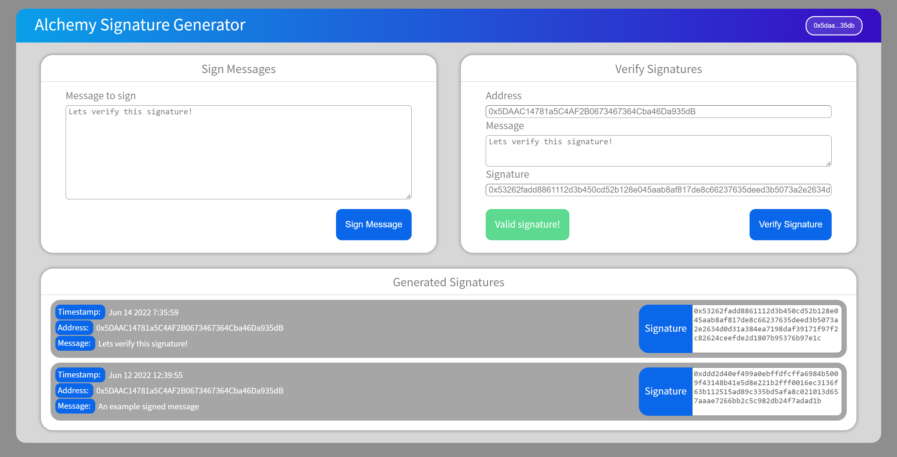

## Clone Starter Files

1. First, clone the [signature-generator-app](https://github.com/Chris-Moller/signature-generator-app) repository to get your starter files on your local machine. This repository provides all of the necessary styling and UI. (If you need assistance cloning a repository, checkout [GitHub's documentation](https://docs.github.com/en/repositories/creating-and-managing-repositories/cloning-a-repository).)
2. Open the `starter-files` in your preferred IDE and navigate to the `/src/components` folder. Here, you will find all of the React [components](https://reactjs.org/docs/components-and-props.html) that make up our app, as well as a `styles` folder with all of our styling sheets. Within the React components, the `WalletButton.jsx`, `SignMessage.jsx`, and `VerifySignature.jsx` have empty functions that we will build out in the reset of this tutorial. The rest of the components are fully functional so we won't worry about editing them in this tutorial.



Next, let's install all of the necessary modules and deploy a local development server before begin building our components.

In your terminal:

1. Navigate to your local repository with \`cd starter files.
2. Run `npm install` to install your dependencies.
3. Run `npm start` to deploy a local development server at `http://localhost:3000/`.

At your local server, you should see the front end of our Signature Generator app. It should contain:

* A **Sign Message** component.
* A **Verify Signature** component.
* A **Generated Signatures** component.
* A **Connect Wallet** button.



The **Generated Signatures** component is complete and displays a list of all the signatures we generate with a timestamp, address, and message field. At this point, we haven’t created any signatures so we’ve haven't included any example signatures.

You will notice that the other buttons don't work yet. Let's move on to the next steps to begin adding some functionality!

***

## Component 1: Connect Wallet Button

Navigate to the `/src/components` folder and open `WalletButton.jsx`. Inside, you should see five different functions with the commented text `Code goes here…` in the function body.

We are going to add functionality to each of these empty functions to get our **Connect Wallet** button working.

<Info>
  You will notice we are importing `useState` and `useEffect`. These are the React hooks we will use to manage the state of our button. For more information about React hooks and components, check out React's documentation: [Introducing Hooks](https://reactjs.org/docs/hooks-intro.html) and [Components and Props](https://reactjs.org/docs/components-and-props.html).
</Info>

Below is what your `WalletButton.jsx` component should look like:

<CodeGroup>
  ```jsx WalletButton.jsx
  import { useEffect, useState } from "react";
  import "./styles/WalletButton.css";

  const WalletButton = ({ setError }) => {
    const [walletAddress, setWallet] = useState("");

    const connectWallet = async () => {
  		// Code goes here...
    };
    
    const getConnectedWallet = async () => {
  		// Code goes here...
    };

    const walletConnectHandler = async () => {
  		// Code goes here...
    };

    const addWalletListener = () => {
  		// Code goes here...
    };

    const load = async () => {
  		// Code goes here...
    };

    return (
      <div>
        <button className="wallet-button" onClick={walletConnectHandler}>
          {walletAddress.length > 0 ? (
            String(walletAddress).substring(0, 6) +
            "..." +
            String(walletAddress).substring(38)
          ) : (
            <span>Connect Wallet</span>
          )}
        </button>
      </div>
    );
  };

  export default WalletButton;
  ```
</CodeGroup>

### `connectWallet`

The `connectWallet` function allows us to request a list of account addresses from MetaMask.

Copy the following into your `connectWallet` function body:

<CodeGroup>
  ```javascript WalletButton.jsx
  const connectWallet = async () => {
      if (window.ethereum) {
        // Checks if MetaMask is installed in the browser
        try {
          const addressArray = await window.ethereum.request({
            method: "eth_requestAccounts",
  	      // Requests an array of account addresses from the connect MetaMask wallet 
          });
          const obj = {
            address: addressArray[0],
  	      // Grabs the first address in the array
          };
          return obj;
        } catch (err) {
          throw err;
        }
      } else {
        throw new Error(
          "You must install MetaMask, a virtual Ethereum wallet, in your browser."
        // If MetaMask is not installed, the function will throw an error and tell the user they first need to install Metamask
        );
      }
    };
  ```
</CodeGroup>

The above code directs the `connectWallet` function to check whether MetaMask is installed and if so, returns the user’s account address. If MetaMask is not installed, the function will throw an error and let the user know they need to install MetaMask.

<Check>
  For more detailed descriptions of smaller pieces of code, check out the commented descriptions throughout the examples.
</Check>

### `getConnectedWallet`

If a user is already connected we still need a way to retrieve the currently connected addresses. This is what our `getConnectedWallet` function will do.

Copy the following into the `getConnectedWallet` function's body:

<CodeGroup>
  ```javascript WalletButton.jsx
  const getConnectedWallet = async () => {
      if (window.ethereum) {
        try {
          const addressArray = await window.ethereum.request({
            method: "eth_accounts",
  	// Requests an array of account addresses from the connected MetaMask wallet
          });
          if (addressArray.length > 0) {
            return {
              address: addressArray[0],
  	// First, we make sure atleast one address is avaiable and then return the first address in the array
            };
          } else {
            throw new Error("Connect to MetaMask using the connect wallet button.");
  	// If there are no addresses in the array, this means MetaMask is installed but the user has not connected their account yet.
          }
        } catch (err) {
          throw err;
        }
      } else {
        throw new Error(
          "You must install MetaMask, a virtual Ethereum wallet, in your browser."
        );
      }
    };
  ```
</CodeGroup>

Great! The above code retrieves all of the MetaMask account's addresses.

### `walletConnectHandler`

The `walletConnectHandler` function makes the **Connect Wallet** button respond to user clicks by calling the `connectWallet` function. Additionally, it sets the `walletAddress` state so our button renders the correct account address.

To achieve this, add the following code to our `walletConnectHandler` function:

<CodeGroup>
  ```javascript WalletButton.jsx
  const walletConnectHandler = async () => {
      try {
        const walletResponse = await connectWallet();
        // We create a variable to await the returned promise of our connectWallet function
        setWallet(walletResponse.address);
        // Now we set the walletAddress state with the response so we can render this change in our wallet button
        setError(null);
        // The SetError state is managed in App.js and is passed in as a prop to our wallet button
        // The state is set to null because we did not encounter an error while connecting to the wallet
      } catch (e) {
        setError(e.message);
        // Otherwise, we set the error state with the encountered error
      }
    };
  ```
</CodeGroup>

### `addWalletListener`

Awesome, our connect wallet button is almost functional! However, we still need a way to detect if the user decides to switch to a different account. If a user does switch accounts, we will need to update our `walletAddress` state.

To achieve this, let's build our `addWalletListener` function to update our button if the user changes accounts:

<CodeGroup>
  ```javascript WalletButton.jsx
  const addWalletListener = () => {
      if (window.ethereum) {
        window.ethereum.on("accountsChanged", (accounts) => {
  	// First, we listen for an account change event from Metamask
          if (accounts.length > 0) {
            setWallet(accounts[0]);
  	// Then, we set our walletAddress state to the new account address
            setError(null);
          } else {
            setWallet("");
          }
        });
      } else {
        throw Error(
          "You must install Metamask, a virtual Ethereum wallet, in your browser."
        );
      }
    };
  ```
</CodeGroup>

### `load`

Finally, we will create the `load` function to handle all of the code we want to run after React has updated the DOM. With this, we can run the load function in the `useEffect` hook and perform all of our needed [side effects](https://reactjs.org/docs/hooks-effect.html).

Copy the following into the `load` function's body:

<CodeGroup>
  ```javascript WalletButton.jsx
  const load = async () => {
      try {
        const address = await getConnectedWallet();
        setWallet(address);
        addWalletListener();
      } catch (e) {
        setError(e.message);
      }
    };
  ```
</CodeGroup>

Below our load function, we add the `useEffect` hook and call `load` inside, like this:

<CodeGroup>
  ```jsx WalletButton.jsx
  useEffect(() => {
      load();
    }, []);
  ```
</CodeGroup>

Nice going, you just created a functioning **Connect Wallet** button that connects to a MetaMask wallet! We can use this button to connect MetaMask to our signature generator. If you'd like, you can try out the button at your local development server.

***

## Component 2: Signing Messages

For our signer component, we want to make a user’s message and prompt them with a signature request from MetaMask. We will also add a timestamp to the signature to display in our generated signatures component. Finally, let's have this all happen when the user clicks on the sign message button.

To start, navigate to the `SignMessage.jsx` starter file. It should look like this, with commented-out functions:

<CodeGroup>
  ```jsx SignMessage.jsx
  import "./styles/SignMessage.css";
  const { ethers } = require("ethers");

  const SignMessage = (props) => {
    const messageToSign = async ({ message, setError }) => {
  	   // Code goes here...
    };

    const signMessageHandler = async (e) => {
    	   // Code goes here...
    };

    return (
      <div className="card1">
        <div className="banner-sign">
          <span>Sign Messages</span>
        </div>
        <form
  	//Add a pointer to our messageHandler function when a message is submitted
          className="sign-form"
          id="form-submit"
        >
          <div className="form-title-message">
            <span>Message to sign</span>
          </div>
          <textarea
            className="message-input"
            type="text"
            name="message"
            placeholder="Enter a message here..."
          ></textarea>
        </form>
        <div className="alert-div">
          <button
            className="sign-message-button"
            form="form-submit"
            type="submit"
          >
            <span>Sign Message</span>
          </button>
        </div>
      </div>
    );
  };

  export default SignMessage;
  ```
</CodeGroup>

### `messageToSign`

The `messageToSign` function takes a message from our user text input and our error state. Our objective is to make this function pass along the user’s message to MetaMask and await their signature. We also want to create our own timestamp and return an object that includes that timestamp, as well as the message, signature hash, and signer address. This object can later be passed to an array in our generated signatures component to be displayed dynamically there.

Let's walk through the above step-by-step in the function below. Copy the following into your `messageToSign` function's body:

<CodeGroup>
  ```javascript SignMessage.jsx
  const messageToSign = async ({ message, setError }) => {
      try {
        if (!window.ethereum)
          setError("Please connect your wallet before signing a message!");
        const provider = new ethers.providers.Web3Provider(window.ethereum);
  	// First, lets create an Ethers provider instance so we can interact with MetaMask
        const signer = provider.getSigner();
  	// Then, we retrieve our signer from MetaMask
        const signatureHash = await signer.signMessage(message);
  	// Generate a unique signature hash from the message we passed in from our form submission and the signer's MetaMask
        const address = await signer.getAddress();
  	// Also lets grab our signer's Address 
        return {
          message,
          signatureHash,
          address
        };
  	// Finally, we return an object with the message, signature hash, and address
      } catch (err) {
        console.log(err.message);
      }
    };
  ```
</CodeGroup>

Now our function does everything we want it to do, except create signature timestamp. We can add a timestamp by creating a date object, such as:

<CodeGroup>
  ```javascript SignMessage.jsx
  const messageToSign = async ({ message, setError }) => {
      try {
        if (!window.ethereum)
          setError("Please connect your wallet before signing a message!");
        const provider = new ethers.providers.Web3Provider(window.ethereum);
        const signer = provider.getSigner();
        const signatureHash = await signer.signMessage(message);
        const date = new Date();
  	//creates new date object
        const minutes = date.getMinutes();
        const minutedigit = minutes <= 9 ? '0' + minutes : minutes;
        const seconds = date.getSeconds();
        const seconddigit = seconds <= 9 ? '0' + seconds : seconds;
  	// Here, we format the minutes seconds so that they are always 2-digits
        const dateFormat =
          date.toDateString().slice(4) +
          " " +
          date.getHours() +
          ":" +
          minutedigit +
          ":" +
          seconddigit;
        const timestamp = dateFormat.toString();
  	// We create a timestamp variable and convert it to a string
        const address = await signer.getAddress();

        return {
          message,
          signatureHash,
          address,
          timestamp,
  	// Then, the timestamp can be added to the returned object
        };
      } catch (err) {
        console.log(err.message);
      }
    };
  ```
</CodeGroup>

Our function now passes along the user’s message to MetaMask and awaits their signature. It also creates a timestamp and returns all of the values we need for our generated signatures component.

### `signMessageHandler`

Now, we need to add some responsiveness when the user clicks the **Sign Message** button. To do this, we should add some functionality to the `signMessageHandler` function:

<CodeGroup>
  ```javascript SignMessage.jsx
  const signMessageHandler = async (e) => {
      e.preventDefault();
      const entry = new FormData(e.target);
        // first we create a new FormData object which takes the target, or in this case, form entry of the passed in event 
      const sig = await messageToSign({
        message: entry.get("message"),
      });
        // Next we await the promise of our messageToSign function and pass in our form entry message.
      if (sig) {
        // Finally, if the signature object is created we use the passed in props to send it over to our generated signatures component
        props.onSubmit(sig);
      }
  	   
    };
  ```
</CodeGroup>

Now, add an `onSubmit` pointer to the `signMessageHandler` function inside the form element:

<CodeGroup>
  ```jsx SignMessage.jsx
  import "./styles/SignMessage.css";
  const { ethers } = require("ethers");

  const SignMessage = (props) => {
    const messageToSign = async ({ message, setError }) => {
      try {
        if (!window.ethereum)
          setError("Please connect your wallet before signing a message!");
        const provider = new ethers.providers.Web3Provider(window.ethereum);
        const signer = provider.getSigner();
        const signatureHash = await signer.signMessage(message);
        const date = new Date();
        const minutes = date.getMinutes();
        const minutedigit = minutes <= 9 ? '0' + minutes : minutes;
        const seconds = date.getSeconds();
        const seconddigit = seconds <= 9 ? '0' + seconds : seconds;
        const dateFormat =
          date.toDateString().slice(4) +
          " " +
          date.getHours() +
          ":" +
          minutedigit +
          ":" +
          seconddigit;
        const timestamp = dateFormat.toString();
        const address = await signer.getAddress();

        return {
          message,
          signatureHash,
          address,
          timestamp,
        };
      } catch (err) {
        console.log(err.message);
      }
    };

    const signMessageHandler = async (e) => {
      e.preventDefault();
      const entry = new FormData(e.target);
      const sig = await messageToSign({
        message: entry.get("message"),
      });
      if (sig) {
        props.onSubmit(sig);
      }
    };

    return (
      <div className="card1">
        <div className="banner-sign">
          <span>Sign Messages</span>
        </div>
        <form
          onSubmit={signMessageHandler} // <--- add pointer here
          className="sign-form"
          id="form-submit"
        >
          <div className="form-title-message">
            <span>Message to sign</span>
          </div>
          <textarea
            className="message-input"
            type="text"
            name="message"
            placeholder="Enter a message here..."
          ></textarea>
        </form>
        <div className="alert-div">
          <button
            className="sign-message-button"
            form="form-submit"
            type="submit"
          >
            <span>Sign Message</span>
          </button>
        </div>
      </div>
    );
  };

  export default SignMessage;
  ```
</CodeGroup>

Awesome! We can now sign messages and see them in our generated signatures component! Try it out on your local development server.



***

## Component 3: Verifying Message Signatures

In our final step, we need to input an address, message, and signature hash and check whether they are valid using the Ethers.js `recoverAddress` function.

Navigate to the `VerifySignature.jsx` component, which should look like this (again, functions commented out):

<CodeGroup>
  ```jsx VerifySignature.jsx
  import "./styles/VerifySignature.css";
  import SuccessMessage from "./SuccessMessage";
  import ErrorMessage from "./ErrorMessage";
  import { useState } from "react";
  const { ethers } = require("ethers");
  const { hashMessage } = require("@ethersproject/hash");

  const VerifyMessage = () => {
    const [error, setError] = useState();
    const [success, setSuccess] = useState();

    const signatureToVerify = async ({ address, message, signature }) => {
  		// Code goes here...
    };
    const verifySignatureHandler = async (e) => {
  		// Code goes here...

    };
    return (
      <div className="card1">
        <div className="banner-sign">
          <span>Verify Signatures</span>
        </div>
        <form
          className="verify-form"
          id="form-submit2"
  	// Add a pointer to our verifySignatureHandler function when a message is submitted
        >
          <div className="form-title-message">
            <span>Address</span>
          </div>
          <input
            className="address-input"
            type="text"
            name="address"
            placeholder="0x..."
          ></input>
          <div className="form-title-message">
            <span>Message</span>
          </div>

          <textarea
            className="message-input2"
            type="text"
            name="message"
            placeholder="Enter a message here..."
          ></textarea>
          <div className="form-title-message">
            <span>Signature</span>
          </div>
          <input
            className="signature-input2"
            type="text"
            name="signature"
          ></input>
        </form>
        <div className="alert-div">
          <SuccessMessage message={success}></SuccessMessage>
          <ErrorMessage message={error}></ErrorMessage>
          <button
            className="sign-message-button"
            type="submit"
            form="form-submit2"
          >
            <span>Verify Signature</span>
          </button>
        </div>
      </div>
    );
  };

  export default VerifyMessage;
  ```
</CodeGroup>

### `signatureToVerify`

First, let's create our `signatureToVerify` function which takes an address, message, and signature and returns either a valid or invalid response.

Add the following to your `signatureToVerify` function body:

<CodeGroup>
  ```javascript VerifySignature.jsx
  const signatureToVerify = async ({ address, message, signature }) => {
      try {
        const signerAddr = ethers.utils.recoverAddress(
          hashMessage(message),
          signature
        );
  	// Takes the passed in signatureand message value and returns the signer address
        console.log(signerAddr);
        if (signerAddr !== address) {
          return false;
  	// If the signer address is different from the entered address the function will return false
        }
        return true;
  	// Else, the signer address matches the entered address and the signature is valid
      } catch (err) {
        console.log(err);
        return false;
      }
    };
  ```
</CodeGroup>

The function now returns true if the signer address matches the entered address or false if they don't match.

### `verifySignatureHandler`

Now, we have to ensure our `signatureToVerify` function retrieves data from the form submission when the user clicks the **Verify Signature** button.

The above can be accomplished in the `verifySignatureHandler` function. Add the following code to the function's body:

<CodeGroup>
  ```jsx VerifySignature.jsx
  const verifySignatureHandler = async (e) => {
      e.preventDefault();
      const entry = new FormData(e.target);
      setSuccess();
      setError();
      const verify = await signatureToVerify({
        address: entry.get("address"),
        message: entry.get("message"),
        signature: entry.get("signature"),
      });
    // Passes data from our form to the 

      if (verify) {
        setSuccess("Valid signature!");
      } else {
        setError("Invalid signature!");
      }
    //Awaits the promise of the signatureToVerify function and sets the correct state
    };
  ```
</CodeGroup>

Lastly, add an `onSubmit` pointer to our `verifySignatureHandler` function inside our form element:

<CodeGroup>
  ```jsx VerifySignature.jsx
  import "./styles/VerifySignature.css";
  import SuccessMessage from "./SuccessMessage";
  import ErrorMessage from "./ErrorMessage";
  import { useState } from "react";
  const { ethers } = require("ethers");
  const { hashMessage } = require("@ethersproject/hash");

  const VerifyMessage = () => {
    const [error, setError] = useState();
    const [success, setSuccess] = useState();

    const signatureToVerify = async ({ address, message, signature }) => {
      try {
        const signerAddr = ethers.utils.recoverAddress(
          hashMessage(message),
          signature
        );
        console.log(signerAddr);
        if (signerAddr !== address) {
          return false;
        }
        return true;
      } catch (err) {
        console.log(err);
        return false;
      }
    };
    const verifySignatureHandler = async (e) => {
     const verifySignatureHandler = async (e) => {
      e.preventDefault();
      const entry = new FormData(e.target);
      setSuccess();
      setError();
      const verify = await signatureToVerify({
        address: entry.get("address"),
        message: entry.get("message"),
        signature: entry.get("signature"),
      });

      if (verify) {
        setSuccess("Valid signature!");
      } else {
        setError("Invalid signature!");
      }
  	
    };

    };
    return (
      <div className="card1">
        <div className="banner-sign">
          <span>Verify Signatures</span>
        </div>
        <form
          className="verify-form"
          id="form-submit2"
  	onSubmit={verifySignatureHandler} // <--- add pointer here
        >
          <div className="form-title-message">
            <span>Address</span>
          </div>
          <input
            className="address-input"
            type="text"
            name="address"
            placeholder="0x..."
          ></input>
          <div className="form-title-message">
            <span>Message</span>
          </div>

          <textarea
            className="message-input2"
            type="text"
            name="message"
            placeholder="Enter a message here..."
          ></textarea>
          <div className="form-title-message">
            <span>Signature</span>
          </div>
          <input
            className="signature-input2"
            type="text"
            name="signature"
          ></input>
        </form>
        <div className="alert-div">
          <SuccessMessage message={success}></SuccessMessage>
          <ErrorMessage message={error}></ErrorMessage>
          <button
            className="sign-message-button"
            type="submit"
            form="form-submit2"
          >
            <span>Verify Signature</span>
          </button>
        </div>
      </div>
    );
  };

  export default VerifyMessage;
  ```
</CodeGroup>

Congratulations! You have just completed this tutorial and created a fully functional signature generator and verifier! Try verifying some signatures on your own and, as an experiment, change a single letter of your message to see that the signature becomes invalid.



***

## What You Learned:

In this tutorial, you learned (and completed) the following things:

* How to sign messages and verify signatures using Ethers.js and Alchemy’s Web3.js
* How to build a frontend React app and connect it to MetaMask

Feel free to reach out to us in the [Alchemy Discord](https://alchemy.com/discord) for help or [@Alchemy](https://twitter.com/Alchemy) on Twitter and let us know you just finished building your signature generator!
