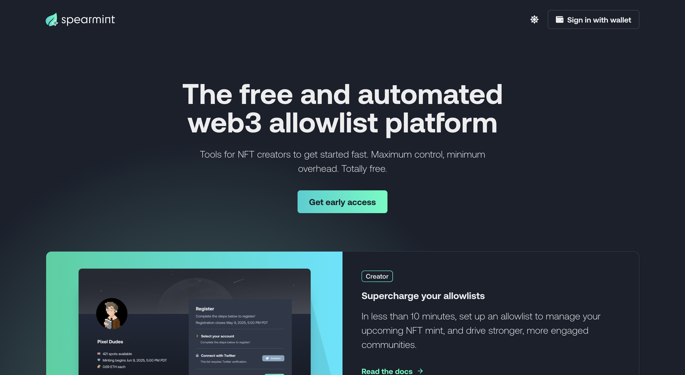
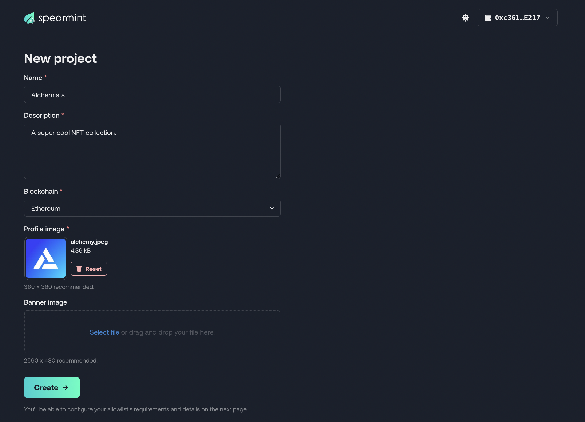
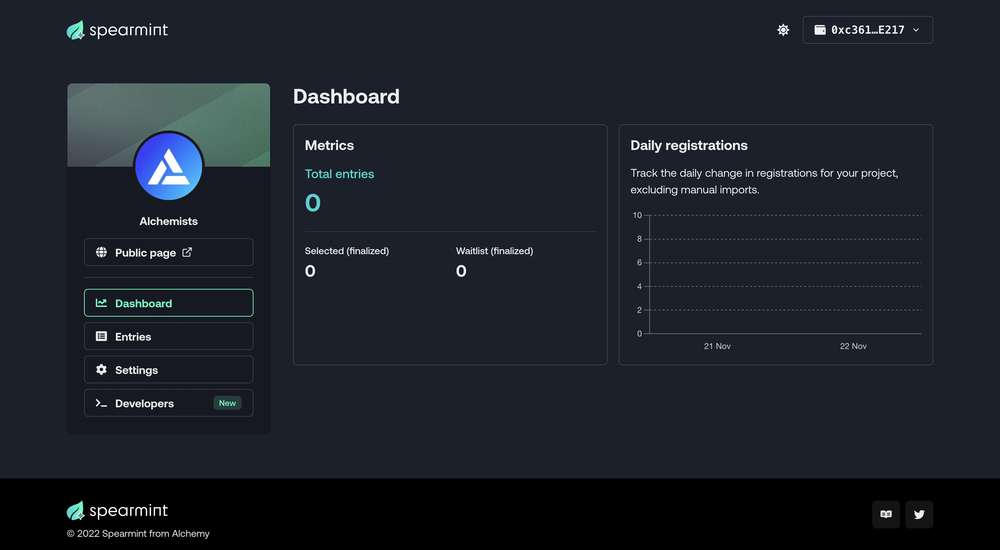
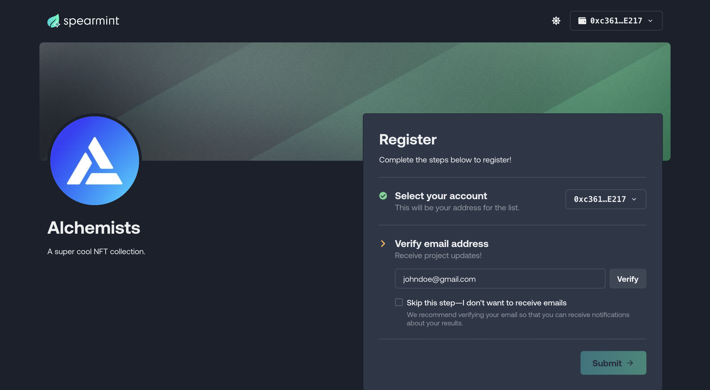
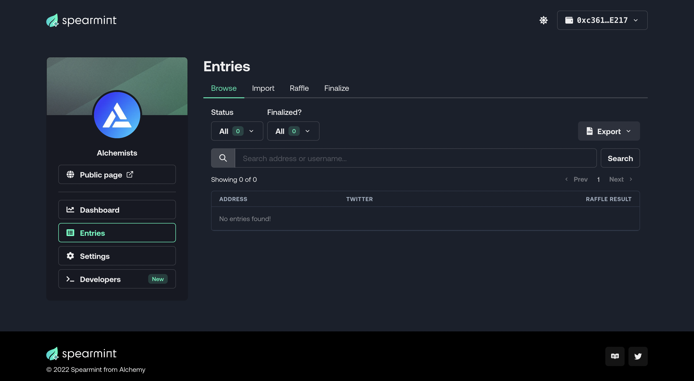
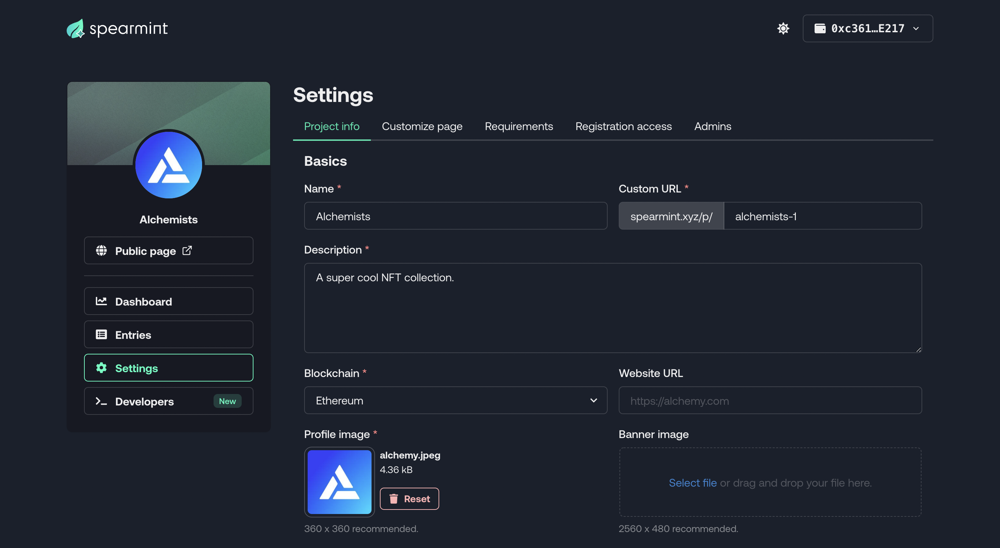
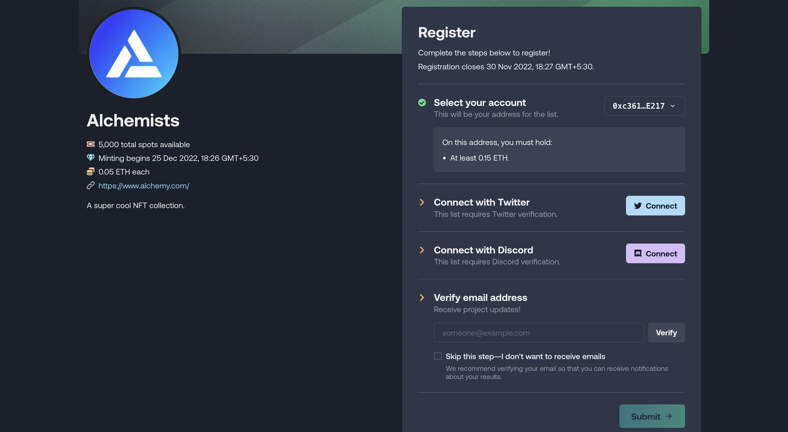
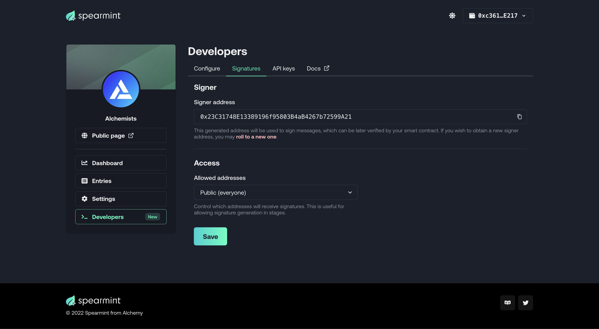

In [How to Create an Off-Chain NFT Allowlist](/docs/how-to-create-an-off-chain-nft-allowlist), we explored how to create off-chain allowlists that leveraged the creation and verification of digital signatures.



Spearmint, a free and automated web3 allowlist platform

As we saw in the aforementioned tutorial, implementing the on-chain aspects of an allowlist (i.e configuring smart contracts to deal with digital signatures) is fairly simple.

The complexity of off-chain allowlists tends to arise from the more centralized aspects of it. In this kind of allowlist, you would typically be required to maintain a list of allowlisted wallet addresses in a centralized database. Moreover, you would also need systems that can collect addresses and verify that someone actually is qualified for a spot.

Building the aforementioned systems can require a significant amount of time and resources. Fortunately, powerful tools such as Alchemy's [Spearmint](https://spearmint.xyz/) exist that streamlines the entire process, and reduces the engineering effort to a bare minimum.

In this article, we will create an off-chain allowlist using Spearmint's web platform and API.

## Creating the Off-Chain Allowlist using Spearmint

#### Overview

Using Spearmint to create an off-chain allowlist will entail the following:

1. Configuring the allowlist on Spearmint
2. Launching a public page that allows registration
3. Finalizing the allowlist
4. Generating signatures through the Spearmint API, and passing it to your NFT minting contract

Let's go through all of these steps in detail.

### Step 1: Sign up for Spearmint

In order to use the Spearmint platform, you will have to [sign up for a free account](https://spearmint.xyz/sign-in) using your crypto wallet.

The Spearmint website will prompt you to sign a message using your wallet, following which it will allow you to create a new project.

### Step 2: Create a new Spearmint Project

On the main Spearmint page, click on *Create an allowlist*. This will redirect you to a *New Project* creation page.



New Project creation page

You will be required to provide the name, description, chain, and profile image of your project. Once you're done, click on the *Create* button at the bottom.

### Step 3: Configure your Project on Spearmint

Upon submitting details in the previous step, Spearmint will automatically create a project dashboard, and allow you to configure your project any way you want. Let's take a brief walkthrough of everything you can do here.



The main project page

#### Public Page

Spearmint generates a public page once you create a new project. This page has a URL unique to your project, and lets your users sign up for the waitlist. The layout and features of this page change automatically to reflect your latest configurations. Below is the public page for the [demo project we created](https://spearmint.xyz/p/alchemists-1).



Public page of the project

#### Dashboard

The dashboard gives you analytics on how many users have registered for your allowlist (broken down by day), and how many you have selected and waitlisted.

#### Entries



Entries

The Entries tab allows you to create, manage, and finalize your allowlist. You can do the following:

1. View all addresses that have signed up through the public page.
2. Manually import addresses that haven't signed up.
3. Perform a raffle to choose a final list of addresses.
4. Finalize the allowlist and notify every user of the results.

#### Settings



Settings

The Settings tab is where the main configurations pertaining to registering for the allowlists is done. You can do the following:

1. Change the Project Info (name, description, public page URL, etc.).
2. Provide details on the mint date, mint price, and number of allowlist spots.
3. Ask users for additional verification in order to register (Twitter, Discord, minimum wallet balance, etc.).
4. Set a registration schedule (i.e start and end date).
5. Add other wallet addresses as admins and collaborators of the project.

Here is what our public page looks like once we've added a few aforementioned details on the *Settings Page*



Updated Public Page

### Step 4: Get Signatures through the API

In our previous tutorial on [How to Create an Off-Chain NFT Allowlist](/docs/how-to-create-an-off-chain-nft-allowlist), we explored at a high-level, how off-chain allowlists work.

1. Allowlist a set of wallet addresses.
2. When an address requests a mint, check if the address belongs to the aforementioned list.
3. If yes, sign the address using a wallet that you control.
4. Send the generated signature to the minting contract.
5. From the contract, check if the signature is valid (i.e it's a message signed by our wallet).
6. If yes, allow mint to take place.

Spearmint, with its Developer APIs, makes it extremely simple to perform steps 2 and 3. In the *Developers* tab of the project, you will see a Signer Key associated. This is the wallet that will be used to create signatures.



Developers Tab

Under **API Keys**, you will also see a token generated for your project. Let's now write a small script in Node that calls the Spearmint API and gets a signature. (Notice that we have set access to *Public*. In a real project, you'd ideally only want to generate signatures for allowlisted wallets).

Make sure you have [node and npm installed](https://www.alchemy.com/), and then run the following commands on your terminal.

<CodeGroup>
  ```curl curl
  mkdir spearmint && cd spearmint
  npm init -y
  npm install axios
  touch demo.js
  ```
</CodeGroup>

Open this folder in your favorite code editior. Add the following code to the `demo.js` file.

<CodeGroup>
  ```javascript javascript
  const { default: axios } = require("axios");

  const API_KEY = "<-- SPEARMINT API KEY -->";
  const connectedAddress = "<-- WALLET THAT HAS REQUESTED MINT -->";

  const main = async () => {

      const response = await axios.get(
          `https://api.spearmint.xyz/attestations/signature?address=${connectedAddress}`,
          {
              headers: {
                  accept: "application/json",
                  authorization: `Bearer ${API_KEY}`,
              },
          },
      );

      let signature = response['data']['data']['signature']
      console.log(signature);

  };

  const runMain = async () => {
      try {
          await main();
          process.exit(0);
      } catch (error) {
          console.log(error);
          process.exit(1);
      }
  };

  runMain();
  ```
</CodeGroup>

Run this script from the terminal using

<CodeGroup>
  ```curl curl
  node demo.js
  ```
</CodeGroup>

If all goes well, you should see a signature outputted to the terminal that looks something like this:

```shell
0x0a313d727ce7ec3ed7d78586ce8d64ba517ce703e9a917749de3b21fae1ac8514fbf73a3b28d969fd0336edcbaaf92e5f123eff0f75a11a0f8b621d1bb636d6d1c
```

You can now send this signature to your smart contract for verification. The following is a sample smart contract that is compatible with the above signature.

<CodeGroup>
  ```sol sol
  // SPDX-License-Identifier: UNLICENSED

  pragma solidity 0.8.17;

  import "@openzeppelin/contracts/access/Ownable.sol";
  import "@openzeppelin/contracts/utils/cryptography/ECDSA.sol";
  import "erc721a/contracts/ERC721A.sol";

  contract DigitalSignaturesDemo is Ownable, ERC721A {
    using ECDSA for bytes32;

    address public signer;

    constructor(address _signer) ERC721A("Alchemists", "GOLD") {
      setSigner(_signer);
    }

    function mint(uint256 _quantity, bytes calldata _signature) external payable {
      if (!_verifySignature(msg.sender, _signature)) {
        revert InvalidSignature();
      }
      _safeMint(msg.sender, _quantity);
    }

    function setSigner(address _signer) public onlyOwner {
      signer = _signer;
    }

    function _verifySignature(address _addr, bytes calldata _signature)
      internal
      view
      returns (bool _isValid)
    {
      bytes32 digest = keccak256(
        abi.encodePacked(
          "\x19Ethereum Signed Message:\n32",
          keccak256(abi.encode(_addr))
        )
      );
      _isValid = signer == digest.recover(_signature);
    }

    error InvalidSignature();
  }
  ```
</CodeGroup>

To learn more about digital signatures and how they work, check out the tutorial on creating off-chain allowlists. (Note that the signatures created in this tutorial are not compatible with the signature created by Spearmint. Use the sample contract above for decoding and verifying smart contract signatures).

## Conclusion

Congratulations! You now know how to implement an off-chain NFT allowlist using Spearmint.

If you enjoyed this tutorial about creating on-chain allowlists, tweet us at \[@Alchemy] and give us a shoutout!

Don't forget to join our [Discord server](https://www.alchemy.com/discord) to meet other blockchain devs, builders, and entrepreneurs!

Ready to start building your NFT collection?

[Create a free Alchemy account](https://alchemy.com/?a=63bb2620e6) and do share your project with us!
