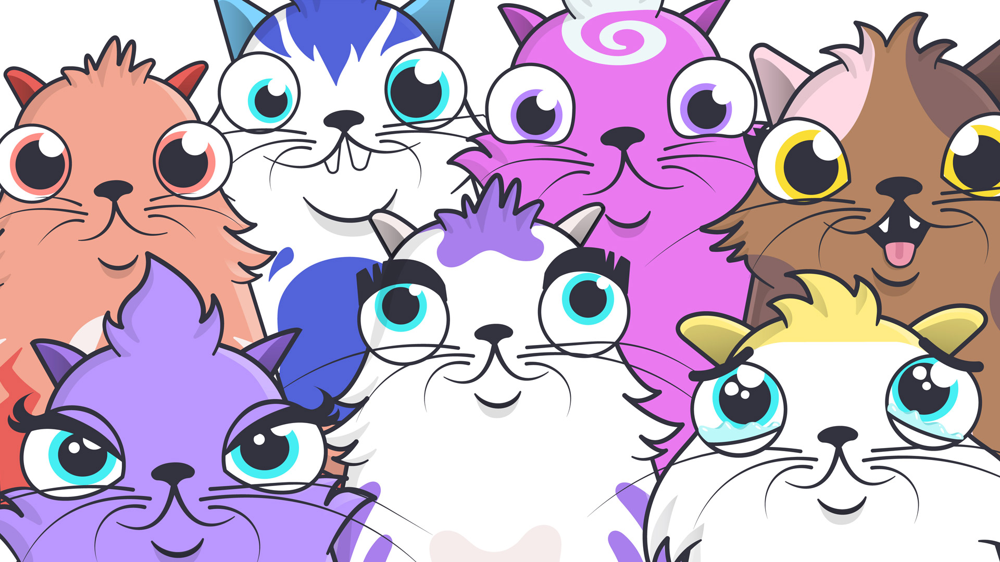
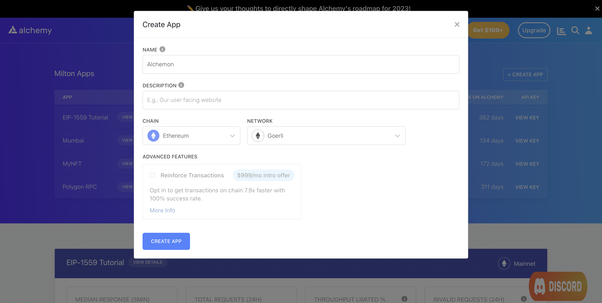
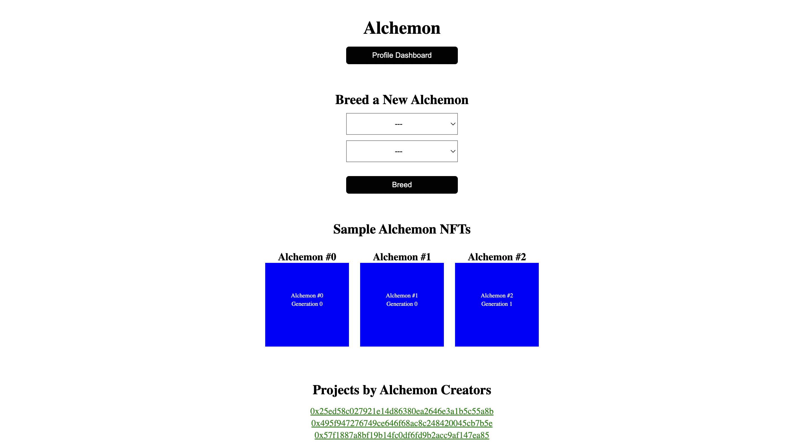

In the last tutorial on [Part 1: How to Create an NFT Game Smart Contract](/docs/how-to-create-an-nft-game-smart-contract), we leveraged Hardhat, Solidity, and Alchemy to deploy an NFT game smart contract that allowed users to breed and collect creatures called Alchemon.



Cryptokitties, a breeding game that Alchemon is based on

In this tutorial, we will build a frontend using Next.js that is capable of interacting with our smart contract and allows users to breed and view their Alchemons directly from a web app. In case you haven't already, we suggest that you complete [Part I](/docs/how-to-create-an-nft-game-smart-contract) of the tutorial first before proceeding with Part II.

## About the Frontend

Through our game's frontend, users will be able to do the following:

1. Breed new Alchemons using the Alchemons they already have (genesis or otherwise).
2. View all the Alchemons they own.
3. View all other projects created by the creators of Alchemon.
4. View a few sample Alchemons.

We will achieve this by interfacing with our smart contract using ethers, wagmi, and Alchemy. Additionally, we will use the [Alchemy NFT API](/reference/nft-api-quickstart) to easily extract useful data such as NFT ownership and metadata.

## Creating the NFT Game Frontend

### Step 1: Create an Alchemy App

We will need an [Alchemy app](https://alchemy.com/?a=alchemons) to use the NFT API, implement connect wallet functionality, and send transactions to the Goerli blockchain. You can use the same app that you created in Part I. To re-iterate, this is how you go about creating an app:

1. From [Alchemy's dashboard](https://dashboard.alchemyapi.io/), hover over the **Apps** drop-down menu and choose **Create App**.
2. Provide a **Name** and **Description** for your app. For **Chain**, select **Ethereum** and for **Network** select **Goerli**.
3. Click the **Create App** button.



Creating an app on the Alchemy Dashboard

Once you have created your app, click on your app's **View Key** button in the dashboard and save the **HTTP URL**. We will use this later.

### Step 2: Download the starter repository

We have already created a starter repository for you that implements helpful functionality such as the *connect wallet* feature.

Download or clone the repository [here](https://github.com/alchemyplatform/alchemon-frontend).

Once this is done, open the repository in a Terminal and run the following command:

<CodeGroup>
  ```shell shell
  npm install
  ```
</CodeGroup>

This will install Next.js as well as all other libraries we will be using including the Alchemy SDK, ethers, and wagmi.

Once the installation is complete, open the repository in your favorite code editor (e.g. VS Code).

### Step 3: Populate the `constants.js` file

In the `data` folder of the project, there is a `constants.js` file. This file will contain all the values required by us to interface with the NFT API and our smart contract. Populate the contents of the file with the following:

<CodeGroup>
  ```javascript constants.js
  const alchemyApiKey = "<-- ALCHEMY APP API KEY -->";
  const ownerAddress = "<-- WALLET ADDRESS USED TO DEPLOY CONTRACT IN PART I -->";
  const contractAddress = "<-- DEPLOYED ALCHEMON CONTRACT ADDRESS FROM PART I -->";

  export { alchemyApiKey, ownerAddress, contractAddress }
  ```
</CodeGroup>

### Step 4: Obtain the contract ABI file

In order to invoke functions on the contract from our frontend, the latter requires an ABI file which gives it information on all the functions in the contract such as its view scope, inputs, outputs, name, etc.

Fortunately for us, our Hardhat project from Part I generates this file automatically upon compilation of our contract.

In the `alchemon` project from Part I, navigate to `artifacts/contracts/AlchemonNft.sol` and copy the `AlchemonNft.json` file.

Next, in our current `alchemon-frontend` repository, create a new folder called `contracts` and paste this file into it.

### Step 5: Create the main breeding page

We are now in a good place to write code for the main page. On this page, users will be able to do the following:

1. Choose 2 **distinct** Alchemons they own to breed a new Alchemon. We will use the [getNftsForOwner](/reference/sdk-getnfts) function of the NFT API along with ethers to achieve this.
2. View a few sample Alchemons that already exist using the [getNftsForContract](/reference/sdk-getnftsforcontract) function.
3. View a few other projects that have been launched by the Alchemon creators using the [getContractsForOwner](/reference/getcontractsforowner) function.

This page assumes that your MetaMask wallet is already connected to the app. If it isn't, the page redirects you to the *Connect* page.

Open the `index.js` file in the `pages` folder and add the following code:

<CodeGroup>
  ```jsx index.jsx
  // Standard Next and CSS imports
  import Head from 'next/head'
  import styles from '@/styles/Home.module.css'
  import { useRouter } from "next/router";
  import { useState, useEffect, Fragment } from "react";

  // Alchemy SDK imports for NFT API
  import { Network, Alchemy } from "alchemy-sdk";

  // Imports from the constants.js file
  import { alchemyApiKey, contractAddress } from "@/data/constants";

  // Wagmi import for connected wallet info
  import { useAccount } from "wagmi";

  // Contract ABI import
  import contract from '@/contracts/AlchemonNft.json';

  // Ethers for invoking functions on smart contract
  import { ethers } from 'ethers';

  // Extract ABI from the ABI JSON file
  const abi = contract.abi;

  export default function Home() {

    // Standard Next router definition
    const router = useRouter();

    // Get connected wallet address and connection status
    const { address, isConnected } = useAccount();

    // Page mounting info to prevent hydration errors
    const [hasMounted, setHasMounted] = useState(false);

    // Variable that holds sample Alchemon NFTs
    const [samples, setSamples] = useState([]);

    // Variable that holds contracts created by Owner address
    const [contracts, setContracts] = useState([]);

    // Variable that holds all Alchemons created by connected wallet
    const [nfts, setNfts] = useState([]);

    // Parent Alchemons
    const [parent1, setParent1] = useState('none');
    const [parent2, setParent2] = useState('none');

    // Initialize Alchemy SDK
    const settings = {
      apiKey: alchemyApiKey,
      network: Network.ETH_GOERLI,
    };

    const alchemy = new Alchemy(settings);

    // Mounting fix to avoid hydration errors
    useEffect(() => {
      setHasMounted(true)
    }, []);

    // Get all Alchemon NFTs owned by the connected wallet
    useEffect(() => {
      const getNfts = async () => {
        const response = await alchemy.nft.getNftsForOwner(address);
        const nfts = response.ownedNfts.filter(nft => nft.contract.address.toUpperCase() === contractAddress.toUpperCase());
        setNfts(nfts);
      }
      getNfts();
    }, [])

    // Get sample Alchemon NFTs 
    useEffect(() => {
      const getSamples = async () => {
        const response = await alchemy.nft.getNftsForContract(contractAddress);
        const nfts = response.nfts.slice(0, 3);
        setSamples(nfts);
      }
      getSamples();
    }, [])

    // Get all contracts for owner
    useEffect(() => {
      const options = { method: 'GET', headers: { accept: 'application/json' } };

      fetch(`https://eth-mainnet.g.alchemy.com/nft/v2/${alchemyApiKey}/getContractsForOwner?owner=${address}`, options)
        .then(response => response.json())
        .then(response => setContracts(response.contracts))
        .catch(err => console.error(err));
    }, [])

    // Do not render until entire UI is mounted  
    if (!hasMounted) return null;

    // Redirect to Connect page if wallet is not connected
    if (!isConnected) {
      router.replace('/connect');
    }

    // Form handlers
    const parent1Handler = (e) => {
      setParent1(e.target.value);
    }

    const parent2Handler = (e) => {
      setParent2(e.target.value);
    }

    // Function that allows breeding of NFTs using 2 parent NFTs
    const mintNft = async (e) => {

      e.preventDefault();

      // Only allow breeding if the parents are distinct 
      if (parent1 === 'none' || parent2 === 'none' || parent1 === parent2) {
        console.log("Incorrect parents");
        return;
      }

      // Call the breed function from connected wallet
      try {
        const { ethereum } = window;

        if (ethereum) {
          const provider = new ethers.providers.Web3Provider(ethereum);
          const signer = provider.getSigner();
          const nftContract = new ethers.Contract(contractAddress, abi, signer);

          console.log("Initialize payment");
          let nftTxn = await nftContract.breed(parseInt(parent1), parseInt(parent2));

          console.log("Mining... please wait");
          await nftTxn.wait();

          console.log(`Mined, see transaction: https://goerli.etherscan.io/tx/${nftTxn.hash}`);
          router.replace('/dashboard');

        } else {
          console.log("Ethereum object does not exist");
        }

      } catch (err) {
        console.log(err);
      }
    }

    return (
      <Fragment>

        <Head>
          <title>Alchemon</title>
          <meta name="description" content="A simple NFT based game" />
          <meta name="viewport" content="width=device-width, initial-scale=1" />
          <link rel="icon" href="/favicon.ico" />
        </Head>

        <main className={styles.main}>
          <h1>Alchemon</h1>

          <button onClick={() => router.push('/dashboard')}>
            Profile Dashboard
          </button>

          <h2>Breed a New Alchemon</h2>

          <form className={styles.breed_form} onSubmit={mintNft}>
            <select name="parent1" id="parent1" value={parent1} onChange={parent1Handler}>
              <option value="none">---</option>
              {nfts.map(nft => {
                return <option value={nft.tokenId} key={nft.tokenId}>{nft.title}</option>
              })}
            </select>
            <select name="parent2" id="parent2" value={parent2} onChange={parent2Handler}>
              <option value="none">---</option>
              {nfts.map(nft => {
                return <option value={nft.tokenId} key={nft.tokenId}>{nft.title}</option>
              })}
            </select>
            <button type='submit'>Breed</button>
          </form>

          <h2>Sample Alchemon NFTs</h2>
          <div className={styles.sample_nfts}>
            {samples.map(nft => {
              return (
                <div className={styles.nft} key={nft.tokenId}>
                  <h3>{nft.title}</h3>
                  
                </div>
              )
            })}
          </div>

          <h2>Projects by Alchemon Creators</h2>
          <ul className={styles.contract_container}>
            {contracts.map(contract => {
              return (
                <li key={contract.address}>
                  <a href={`https://goerli.etherscan.io/address/${contract.address}`} target="_blank">
                    {contract.address}
                  </a>
                </li>
              )
            })}
          </ul>

        </main>
      </Fragment>
    )
  }
  ```
</CodeGroup>

In the main breeding page:

* We use [getNftsForOwner](/reference/sdk-getnfts) to get a list of all Alchemon NFTs owner by the wallet.
* We use [getNftsForContract](/reference/sdk-getnftsforcontract) to get a few sample NFTs from the Alchemon collection.
* We use [getContractsForOwner](/reference/getcontractsforowner) to get a list of projects created by the owners of Alchemon.

<Info>
  In order to understand what various parts of the code does, do make sure to read the comments associated with each section.
</Info>

Once we wire up the remaining components of the app, this page should look something like this:



The main Alchemon breeding page

### Step 6: Create the profile dashboard page

In the profile dashboard page, users will be able to see their connected wallet address and all the Alchemons that they own. For the latter, we will be using the `getNftsForOwner` function of the Alchemy NFT API.

In the `dashboard.js` file within the `pages` folder, add the following code:

<CodeGroup>
  ```jsx dashboard.js
  // Standard Next and CSS imports
  import Head from "next/head";
  import { Fragment, useState, useEffect } from "react";
  import styles from "../styles/dashboard.module.css";
  import { useRouter } from "next/router";

  // Alchemy SDK imports for NFT API
  import { Network, Alchemy } from "alchemy-sdk";

  // Imports from the constants.js file
  import { alchemyApiKey, contractAddress } from "@/data/constants";

  // Wagmi import for connected wallet info
  import { useAccount } from "wagmi";

  export default function Dashboard() {

      // Standard Next router definition
      const router = useRouter();

      // Get connected wallet address and connection status
      const { address, isConnected } = useAccount();

      // Page mounting info to prevent hydration errors
      const [hasMounted, setHasMounted] = useState(false);

      // Variable that holds all Alchemons created by connected wallet
      const [nfts, setNfts] = useState([]);

      // Initialize Alchemy SDK
      const settings = {
          apiKey: alchemyApiKey,
          network: Network.ETH_GOERLI,
      };

      const alchemy = new Alchemy(settings);

      // Mounting fix to avoid hydration errors
      useEffect(() => {
          setHasMounted(true);
      }, []);

      // Get all Alchemon NFTs owned by the connected wallet
      useEffect(() => {
          const getNfts = async () => {
              const response = await alchemy.nft.getNftsForOwner(address);
              const nfts = response.ownedNfts.filter(nft => nft.contract.address.toUpperCase() === contractAddress.toUpperCase());
              setNfts(nfts);
          }

          getNfts();
      }, [])

      // Do not render until entire UI is mounted  
      if (!hasMounted) return null;

      // Redirect to Connect page if wallet is not connected
      if (!isConnected) {
          router.replace('/connect');
      }

      return (
          <Fragment>
              <Head>
                  <title>Profile Dashboard</title>
              </Head>

              <div className={styles.jumbotron}>

                  <h1>Dashboard</h1>

                  <h2>Contract Address</h2>
                  <p>{address}</p>

                  <h2 className={styles.nft_heading}>My NFTs</h2>
                  <div className={styles.nft_container}>
                      {nfts.map(nft => {
                          return (
                              <div className={styles.nft} key={nft.tokenId}>
                                  <h3>{nft.rawMetadata.name}</h3>
                                  
                              </div>
                          )
                      })}
                  </div>

                  <button onClick={() => router.replace('/')}>
                      Back to Main Page
                  </button>

              </div>
          </Fragment>
      )
  }
  ```
</CodeGroup>

In the dashboard page, we use [getNftsForOwner](/reference/sdk-getnfts) to get a list of all Alchemon NFTs owned by the wallet.

<Info>
  In order to understand what various parts of the code does, do make sure to read the comments associated with each section.
</Info>

We are all set to go! Let's launch our app on localhost using the following command:

<CodeGroup>
  ```shell shell
  npm run dev
  ```
</CodeGroup>

### Playing the game

* When you open `localhost:3000`, you will first be prompted to visit the `localhost:3000/connect` page. Here, connect your MetaMask wallet to be redirected back to the main breeding page at `localhost:3000`.

* For breeding to work, you must choose two different Alchemons as parents. In case you don't have 2 Alchemons, you can simply mint Genesis NFTs by visiting `localhost:3000/mint-genesis`. Make sure you've got enough Goerli ETH from the [Goerli Faucet](https://goerlifaucet.com/) before you mint.

* You will be redirected back on the main page. Select an Alchemon in both the first and the second dropdown, then click on breed. Metamask will prompt you to pay gas for the transaction.

* Mining the transaction will roughly take 15 seconds after which you will be re-directed to a Dashboard page where you can see your new Alchemon NFT! This completes the game.

* You can keep doing this indefinitely to create newer generations of Alchemons from the main breeding page.

### Conclusion

Congratulations! You now know how to create a Next.js frontend that interacts with gaming smart contracts and implements an on-chain breeding game.

As a learning exercise we would love for you to give more functionality to these alchemons. For example, you could give certain skillsets and skill levels to these alchemons and then have 2 Alchemons fight each other - so one of them wins.

If you enjoyed this tutorial about creating NFT games or happen to build more functionality on top of this, tweet us at [@AlchemyPlatform](https://twitter.com/AlchemyPlatform)!

Don't forget to join our [Discord server](https://www.alchemy.com/discord) to meet other blockchain devs, builders, and entrepreneurs!

Ready to start building your NFT game?

[Create a free Alchemy account](https://alchemy.com/?a=alchemons) and do share your project with us!
