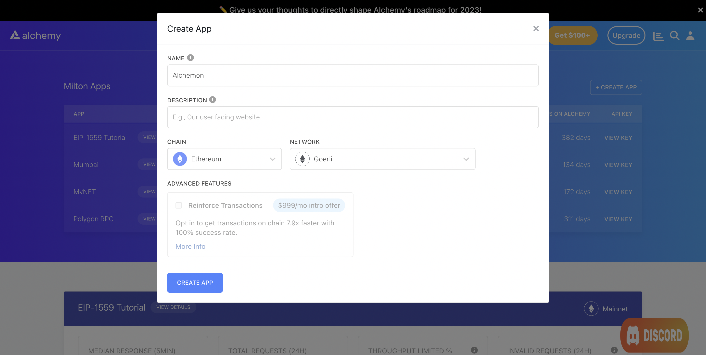

Gaming has become one of the most popular applications of NFTs. Since 2021, there have been multiple games that have witnessed millions of dollars worth of transactions.

NFTs have been used in pet collectible games like [Cryptokitties](https://www.cryptokitties.co/), Pokemon style monster battling games like [Axie Infinity](https://axieinfinity.com/) and fantasy trading card games like [Sorare](https://sorare.com/). These games have been the closest thing to mainstream adoption of NFTs.


Axie Infinity, a popular Pokemon-style monster battling game

In this two part series, we will build a Cryptokitties-style breeding game from scratch. This tutorial will focus on writing a smart contract that will power our game on-chain. The next part will focus on building a frontend using Next.js that interfaces with the aforementioned contract.

***

## About the Game

As stated above, the game will implement breeding mechanics seen in games like Cryptokitties. Users will be able to do the following:

1. Mint a genesis monster by paying some ETH.
2. Breed a new monster using any two existing monsters that they own (genesis or otherwise)
3. View all their monsters on a dapp

We will call our monsters Alchemons. In the subsequent parts of this tutorial, we will write an ERC-721 smart contract that allows users to mint genesis Alchemons and breed new Alchemons into existence.

***

## Creating the NFT Game Smart Contract

### Step 1: Create an Alchemy app

We're going to deploy and test our contract on the Goerli testnet. In order to do this, we will require a [free Alchemy account](https://alchemy.com/?a=alchemons).

Create an Alchemy app by following these steps:

1. From [Alchemy's dashboard](https://dashboard.alchemyapi.io/), hover over the **Apps** drop-down menu and choose **Create App**.
2. Provide a **Name** and **Description** for your app. For **Chain**, select **Ethereum** and for **Network** select **Goerli**.
3. Click the **Create App** button.



Creating an app on the Alchemy Dashboard

Once you have created your app, click on your app's **View Key** button in the dashboard and save the **HTTP URL**. We will use this later.

### Step 2: Install Node and npm

In case you haven't already, [install node and npm](https://nodejs.org/en/download/) on your local machine.

Make sure that node is at least v14 or higher by typing the following in your terminal:

<CodeGroup>
  ```shell shell
  node -v
  ```
</CodeGroup>

### Step 3: Create a Hardhat project

We're going to set up our project using [Hardhat](https://hardhat.org/), the industry-standard development environment for Ethereum smart contracts. Additionally, we'll also install [OpenZeppelin](https://www.openzeppelin.com/) contracts.

***To set up Hardhat, run the following commands in your terminal:***

<CodeGroup>
  ```shell shell
  mkdir alchemon && cd alchemon
  npm init -y
  npm install --save-dev hardhat
  npx hardhat
  ```
</CodeGroup>

Choose `Create a Javascript project` from the menu and accept all defaults. To ensure everything is installed correctly, run the following command in your terminal:

<CodeGroup>
  ```shell shell
  npx hardhat test
  ```
</CodeGroup>

***To install OpenZeppelin:***

<CodeGroup>
  ```shell shell
  npm install @openzeppelin/contracts
  ```
</CodeGroup>

### Step 4: Write the smart contract

Let's now write a smart contract that implements our on-chain game. To do this, we need to broadly implement three things:

1. A `mintGenesis` function that allows users to mint genesis (or generation 0) NFTs by paying a certain amount of ETH.
2. A `breed` function that allows users to use any two of their NFTs to breed a new NFT.
3. A `generateMetadata` function that generates metadata that will be stored on-chain.

Open the project in your favorite code editor (e.g., VS Code), and create a new file called `AlchemonNft.sol` in the `contracts` folder. Add the following code to this file:

<CodeGroup>
  ```solidity AlchemonNft.sol
  // SPDX-License-Identifier: MIT
  pragma solidity ^0.8.9;

  import "@openzeppelin/contracts/token/ERC721/ERC721.sol";
  import "@openzeppelin/contracts/token/ERC721/extensions/ERC721Enumerable.sol";
  import "@openzeppelin/contracts/token/ERC721/extensions/ERC721URIStorage.sol";
  import "@openzeppelin/contracts/access/Ownable.sol";
  import "@openzeppelin/contracts/utils/Counters.sol";
  import "@openzeppelin/contracts/utils/Base64.sol";
  import "@openzeppelin/contracts/utils/Strings.sol";

  contract AlchemonNft is ERC721, ERC721Enumerable, ERC721URIStorage, Ownable {
      using Counters for Counters.Counter;

      Counters.Counter private _tokenIds;

      // Set price for the genesis NFTs
      uint public constant PRICE = 0.0005 ether;

      constructor() ERC721("Alchemon", "Alch") {}

      // Mint Genesis NFTs
      function mintGenesis(uint _count) public payable {
          require(msg.value >= PRICE, "Not enough ether to purchase genesis NFT.");

          // Genesis NFTs are generation 0
          for (uint i = 0; i < _count; i++) {
              string memory metadata = generateMetadata(_tokenIds.current(), 0);
              _mintSingleNft(metadata);
          }
          
      }

      // Generate NFT metadata
      function generateMetadata(uint tokenId, uint generation) public pure returns (string memory) {
          string memory svg = string(abi.encodePacked(
              "<svg xmlns='http://www.w3.org/2000/svg' preserveAspectRatio='xMinyMin meet' viewBox='0 0 350 350'>",
              "<style>.base { fill: white; font-family: serif; font-size: 25px; }</style>",
              "<rect width='100%' height='100%' fill='blue' />",
              "<text x='50%' y='40%' class='base' dominant-baseline='middle' text-anchor='middle'>",
              "<tspan y='40%' x='50%'>Alchemon #",
              Strings.toString(tokenId),
              "</tspan>",
              "<tspan y='50%' x='50%'>Generation ",
              Strings.toString(generation),
              "</tspan></text></svg>"
          ));

          string memory json = Base64.encode(
              bytes(
                  string(
                      abi.encodePacked(
                          '{"name": "Alchemon #',
                          Strings.toString(tokenId),
                          '", "description": "An in-game monster", "image": "data:image/svg+xml;base64,',
                          Base64.encode(bytes(svg)),
                          '", "attributes": [{"trait_type": "Generation", "value": "',
                          Strings.toString(generation),
                          '"}]}'
                      )
                  )
              )
          );

          string memory metadata = string(
              abi.encodePacked("data:application/json;base64,", json)
          );

          return metadata;
      }

      // Breed a new NFT
      function breed(uint parent1Id, uint parent2Id) public {
          require(parent1Id != parent2Id, "Parents must be different");
          require(ownerOf(parent1Id) == msg.sender && ownerOf(parent2Id) == msg.sender, "Sender doesn't own NFTs");

          // Get generations of each parent and compute new generation
          // New Generation = Max(Parent 1, Parent 2) + 1
          uint newGen;

          if (parent1Id >= parent2Id) {
              newGen = parent1Id + 1;
          } else {
              newGen = parent2Id + 1;
          }

          // Generate metadata
          string memory metadata = generateMetadata(_tokenIds.current(), newGen);

          // Mint offspring
          _mintSingleNft(metadata);
      }

      // Mint a single NFT with on-chain metadata
      function _mintSingleNft(string memory _tokenURI) private {
          uint newTokenID = _tokenIds.current();
          _safeMint(msg.sender, newTokenID);
          _setTokenURI(newTokenID, _tokenURI);
          _tokenIds.increment();
      }

      // Get tokens of an owner
      function tokensOfOwner(address _owner) external view returns (uint[] memory) {

          uint tokenCount = balanceOf(_owner);
          uint[] memory tokensId = new uint256[](tokenCount);

          for (uint i = 0; i < tokenCount; i++) {
              tokensId[i] = tokenOfOwnerByIndex(_owner, i);
          }
          return tokensId;
      }

      // Withdraw ether
      function withdraw() public payable onlyOwner {
          uint balance = address(this).balance;
          require(balance > 0, "No ether left to withdraw");

          (bool success, ) = (msg.sender).call{value: balance}("");
          require(success, "Transfer failed.");
      }

      // The following functions are overrides required by Solidity.

      function _beforeTokenTransfer(address from, address to, uint256 tokenId, uint256 batchSize)
          internal
          override(ERC721, ERC721Enumerable)
      {
          super._beforeTokenTransfer(from, to, tokenId, batchSize);
      }

      function _burn(uint256 tokenId) internal override(ERC721, ERC721URIStorage) {
          super._burn(tokenId);
      }

      function tokenURI(uint256 tokenId)
          public
          view
          override(ERC721, ERC721URIStorage)
          returns (string memory)
      {
          return super.tokenURI(tokenId);
      }

      function supportsInterface(bytes4 interfaceId)
          public
          view
          override(ERC721, ERC721Enumerable)
          returns (bool)
      {
          return super.supportsInterface(interfaceId);
      }
  }
  ```
</CodeGroup>

Compile the contract and make sure everything works by running:

<CodeGroup>
  ```shell shell
  npx hardhat compile
  ```
</CodeGroup>

### Step 5: Install MetaMask and get ETH from the Alchemy faucet

Next, let's set up a MetaMask wallet. You can download the wallet extension for your browser [here](https://metamask.io/download/). MetaMask comes configured with the Goerli network by default, and you can switch to this once your wallet is set up.

In order to deploy our contract, mint NFTs, and pay for the genesis pieces, we will require some test goerliETH. You can obtain this for free from Alchemy's [Goerli faucet](https://goerlifaucet.com/).

Depending on demand, you may be required to sign with your Alchemy account.

### Step 6: Configure `hardhat.config.js`

Once we have a wallet set up with some test ETH, we can proceed to configure hardhat so that it deploys our contract to Goerli. Replace the contents of `hardhat.config.js` with the following:

<CodeGroup>
  ```javascript hardhat.config.js
  require("@nomicfoundation/hardhat-toolbox");

  /** @type import('hardhat/config').HardhatUserConfig */
  module.exports = {
    solidity: "0.8.17",
    networks: {
      goerli: {
        url: '<-- ALCHEMY APP HTTP URL -->',
        accounts: ['<-- METAMASK WALLET PRIVATE KEY -->']
      }
    }
  };
  ```
</CodeGroup>

Make sure you do not make your HTTP URL or wallet private key public.

### Step 7: Write the contract deployment script

We are now in a good position to write a script that allows us to do the following:

1. Deploy the Alchemon contract to the Goerli testnet.
2. Mint 2 Genesis NFTs by paying 0.001 ETH.
3. Breed a new NFT using the Genesis NFTs minted in step 2.

In the `scripts` folder, replace the contents of `deploy.js` with the following:

<CodeGroup>
  ```javascript deploy.js
  const hre = require("hardhat");
  const ethers = require("ethers");

  async function main() {

    // Deploy the Alchemon contract
    const contractFactory = await hre.ethers.getContractFactory('AlchemonNft');
    const alchContract = await contractFactory.deploy();
    await alchContract.deployed();

    console.log("Contract deployed to:", alchContract.address);

    // Mint 2 genesis NFTs
    let txn;
    txn = await alchContract.mintGenesis(2, { value: ethers.utils.parseEther('0.001') });
    await txn.wait();
    console.log("2 NFTs minted");

    // Breed genesis NFTs
    txn = await alchContract.breed(0, 1);
    await txn.wait();
    console.log("1 NFT bred");

  }

  const runMain = async () => {
    try {
      await main();
      process.exit(0);
    } catch (e) {
      console.log(e);
      process.exit(1);
    }
  }

  runMain();
  ```
</CodeGroup>

Run this script by running the following command in your terminal:

<CodeGroup>
  ```shell shell
  npx hardhat run scripts/deploy.js --network goerli
  ```
</CodeGroup>

If all goes well, you should see output that looks something like this:

```shell
Contract deployed to: 0xDDd5bBAFd1F4318277446e17C9ebDcD079977d0C
2 NFTs minted
1 NFT bred
```

You can check out your new NFTs by searching your contract address in [testnets.opensea.io](https://testnets.opensea.io).


Alchemon NFT page on OpenSea

### Conclusion

Congratulations! You now know how to create a contract that implements an on-chain breeding game. In the next tutorial [Part 2: How to create an NFT game frontend](/docs/how-to-create-an-nft-game-frontend), we will build a frontend that will allow users to breed their NFTs from an easy-to-use interface.

If you enjoyed this tutorial about creating NFT games, tweet us at [@AlchemyPlatform](https://twitter.com/AlchemyPlatform) and give us a shoutout!

Don't forget to join our [Discord server](https://www.alchemy.com/discord) to meet other blockchain devs, builders, and entrepreneurs!

Ready to start building your NFT game?

[Create a free Alchemy account](https://alchemy.com/?a=alchemons) and do share your project with us!

***

What’s Next

* [Part 2: How to Create an NFT Game Frontend](/docs/how-to-create-an-nft-game-frontend)
