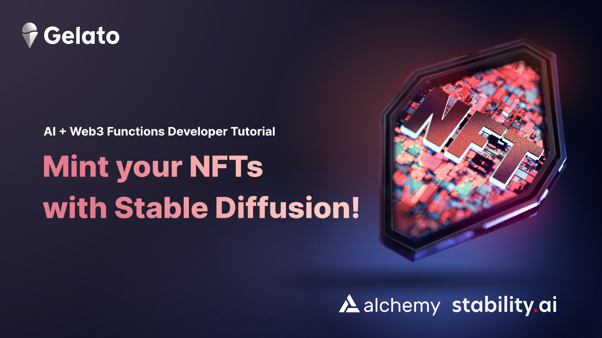
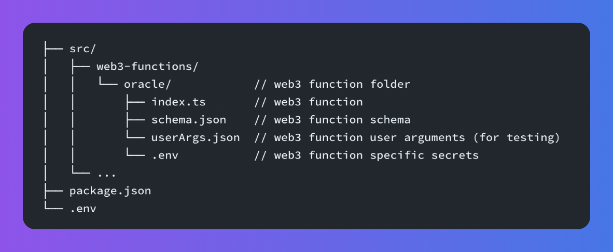
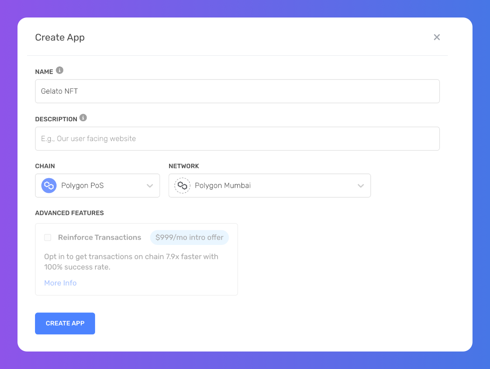
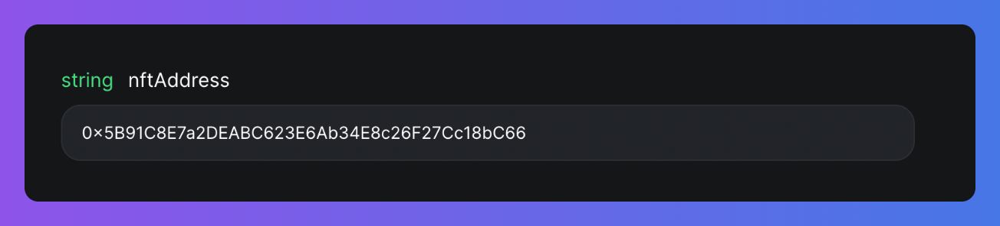
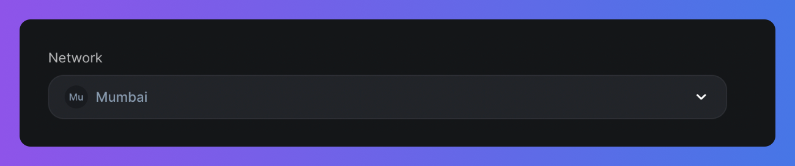
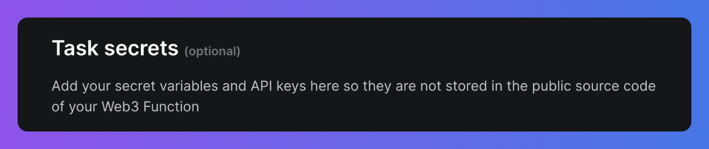
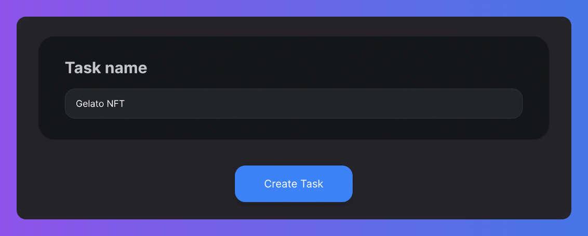
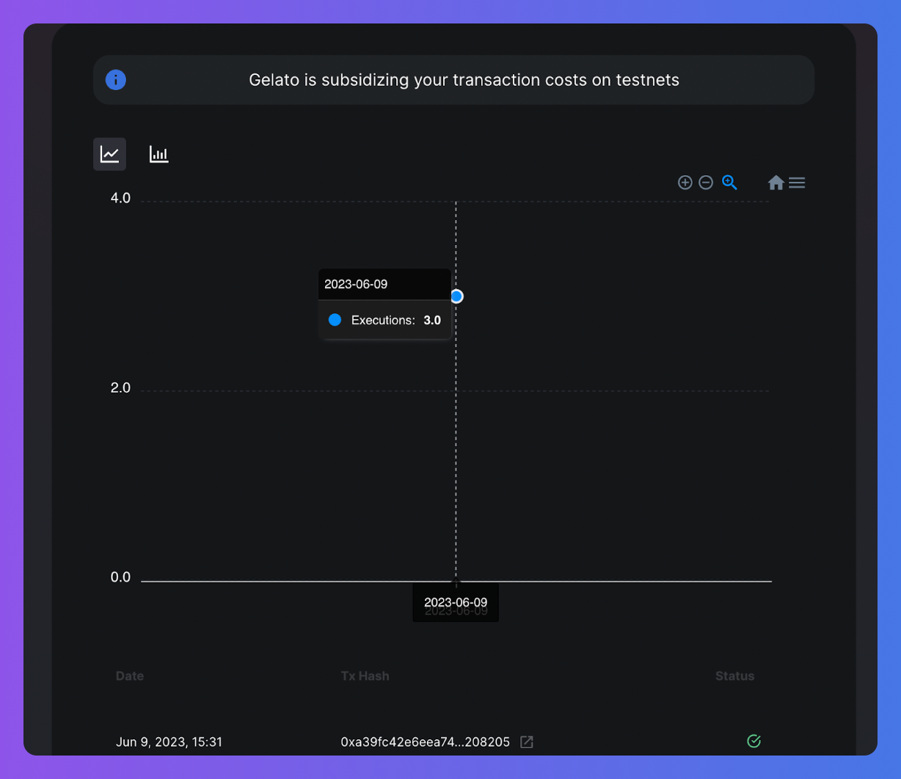

In the accelerating tech landscape, AI and web3 are converging, boosting the adoption of decentralized networks and enhancing smart contracts. A significant aspect of this convergence is generative modeling in AI, which creates new data from existing patterns. The diffusion model, a subset of generative modeling, constructs valuable images from random data.

This tutorial demonstrates the merger of AI and blockchain by integrating Gelato's Web3 Functions and StabilityAI's [Stable Diffusion](https://stablediffusionweb.com/) tool. We will use Stable Diffusion to generate AI-crafted images, which will serve as metadata for our NFTs. Web3 Functions play a crucial role as a link between the 'on-chain' and 'off-chain' domains, connecting our NFT creation smart contract with APIs like Stable Diffusion, thereby automatically assigning AI-generated images to NFTs.

## Workflow

Here's what we'll cover:

1. **GelatoNft smart contract:** You'll learn how to mint new NFTs with this smart contract, maintaining an element of suspense until their final reveal.
2. **Stable Diffusion:** This AI tool from StabilityAI generates unique images that become the metadata for your NFTs. You'll explore how to integrate AI-driven imagery into your NFTs.
3. **Gelato’s Web3 Functions:** Serving as a conduit between your NFT smart contract and the Stable Diffusion API off-chain, these functions automate the assignment of AI-created images to your NFTs. By the end of this tutorial, you'll grasp how to use Gelato's Web3 Functions to streamline your NFT creation process.
4. **Alchemy**: We'll use Alchemy to deploy our NFT contract.

Get ready for an insightful voyage into the future of digital innovation!

## Prerequisites

Ensure you have the following before you start:

* Signed up for the [Gelato Web3 Functions beta](https://form.typeform.com/to/RrEiARiI).
* Installed Node.js v16+, NPM, and Git.
* Set up a Web3 wallet in your browser, such as [MetaMask](https://metamask.io/).
* Account created on [Alchemy](https://www.alchemy.com/), [NFT storage](https://nft.storage/) & [Stable Diffusion](https://stablediffusionweb.com/)

Once set up, we can dive in!

## Set Up Your Dev Environment

Start by cloning the Gelato Web3 Functions Web3 NFT AI Repository:

`git clone https://github.com/gelatodigital/W3F-NFT-AI`

Install the dependencies:

`yarn install`

### Code Structure

The code structure should look like this:



### Configure Secrets

* Alchemy ID
* Private Key
* A Stable Diffusion Key
* A NFT.Storage Key

**Obtain Alchemy ID & Private Key:** Locate the `.env.template` file in your root folder, copy it and rename the copy to `.env` These keys are only required if deploying your smart contract to testnet/mainnet.

Here are the steps for acquiring these:

**Acquiring an Alchemy ID**

* **Sign Up for a free Alchemy Account**

  Creating an account with Alchemy is simple, sign up for free [here](https://www.alchemy.com/homepage).

* **Create an Alchemy App**

  You need an API key to authenticate your requests. You can create API keys from the dashboard. Navigate to “Create App” and fill in the details to get your new key and paste it in .env..



**Acquiring a Private Key**

Go to your Metamask wallet and do the following:

* Click on the three dots next to ‘Account Address’
* Then click on ‘Account Details’
* Export the private key
* Enter your Metamask wallet password
* Copy the private key & paste it in .env

***

**Obtain Stable diffusion and NFT.Storage Keys**

Find the `.env.template` file in the ***web3-functions/stable-diffusion-nft*** directory. Again, make a copy of it and rename the copy to `.env`.

Sign in on the [NFTStorage ](https://nft.storage/)website using either your GitHub or email, navigate to API Keys section and generate a new key.

For the [Stable Diffusion](https://stablediffusionweb.com/) API Key, visit the [website](https://stablediffusionapi.com/), click on My Profile and get your API Keys from API Keys sections. Once obtained, these keys need to be entered into the newly created .env file.

Now you're all set to get started!

## Code Explanation

The "**GelatoNft**" contract represents an NFT on the Polygon blockchain. Users can mint new tokens by calling the mint function, providing a boolean value to indicate if the token represents a night time or sunset. The contract keeps track of minted tokens and their ownership. The revealNft function is used by a specific Gelato message sender to update the token metadata URI.

### GelatoNft contract

* **mint():**

  The mint function in the "GelatoNft" contract allows users to create and mint a new NFT. It checks if the caller has already minted a token, increments the token ID counter, mints the token to the caller's address, sets the default URI to `notRevealedUri`.

<CodeGroup>
  ```sol sol
  function mint(bool _isNight) external whenNotPaused {
      require(!hasMinted[msg.sender], "Already minted!");

      tokenIds.increment();
      uint256 newItemId = tokenIds.current();

      _mint(msg.sender, newItemId);
      _setTokenURI(newItemId, notRevealedUri);

      hasMinted[msg.sender] = true;
      tokenIdByUser[msg.sender] = newItemId;
      nightTimeByToken[newItemId] = _isNight;

      emit MintEvent(newItemId);
  }
  ```
</CodeGroup>

* **revealNft():**

  The revealNft function is used by Gelato's [dedicated msg.sender](https://docs.gelato.network/developer-services/web3-functions/contract-address) to update the metadata URI for a specific token.In this contract, the updated URI is generated using the Stable Diffusion API, which creates the NFT metadata image. Once the URI is set, the MetadataUpdate event is emitted to notify listeners about the updated metadata for the token.This is the function automated by Web3 Functions, when user mints the NFT, Web3 Functions will run and call the **revealNft()** function and update the tokenURI.

<CodeGroup>
  ```sol sol
  function revealNft(uint256 tokenId, string memory tokenURI) external onlyGelatoMsgSender {
      _setTokenURI(tokenId, tokenURI);
      emit MetadataUpdate(tokenId);
  }
  ```
</CodeGroup>

### GelatoNft Web3 Function

The Web3 function handles the "reveal" process, where initially hidden NFT tokenURI are made public.

**1. Importing necessary libraries and contract ABIs:**

These import statements include various utilities necessary for the function to work correctly. Web3Function and Web3FunctionContext are used to define and interact with the Web3 Functions.Contract from the ethers library are used for interacting with smart contracts . NFTStorage is used to store NFT metadata and axios is used for making HTTP requests.

<CodeGroup>
  ```typescript typescript
  import { Web3Function, Web3FunctionContext } from "@gelatonetwork/web3-functions-sdk";
  import { Contract, utils } from "ethers";
  import { NFTStorage, File } from "nft.storage";
  import axios, { AxiosError } from "axios";
  ```
</CodeGroup>

**2. Validate user arguments and secrets**

In this section, the function fetches user arguments and secrets, which include contract addresses and API keys. The nftAddress is retrieved from user arguments, while the API keys are fetched from secrets. If these values are missing or invalid, the function will throw an error.

<CodeGroup>
  ```typescript typescript
  ////// User Arguments

  const nftAddress = userArgs.nftAddress as string;
  console.log("nftAddress", nftAddress);

  if (!nftAddress) {
    throw new Error("Missing userArgs.nftAddress, please provide");
  }

  ////// User Secrets

  const nftStorageApiKey = await secrets.get("NFT_STORAGE_API_KEY");
  const stableDiffusionApiKey = await secrets.get("STABLE_DIFFUSION_API_KEY");

  if (!nftStorageApiKey || !stableDiffusionApiKey) {
    console.error("Error: Missing secrets");
    return {
      canExec: false,
      message: "Error: Missing Secrets",
    };
  }
  ```
</CodeGroup>

**3. Fetching and Processing NFTs**

The function fetches the current and the last processed token IDs. If there are any new tokens, the function processes them in batches to stay within RPC call limits. The function checks each NFT in sequence and only selects those that have not been revealed yet.

**4. Generation of Metadata and Image Creation**

For each selected NFT, the function generates the NFT properties and description based on whether it's night or day time as per the NFT contract.The description is used as a prompt to generate an image via the Stable Diffusion API. The Stable Diffusion API returns a URL of the generated image, which is then stored for uploading it to IPFS via NFT.Storage. If there is an error during this process, the error is caught and an appropriate message is returned.

<CodeGroup>
  ```typescript typescript
  const isNight = await nft.nightTimeByToken(tokenId);
  const nftProps = generateNftProperties(isNight);

  // Generate NFT image with Stable Diffusion
  let imageUrl: string;
  const stableDiffusionResponse = await fetch("https://stablediffusionapi.com/api/v3/text2img", {
    method: "POST",
    headers: {
      "Content-Type": "application/json",
    },
    body: JSON.stringify({
      key: stableDiffusionApiKey,
      prompt: nftProps.description,
      // Other parameters for the API request...
    }),
  });

  const stableDiffusionData = await stableDiffusionResponse.json();
  imageUrl = stableDiffusionData.output[0] as string;
  ```
</CodeGroup>


Image generated by Stable Diffusion through the given prompt

**5. Upload to IPFS**

The image generated by the Stable Diffusion API is fetched and uploaded to IPFS along with the rest of the NFT metadata using the NFTStorage library. NFTStorage provides an interface to easily store NFT data on the IPFS network.

<CodeGroup>
  ```typescript typescript
  const imageBlob = (await axios.get(imageUrl, { responseType: "blob" })).data;
  const nftStorage = new NFTStorage({ token: nftStorageApiKey });
  const imageFile = new File([imageBlob], `gelato_nft_${tokenId}.png`, { type: "image/png" });

  const metadata = await nftStorage.store({
    name: `GelatoNFT #${tokenId}`,
    description: nftProps.description,
    image: imageFile,
    attributes: nftProps.attributes,
    // Other properties for the metadata...
  });
  ```
</CodeGroup>

**6. Execution of the Contract's Function**

The Web3 Functions then creates necessary call data with contract address token ID and token URI for revealNft function to update the tokenURI.

<CodeGroup>
  ```typescript typescript
  const callDatas: Array<{ to: string; data: string }> = [];

  tokensData.forEach((token) => {
    callDatas.push({
      to: nft.address,
      data: nft.interface.encodeFunctionData("revealNft", [token.id, token.url]),
    });
  });

  return {
    canExec: true,
    callData: callDatas,
  };
  ```
</CodeGroup>

**7. Logging and State Update**

If all NFTs have been revealed or if there are no new NFTs to process, the function logs this information and updates the "lastProcessedId" in the storage to keep track of the progress. It will also return a canExec property set to false and an appropriate message.

## Running Web3 Functions

### Deploying GelatoNFT SmartContract

**Deploying on Mumbai Network**

Run this command in root of the project directory:

`npx hardhat run deploy/deploy-contract.ts --network mumbai`

Copy the smart contract address

### Deploying Web3 Functions code

In userArgs.json file in the `web3-functions/stable-diffusion-nft` folder replace **GelatoNFT** address with yours **deployed** address.

Then run the command to deploy the Web3 Functions . They are stores on IPFS,to compile your Web3 Function and deploy it to IFPS, use:

`npx hardhat w3f-deploy W3FNAME`

In our case:

`npx hardhat w3f-deploy stable-diffusion-nft`

Once uploaded, Gelato Nodes will pin the file on your behalf on IPFS. If the upload was successful, you should get the IPFS CID of your Web3 Function returned.

✓ Web3Function deployed to ipfs.

✓ CID: \<YOUR\_IPFS\_CID>

To create a task that runs your Web3 Function every minute, visit:

> [https://beta.app.gelato.network/new-task?cid=](https://beta.app.gelato.network/new-task?cid=)\<YOUR\_IPFS\_CID>

### Creating a Web3 Function Task via the UI

1. **Go to the Link:** Click on the link you got when you set up your Web3 Function, the IPFS CID will already be there. This lets you look at the code of your Web3 Function.

2. **Enter user arguments:** Type in the arguments you entered in userArgs.Json file: **nftAddress.** 

3. **Choose Your Network:** Pick the network for your task to work on. 

4. **Add Your Keys:** Put in your NFT storage and Stable Diffusion API keys. 

5. **Give Life to Your Task:** Last but not least, you'll be asked to name your task. Hit the "Create Task" button, confirm the name and task creation with your wallet, et voila! 

### Monitoring Your Task Performance

You can keep an eye on how your task is doing from your Web3 Functions Task dashboard. It's got everything you need:

* **Executions:** Check how many times your task has run on specific dates.
* **Task Logs:** Look at logs Web3 Function's code has sent out.
* **Code, Storage, & Secrets**: Review your code, storage details, and your secrets for additional insights.

With this dashboard, you'll have all the information about your task right at your fingertips.



## Conclusion

In conclusion, the innovative blend of AI and blockchain is rapidly transforming the landscape of NFT creation and engagement. Through this tutorial, you've learned how to apply these groundbreaking technologies to mint new NFTs with the GelatoNft Solidity smart contract, create unique AI-generated imagery for your NFTs using the Stable Diffusion tool from StabilityAI, and automate the NFT creation process with Gelato’s Web3 Functions.

This process enables an exciting new realm of possibilities for creators and developers in the NFT space, offering an enriching and immersive user experience. As we continue to delve into the world of AI and blockchain, we look forward to witnessing even more incredible advancements and applications within the NFT sphere and beyond. Happy coding!

## Dive Deeper with Gelato

Web3 Functions provide an innovative solution for developers to create serverless, decentralized applications with ease. They enable seamless integration of smart contracts with off-chain data, bridging the gap between on-chain and off-chain worlds.

By leveraging Web3 Functions, developers can build robust, scalable, and decentralized web3 applications, supported by a reliable and resilient infrastructure.
