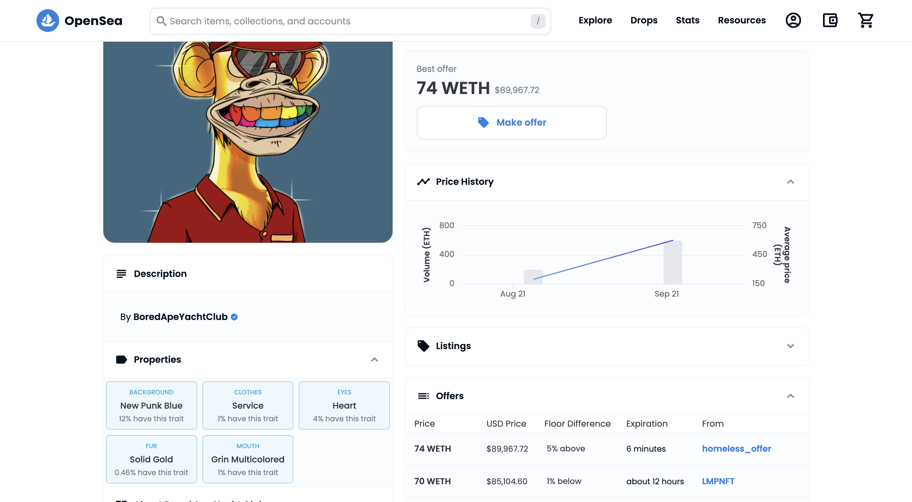
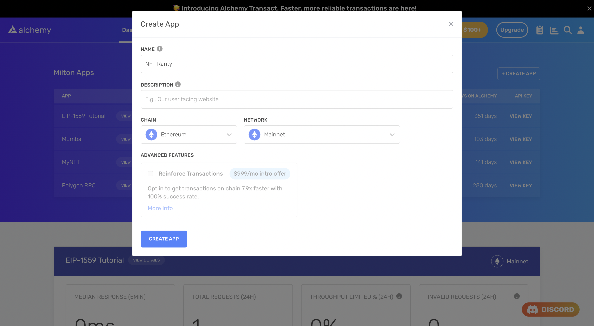

<Info>
  This tutorial uses the \*\*[computeRarity](/reference/computerarity) \*\*endpoint.
</Info>

Perhaps the most important determinant of an NFT's price is the rarity of its component traits relative to the rest of the collection.

Although *Bored Ape Yacht Club* NFTs are some of the most valuable in the world, there are significant differences in price within the collection. A laser eye or gold fur ape can fetch ten times the price of a more common ape with brown fur and bored eyes.

If you're building an NFT marketplace or analytics platform, it is absolutely essential that you display rarity data for each NFT in a collection. This helps buyers make more informed decisions about the reasonability of the ask price as well as helps them make better bids.



Rarity data or Properties of a BAYC NFT on the left panel

Typically, in order to compute the rarity of each trait of a particular NFT, you would need to do the following:

1. Spin up a node
2. Extract metadata for each NFT
3. Compute the frequency of occurrence of each trait in every individual category (background, eyes, fur, etc.)

Performing these steps can take a non-trivial amount of time and computational resources. However, it is possible to bypass this entire effort and replace it with a single call to the [computeRarity](/reference/sdk-computerarity) endpoint of Alchemy's NFT API.

## Overview

We will write a simple Node script that gets us trait rarity data of [BAYC NFT #7090](https://opensea.io/assets/ethereum/0xbc4ca0eda7647a8ab7c2061c2e118a18a936f13d/7090) using [a free Alchemy developer account](https://alchemy.com/?a=99a4749c0c) and the [NFT API](/reference/nft-api-quickstart).

## Creating the NFT Rarity Script

### Step 1: Install Node and npm

In case you haven't already, [install node and npm](https://nodejs.org/en/download/) on your local machine.

Make sure that node is at least **v14 or higher** by typing the following in your terminal:

<CodeGroup>
  ```shell shell
  node -v
  ```
</CodeGroup>

### Step 2: Create an Alchemy app

In case you haven't already, [sign up for a free Alchemy account](https://alchemy.com/?a=0537f986ca).



Alchemy's account dashboard where developers can create a new app on the Ethereum blockchain.

Next, navigate to the [Alchemy Dashboard](https://dashboard.alchemy.com/signup/?a=0537f986ca) and create a new app.

Make sure you set the chain to Ethereum and the network to Mainnet.

Once the app is created, click on your app's *View Key* button on the dashboard.

Take note of the **HTTP URL** and **API KEY**.

The URL will be in this form: `https://eth-mainnet.g.alchemy.com/v2/xxxxxxxxx`

You will need these later.

### Step 3: Create a node project

Let's now create an empty repository and install all node dependencies.

To make requests to the NFT API, we will use the [Alchemy SDK](/reference/alchemy-sdk-quickstart).

You can also use `axios` or `fetch` alternatively.

<CodeGroup>
  ```text Alchemy SDK
  mkdir nft-rarity && cd nft-rarity
  npm init -y
  npm install --save alchemy-sdk
  touch main.js
  ```

  ```text Axios
  mkdir nft-rarity && cd nft-rarity
  npm init -y
  npm install --save axios
  touch main.js
  ```

  ```text Fetch
  mkdir nft-rarity && cd nft-rarity
  npm init -y
  touch main.js
  ```
</CodeGroup>

This will create a repository named `nft-rarity` that holds all your files and dependencies.

Next, open this repo in your favorite code editor (for e.g. VS Code).

We will be writing our code in the `main.js` file.

### Step 4: Get rarity data of a particular NFT in a collection

To get all the attributes or traits data of a particular NFT as well as the rarity (or prevalence) associated with each attribute, we will use the [computeRarity](/reference/sdk-computerarity) method.

This method takes in two required arguments:

1. `contractAddress`: The address of the NFT collection (an ERC-721 or an ERC-1155 contract)
2. `tokenId`: The ID of the token

Add the following code to the `main.js` file.

<CodeGroup>
  ```javascript Alchemy SDK
  const { Alchemy, Network } = require("alchemy-sdk");

  const config = {
      apiKey: "<-- ALCHEMY API KEY -->",
      network: Network.ETH_MAINNET,
  };
  const alchemy = new Alchemy(config);

  const main = async () => {

      // BAYC contract address
      const address = "0xBC4CA0EdA7647A8aB7C2061c2E118A18a936f13D";

      // Token ID
      const tokenId = 7090;

      // Get attributes and rarity data
      const rarityData = await alchemy.nft.computeRarity(address, tokenId);
      console.log(rarityData);
  };

  const runMain = async () => {
      try {
          await main();
          process.exit(0);
      } catch (error) {
          console.log(error);
          process.exit(1);
      }
  };

  runMain();
  ```

  ```javascript Axios
  const axios = require('axios')

  // BAYC contract address
  const address = "0xBC4CA0EdA7647A8aB7C2061c2E118A18a936f13D";

  // Token ID
  const tokenId = 7090;

  // Alchemy API key
  const apiKey = "<-- ALCHEMY API KEY -->"

  // Alchemy URL
  const baseURL = `https://eth-mainnet.g.alchemy.com/nft/v2/${apiKey}`;
  const url = `${baseURL}/computeRarity/?contractAddress=${address}&tokenId=${tokenId}`;

  const config = {
      method: 'get',
      url: url,
  };

  // Make the request and print the formatted response:
  axios(config)
      .then(console.log)
      .catch(error => console.log('error', error));
  ```

  ```javascript Fetch
  import fetch from 'node-fetch';

  // BAYC contract address
  const address = "0xBC4CA0EdA7647A8aB7C2061c2E118A18a936f13D";

  // Token ID
  const tokenId = 7090;

  // Alchemy API key
  const apiKey = "<-- ALCHEMY API KEY -->"

  // Alchemy URL
  const baseURL = `https://eth-mainnet.g.alchemy.com/nft/v2/${apiKey}`;
  const url = `${baseURL}/computeRarity/?contractAddress=${address}&tokenId=${tokenId}`;

  var requestOptions = {
    method: 'get',
    redirect: 'follow'
  };

  fetch(url, requestOptions)
    .then(response => console.log)
    .catch(error => console.log('error', error))
  ```
</CodeGroup>

Run the script using:

<CodeGroup>
  ```shell shell
  node main.js
  ```
</CodeGroup>

This should produce output that looks something like this:

```shell
[
  { prevalence: 0.0394, traitType: 'Eyes', value: 'Heart' },
  {
    prevalence: 0.1232,
    traitType: 'Background',
    value: 'New Punk Blue'
  },
  {
    prevalence: 0.0116,
    traitType: 'Mouth',
    value: 'Grin Multicolored'
  },
  { prevalence: 0.0142, traitType: 'Clothes', value: 'Service' },
  { prevalence: 0.0046, traitType: 'Fur', value: 'Solid Gold' }
]
```

The value we are most interested in is *prevalence*. It tells us the fraction of all NFTs in the collection that have a particular trait.

You can cross-check these values with those displayed by this [NFT's OpenSea page](https://opensea.io/assets/ethereum/0xbc4ca0eda7647a8ab7c2061c2e118a18a936f13d/7090).

### Understanding the results

Let's now take a minute to understand what the results we obtained above mean. For BAYC NFT #7090, the following are true:

* 3.94% of the apes have *Heart* eyes
* 12.32% of all the NFTs have a *New Punk Blue* background
* 1.16% of the apes have a *Multicolored Grin*
* 1.42% of the apes have a *Service* dress
* 0.46% of the apes have a *Solid Gold* fur

While these individual trait rarities give us a good initial picture of how rare the NFT is, it is often convenient to generate an overall rarity score.

There isn't a score that is uniformly accepted and used by users and platforms alike. However, one popular measure is simply the sum of the reciprocal of all prevalences. In other words,

Rarity(NFT; trait1, trait2, ..., traitn) = (1/prevalence,trait1) + (1/prevalence,trait2) + ... + (1/prevalence,traitn)

The higher the rarity score, the rarer the NFT is.

Other measures include averaging the prevalence score, and computing their product. In these cases, a lower score denotes a higher rarity.

## Conclusion

Congratulations! You now know how to use the [Alchemy NFT API](/reference/nft-api) to get rarity data for a particular NFT in a collection.

If you enjoyed this tutorial, give us a tweet [@Alchemy](https://twitter.com/Alchemy).

Don't forget to join our [Discord server](https://www.alchemy.com/discord) to meet other blockchain developers, builders, and entrepreneurs.

Ready to start using the Alchemy NFT API?

[Create a free Alchemy account ](https://alchemy.com/?a=0537f986ca)and share your project with us!
