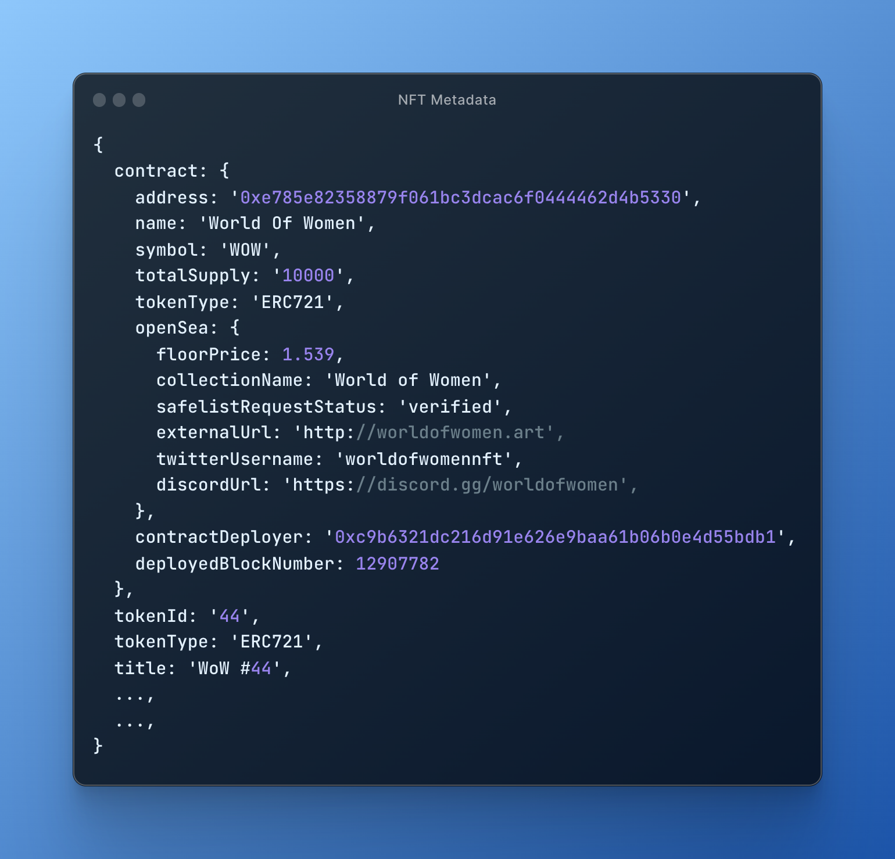
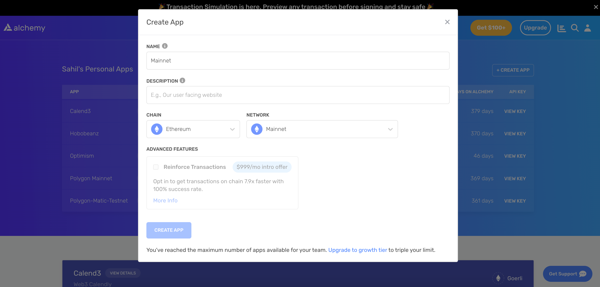

<Tip title="Don’t have an API key?" icon="star">
  Sign up or upgrade your plan for access. [Get started for free](https://dashboard.alchemy.com/signup/?a=fetch-complete-metadata)
</Tip>

# Objectives

By the end of this tutorial, you will be able to:

* Understand the importance and applications of NFT metadata
* Fetch the complete and up-to-date metadata for a specific NFT

***

# Table of Contents

* [Introduction](#introduction)

* [Setting up the project](#setting-up-the-project)

  * [Install Node and npm](#install-node-and-npm)
  * [Create an Alchemy App](#create-an-alchemy-app)
  * [Create a node project](#create-a-node-project)

* [Writing and Testing the Script](#writing-and-testing-the-script)

  * [Coding the Script](#coding-the-script)
  * [Understanding the Result](#understanding-the-result)

* [Importance of NFT and Contract Metadata](#importance-of-nft-and-contract-metadata)

* [Conclusion](#conclusion)

# Introduction

NFTs are digital assets that represent ownership of unique items or content on the blockchain. Each NFT has metadata associated with it, which contains vital information about the NFT, such as its title, description, media, and other attributes. In this tutorial, we will use Alchemy's [getNftMetadata](/reference/getnftmetadata) API to fetch complete metadata for a given NFT.



Getting metadata is crucial in understanding the properties and value of an NFT. It helps developers, collectors, and marketplaces to analyze and showcase the NFT's properties effectively.

***

# Setting up the project

## Install Node and npm

In case you haven't already, [install node and npm](https://nodejs.org/en/download/) on your local machine.

Make sure that node is at least **v14 or higher** by typing the following in your terminal:

<CodeGroup>
  ```shell shell
  node -v
  ```
</CodeGroup>

***

## Create an Alchemy App

To create an Alchemy app, follow these steps:

1. [Sign up for a free Alchemy account](https://dashboard.alchemy.com/signup/?a=fetch-complete-metadata).
2. Navigate to the [Alchemy Dashboard](https://dashboard.alchemy.com/signup/?a=fetch-complete-metadata) and create a new app.
3. Set the chain to **Ethereum** and the network to **Mainnet**.
4. Once the app is created, click on your app's *View Key* button on the dashboard.
5. Take note of the **HTTP URL**. The URL will be in this form: `https://eth-mainnet.g.alchemy.com/v2/xxxxxxxxx`. You will need this later.



Alchemy's account dashboard where developers can create a new app on the Ethereum blockchain.

***

## Create a node project

Let's now create an empty repository and install all node dependencies:

1. Run the following commands in order to create your node project and install Alchemy SDK.

<CodeGroup>
  ```shell Alchemy SDK
  mkdir getNftMetadata && cd getNftMetadata
  npm init -y
  npm install --save alchemy-sdk
  touch main.js
  ```
</CodeGroup>

2. This will create a repository named `getNftMetadata` that holds all your files and dependencies.
3. Next, open this repo in your favorite code editor.

Now our project is set up and we are ready to write code. We will write all our code in the `main.js` file.

***

# Writing and Testing the Script

## Coding the Script

The script below utilizes [getNFTMetadata](/reference/getnftmetadata) API through [Alchemy SDK](/reference/alchemy-sdk-quickstart) to fetch the metadata for of [World of Women](https://opensea.io/collection/world-of-women-nft) NFT Collection:

<CodeGroup>
  ```javascript main.js
  // Importing the required modules
  const { Network, Alchemy } = require("alchemy-sdk");

  // Configuring Alchemy SDK with your API key and network
  const settings = {
    apiKey: "demo", // Replace with your Alchemy API Key.
    network: Network.ETH_MAINNET, // Replace with the network your NFT is on.
  };

  // Creating an Alchemy instance to make calls to the Alchemy API
  const alchemy = new Alchemy(settings);

  // Function to get the metadata of an NFT: accepts the NFT contract address and the token ID to get the metadata of
  async function getNFTMetadata(nftContractAddress, tokenId) {
    // Making a call to the Alchemy API to get the metadata
    const response = await alchemy.nft.getNftMetadata(
      nftContractAddress,
      tokenId
    );
    return response; // returning the metadata
  }

  // main function that runs the script
  async function main() {
    // Getting the NFT metadata through the `getNFTMetadata` method
    const response = await getNFTMetadata(
      "0xe785E82358879F061BC3dcAC6f0444462D4b5330", //  World of Women NFT contract address: Replace with your own NFT contract address
      "44" // Replace with the token id you want to get the metadata of
    );
    console.log("NFT Metadata:\n", response); // logging the metadata to the console
  }

  // calling the main function to run the script
  main();
  ```
</CodeGroup>

Let's break down the code in bullet points:

* The script first imports the required modules
* After that, it configures the Alchemy SDK with appropriate API key and network
* Then it creates an Alchemy instance to make calls to the Alchemy API
* The script defines a function `getNFTMetadata` that accepts an NFT contract address and a token ID as its arguments: This function will fetch the metadata of the specified NFT.
* Inside the `getNFTMetadata` function, a call is made to the Alchemy API using the [`getNftMetadata`](/reference/getnftmetadata) method, passing the NFT contract address and token ID as parameters.
* The `getNFTMetadata` function returns the fetched metadata as its output.
* A `main` function is defined that runs the script: This function calls the `getNFTMetadata` function with a specific NFT contract address (World of Women) and token ID (44) to fetch the metadata.
* The main function then logs the fetched metadata to the console.

<Info>
  If you are facing the `"Error Code 429: Your app has exceeded its concurrent requests capacity"` error, try replacing the `"demo"` API key with your own API key that you copied in the ["Create an Alchemy App"](#create-an-alchemy-app) section.
</Info>

## Understanding the Result

After running the script, you will receive a response similar to the example below:

<CodeGroup>
  ```json response
  {
    "contract": {
      "address": "0xe785e82358879f061bc3dcac6f0444462d4b5330"
    },
    "id": {
      "tokenId": "44",
      "tokenMetadata": {
        "tokenType": "ERC721"
      }
    },
    "title": "WoW #44",
    "description": "",
    "tokenUri": {
      "gateway": "https://alchemy.mypinata.cloud/ipfs/QmTNBQDbggLZdKF1fRgWnXsnRikd52zL5ciNu769g9JoUP/44",
      "raw": "ipfs://QmTNBQDbggLZdKF1fRgWnXsnRikd52zL5ciNu769g9JoUP/44"
    },
    "media": [
      {
        "gateway": "https://nft-cdn.alchemy.com/eth-mainnet/9316855d8f60a32cd44aa71f07cd7dc1",
        "thumbnail": "https://res.cloudinary.com/alchemyapi/image/upload/thumbnailv2/eth-mainnet/9316855d8f60a32cd44aa71f07cd7dc1",
        "raw": "ipfs://QmUkdJKCsV8ixm2eDLJGosH8Bntwwx942YXxfuF9yXPBzi",
        "format": "png",
        "bytes": 105117
      }
    ],
    "metadata": {
      "name": "WoW #44",
      "image": "ipfs://QmUkdJKCsV8ixm2eDLJGosH8Bntwwx942YXxfuF9yXPBzi",
      "attributes": [
        {
          "value": "Green Orange",
          "trait_type": "Background"
        },
        {
          "value": "Medium Gold",
          "trait_type": "Skin Tone"
        },
        {
          "value": "Green To The Left",
          "trait_type": "Eyes"
        },
        {
          "value": "Freckles",
          "trait_type": "Facial Features"
        },
        {
          "value": "Boy Cut",
          "trait_type": "Hairstyle"
        },
        {
          "value": "Tunic",
          "trait_type": "Clothes"
        },
        {
          "value": "Spikes",
          "trait_type": "Earrings"
        },
        {
          "value": "Slight Smile",
          "trait_type": "Mouth"
        },
        {
          "value": "Purple",
          "trait_type": "Lips Color"
        }
      ]
    },
    "timeLastUpdated": "2023-03-30T12:11:50.505Z",
    "contractMetadata": {
      "name": "World Of Women",
      "symbol": "WOW",
      "totalSupply": "10000",
      "tokenType": "ERC721",
      "contractDeployer": "0xc9b6321dc216d91e626e9baa61b06b0e4d55bdb1",
      "deployedBlockNumber": 12907782,
      "openSea": {
        "floorPrice": 1.539,
        "collectionName": "World of Women",
        "safelistRequestStatus": "verified",
        "imageUrl": "https://i.seadn.io/gae/EFAQpIktMBU5SU0TqSdPWZ4byHr3hFirL_mATsR8KWhM5z-GJljX8E73V933lkyKgv2SAFlfRRjGsWvWbQQmJAwu3F2FDXVa1C9F?w=500&auto=format",
        "description": "World of Women is a collection of 10,000 NFTs that gives you full access to our network of artists, creators, entrepreneurs, and executives who are championing diversity and equal opportunity on the blockchain.\n\nCreated and illustrated by Yam Karkai (@ykarkai), World of Women has made prominent appearances at Christie's, The New Yorker and Billboard.\n\nJoin us to receive exclusive access to NFT drops, experiences, and much more.\n\nThe Time is WoW.",
        "externalUrl": "http://worldofwomen.art",
        "twitterUsername": "worldofwomennft",
        "discordUrl": "https://discord.gg/worldofwomen",
        "lastIngestedAt": "2023-03-21T21:22:13.000Z"
      }
    }
  }
  ```
</CodeGroup>

The response contains the following key information fields:

1. `contract`: Contains information about the NFT's smart contract.
   1. `address`: The address of the NFT's smart contract.

2. `id`: Contains information related to the NFT's token ID.

   1. `tokenId`: The specific token ID of the NFT.
   2. `tokenMetadata`: Metadata associated with the token ID.
      1. `tokenType`: The type of NFT token (e.g., ERC721).

3. `title`: The name of the NFT asset.

4. `description`: A brief human-readable description of the NFT.

5. `tokenUri`: Contains information related to the token URI.

   1. `gateway`: The URL for accessing the token metadata on IPFS via a gateway.
   2. `raw`: The raw IPFS URI for the token metadata.

6. `media`: Contains information related to the NFT's media asset.

   1. `gateway`: The URL for accessing the media asset on IPFS via a gateway.
   2. `thumbnail`: The URL for a resized thumbnail of the NFT media asset.
   3. `raw`: The raw IPFS URI for the media asset.
   4. `format`: The media format (e.g., jpg, gif, png) of the gateway and thumbnail assets.
   5. `bytes`: The size of the media asset in bytes.

7. `metadata`: Contains additional metadata associated with the NFT.

   1. `name`: The name of the NFT.
   2. `image`: The IPFS URI for the NFT's image.
   3. `attributes`: An array of attributes associated with the NFT, including `value` and `trait_type`.

8. `timeLastUpdated`: The ISO timestamp of the last cache refresh for the information returned in the metadata field.

9. `contractMetadata`: Contains metadata related to the NFT's contract.

   1. `name`: The NFT contract name.
   2. `symbol`: The NFT contract symbol abbreviation.
   3. `totalSupply`: The total number of NFTs in the NFT collection.
   4. `tokenType`: The type of NFT token (e.g., ERC721).
   5. `contractDeployer`: The Ethereum address that deployed the smart contract.
   6. `deployedBlockNumber`: The block number when the deployment transaction was successfully mined.
   7. `openSea`: Contains information related to the NFT's listing on OpenSea, including `floorPrice`, `collectionName`, `safelistRequestStatus`, `imageUrl`, `description`, `externalUrl`, `twitterUsername`, `discordUrl`, and `lastIngestedAt`.

10. `spamInfo`: Contains information about whether and why a contract was marked as spam.

    1. `isSpam`: Indicates whether the contract is spam ("true" if spam, else "false").
    2. `classifications`: A list of reasons why the contract was classified as spam.

You can use this detailed information to build amazing NFT dapps!

***

## Best Practices for Utilizing NFT Metadata

When working with NFT metadata, it's important to follow best practices to ensure that you're utilizing the available data effectively. Here are some recommended practices:

1. **Preferred Media URL:** When displaying the media associated with an NFT, it is recommended to use the `media.gateway` URL as the preferred media URL. If this URL is not available, fall back to `media.raw`. If neither is available, use `metadata.image`.
2. **Thumbnail usage and Resizing:** If the user wants to display a thumbnail, they can use `media.thumbnail`. If they need to resize the thumbnail, instructions on how to do so are provided in the [NFT API FAQ](/reference/nft-api-faq#how-does-image-resizing-work).
3. **Converting SVG images to PNG:** By default, Alchemy's API returns the same image format as is in the metadata. Sometimes that means SVG images. In case you want to obtain the PNG format for those images instead, you can follow the instructions given in the [NFT API FAQ](/reference/nft-api-faqnft-api-faq#how-can-i-get-png-images-instead-of-svg-when-using-alchemys-apis)

***

# Importance of NFT and Contract Metadata

## NFT Metadata

* **Understanding NFT properties and rarity**: NFT metadata provides essential information about the NFT, such as its name, description, unique attributes, and rarity. It helps developers and collectors understand the NFT's properties and evaluate its worth.
* **Displaying NFTs**: NFT marketplaces and galleries use metadata to display NFTs to potential buyers, showcasing the artwork, descriptions, and unique traits.
* **Integration with applications**: The metadata provides details about the NFT that enable developers to integrate NFTs into various applications, such as web3 dapps, games, virtual worlds, and other digital experiences, leveraging the unique properties and traits of the NFT.
* **Additional contextual information**: The NFT metadata offers more contextual information about the NFT, such as associated images, external URLs, social media handles, and descriptions. This information can help developers, collectors, and enthusiasts better understand the NFT's background, the creators behind it, and its significance within the broader community.
* **Complete and refreshed NFT metadata with Alchemy**: Alchemy's endpoints return complete and fresh NFT metadata. NFT metadata can change during reveals and sometimes on transfers. With Alchemy, you can guarantee that you are getting all relevant metadata in its most updated form.

## Contract Metadata

* **Smart contract interaction**: The contract metadata, including contract address, token type, and symbol, helps developers interact with the underlying smart contracts of NFTs. This information is necessary for developers to build applications that allow users to trade, transfer, or otherwise manage their NFTs.
* **Understanding the NFT collection**: The contract metadata provides information about the broader NFT collection, such as the total supply, the name of the collection, and the floor price. It enables developers and collectors to understand the context of the NFT within the larger collection.
* **Accessing collection information and community**: Contract metadata often includes links to external resources, such as the collection's official website, Twitter handle, and Discord server. These resources provide additional information about the collection and grant access to the community behind it.

***

# Conclusion

In this tutorial, you learned how to fetch complete NFT metadata using Alchemy's [getNftMetadata](/reference/getnftmetadata) method. Understanding and fetching metadata is crucial in analyzing and showcasing NFT properties and integrating NFTs into various applications.

Now you're equipped with the knowledge and tools to fetch NFT metadata for a specific NFT and build powerful applications leveraging the unique properties of NFTs 🚀

If you have any questions or need further assistance, feel free to join [Alchemy's Discord](https://alchemy.com/discord) and engage with the community. Also, don't forget to follow Alchemy on Twitter [@Alchemy](https://twitter.com/Alchemy) for the latest updates and news ✨
