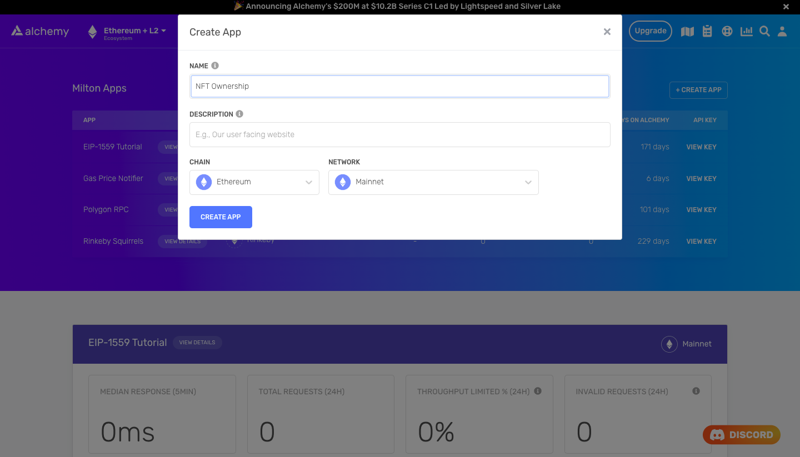

<Info>
  This tutorial uses the **[getSpamContracts](/reference/sdk-getspamcontracts)** endpoint.
</Info>

If you’re building a wallet or an NFT marketplace like [OpenSea](https://opensea.io), chances are you'll want to display NFTs that belong to a particular collection or are owned by a particular wallet.

Most blockchains, including Ethereum, allow anyone to airdrop NFTs into any wallet. Unfortunately, this means that users can sometimes receive NFTs that they do not actually want but are still visible on their profiles.


OpenSea identifies and hides certain NFTs by default

Identifying spam NFTs is a challenging problem to solve. Usually, it involves parsing the entire blockchain for ERC-721 and ERC-1155 contracts, tracking the NFT's activity, then labeling the activity as spam if it is suspicious (e.g., a copy of a popular project, airdropped without consent, etc.). This method typically requires an enormous amount of engineering resources and time.

Fortunately, you can bypass much of the above effort by using [Alchemy’s NFT API](https://docs.alchemy.com/alchemy/enhanced-apis/nft-api). Alchemy has already completed much of the heavy lifting of identifying spam contracts and makes that data available through easy-to-use API endpoints.

In this article, we will extract all NFTs owned by a particular wallet and exclude those that have been marked as spam by Alchemy.

<Info>
  If you are new to using the NFT API, check out the [NFT API Quickstart Guide](https://docs.alchemy.com/alchemy/enhanced-apis/nft-api/nft-api-quickstart-guide) to learn more about how the NFT API works.
</Info>

# Creating the Spam NFT Script

## Step 1: Install Node and npm

To start, [install node and npm](https://nodejs.org/en/download/) on your local machine. If you already have them installed, ensure that your Node version is at least v14 or higher. To check, type the following in your terminal:

<CodeGroup>
  ```bash bash
  node -v
  ```
</CodeGroup>

## Step 2: Create a new Alchemy app

In case you haven't already, sign up for a [free Alchemy account](https://alchemy.com/?a=6db6a5ec1e).



Alchemy dashboard where NFT developers can easily create a new app on a specific blockchain and network

Alchemy dashboard where NFT developers can easily create a new app on a specific blockchain and network.

Next, navigate to the [Alchemy Dashboard](https://dashboard.alchemyapi.io/) and create a new app (**Apps > Create App**). Make sure you set the **Chain** to **Ethereum** and **Network** to **Mainnet**.

Once you create the app:

1. Click on your app's **View Key** button.
2. Save the **HTTP URL** (e.g., something like `https://eth-mainnet.g.alchemy.com/nft/v2/xxxxxxxxx`).

You will need this URL later in this tutorial.

## Step 3: Create a Node Project

Next, create an empty repository and install all node dependencies.

To make requests to the NFT API, we recommend using the Alchemy SDK.

Alternatively, you can also use either `axios` or `fetch` libraries. From your terminal, run the following commands:

<CodeGroup>
  ```shell Alchemy SDK
  mkdir nft-spam && cd nft-spam
  npm init -y
  npm install --save alchemy-sdk
  touch main.js
  ```

  ```shell axios
  mkdir nft-spam && cd nft-spam
  npm init -y
  npm install --save axios
  touch main.js
  ```

  ```shell fetch
  mkdir nft-spam && cd nft-spam
  npm init -y
  touch main.js
  ```
</CodeGroup>

The above creates a repository named `nft-spam` that holds all the files and dependencies we need and the `main.js` file, where we will write our code. Open this repo in your preferred code editor (e.g., VS Code).

## Step 4: Removing Spam NFTs in a Wallet

Alchemy has identified close to 5000 smart contracts to be spam. If an NFT originates from any of these spam contracts, it is likely to be spam as well.

Now, let’s retrieve a list of all NFTs owned by a particular wallet (if you’re not sure how to do this, check out [this tutorial](https://docs.alchemy.com/alchemy/enhanced-apis/nft-api/how-to-get-all-nfts-owned-by-an-address)).

Then, we will check if the NFTs belong to a spam contract. To do this, all we have to do is add an `excludeFilters` argument to remove NFTs that have been marked as spam.

Add the following code to the `main.js` file:

<CodeGroup>
  ```javascript Alchemy SDK
  const { Alchemy, Network, NftFilters } = require("alchemy-sdk");

  const config = {
      apiKey: "<-- ALCHEMY APP API KEY -->",
      network: Network.ETH_MAINNET,
  };

  const alchemy = new Alchemy(config);

  const main = async () => {

      // Wallet address
      const address = "elanhalpern.eth";

      // Get non-spam NFTs
      let nfts = await alchemy.nft.getNftsForOwner(address, { excludeFilters: [NftFilters.SPAM] });
      nfts = nfts['ownedNfts'];

      console.log("Non-Spam NFTs")
      for (let i = 0; i < nfts.length; i++) {
          console.log("*", nfts[i].title)
      }
  };

  const runMain = async () => {
      try {
          await main();
          process.exit(0);
      } catch (error) {
          console.log(error);
          process.exit(1);
      }
  };

  runMain();
  ```

  ```javascript axios
  const axios = require('axios')

  // Wallet address
  const address = "elanhalpern.eth";

  // Alchemy URL
  const baseURL = `<-- ALCHEMY APP HTTP URL -->`;
  const url = `${baseURL}/getNFTs/?owner=${address}&excludeFilters=SPAM`;

  const config = {
      method: 'get',
      url: url,
  };

  // Make the request and print the formatted response:
  axios(config)
      .then(response => {
          let nfts = response['data']['ownedNfts'];

          console.log("Non-Spam NFTs")
          for (let i = 0; i < nfts.length; i++) {
              console.log("*", nfts[i].title)
          }
      })
      .catch(error => console.log('error', error));
  ```

  ```javascript fetch
  import fetch from 'node-fetch';

  // Wallet address
  const address = 'elanhalpern.eth';

  // Alchemy URL
  const baseURL = `<-- ALCHEMY APP HTTP URL -->`;
  const url = `${baseURL}/getNFTs/?owner=${address}&excludeFilters=SPAM`;

  var requestOptions = {
      method: 'GET',
      redirect: 'follow'
  };

  const getNonSpamNfts = async () => {

      // Get all non-spam NFTs
  		let nfts = await fetch(url, requestOptions);
      nfts = nfts['data']['ownedNfts']

      console.log("Non-Spam NFTs")
      for (let i = 0; i < nfts.length; i++) {
        console.log("*", nfts[i].title)
      }
  }

  getNonSpamNfts()
  ```
</CodeGroup>

Run the code with the following command:

<CodeGroup>
  ```bash bash
  node main.js
  ```
</CodeGroup>

This code should produce output that looks like this:

<CodeGroup>
  ```bash bash
  Non-Spam NFTs
  * DuskBreaker #9
  * Dev #6881
  * WAW #1878
  * You #1546
  * Super Fat Ape #570
  * Runner #3429  
  * cryptocreamery.eth
  * elanhalpern.eth
  * BFF Friendship Bracelet
  * BFF Friendship Bracelet
  * Founding Member
  * CityDAO Citizen
  * #4842
  * MAVION #1002
  * Shackled Genesis #622
  * Runner #3429
  * Squirrelly Squirrel #245
  * WAW S2 #9656
  * Founding BFF Friendship Bracelets
  * MAVION Gems - The OG
  * annika rose genesis #7/50
  * Zero Sum Destabilizer
  * Protocol Destabilizer
  * Diamond Hand Destabilizer
  ```
</CodeGroup>

# Conclusion

Congratulations! You now know how to use the Alchemy NFT API to identify and remove spam NFTs.

If you enjoyed this tutorial on how to get all NFTs owned by an address, tweet us at [@Alchemy](https://twitter.com/Alchemy) and give us a shoutout!

Don't forget to join our [Discord server](https://www.alchemy.com/discord) to meet other blockchain devs, builders, and entrepreneurs!

Ready to start using the Alchemy NFT API?

[Create a free Alchemy account](https://alchemy.com/?a=22e42c85f0) and share your project with us!
