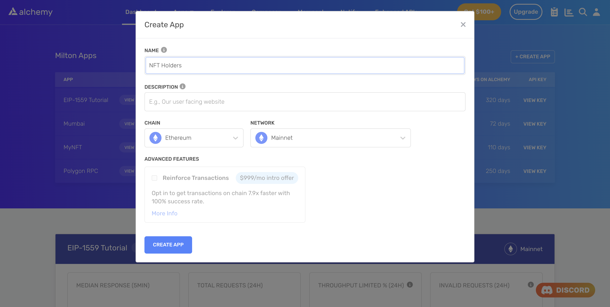

<Info>
  This tutorial uses the **[getOwnersForContract](/reference/sdk-getownersforcontract)** endpoint.
</Info>

Getting a list of wallet addresses that hold an NFT from a particular collection is an incredibly insightful piece of data. You could track the behavior of these wallets, and gain useful insights about the market. You could also generate analytics that mapped interests to wallets.

Although a vast number of companies and projects harvest NFT ownership data to display to their users, doing so through traditional means is not an easy task. Typically, you would have to spin up a node, and call the `ownerOf` function of the ERC-721 or ERC-1155 contract. Since it is not uncommon for NFT collections to have 10,000+ NFTs, it also means that you'll have to call the aforementioned function many, many times.

This process can be expensive and time consuming. Fortunately, we can save on time and engineering efforts by replacing all the above work with a single call to [getOwnersForContract](/reference/sdk-getownersforcontract).

### About this Tutorial

***

We will write a simple script in Node to gets us all the owners of the *World of Women* collection using [a free Alchemy developer account](https://alchemy.com/?a=89adfa3b06) and the [NFT API](/reference/nft-api-quickstart).

## Creating the NFT Holders Script

***

### Step 1: Install Node and npm

In case you haven't already, [install node and npm](https://nodejs.org/en/download/) on your local machine.

Make sure that node is at least **v14 or higher** by typing the following in your terminal:

<CodeGroup>
  ```shell shell
  node -v
  ```
</CodeGroup>

### Step 2: Create an Alchemy app

***

In case you haven't already, [sign up for a free Alchemy account](https://alchemy.com/?a=89adfa3b06).



Alchemy's account dashboard where developers can create a new app on the Ethereum blockchain.

Next, navigate to the [Alchemy Dashboard](https://dashboard.alchemy.com/signup/?a=89adfa3b06) and create a new app.

Make sure you set the chain to Ethereum and network to Mainnet.

Once the app is created, click on your app's *View Key* button on the dashboard.

Take a note of the **API KEY** and **HTTPS URL**.

The URL will be in this form: [https://eth-mainnet.g.alchemy.com/v2/xxxxxxxxx](https://eth-mainnet.g.alchemy.com/v2/xxxxxxxxx)

You will need this later.

***

### Step 3: Create a node project

Let's now create an empty repository and install all node dependencies.

To make requests to the NFT API, use the [Alchemy SDK](/reference/alchemy-sdk-quickstart).

You can also use `axios` or `fetch` alternatively.

<CodeGroup>
  ```text Alchemy SDK
  mkdir nft-holders && cd nft-holders
  npm init -y
  npm install --save alchemy-sdk
  touch main.js
  ```

  ```text Axios
  mkdir nft-holders && cd nft-holders
  npm init -y
  npm install --save axios
  touch main.js
  ```

  ```text Fetch
  mkdir nft-holders && cd nft-holders
  npm init -y
  touch main.js
  ```
</CodeGroup>

This will create a repository named `nft-holders` that holds all your files and dependencies.

Next, open this repo in your favorite code editor.

We will be writing all our code in the `main.js` file.

### Step 4: Get all current holders of the NFT collection

To get all holders of a particular NFT collection, we will use the [getOwnersForCollection](/reference/getownersforcollection) method.

This method takes in one required argument:

1. `contractAddress`: The address of the NFT collection (an ERC-721 or an ERC-1155 contract)

Note that it is also possible to optionally set a `block` height parameter. We do not need to do this here since it is set to the latest block by default.

Add the following code to the `main.js` file.

<CodeGroup>
  ```javascript Alchemy SDK
  const { Alchemy, Network } = require("alchemy-sdk");

  const config = {
      apiKey: "<-- ALCHEMY API KEY -->",
      network: Network.ETH_MAINNET,
  };
  const alchemy = new Alchemy(config);

  const main = async () => {

      // WOW contract address
      const address = "0xe785E82358879F061BC3dcAC6f0444462D4b5330";

      // Get owners 
      const owners = await alchemy.nft.getOwnersForContract(address);
      console.log(owners);
  };

  const runMain = async () => {
      try {
          await main();
          process.exit(0);
      } catch (error) {
          console.log(error);
          process.exit(1);
      }
  };

  runMain();
  ```

  ```javascript Axios
  const axios = require('axios')

  // WOW contract address
  const address = "0xe785E82358879F061BC3dcAC6f0444462D4b5330";

  // Alchemy URL
  const baseURL = `<-- ALCHEMY HTTP URL -->`;
  const url = `${baseURL}/getOwnersForCollection/?contractAddress=${address}`;

  const config = {
      method: 'get',
      url: url,
  };

  // Make the request and print the formatted response:
  axios(config)
      .then(console.log)
      .catch(error => console.log('error', error));
  ```

  ```javascript Fetch
  import fetch from 'node-fetch';

  // WOW contract address
  const address = "0xe785E82358879F061BC3dcAC6f0444462D4b5330";

  const baseURL = "<-- ALCHEMY APP HTTP URL -->";
  const url = `${baseURL}/getOwnersForCollection/?contractAddress=${address}`;

  var requestOptions = {
    method: 'get',
    redirect: 'follow'
  };

  fetch(url, requestOptions)
    .then(response => console.log)
    .catch(error => console.log('error', error))
  ```
</CodeGroup>

Run the following command on your terminal:

<CodeGroup>
  ```shell shell
  node main.js
  ```
</CodeGroup>

If all goes well, you should see output that looks something like this:

```shell
{
  owners: [
    '0x00189b281d7249950ecbe735653536c4a1821351',
    '0x0026691eed3d9ca5dcf7351dfbe113e6dfce528d',
    ........
    '0x050dd8aa03290cd4552882804239629912423f56',
    '0x05158928d3b7764187c691da53cef446aeb32f31',
    '0x05171c1ed768ccd3fe3b609f499b5405e4542682',
    '0x0522197898a464c83966eec76e441e391224e178',
    ... 5465 more items
  ]
}
```

## Conclusion

***

Congratulations! You now know how to use the [Alchemy NFT API](/reference/nft-api) to get a list of all holders of an NFT collection or contract.

If you enjoyed this tutorial on how to get all holders of an NFT collection, give us a tweet [@AlchemyPlatform](https://twitter.com/AlchemyPlatform).

Don't forget to join our [Discord server](https://www.alchemy.com/discord) to meet other blockchain devs, builders, and entrepreneurs.

Ready to start using the Alchemy NFT API?

[Create a free Alchemy account ](https://alchemy.com/?a=89adfa3b06)and share your project with us!
