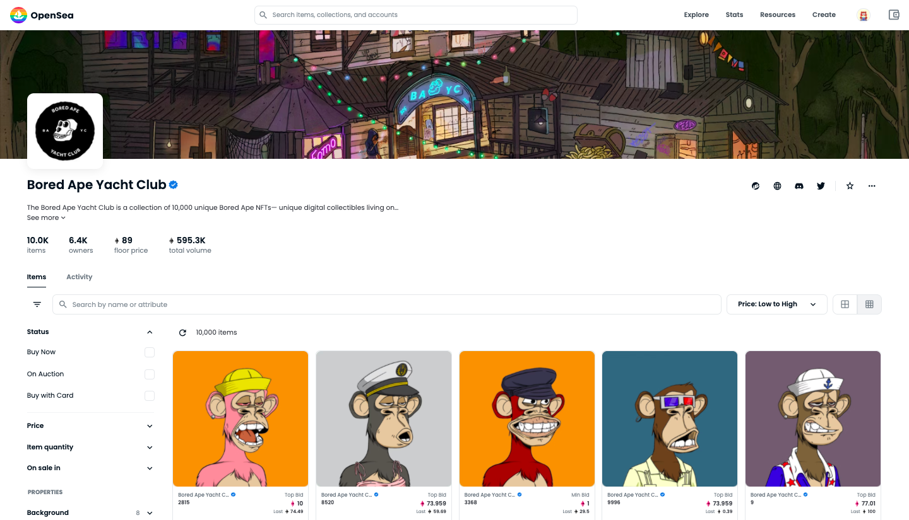
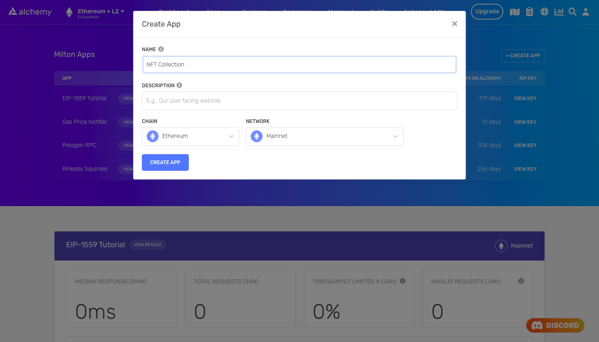

<Info>
  This tutorial uses the **[getNFTsForCollection](/reference/getnftsforcollection)** endpoint.
</Info>

If you just need the script for this tutorial refer to the below Recipe or continue reading for more

🖼️

Script to get all NFTs in a collection

Open Recipe

If you're building an NFT marketplace such as [OpenSea](https://opensea.io/), an NFT analytics platform like [rarity.tools](https://rarity.tools/), or a website for your PFP project, you will likely want to display all the NFTs in a collection you are interested in.



The Bored Ape Yacht Club collection on OpenSea

Typically, you might achieve this by calling functions on the contract directly and parsing the data that you're interested in. This approach requires an understanding of `ERC-721` or `ERC-1155` standards and involves making multiple individual requests for each NFT in the collection.

Using Alchemy's NFT API, however, you can retrieve all of the data for an entire NFT collection with a single call. This tutorial will guide you in creating a script that retrieves all metadata of an NFT collection.

## Our Example

In our example, we will write a script in Node that retrieves all metadata for each NFT in the Bored Ape Yacht Club (BAYC) collection on the Ethereum network. We will achieve this by using[ Alchemy ](https://alchemy.com/?a=e1a99cf277)and the [NFT API](./).

## Creating the NFT Collections Script

### Prerequisites

Before you begin the steps in this tutorial, ensure you complete the following steps:

* Install both[ Node.js ](https://nodejs.org/en/)(> 14) and [npm](https://www.npmjs.com/) on your local machine. To check your Node version, run the following command in your terminal:

<CodeGroup>
  ```bash bash
  node -v
  ```
</CodeGroup>

* [Create a free Alchemy account.](https://alchemy.com/?a=e1a99cf277)

### Step 1: Create an Alchemy app

To create an Alchemy app:

1. From [Alchemy's dashboard](https://dashboard.alchemyapi.io/), hover over the **Apps** drop-down menu and choose **Create App**.
2. Provide a **Name** and **Description** for your app. For **Chain**, select **Ethereum** and for **Network** select **Mainnet**.
3. Click the **Create App** button.



Creating an app on the Alchemy Dashboard

Once you have created your app, click on your app's **View Key** button in the dashboard and save the **API KEY**. We will use this later.

### Step 2: Create a Node project

Now, let's create an empty repository and install all node dependencies. To make requests to the NFT API, we recommend using the [Alchemy SDK](https://docs.alchemy.com/alchemy/sdk/sdk-quickstart). However, you can also use `axios` or `fetch` libraries. Run the following commands in your terminal:

<CodeGroup>
  ```shell Alchemy SDK (Recommended)
  mkdir nft-collection && cd nft-collection
  npm init -y
  npm install --save alchemy-sdk
  touch main.js
  ```

  ```shell Axios
  mkdir nft-collection && cd nft-collection
  npm init -y
  npm install --save axios
  touch main.js
  ```

  ```shell fetch
  mkdir nft-collection && cd nft-collection
  npm init -y
  touch main.js
  ```
</CodeGroup>

The above commands create a repository named `nft-collection` that holds all the files and dependencies we need. Open this repository in your favorite text editor (e.g., VS Code). We will write the remainder of our code in the `main.js` file.

### Step 3: Get all NFTs that belong to a collection

<Info>
  The SDK renames `getNFTsForCollection` to `getNftsForContract` for better consistency. They refer to the same method.
</Info>

To retrieve all of the NFTs that belong to a collection, we will use the `getNftsForContract` method. This method accepts one required argument and two optional arguments.

* `contractAddress`: The address of the NFT contract we're interested in. This is a required argument.
* `omitMetadata`: A `boolean` that indicates whether the method should omit the NFT metadata. By default, this is set to `false`.

As noted, the method returns NFT metadata by default. For more information about NFT metadata, check out the [NFT API FAQ](https://docs.alchemy.com/alchemy/enhanced-apis/nft-api/nft-api-faq#understanding-nft-metadata).

Add the following code to the `main.js` file, using your Alchemy API key:

<CodeGroup>
  ```javascript Alchemy SDK (Recommended)
  // Setup: npm install alchemy-sdk
  import { Alchemy, Network } from "alchemy-sdk";

  const config = {
    apiKey: "<-- ALCHEMY APP API KEY -->",
    network: Network.ETH_MAINNET,
  };
  const alchemy = new Alchemy(config);

  const main = async () => {
    // Contract address
    const address = "0xBC4CA0EdA7647A8aB7C2061c2E118A18a936f13D";

    // Flag to omit metadata
    const omitMetadata = false;

    // Get all NFTs
    const response = await alchemy.nft.getNftsForContract(address, {
      omitMetadata: omitMetadata,
    });
    console.log(JSON.stringify(response, null, 2));
  };

  const runMain = async () => {
    try {
      await main();
      process.exit(0);
    } catch (error) {
      console.log(error);
      process.exit(1);
    }
  };
  ```

  ```javascript Axios
  const axios = require('axios')

  // Contract address
  const address = '0xBC4CA0EdA7647A8aB7C2061c2E118A18a936f13D'

  // Metadata inclusion flag
  const withMetadata = 'true';

  // Alchemy API key
  const apiKey = '<-- YOUR ALCHEMY APP API KEY -->';

  // Alchemy URL
  const baseURL = `https://eth-mainnet.g.alchemy.com/nft/v2/${apiKey}/getNFTsForCollection`;
  const url = `${baseURL}?contractAddress=${address}&withMetadata=${withMetadata}`;

  const config = {
      method: 'get',
      url: url,
  };

  // Make the request and print the formatted response:
  axios(config)
      .then(response => console.log(JSON.stringify(response['data'], null, 2)))
      .catch(error => console.log(error));
  ```

  ````javascript fetch
  import fetch from 'node-fetch';

  // Contract address
  const address = '0xBC4CA0EdA7647A8aB7C2061c2E118A18a936f13D'

  // Metadata inclusion flag
  const withMetadata = 'true';

  // Alchemy API key
  const apiKey = '<-- ALCHEMY APP API KEY -->';

  // Alchemy URL
  const baseURL = `https://eth-mainnet.g.alchemy.com/nft/v2/${apiKey}/getNFTsForCollection`;
  const url = `${baseURL}?contractAddress=${address}&withMetadata=${withMetadata}`;

  var requestOptions = {
    method: 'get',
    redirect: 'follow'
  };

  fetch(url, requestOptions)
    .then(response => response.json())
    .then(response => JSON.stringify(response, null, 2))
    .then(result => console.log(result))
    .catch(error => console.log('error', error));
  ```
  
  

  Run this script by running the following command in your terminal:

  ```bash
  node main.js
  ```

  If successful, you should see output that looks something like this:

  ```
  { 
    "nfts":  
    [
      ... 
      {
        "contract": {
          "address": "0xbc4ca0eda7647a8ab7c2061c2e118a18a936f13d"
        },
        "id": {
          "tokenId": "0x00000000000000000000000000000000000000000000000000000000000000c7",
          "tokenMetadata": {
            "tokenType": "ERC721"
          }
        },
        "title": "",
        "description": "",
        "tokenUri": {
          "raw": "ipfs://QmeSjSinHpPnmXmspMjwiXyN6zS4E9zccariGR3jxcaWtq/199",
          "gateway": "https://ipfs.io/ipfs/QmeSjSinHpPnmXmspMjwiXyN6zS4E9zccariGR3jxcaWtq/199"
        },
        "media": [
          {
            "raw": "ipfs://QmUiCqmHZd5CxeGsamizmS2Y8eSuMkNgVN44RzLcFVctyw",
            "gateway": "https://res.cloudinary.com/alchemyapi/image/upload/mainnet/e8009d708d27f11c38fed183c70f2f48.png",
            "thumbnail": "https://res.cloudinary.com/alchemyapi/image/upload/w_256,h_256/mainnet/e8009d708d27f11c38fed183c70f2f48.png"
          }
        ],
        "metadata": {
          "image": "ipfs://QmUiCqmHZd5CxeGsamizmS2Y8eSuMkNgVN44RzLcFVctyw",
          "attributes": [
            {
              "value": "Army Green",
              "trait_type": "Background"
            },
            {
              "value": "Striped Tee",
              "trait_type": "Clothes"
            },
            {
              "value": "Zombie",
              "trait_type": "Eyes"
            },
            {
              "value": "Brown",
              "trait_type": "Fur"
            },
            {
              "value": "Grin",
              "trait_type": "Mouth"
            },
            {
              "value": "Girl's Hair Short",
              "trait_type": "Hat"
            }
          ]
        },
        "timeLastUpdated": "2022-05-26T14:52:39.110Z"
      }
    ],
    "nextToken": "0x00000000000000000000000000000000000000000000000000000000000000c8"
  }
  ````
</CodeGroup>

**Note:** The API will only return data for the first 100 NFTs. For collections that contain more than 100 NFTs, use the `startToken` argument for the `getNFTsForCollection` method and set it to the NFT number you wish to retrieve.

For instance, if you want data on NFTs 101-200, set `startToken` to 101. For 201-300, set it to 201. Continue this process until you reach the end of the collection.

For more information, check out the [NFT API docs](https://docs.alchemy.com/alchemy/enhanced-apis/nft-api/getnftsforcollection).

### Step 4: Parse the NFT API Output

As a final step, parse the API output to show the image URL of every NFT. In the case of BAYC, this is an IPFS (InterPlanetary File System) URL.

Replace the contents of `main.js` with the following code:

<CodeGroup>
  ```javascript Alchemy SDK (Recommended)
  // Setup: npm install alchemy-sdk
  import { Alchemy, Network } from "alchemy-sdk";

  const config = {
    apiKey: "<-- ALCHEMY APP API KEY -->",
    network: Network.ETH_MAINNET,
  };
  const alchemy = new Alchemy(config);

  const main = async () => {
    // Contract address
    const address = "0xBC4CA0EdA7647A8aB7C2061c2E118A18a936f13D";

    // Flag to omit metadata
    const omitMetadata = false;

    // Get all NFTs
    const { nfts } = await alchemy.nft.getNftsForContract(address, {
      omitMetadata: omitMetadata,
    });

    let i = 1;

    for (let nft of nfts) {
      console.log(`${i}. ${nft.rawMetadata.image}`);
      i++;
    }
  };

  const runMain = async () => {
    try {
      await main();
      process.exit(0);
    } catch (error) {
      console.log(error);
      process.exit(1);
    }
  };
  ```

  ```javascript Axios
  const axios = require('axios')

  // Contract address
  const address = '0xBC4CA0EdA7647A8aB7C2061c2E118A18a936f13D'

  // Metadata inclusion flag
  const withMetadata = 'true';

  // Alchemy API key
  const apiKey = '<-- YOUR ALCHEMY APP API KEY -->';

  // Alchemy URL
  const baseURL = `https://eth-mainnet.g.alchemy.com/nft/v2/${apiKey}/getNFTsForCollection`;
  const url = `${baseURL}?contractAddress=${address}&withMetadata=${withMetadata}`;

  const config = {
      method: 'get',
      url: url,
  };

  // Make the request and print the formatted response:
  axios(config)
      .then(response => {
          const nfts = response['data']['nfts']

          console.log("NFT Metadata")
          let i = 1
          for (let nft of nfts) {
              console.log(`${i}. ${nft['metadata']['image']}`)
              i++;
          }
      })
      .catch(error => console.log('error', error));
  ```

  ```javascript Fetch
  import fetch from 'node-fetch';

  // Contract address
  const address = '0xBC4CA0EdA7647A8aB7C2061c2E118A18a936f13D'

  // Metadata inclusion flag
  const withMetadata = 'true';

  // Alchemy API key
  const apiKey = '<-- ALCHEMY APP API KEY -->';

  // Alchemy URL
  const baseURL = `https://eth-mainnet.g.alchemy.com/nft/v2/${apiKey}/getNFTsForCollection`;
  const url = `${baseURL}?contractAddress=${address}&withMetadata=${withMetadata}`;

  var requestOptions = {
    method: 'get',
    redirect: 'follow'
  };

  fetch(url, requestOptions)
    .then(response => {
    
       const nfts = response['data']['nfts']

       console.log("NFT Metadata")
       let i = 1
       for (let nft of nfts) {
          console.log(`${i}. ${nft['metadata']['image']}`)
          i++;
       }  
    })
    .catch(error => console.log('error', error))
  ```
</CodeGroup>

Run the script by calling the following command in your terminal:

<CodeGroup>
  ```bash bash
  node main.js
  ```
</CodeGroup>

You should obtain output that looks like this:

<CodeGroup>
  ```bash bash
  NFT Metadata
  1. ipfs://QmRRPWG96cmgTn2qSzjwr2qvfNEuhunv6FNeMFGa9bx6mQ
  2. ipfs://QmPbxeGcXhYQQNgsC6a36dDyYUcHgMLnGKnF8pVFmGsvqi
  3. ipfs://QmcJYkCKK7QPmYWjp4FD2e3Lv5WCGFuHNUByvGKBaytif4
  4. ipfs://QmYxT4LnK8sqLupjbS6eRvu1si7Ly2wFQAqFebxhWntcf6
  5. ipfs://QmSg9bPzW9anFYc3wWU5KnvymwkxQTpmqcRSfYj7UmiBa7
  6. ipfs://QmNwbd7ctEhGpVkP8nZvBBQfiNeFKRdxftJAxxEdkUKLcQ
  7. ipfs://QmWBgfBhyVmHNhBfEQ7p1P4Mpn7pm5b8KgSab2caELnTuV
  8. ipfs://QmRsJLrg27GQ1ZWyrXZFuJFdU5bapfzsyBfm3CAX1V1bw6
  9. ipfs://QmXEqPbvM4aq1SQSXN8DSuEcSo5SseYW1izYQbsGB8yn9x
  10. ipfs://QmUQgKka8EW7exiUHnMwZ4UoXA11wV7NFjHAogVAbasSYy
  11. ipfs://QmPQdVU1riwzijhCs1Lk6CHmDo4LpmwPPLuDauY3i8gSzL
  12. ipfs://QmVvdAbabZ2awja88uUhYHFuq67iEiroFuwLGM6HyiWcc8
  13. ipfs://QmexFWUtmFNGQwVuRN8dLLwcucSFoLYjeHkv2uAyan5H8t
  14. ipfs://QmaZLhanFj41yfXY3Ux1JNv6ZAnzsWXfbJmo7qbJzZjh4s
  15. ipfs://QmbcWzteFsAvdwiaZyC1YJVNsApDaPRmqkQDyrYAvP4u48
  ```
</CodeGroup>

Congratulations! You now know how to use the Alchemy NFT API to retrieve all NFTs in a collection or at an address. You can adapt this for any network (e.g., Ethereum, Polygon, etc.).

If you enjoyed this tutorial about how to get all NFTs owned by an address, tweet us at [@AlchemyPlatform](https://twitter.com/AlchemyPlatform) and give the authors [@rounak\_banik](https://twitter.com/Rounak_Banik) and [@ankg404](https://twitter.com/ankg404) a shoutout!

Don't forget to join our [Discord server](https://www.alchemy.com/discord) to meet other blockchain devs, builders, and entrepreneurs!

Ready to start using the Alchemy NFT API?

[Create a free Alchemy account ](https://alchemy.com/?a=e1a99cf277)and do share your project with us!
