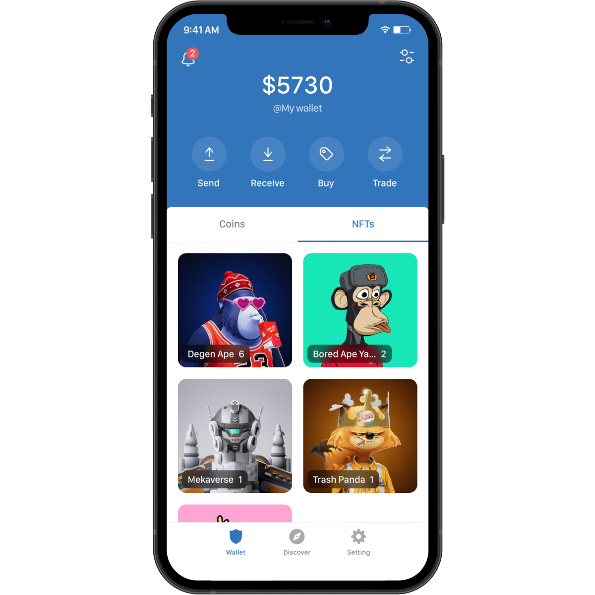
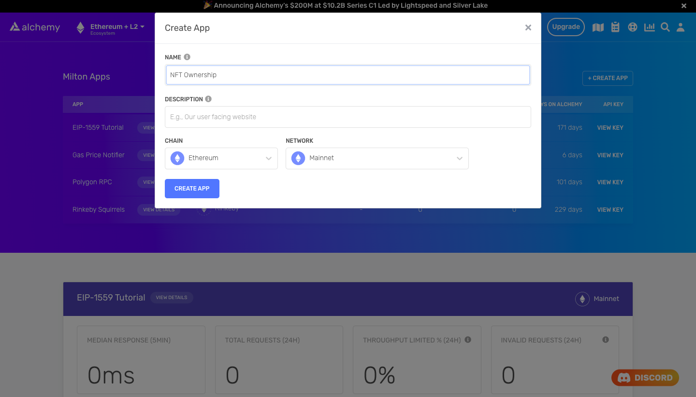

<Info>
  This tutorial uses the **[getNFTs](/reference/getnfts)** endpoint.
</Info>

If you just need the script for this tutorial refer to the below Recipe or continue reading for more

🖼️

Script to Get All NFTs Owned by an Address

Open Recipe

If you're building a wallet, an NFT marketplace like OpenSea, or a [Building a dApp with Real-Time Transaction Notifications](/docs/building-a-dapp-with-real-time-transaction-notifications), chances are that you will need to list all NFTs owned by a user as well as information about the NFTs themselves (such as name, description, traits, etc.)



NFT gallery showing multiple NFTs including Degen Apes, Bored Ape Yacht Club (BAYC), Mekaverse, and Degen Trash Pandas.

To get all NFTs owned by a user on a blockchain like Ethereum or Polygon, you would have to parse the entire blockchain since genesis, track all `ERC-721` and `ERC-1155` contracts, and track the latest ownership status of every NFT.

This requires a massive amount of engineering resources and time.

However, it is possible to bypass this effort by using [Alchemy's NFT API](/reference/nft-api).

In this tutorial, you will use the Alchemy NFT API to get all NFTs owned by a wallet address.

<Info>
  If you are new, read the [NFT API Quickstart Guide](/reference/nft-api-quickstart) to learn how the NFT API works.
</Info>

### About This Tutorial

You will write a simple script in `Node.js` to get the top 100 NFTs owned by a wallet on Ethereum.

This will be achieved using a [free Alchemy developer account](https://alchemy.com/?a=22e42c85f0) and the NFT API.

## Creating the NFT Ownership Script

### Step 1: Install Node and npm

In case you haven't already, [install node and npm](https://nodejs.org/en/download/) on your local machine.

Make sure that node is at least **v14 or higher** by typing the following in your terminal:

<CodeGroup>
  ```shell shell
  node -v
  ```
</CodeGroup>

### Step 2: Create a new Alchemy app

In case you haven't already, sign up for a [free Alchemy account](https://alchemy.com/?a=22e42c85f0).



Alchemy dashboard where NFT developers can easily create a new app on a specific blockchain and network.

Next, navigate to the [Alchemy Dashboard](https://dashboard.alchemyapi.io/) and create a new app.

Make sure you set the chain to Ethereum and network to Mainnet.

Once the app is created:

* click on your app's *View Key* button on the dashboard
* take a note of the **API Key** (e.g.`54gYyVG14f........................`)

You will need this API Key later.

### Step 3: Create a Node project

Next, create an empty repository and install all node dependencies.

To make requests to the NFT API, we recommend using the [Alchemy API Overview](/reference/api-overview)

Alternatively, you can use `axios` or `fetch`.

<CodeGroup>
  ```shell Alchemy SDK (Recommended)
  mkdir nft-ownership && cd nft-ownership
  npm init -y
  npm install --save alchemy-sdk
  touch main.js
  ```

  ```shell Axios
  mkdir nft-ownership && cd nft-ownership
  npm init -y
  npm install --save axios
  touch main.js
  ```

  ```shell Fetch
  mkdir nft-ownership && cd nft-ownership
  npm init -y
  touch main.js
  ```
</CodeGroup>

This will create a repository named `nft-ownership` that holds all the files and dependencies.

Open this repo in your favorite code editor.

You will be writing all your code in the `main.js` file.

### Step 4: Get all NFTs owned by an address

To get all NFTs owned by an address, use the `getNFTsForOwner` method.

The [getNFTsForOwner method](/reference/getnfts) takes in one required argument:

1. `owner`: The wallet address of which we want to get NFT ownership data.

By default, the `getNFTsForOwner` method returns metadata of the NFTs.

We are going to stick with this default behavior.

You can also restrict the NFT collections by passing in an array of `contractAddresses[]` and filtering out NFTs that have been classified as spam using the `filter` argument.

For more information on this, check out the [NFT API FAQ](/reference/nft-api). Add the following code to the `main.js` file:

<CodeGroup>
  ```javascript Alchemy SDK (Recommended)
  // Setup: npm install alchemy-sdk
  import { Alchemy, Network } from "alchemy-sdk";

  const config = {
    apiKey: "<-- ALCHEMY APP API KEY -->",
    network: Network.ETH_MAINNET,
  };
  const alchemy = new Alchemy(config);

  const main = async () => {
    // Get all NFTs
    const nfts = await alchemy.nft.getNftsForOwner("elanhapern.eth");
    // Print NFTs
    console.log(nfts);
  };

  const runMain = async () => {
    try {
      await main();
      process.exit(0);
    } catch (error) {
      console.log(error);
      process.exit(1);
    }
  };

  runMain();
  ```

  ```javascript Axios
  const axios = require('axios')

  // Wallet address
  const address = 'elanhalpern.eth'

  // Alchemy URL
  const baseURL = `<-- ALCHEMY APP HTTP URL -->`;
  const url = `${baseURL}/getNFTs/?owner=${address}`;

  const config = {
      method: 'get',
      url: url,
  };

  // Make the request and print the formatted response:
  axios(config)
      .then(response => console.log(response['data']))
      .catch(error => console.log('error', error));
  ```

  ```javascript Fetch
  import fetch from 'node-fetch';

  const baseURL = "<-- ALCHEMY APP HTTP URL -->";
  const address = "elanhalpern.eth";
  const url = `${baseURL}/getNFTs/?owner=${address}`;

  var requestOptions = {
    method: 'get',
    redirect: 'follow'
  };

  fetch(url, requestOptions)
    .then(response => response.json())
  	.then((data) => console.log(data))
    .catch(error => console.log('error', error))
  ```
</CodeGroup>

Run this script by typing:

<CodeGroup>
  ```shell shell
  node main.js
  ```
</CodeGroup>

You should then see an output that looks something like this:

<CodeGroup>
  ```shell output
  {
      "ownedNfts": [
          {
              "contract": {
                  "address": "0x0beed7099af7514ccedf642cfea435731176fb02"
              },
              "id": {
                  "tokenId": "28",
                  "tokenMetadata": {
                      "tokenType": "ERC721"
                  }
              },
              "title": "DuskBreaker #28",
              "description": "Breakers have the honor of serving humanity through their work on The Dusk. They are part of a select squad of 10,000 recruits who spend their days exploring a mysterious alien spaceship filled with friends, foes, and otherworldly technology.",
              "tokenUri": {
                  "raw": "https://duskbreakers.gg/api/breakers/28",
                  "gateway": "https://duskbreakers.gg/api/breakers/28"
              },
              "media": [
                  {
                      "raw": "https://duskbreakers.gg/breaker_images/28.png",
                      "gateway": "https://duskbreakers.gg/breaker_images/28.png"
                  }
              ],
              "metadata": {
                  "name": "DuskBreaker #28",
                  "description": "Breakers have the honor of serving humanity through their work on The Dusk. They are part of a select squad of 10,000 recruits who spend their days exploring a mysterious alien spaceship filled with friends, foes, and otherworldly technology.",
                  "image": "https://duskbreakers.gg/breaker_images/28.png",
                  "external_url": "https://duskbreakers.gg",
                  "attributes": [
                      {
                          "value": "Locust Rider Armor (Red)",
                          "trait_type": "Clothes"
                      },
                      ......
                      {
                          "value": "Big Smile (Purple)",
                          "trait_type": "Mouth"
                      },
                      {
                          "value": "Yellow",
                          "trait_type": "Background"
                      }
                  ]
              },
              "timeLastUpdated": "2022-02-16T22:52:54.719Z"
          },
          ......
      ],
      "totalCount": 6,
      "blockHash": "0xeb2d26af5b6175344a14091777535a2cb21c681665a734a8285f889981987630"
  }
  ```
</CodeGroup>

<Info>
  You get all the metadata about the NFTs in the same request.

  This data can be parsed and displayed on your web3 frontend with ease.
</Info>

If the address owns more than 100 NFTs, the response will contain a `pageKey` key-value pair.

Use this key to issue another request to `getNFTs` with `pageKey` as another argument to `owner`.

This will return the next 100 NFTs owned by the user.

You can repeat this process until you reach the end of the wallet's collection.

For more information, check out the NFT API docs.

### Step 5: Parse the NFT API output

The response you received in the previous step is not human-readable. Let's parse the API output to show only the titles of the NFTs owned by a wallet.

Replace the contents of `main.js` with the following:

<CodeGroup>
  ```javascript Alchemy SDK
  // Setup: npm install alchemy-sdk
  import { Alchemy, Network } from "alchemy-sdk";

  const config = {
    apiKey: "<-- ALCHEMY APP API KEY -->",
    network: Network.ETH_MAINNET,
  };
  const alchemy = new Alchemy(config);

  const main = async () => {
    // Wallet address
    const address = "elanhalpern.eth";

    // Get all NFTs
    const nfts = await alchemy.nft.getNftsForOwner(address);

    // Parse output
    const numNfts = nfts["totalCount"];
    const nftList = nfts["ownedNfts"];

    console.log(`Total NFTs owned by ${address}: ${numNfts} \n`);

    let i = 1;

    for (let nft of nftList) {
      console.log(`${i}. ${nft.title}`);
      i++;
    }
  };
  ```

  ```javascript Axios
  const axios = require('axios')

  // Wallet address
  const address = 'elanhalpern.eth'

  // Alchemy URL
  const baseURL = `<-- ALCHEMY APP HTTP URL -->`;
  const url = `${baseURL}/getNFTs/?owner=${address}`;

  const config = {
      method: 'get',
      url: url,
  };

  // Make the request and print the formatted response:
  axios(config)
      .then(response => {
          const nfts = response['data'];

          // Parse output
          const numNfts = nfts['totalCount'];
          const nftList = nfts['ownedNfts'];

          console.log(`Total NFTs owned by ${address}: ${numNfts} \n`);

          let i = 1;

          for (nft of nftList) {
              console.log(`${i}. ${nft['metadata']['name']}`)
              i++;
          }
      })
      .catch(error => console.log('error', error));
  ```

  ```javascript Fetch
  import fetch from 'node-fetch';

  const baseURL = "<-- ALCHEMY APP HTTP URL -->";
  const address = "elanhalpern.eth";
  const url = `${baseURL}/getNFTs/?owner=${address}`;

  var requestOptions = {
    method: 'get',
    redirect: 'follow'
  };

  fetch(url, requestOptions)
    .then(response => {
          const nfts = response['data'];

          // Parse output
          const numNfts = nfts['totalCount'];
          const nftList = nfts['ownedNfts'];

          console.log(`Total NFTs owned by ${address}: ${numNfts} \n`);

          let i = 1;

          for (nft of nftList) {
              console.log(`${i}. ${nft['metadata']['name']}`)
              i++;
          }
    })
    .catch(error => console.log('error', error))
  ```
</CodeGroup>

Run the script using:

<CodeGroup>
  ```shell shell
  node main.js
  ```
</CodeGroup>

You should obtain an output that looks like this:

```
Total NFTs owned by elanhalpern.eth: 18 

1. DuskBreaker #9
2. Dev #6881
3. WAW #1878
4. You #1546
5. Super Fat Ape #570
6. Runner #3429  
7. cryptocreamery.eth
8. elanhalpern.eth
9. BFF Friendship Bracelet
10. BFF Friendship Bracelet
11. CityDAO Citizen
12. #4842
13. MAVION #1002
14. Shackled Genesis #622
15. Runner #3429
16. Squirrelly Squirrel #245
17. Founding BFF Friendship Bracelets
18. MAVION Gems - The OG
```

### Conclusion

Congratulations! You now know how to use the Alchemy NFT API to get all NFTs owned by a user on a blockchain (whether that be Ethereum or Polygon).

If you enjoyed this tutorial on how to get all NFTs owned by an address, tweet us at [@AlchemyPlatform](https://twitter.com/AlchemyPlatform) and give the authors [@rounak\_banik](https://twitter.com/Rounak_Banik) and [@ankg404](https://twitter.com/ankg404) a shoutout!

Don't forget to join our [Discord server](https://www.alchemy.com/discord) to meet other blockchain devs, builders, and entrepreneurs!

Ready to start using the Alchemy NFT API?

[Create a free Alchemy account](https://alchemy.com/?a=22e42c85f0) and do share your project with us!
