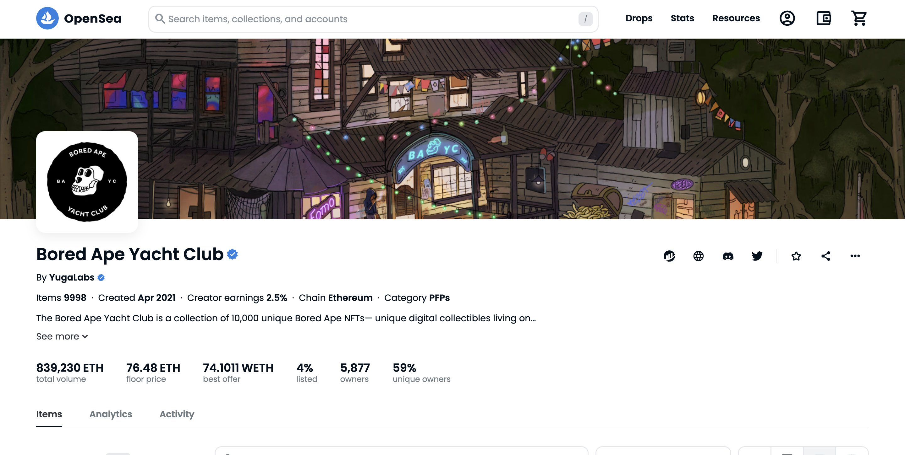
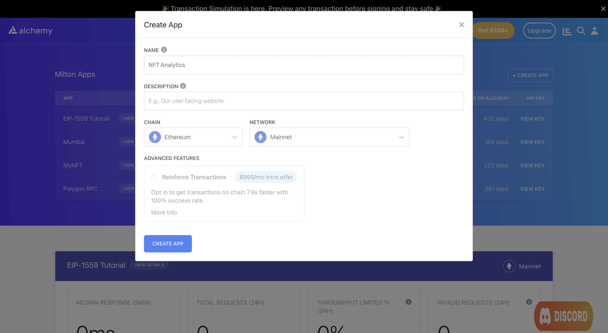

If you're running an NFT marketplace like OpenSea or an analytics platform that keeps track of sales across marketplaces, it is crucial that you provide two pieces of information to every buyer: the floor price of the collection (i.e the lowest price at which an NFT is on offer) and the sales history of every individual NFT.

Buyers usually make a decision to buy an NFT by looking at the absolute values as well as trends of these two data points.



The Bored Ape Yacht Club collection has a floor price of 76.48 ETH as of February 2023.

Although this data is publicly available, extracting and processing it typically involved a number of steps including:

1. Spin up a node
2. Track and index sales passing through the contracts of every major marketplace
3. Collate and verify transfers in the contracts of every NFT collection
4. Parse output

Following these steps usually takes a significant amount of computational resources and time. Fortunately, all of this data is made available through two API endpoints: [getNftSales](/reference/sdk-getnftsales) and [getFloorPrice](/reference/sdk-getfloorprice).

### About this Tutorial

***

We will write a simple script in Node that gets us the following:

1. The floor price of the *Bored Ape Yacht Club* collection on OpenSea and LooksRare marketplaces.
2. The sales history of BAYC #4871 on the OpenSea (Seaport) marketplace.

We will achieve both by using [a free Alchemy developer account](https://alchemy.com/?a=99a4749c0c) and the [NFT API](/reference/nft-api-quickstart).

### Creating the NFT Floor Price and Sales History Script

***

### Step 1: Install Node and npm

In case you haven't already, [install node and npm](https://nodejs.org/en/download/) on your local machine.

Make sure that node is at least **v14 or higher** by typing the following in your terminal:

### Step 2: Create an Alchemy app

***



Alchemy's account dashboard where developers can create a new app on the Ethereum blockchain.

1. In case you haven't already, [sign up for a free Alchemy account](https://alchemy.com/?a=3465966aec).
2. Navigate to the [Alchemy Dashboard](https://dashboard.alchemy.com/signup/?=3465966aec) and create a new app.
3. Set the chain to Ethereum and the network to Mainnet.
4. Once the app is created, click on your app's *View Key* button on the dashboard.
5. Take note of the **HTTP URL**. The URL will be in this form: `https://eth-mainnet.g.alchemy.com/v2/xxxxxxxxx`

***

### Step 3: Create a node project

Let's now create an empty repository and install all node dependencies.

To make requests to the NFT API, use the [Alchemy SDK](/reference/alchemy-sdk-quickstart).

You can also use `axios` or `fetch` alternatively.

<CodeGroup>
  ```shell Alchemy SDK
  mkdir nft-analytics && cd nft-analytics
  npm init -y
  npm install --save alchemy-sdk
  touch main.js
  ```

  ```shell Axios
  mkdir nft-analytics && cd nft-analytics
  npm init -y
  npm install --save axios
  touch main.js
  ```

  ```shell Fetch
  mkdir nft-analytics && cd nft-analytics
  npm init -y
  touch main.js
  ```
</CodeGroup>

This will create a repository named `nft-analytics` that holds all your files and dependencies.

Next, open this repo in your favorite code editor. We will be writing all our code in the `main.js` file.

### Step 4: Get the floor price of BAYC on OpenSea and Rarible

As mentioned earlier, the floor price of a collection is the lowest price at which any NFT in the collection is listed for sale on a particular marketplace. It is possible for floor prices to differ slightly across marketplaces.

To get the floor price across all supported marketplaces, we will use the [getNftSales](/reference/sdk-getnftsales) method. Check out the getNFTSales [documentation page](https://www.notion.so/alchemotion/To-get-the-floor-price-across-all-supported-marketplaces-we-will-use-the-getNftSales-method-getNFT-90f8615964e44085b2793471052bfd83?pvs=4) to see a complete list of Alchemy supported marketplaces.

This method takes in a single `contractAddress` argument that points to the ERC-721 or ERC-1155 contract representing the collection.

Add the following code to the `main.js` file.

<CodeGroup>
  ```javascript Alchemy SDK
  const { Alchemy, Network, NftFilters } = require("alchemy-sdk");

  const config = {
      apiKey: "<-- ALCHEMY APP API KEY -->",
      network: Network.ETH_MAINNET,
  };

  const alchemy = new Alchemy(config);

  const main = async () => {

      // BAYC contract address
      const address = "0xBC4CA0EdA7647A8aB7C2061c2E118A18a936f13D";

      // Get floor price
      const price = await alchemy.nft.getFloorPrice(address);
      console.log(price);

  };

  const runMain = async () => {
      try {
          await main();
          process.exit(0);
      } catch (error) {
          console.log(error);
          process.exit(1);
      }
  };

  runMain();
  ```

  ```javascript Axios
  const axios = require('axios')

  // BAYC contract address
  const address = "0xBC4CA0EdA7647A8aB7C2061c2E118A18a936f13D";

  // Alchemy API Key
  const apiKey = "<-- ALCHEMY APP API KEY -->"

  // Alchemy URL
  const baseURL = `https://eth-mainnet.g.alchemy.com/nft/v2/${apiKey}`;
  const url = `${baseURL}/getFloorPrice/?contractAddress=${address}`;

  const config = {
      method: 'get',
      url: url,
  };

  // Make the request and print the formatted response:
  axios(config)
      .then(response => {
          console.log(response['data'])
      })
      .catch(error => console.log('error', error));
  ```

  ```javascript Fetch
  import fetch from 'node-fetch';

  // BAYC contract address
  const address = "0xBC4CA0EdA7647A8aB7C2061c2E118A18a936f13D";

  // Alchemy API Key
  const apiKey = "<-- ALCHEMY APP API KEY -->"

  // Alchemy URL
  const baseURL = `https://eth-mainnet.g.alchemy.com/nft/v2/${apiKey}`;
  const url = `${baseURL}/getFloorPrice/?contractAddress=${address}`;

  var requestOptions = {
    method: 'get',
    redirect: 'follow'
  };

  fetch(url, requestOptions)
    .then(response => console.log(response['data']))
    .catch(error => console.log('error', error))
  ```
</CodeGroup>

Run the script using the following command:

<CodeGroup>
  ```shell shell
  node main.js
  ```
</CodeGroup>

If all goes well, you should see output that looks something like this:

<CodeGroup>
  ```json json
  {
    openSea: {
      floorPrice: 76.48,
      priceCurrency: 'ETH',
      collectionUrl: 'https://opensea.io/collection/boredapeyachtclub'
      retrievedAt: '2023-02-19T11:25:03.300Z'
    },
    looksRare: {
      floorPrice: 75.9,
      priceCurrency: 'ETH',
     	retrievedAt: '2023-02-19T11:33:34.303Z',
      collectionUrl: 'https://looksrare.org/collections/0xbc4ca0eda7647a8ab7c2061c2e118a18a936f13d'd'
    }
  }
  ```
</CodeGroup>

As you can see, at the time of this writing, the floor price of BAYC is 76.48 ETH on OpenSea and 75.9 ETH on LooksRare.

### Step 5: Extracting the sales history of a token

Let's now write a script that extracts the sale history of an NFT. Again, this is made extremely simple using the [NFT API](/reference/nft-api-quickstart) and the [getNftSales](/reference/sdk-getnftsales) method.

The aforementioned method takes in the following arguments:

1. `fromBlock`: The block we want to track sales from. We usually set this to genesis or 0.
2. `toBlock`: The block until which we want to track sales. The default is `latest`.
3. `order`: A flag which allows you to get history in either chronological or reverse-chronological order.
4. `marketplace`: The marketplace we want sales history from.
5. `contractAddress`: The address of the NFT collection.
6. `tokenId`: The NFT we want the sales history for. By default, the function returns sales history for all IDs.

There are a few other arguments that you can set beyond this. For our scenario of getting sales history of BAYC #4871 on OpenSea (Seaport), the above will suffice.

Create a new file called `sales_history.js` and add the following code:

<CodeGroup>
  ```javascript Alchemy SDK
  const { Alchemy, Network, NftSaleMarketplace } = require("alchemy-sdk");

  const config = {
      apiKey: "<-- ALCHEMY APP API KEY -->",
      network: Network.ETH_MAINNET,
  };

  const alchemy = new Alchemy(config);

  const main = async () => {

      // BAYC contract address
      const address = "0xBC4CA0EdA7647A8aB7C2061c2E118A18a936f13D";

      // Get sales history of BAYC #1000
      const history = await alchemy.nft.getNftSales({
          fromBlock: 0,
          toBlock: 'latest',
          marketplace: NftSaleMarketplace.SEAPORT,
          contractAddress: address,
          tokenId: 4871,
      })

      console.log(history);

  };

  const runMain = async () => {
      try {
          await main();
          process.exit(0);
      } catch (error) {
          console.log(error);
          process.exit(1);
      }
  };

  runMain();
  ```

  ```javascript Axios
  const axios = require('axios')

  // BAYC contract address
  const address = "<-- ALCHEMY APP API KEY -->";

  // Alchemy URL
  const baseURL = `https://eth-mainnet.g.alchemy.com/nft/v2/NQSuAhlOs706-XBHAkbF6rbLJ50InHTj`;
  const url = `${baseURL}/getNFTSales/?contractAddress=${address}&tokenId=4871&marketplace=seaport`;

  const config = {
      method: 'get',
      url: url,
  };

  // Make the request and print the formatted response:
  axios(config)
      .then(response => {
          console.log(response['data'])
      })
      .catch(error => console.log('error', error));
  ```

  ```javascript Fetch
  import fetch from 'node-fetch';

  // BAYC contract address
  const address = "0xBC4CA0EdA7647A8aB7C2061c2E118A18a936f13D";

  // Alchemy API Key
  const apiKey = "<-- ALCHEMY APP API KEY -->"

  // Alchemy URL
  const baseURL = `https://eth-mainnet.g.alchemy.com/nft/v2/${apiKey}`;
  const url = `${baseURL}/getNFTSales/?contractAddress=${address}&tokenId=4871&marketplace=seaport`;

  var requestOptions = {
    method: 'get',
    redirect: 'follow'
  };

  fetch(url, requestOptions)
    .then(response => console.log(response['data']))
    .catch(error => console.log('error', error))
  ```
</CodeGroup>

Run the script using the following command:

<CodeGroup>
  ```shell shell
  node sales_history.js
  ```
</CodeGroup>

If all goes well, you should see output that looks something like this:

<CodeGroup>
  ```json json
  {
    "nftSales": [
      {
        "marketplace": "seaport",
        "marketplaceAddress": "0x00000000006c3852cbef3e08e8df289169ede581",
        "contractAddress": "0xbc4ca0eda7647a8ab7c2061c2e118a18a936f13d", 
        "tokenId": "4871",
        "quantity": "1",
        "buyerAddress": "0x2018b8ca226fdf90eec11f94cc1208c1151ae221",
        "sellerAddress": "0x2cdf2cd096ec9c9724f3920c504dced58b3d3fac",
        "taker": "SELLER",
        "sellerFee": {},
        "protocolFee": {},
        "royaltyFee": {},
        "blockNumber": 15001375,
        "logIndex": 122,
        "bundleIndex": 0,
        "transactionHash": "0xa712a94db879306852bf1a71a16d08a516b6add725e9480c7f498ecd49871a4e"
      },
      {
        "marketplace": "seaport", 
        "marketplaceAddress": "0x00000000006c3852cbef3e08e8df289169ede581",
        "contractAddress": "0xbc4ca0eda7647a8ab7c2061c2e118a18a936f13d",
        "tokenId": "4871",
        "quantity": "1", 
        "buyerAddress": "0x87bc2f2ba8c83f412fed5c3151de0ffbdc959984",
        "sellerAddress": "0xcc4bcaef47d551846525dab499d156e85aeba65a",
        "taker": "BUYER",
        "sellerFee": {},
        "protocolFee": {},
        "royaltyFee": {},
        "blockNumber": 15717503,
        "logIndex": 35,
        "bundleIndex": 0,
        "transactionHash": "0x58d9092831b261a4fd59cd2a8dd6d07b05ec05f94eb95a1f8312c8cfb9ebf305"
      }
    ]
  }
  ```
</CodeGroup>

## Conclusion

***

Congratulations! You now know how to use the [Alchemy NFT API](/reference/nft-api) to get the floor price and sales history of an NFT collection.

If you enjoyed this tutorial on how to get all owners of an NFT collection, give us a tweet [@AlchemyPlatform](https://twitter.com/AlchemyPlatform).

Don't forget to join our [Discord server](https://www.alchemy.com/discord) to meet other blockchain devs, builders, and entrepreneurs.

Ready to start using the Alchemy NFT API?

[Create a free Alchemy account ](https://alchemy.com/?a=99a4749c0c)and share your project with us!
