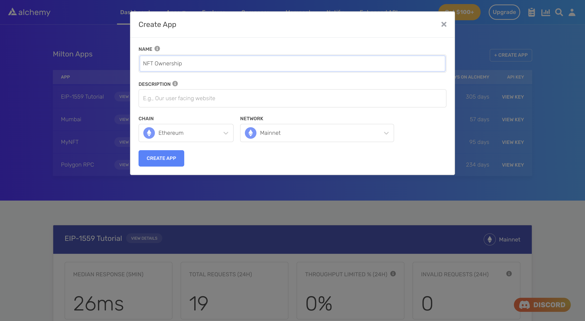

<Info>
  This tutorial uses the **[getOwnersForContract](/reference/sdk-getownersforcontract)** endpoint.
</Info>

Ownership data for an NFT collection is quite possibly the most important piece of information stored on-chain for that particular collection. Needless to say, it is data that is heavily harvested by NFT and non-NFT projects alike.

This information can be critical if you own the project and you want to reward your owners with extra utility (for example, an airdrop). It is also extremely useful to other projects that are trying to gain traction from owners of well-established collections.


The Bored Ape Yacht Club NFT collection

It is common for projects to use ownership data from a particular height instead of the latest block. This is done to ensure that the market prices of the NFTs remain relatively stable, and long-term holders are rewarded for their loyalty and contributions.

Typically, in order to get ownership data for an NFT collection at a particular block, you would have to do the following:

1. Spin up a node
2. Extract historical data for the block height you're interested in
3. Call functions on the NFT contract
4. Parse the output

Following these steps usually takes a significant amount of resources and time. For instance, to get the ownership data of a 10,000 PFP collection, you'd have to call the `ownerOf` function 10,000 times.

Fortunately, all of this data is actually available in one API call: [getOwnersForCollection](/reference/getownersforcollection).

### About this Tutorial

***

We will write a simple script in Node to gets us all the owners of the *Bored Ape Yacht Club* collection at block number 15753215 using [a free Alchemy developer account](https://alchemy.com/?a=99a4749c0c) and the [NFT API](/reference/nft-api-quickstart).

## Creating the NFT Ownership Script

***

### Step 1: Install Node and npm

In case you haven't already, [install node and npm](https://nodejs.org/en/download/) on your local machine.

Make sure that node is at least **v14 or higher** by typing the following in your terminal:

<CodeGroup>
  ```shell shell
  node -v
  ```
</CodeGroup>

### Step 2: Create an Alchemy app

***

In case you haven't already, [sign up for a free Alchemy account](https://alchemy.com/?a=99a4749c0c).



Alchemy's account dashboard where developers can create a new app on the Ethereum blockchain.

Next, navigate to the [Alchemy Dashboard](https://dashboard.alchemy.com/signup/?a=99a4749c0c) and create a new app.

Make sure you set the chain to Ethereum and the network to Mainnet.

Once the app is created, click on your app's *View Key* button on the dashboard.

Take note of the **HTTP URL**.

The URL will be in this form: `https://eth-mainnet.g.alchemy.com/v2/xxxxxxxxx`

You will need this later.

***

### Step 3: Create a node project

Let's now create an empty repository and install all node dependencies.

To make requests to the NFT API, use the [Alchemy SDK](/reference/alchemy-sdk-quickstart).

You can also use `axios` or `fetch` alternatively.

<CodeGroup>
  ```shell Alchemy SDK
  mkdir nft-ownership && cd nft-ownership
  npm init -y
  npm install --save alchemy-sdk
  touch main.js
  ```

  ```shell Axios
  mkdir nft-ownership && cd nft-ownership
  npm init -y
  npm install --save axios
  touch main.js
  ```

  ```shell Fetch
  mkdir nft-ownership && cd nft-ownership
  npm init -y
  touch main.js
  ```
</CodeGroup>

This will create a repository named `nft-ownership` that holds all your files and dependencies.

Next, open this repo in your favorite code editor.

We will be writing all our code in the `main.js` file.

### Step 4: Get owners of the NFT collection

To get all owners of a particular NFT collection, we will use the [getOwnersForCollection](/reference/getownersforcollection) method.

This method takes in two arguments:

1. `contractAddress`: The address of the NFT collection (an ERC-721 or an ERC-1155 contract)
2. `block`: The point in time or block number (in hex or decimal) to fetch collection ownership information for.

Note that the `block` parameter is optional. If you do not set it, the API will fetch ownership information from the latest available block.

Add the following code to the `main.js` file.

<CodeGroup>
  ```javascript Alchemy SDK
  const { Alchemy, Network } = require("alchemy-sdk");

  const config = {
      apiKey: "<-- ALCHEMY API KEY -->",
      network: Network.ETH_MAINNET,
  };
  const alchemy = new Alchemy(config);

  const main = async () => {

      // BAYC contract address
      const address = "0xBC4CA0EdA7647A8aB7C2061c2E118A18a936f13D";

      // Block number or height
      const block = "15753215";

      // Get owners 
      const owners = await alchemy.nft.getOwnersForContract(address, false, block);
      console.log(owners);
  };

  const runMain = async () => {
      try {
          await main();
          process.exit(0);
      } catch (error) {
          console.log(error);
          process.exit(1);
      }
  };

  runMain();
  ```

  ```javascript Axios
  const axios = require('axios')

  // BAYC contract address
  const address = "0xBC4CA0EdA7647A8aB7C2061c2E118A18a936f13D";

  // Block number or height
  const block = "15753215";

  // Alchemy URL
  const baseURL = `<-- ALCHEMY HTTP URL -->`;
  const url = `${baseURL}/getOwnersForCollection/?contractAddress=${address}&block=${block}`;

  const config = {
      method: 'get',
      url: url,
  };

  // Make the request and print the formatted response:
  axios(config)
      .then(console.log)
      .catch(error => console.log('error', error));
  ```

  ```javascript Fetch
  import fetch from 'node-fetch';

  // BAYC contract address
  const address = "0xBC4CA0EdA7647A8aB7C2061c2E118A18a936f13D";

  // Block number or height
  const block = "15753215";

  const baseURL = "<-- ALCHEMY APP HTTP URL -->";
  const url = `${baseURL}/getOwnersForCollection/?contractAddress=${address}&block=${block}`;

  var requestOptions = {
    method: 'get',
    redirect: 'follow'
  };

  fetch(url, requestOptions)
    .then(response => console.log)
    .catch(error => console.log('error', error))
  ```
</CodeGroup>

Run the script using the following command:

<CodeGroup>
  ```shell shell
  node main.js
  ```
</CodeGroup>

If all goes well, you should see output that looks something like this:

```shell
{
  owners: [
    '0x000000000000000000000000000000000000dead',
    '0x000001f568875f378bf6d170b790967fe429c81a',
    '0x0001bb2a72173f3a1aaae96bd0ddb1f8be4f91b7',
    ........
    '0x034c4322251c8eec17a1667e629e072a70f4dc35',
    '0x03546b22bc80b3e6b64c4445963d981250267a68',
    '0x0359e5cb17c3f712886b276433213f456e0579dc',
    ... 6315 more items
  ]
}
```

## Conclusion

***

Congratulations! You now know how to use the [Alchemy NFT API](/reference/nft-api) to get a list of owners of an NFT collection at a particular block height.

If you enjoyed this tutorial on how to get all owners of an NFT collection, give us a tweet [@AlchemyPlatform](https://twitter.com/AlchemyPlatform).

Don't forget to join our [Discord server](https://www.alchemy.com/discord) to meet other blockchain devs, builders, and entrepreneurs.

Ready to start using the Alchemy NFT API?

[Create a free Alchemy account ](https://alchemy.com/?a=99a4749c0c)and share your project with us!
