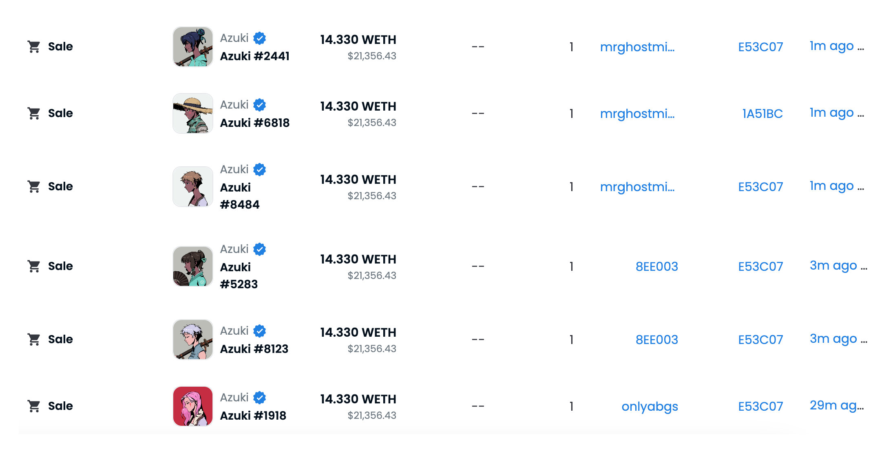
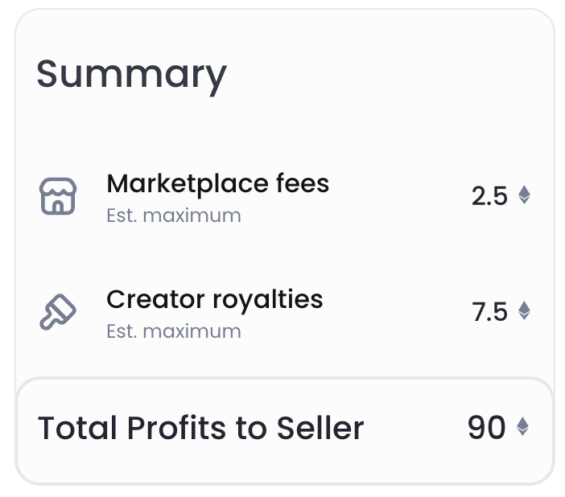
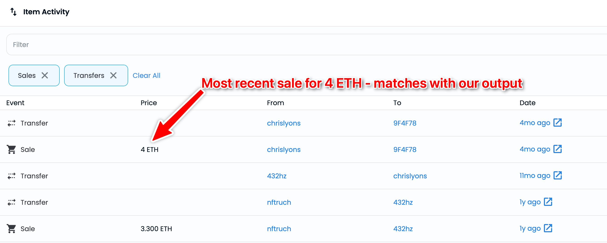

### Don’t have an API key?

Start using this API in your app today.

[Get started for free](https://dashboard.alchemy.com/signup/)

<Info>
  The tutorial uses the **[getNftSales](/reference/getnftsales)** API.
</Info>

# Introduction

In the world of blockchain and decentralized finance, non-fungible tokens (NFTs) have gained immense popularity in recent years. NFTs are unique digital assets that are used to represent ownership of various forms of art, collectibles, and other real-world assets. As the demand for NFTs continues to grow, tracking their prices and value has become increasingly important.

As a developer, you may want to retrieve the last sale price of an NFT to build various blockchain applications, such as NFT marketplaces, price trackers, or analytics tools. However, retrieving this information can be challenging, especially since NFT transactions occur on decentralized marketplaces where data is not always easily accessible.

In this tutorial, we will show you how to use Alchemy SDK to get the last sale price of an NFT. With our step-by-step guide, you'll be able to retrieve this data quickly and efficiently, giving you the information you need to build powerful NFT dapps. Whether you're an experienced blockchain developer or just getting started, this tutorial will provide you with the knowledge and skills you need to work with NFTs using Alchemy SDK.



Opensea's interface showing the last sale prices for Azuki NFTs

***

# Understanding the Last Sale Price of an NFT

As a developer, it's essential to understand the calculation behind the last sale price of an NFT. Even though you will be making an API request using Alchemy SDK to get this information, understanding the underlying calculation is crucial for building more complex applications and making informed decisions.

When an NFT is sold on a marketplace, the total sale price consists of three different fees:

* `sellerFee`: It is the amount paid to the wallet address of the seller.
* `protocolFee`: It is the fee charged by the marketplace for using it, this fee is sent to the NFT marketplace such as OpenSea.
* `royaltyFee`: The `royaltyFee` is paid to the owner address of the NFT collection whenever the NFT is re-sold, but only if the NFT was originally sold as part of a collection that takes a royalty fee. Some NFT collections do not charge any `royaltyFee`.

These three fees combined gives us the Last Sale Price of an NFT.

For example, if the last sale price of an NFT is 100 ETH, with a protocol fee of 2.5% and a royalty fee of 7.5%, the Seller Fee would be:

<CodeGroup>
  ```markdown Seller Fee Calculation
  Last Sale Price = Seller Fee + Protocol Fee + Royalty Fee
  Seller Fee = Last Sale Price - (Protocol Fee + Royalty Fee)
  Seller Fee = 100 ETH - (2.5% * 100 ETH + 7.5% * 100 ETH)
  Seller Fee = 100 ETH - 10 ETH
  Seller Fee = 90 ETH
  ```
</CodeGroup>

In this case, the seller would have received 90 ETH, while the remaining 10 ETH would be split between the NFT marketplace and the original NFT collection owner.



The breakdown of Protocol Fee, Royalty Fee and Seller Fee for an NFT whose last sale price is 100 ETH

Now that we understand the calculation behind the last sale price of an NFT, let's get our hands dirty and start a node.js project to get the last sale price of an NFT.

***

# Setting up the project

## Install Node and npm

In case you haven't already, [install node and npm](https://nodejs.org/en/download/) on your local machine.

Make sure that node is at least **v14 or higher** by typing the following in your terminal:

<CodeGroup>
  ```shell shell
  node -v
  ```
</CodeGroup>

***

## Create an Alchemy app

In case you haven't already, [sign up for a free Alchemy account](https://dashboard.alchemy.com/signup/).


Alchemy's account dashboard where developers can create a new app on the Ethereum blockchain.

Next, navigate to the [Alchemy Dashboard](https://dashboard.alchemy.com/signup) and create a new app.

Make sure you set the chain to Ethereum and the network to Mainnet. Once the app is created, click on your app's *View Key* button on the dashboard.

Take note of the **HTTP URL**.

The URL will be in this form: `https://eth-mainnet.g.alchemy.com/v2/xxxxxxxxx`

You will need this later.

***

## Create a node project

Let's now create an empty repository and install all node dependencies.

Run the following commands in order to create your node project and install Alchemy SDK.

<CodeGroup>
  ```shell Alchemy SDK
  mkdir get-nft-last-sale-price && cd get-nft-last-sale-price
  npm init -y
  npm install --save alchemy-sdk
  touch main.js
  ```
</CodeGroup>

This will create a repository named `get-nft-last-sale-price` that holds all your files and dependencies.

Next, open this repo in your favorite code editor.

Now our project is set up and we are ready to write code. We will write all our code in the `main.js` file.

***

# Writing and Testing the Script

## Coding the Script

For the sake of this tutorial, we will get the last sale price for the [#44 NFT](https://opensea.io/assets/ethereum/0xe785e82358879f061bc3dcac6f0444462d4b5330/44) of the [World of Women Collection](https://opensea.io/collection/world-of-women-nft).

The gameplan is simple, we will use the [`getNFTSales`](/reference/sdk-getnftsales) endpoint of Alchemy SDK to get the sales information about the NFT, in addition to this we will sort the response in descending order (most recent sales first), this implies that the first sales object will be the information about the most recent sales.

This sales object will give us the `sellerFee`, the `protocolFee` and the `royaltyFee` in a string wei format which we can add and convert to Ether to get the last sale price in Ether.

Here's the code that demonstrates this (code also explained in comments):

<CodeGroup>
  ```javascript main.js
  // importing the required modules
  const { Network, Alchemy } = require("alchemy-sdk");

  // configuring the Alchemy SDK
  const settings = {
    apiKey: "demo", // Replace with your Alchemy API Key.
    network: Network.ETH_MAINNET, // Replace with your network.
  };

  // creating an instance of the Alchemy SDK to make requests
  const alchemy = new Alchemy(settings);

  // creating the main function to run the code
  async function main() {
    // the contract address of the NFT collection whose NFT's last sale price you want to get
    const contractAddress = "0xe785E82358879F061BC3dcAC6f0444462D4b5330"; // World of Women NFT Collection

    // token id of the NFT whose last sale price you want to get
    const tokenId = "44";

    // making the request to get the information about the last sales of the NFT
    const sales = await alchemy.nft.getNftSales({
      // get all the sales of the NFT from the beginning of the blockchain to the latest block
      fromBlock: "0",
      toBlock: "latest",
      order: "desc", // this will return the sales from the most recent to the oldest, so we can get the most recent sale price by accessing the first element of the array
      contractAddress: contractAddress, // the contract address of the NFT collection
      tokenId: tokenId, // the token id of the NFT
    });

    // logging the response object to the console - uncomment the following line to see the response object
    // console.log(sales);

    // extracting the seller fee, protocol fee, and royalty fee from the response object
    const sellerFee = sales.nftSales[0].sellerFee.amount;
    const protocolFee = sales.nftSales[0].protocolFee.amount;
    const royaltyFee = sales.nftSales[0].royaltyFee.amount;

    // getting the last sale price of the NFT by adding the seller fee, protocol fee, and royalty fee using the getLastSalePrice function that adds the fees and converts the last sale price from wei to ether
    const lastSalePrice = getLastSalePrice(sellerFee, protocolFee, royaltyFee);

    console.log(`Last Sale Price of the NFT: ${lastSalePrice} ETH`);
  }

  // calling the main function to run the code
  main();

  // function to add the seller fee, protocol fee, and royalty fee to get the last sale price and convert it from wei to ether
  function getLastSalePrice(sellerFee, protocolFee, royaltyFee) {
    // converting the string fee amounts (in wei) to BigInts so that we can add them in javascript without it we can't add large numbers in javascript
    const lastSalePriceInBigInt =
      BigInt(sellerFee) + BigInt(protocolFee) + BigInt(royaltyFee);

    // converting the last sale price from wei to ether and returning it
    const lastSalePrice = lastSalePriceInBigInt / BigInt(10 ** 18); // because 10 ** 18 is the number of wei in 1 ether

    return lastSalePrice;
  }
  ```
</CodeGroup>

Here's an explanation of the code:

* Imports the required modules to run the script.
* Configures the Alchemy SDK by setting a network and API key.
* Defines an `async` function called `main()` which is the main entry point for the script.
* Assigns the `contractAddress` and `tokenId` of the NFT whose last sale price the user wants to get - in this case #44 of World of Women NFT.
* Calls the `getNftSales` method to get information about the last sale of the NFT. The method takes several parameters, including `fromBlock`, `toBlock`, `order`, `contractAddress`, and `tokenId`, which are used to filter and sort the sales data. Here we use the descending order to get the most recent sale information first.
* Extracts the seller fee, protocol fee, and royalty fee from the object with the info about the most recent sale returned by `getNftSales`.
* Calls the `getLastSalePrice()` function to add the three fees to get the last sale price and convert it from wei to ether.
* Logs the last sale price to the console.

***

## Testing the Script

Run the script using:

<CodeGroup>
  ```shell shell
  node main.js
  ```
</CodeGroup>

You should see an output with the last sale price of the NFT:

<CodeGroup>
  ```shell output
  Last Sale Price of the NFT: 4 ETH
  ```
</CodeGroup>

You can also verify the last sale price for this particular [NFT on Opensea](https://opensea.io/assets/ethereum/0xe785e82358879f061bc3dcac6f0444462d4b5330/44).



***

Congratulations 🎉

Now you know how to programmatically get the last sale price of an NFT using the Alchemy SDK!

If you enjoyed this tutorial, give us a tweet [@AlchemyPlatform](https://www.alchemy.com/discord).

Don't forget to join our [Discord](https://www.alchemy.com/discord) server to meet other blockchain devs, builders, and entrepreneurs.
