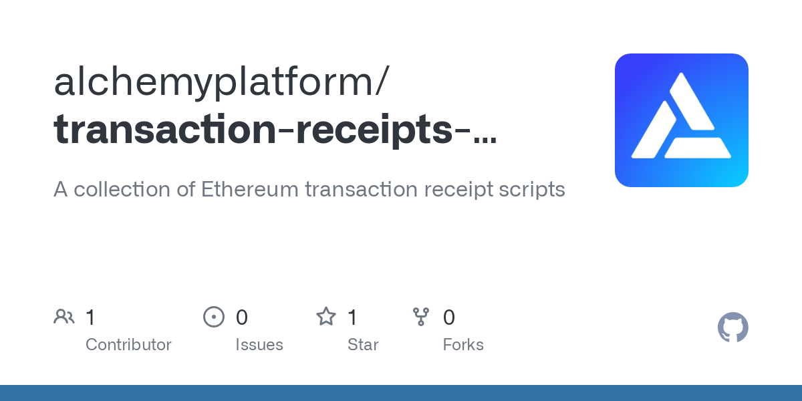

<Info>
  This tutorial uses the **[alchemy\_getTransactionReceipts](/reference/alchemy-gettransactionreceipts)** endpoint.
</Info>

A few reasons why you'd want to get a smart contract's deployer address:

* Verify the provenance of smart contracts deployed on-chain
* Find the owner/OG deployer of an NFT collection

While this type of query can seem intimidating, developers are able to leverage the power of Alchemy’s [Transaction Receipts API](/reference/transaction-receipts) with a few Ethereum RPC calls to get in-depth on-chain data.

**In this tutorial, we’ll be using a combination of Ethereum RPC methods and Alchemy’s [Transaction Receipts API](/reference/transaction-receipts) to fetch a smart contract deployer address.**

***

## How to find a smart contract deployer address

When searching for the deployer address of a smart contract, we first use binary search to find the origin block number of the contract.

In particular, we use `eth_getCode` in combination with our searching algorithm to find the exact moment in block history such that a given address stores code. While you can certainly iterate through all blocks from the latest block down to the target block, binary search will speed this process up!

.png")

After finding the target block where the contract deployment happened, we can then query `alchemy_getTransactionReceipts` using the newly found origin block number and filter for our desired transaction information!

***

## How to Get a Smart Contract's Deployer Address

In this tutorial, we make a few different API calls, `eth_blockNumber`, `eth_getCode`, & `alchemy_getTransactionReceipts`. Let's go through the specific requests made.

### `eth_blockNumber`

This API endpoint accepts no parameters! It only returns the most recent block number.

<Info>
  We use this endpoint so that we can get the latest block, constraining our search space from 0 to the latest block. Binary search requires that we have a finite, ordinal list of numbers that we are searching through, and this block range allows us to construct the list.
</Info>

### `eth_getCode`

* `DATA`, address; can be either a smart contract or EOA (externally owned address)
* `QUANTITY|TAG` - integer block number

<CodeGroup>
  ```python python
  params: ['0xBC4CA0EdA7647A8aB7C2061c2E118A18a936f13D', 12412441]
  ```
</CodeGroup>

<Info>
  The majority of smart contracts will return a non-zero value when `eth_getCode` is called on it. However, in edge cases, it is possible for contracts to return a storage value of zero which would through an error with the search method presented in this tutorial.
</Info>

### `alchemy_getTransactionReceipts`

* `blockNumber` - the block number you want to get transaction receipts for

<CodeGroup>
  ```python python
  params: [{"blockNumber": 12412441}]
  ```
</CodeGroup>

***

## Example: How to Get a Contract's Deployer Address

### Python

[](https://github.com/alchemyplatform/transaction-receipts-scripts/blob/main/contract_creation_finder.py)

[github.com](https://github.com/alchemyplatform/transaction-receipts-scripts/blob/main/contract_creation_finder.py)

[transaction-receipts-scripts/contract\_creation\_finder.py at main · alchemyplatform/transaction-receipts-scripts](https://github.com/alchemyplatform/transaction-receipts-scripts/blob/main/contract_creation_finder.py)

Fetching a Contract's Deployer Address Github Repo

#### 1. Create a file.

In your current directory, create a new file called `contract_creation_finder.py` using your favorite file browser/code editor.

#### 2. Write script!

Copy and paste in the following code snippet into your new file: `contract_creation_finder.py`

<CodeGroup>
  ```python contract_creation_finder.py
  import requests
  import json
  import time

  def getBlockNum():
      url = "https://eth-mainnet.g.alchemy.com/v2/demo"
      
      payload = json.dumps({
      "jsonrpc":"2.0",
      "method":"eth_blockNumber",
      "params":[],
      "id":0
      })
      
      headers = {
        'Content-Type': 'application/json'
      }
      
      response = requests.request("POST", url, headers=headers, data=payload)
      res = (json.loads(response.text))
      return(int(res["result"],0))

  def getCode(contract_address, block_num):
      url = "https://eth-mainnet.g.alchemy.com/v2/demo"
      
      payload = json.dumps({
          "jsonrpc":"2.0",
          "method":"eth_getCode",
          "params":[contract_address, block_num],
          "id":0
      })
      
      headers = {
        'Content-Type': 'application/json'
      }
      
      response = requests.request("POST", url, headers=headers, data=payload)
      res = (json.loads(response.text))
      return(res["result"])

  def getTxReceipt(block_num):
      url = "https://eth-mainnet.g.alchemy.com/v2/demo"
      
      payload = json.dumps({
          "jsonrpc": "2.0",
          "method": "alchemy_getTransactionReceipts",
          "params":[
              {
                  "blockNumber": hex(block_num)
              }
          ],
          "id": 1
      })
      
      headers = {
        'Content-Type': 'application/json'
      }
      
      response = requests.request("POST", url, headers=headers, data=payload)
      res = (json.loads(response.text))
      return(res["result"]["receipts"])

  # Returns index of x in arr if present, else -1
  def binary_search(arr, low, high, contract_address):
   
      # Check base case
      if high >= low:
          
          mid = int((high + low)/2)
          #print("===") 
          #print("high: ", high, "mid: ", mid, "low: ", low)
          
          if (high == low): 
              return low

          # If element is smaller than mid, then it can only
          # be present in left subarray
          
          if getCode(contract_address, hex(mid)) != "0x":
              return binary_search(arr, low, mid, contract_address)
   
          # Else the element can only be present in right subarray
          elif getCode(contract_address, hex(mid)) == "0x":
              return binary_search(arr, mid+1, high, contract_address)
   
      else:
          # Element is not present in the array
          return -1
   
  def find_contract_deployer(contract_address):
      
      currNum = getBlockNum()
      arr = list(range(0, currNum))
       
      # Function call
      result_block_num = binary_search(arr, 0, len(arr)-1,contract_address)  
      
      receipts = (getTxReceipt(result_block_num))
      
      #print(len(receipts))
      
      for r in receipts:
          if ((r["contractAddress"]) == contract_address.lower()):
              return(r["from"], result_block_num)

  # Find the deployer address of the BAYC contract
  print(find_contract_deployer("0xBC4CA0EdA7647A8aB7C2061c2E118A18a936f13D"))
  ```
</CodeGroup>

#### 3. Run script!

Now, on your command line, you can execute the script by calling:

<CodeGroup>
  ```shell shell
  python contract_creation_finder.py
  ```
</CodeGroup>

***

## Understanding the API Calls & Queried Data

Now that we have made a query and can see the response, let's learn how we handled the returned data via the API calls that we made.

### Raw API Response:

Without parsing the response, we have a command-line print-out that gives us the following information:

<CodeGroup>
  ```shell shell
  # Binary Search

  high:  14586896 mid:  7293448 low:  0
  high:  14586896 mid:  10940172 low:  7293449
  high:  14586896 mid:  12763534 low:  10940173
  high:  12763534 mid:  11851853 low:  10940173
  .......................
  high:  12287511 mid:  12287504 low:  12287498
  high:  12287511 mid:  12287508 low:  12287505
  high:  12287508 mid:  12287506 low:  12287505
  high:  12287508 mid:  12287507 low:  12287507
  high:  12287507 mid:  12287507 low:  12287507

  # Transaction Hash Filtering

  {
     "transactionHash":"0x22199329b0aa1aa68902a78e3b32ca327c872fab166c7a2838273de6ad383eba",
     "blockHash":"0x5b605ffe97e58c657dd3888c014a47fff085f356aeda27de46594b711da29e18",
     "blockNumber":"0xbb7e13",
     "contractAddress":"0xbc4ca0eda7647a8ab7c2061c2e118a18a936f13d",
     "cumulativeGasUsed":"0xce97a6",
     "from":"0xaba7161a7fb69c88e16ed9f455ce62b791ee4d03",
     "gasUsed":"0x3b6960",
     "logs":[........],
  }
     .........................
  {
     "transactionHash":"0x22199329b0aa1aa68902a78e3b32ca327c872fab166c7a2838273de6ad383eba",
     "blockHash":"0x5b605ffe97e58c657dd3888c014a47fff085f356aeda27de46594b711da29e18",
     "blockNumber":"0xbb7e13",
     "contractAddress":"0xbc4ca0eda7647a8ab7c2061c2e118a18a936f13d",
     "cumulativeGasUsed":"0xce97a6",
     "from":"0xaba7161a7fb69c88e16ed9f455ce62b791ee4d03",
     "gasUsed":"0x3b6960",
     "logs":[....],
     "logsBloom":"0x00000000000000000000000000000000000000000000000000800000000000000000000000000000000000000000000000000000000000000000000000000000000000000000000000000000000000000001000000000000000000000000000000000008020000000000000000000800000400000000000000000000000000400000800000000000000000000000000000000000000000000000000000000000000000000000001000000000000000000000000000000000000000000000000000000000000000000000000000000000000000000000001000000000000020000800000000000000000000000000000000000000000000000000000000000000",
     "status":"0x1",
     "to":"None",
     "transactionIndex":"0x9b",
     "type":"0x0"
  }

  ('0xaba7161a7fb69c88e16ed9f455ce62b791ee4d03', 12287507)
  ```
</CodeGroup>

### Understanding Binary Search:

As you can visually confirm with the print-outs from our script, at each step, we repeatedly divide the search space containing our target block in half until we have narrowed down the possible locations to just a single block number. Our last print statement of `high: 12287507 mid: 12287507 low: 12287507` tells us our search converged at block number **12287507**

### Understanding Transaction Receipts:

As we can see from the script's raw response, we can pull a lot of data out from the [Transaction Receipts API](https://docs.alchemy.com/alchemy/enhanced-apis/transaction-receipts-api). However, we're only interested in the deployer address of our given smart contract.

* `receipts`: list of transaction receipts

  * `transactionHash`: hash of a transaction
  * `blockHash`: block hash where this transaction was in.
  * `blockNumber`: block number where this transaction was in
  * `contractAddress`: contract address a given transaction interacted with
  * `cumulativeGasUsed`: total amount of gas used by the transaction plus gas used by transactions executed before the current one in the same block
  * `effectiveGasPrice`: if a tx is made with EIP1559, it is equal to the actual gas price paid; if made using the old standard, it is equal to the transaction’s `gasPrice`
  * `from`: address of the transaction sender
  * `gasUsed`: gas used by this transaction

### Filtering Transaction Receipts:

With our queried response saved as a JSON object, we can index through the transfers to find the information useful for us.

1. Loop through all transactions in the block with the smart contract deployal
2. For each receipt, check if the associated `contractAddress` matches with the smart contract we're searching for
   1. If so, break our loop and print out the `from` address

<CodeGroup>
  ```python python
  for r in receipts:
          if (type(r["contractAddress"]) is str):
              return(r["from"], result_block_num)
  ```
</CodeGroup>

If you followed along thus far and commented out intermediate print statements, you'll get the following:

<CodeGroup>
  ```json json
  ('0xaba7161a7fb69c88e16ed9f455ce62b791ee4d03', 12287507)
  ```
</CodeGroup>

And that's it! You can confirm that your query was indeed correct with [Etherscan](https://etherscan.io/tx/0x22199329b0aa1aa68902a78e3b32ca327c872fab166c7a2838273de6ad383eba) showing that `0xaba7161a7fb69c88e16ed9f455ce62b791ee4d03` is the deployer of the BAYC contract.

If you liked this tutorial, give us a tweet [@Alchemy](https://twitter.com/Alchemy)! (Or give the author [@crypt0zeke](https://twitter.com/crypt0zeke) a shoutout!)

Also, join our [Discord server](https://www.alchemy.com/discord) to meet other blockchain devs, builders, and entrepreneurs!
